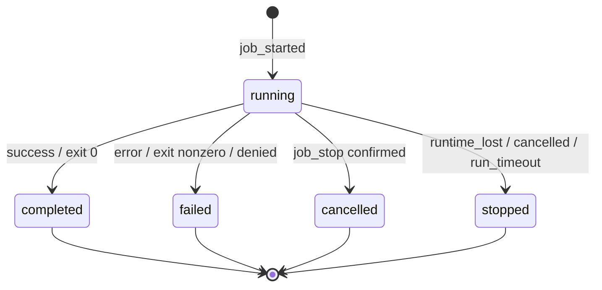
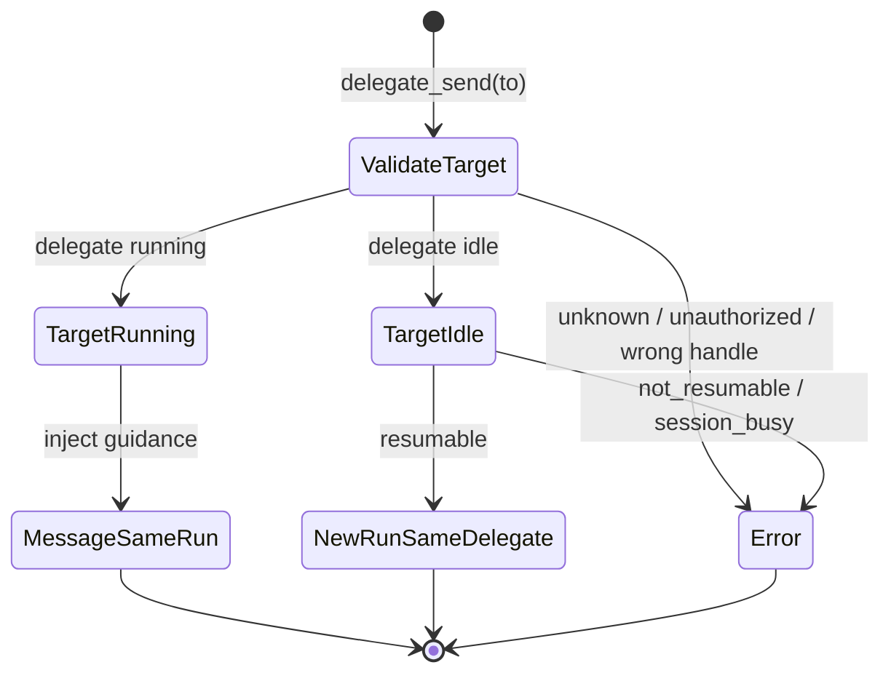
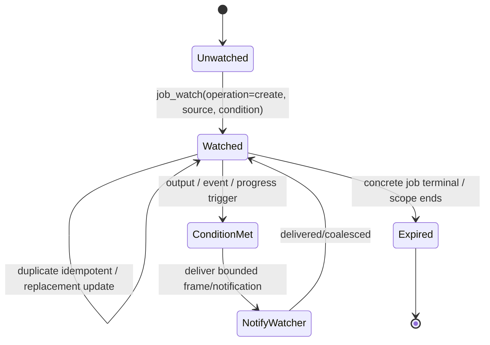
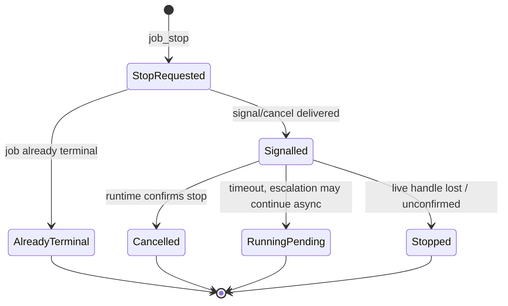
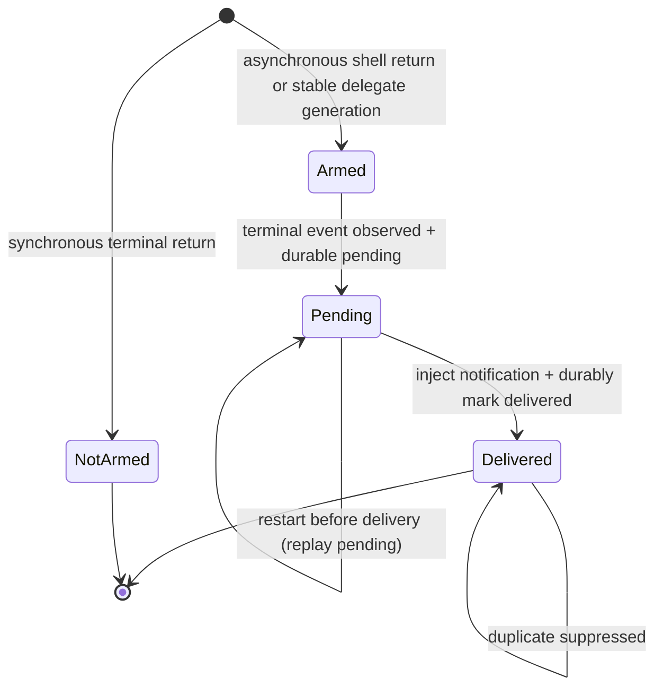
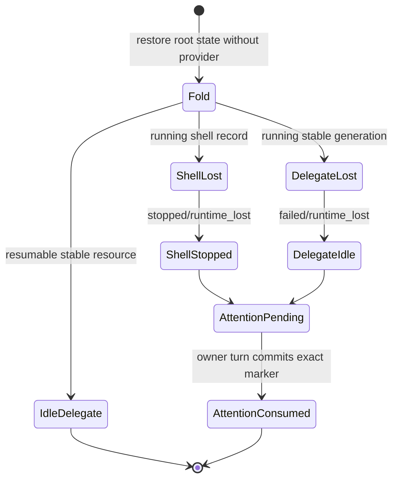
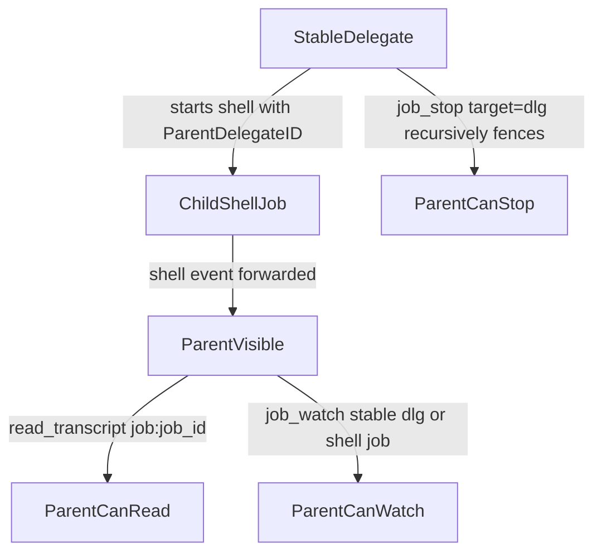

# Job control

Status: Evergreen contract for the shipped job-control system.

This document defines Serf's job-control model. It is an architecture/reference contract for the shipped system, not an implementation plan. Implementation sequencing belongs in separate ephemeral specs or plans.

## Summary

Serf exposes one unified list/status/control view over two typed resource
families. A **shell job** is asynchronous process work owned by a session and
identified by `job_...`. A **delegate** is a durable child conversation owned by
the root delegate-tree controller and identified by `dlg_...`. They share
orientation tools without sharing lifecycle authority or identity.

Two public resource types are in scope:

- **`shell`**: a background-capable invocation of the existing shell/bash command tool.
- **`delegate`**: a stable subagent resource with one child conversation and
  private run generations. It has no activation JobRecord or public `job_id`.

The default model-facing posture is:

> Shell `mode="foreground"` (default) waits inline; a long command may promote
> to a session-owned `job_...`. `mode="background"` launches that shell job
> immediately. `mode="detached"` disowns the process and returns only its PID.
> `delegate` creates one durable `dlg_...` and returns after its metadata and
> initial input are durable; creation has no `max_wait_ms`. Rely on typed
> notifications plus one-off `job_status(target=...)` / `job_list` orientation.
> Read shell bytes with `job:<job_id>` and delegate history with its session
> `transcript_ref`. Do not poll.

The shipped model intentionally does **not** expose:

- `job_kill`
- `job_ack`
- `wait_job`
- `close_agent`
- external `agent_id`

Stopping is handled by `job_stop(target=...)`. Retention is policy-based, not
model-acknowledgement-based. Waiting, when needed, is bounded —
`max_wait_ms` on `delegate_send` / `job_stop`, or `mode` on shell — not a
separate wait tool. Reads never wait.

## Model-facing guidance requirements

This reference contract is not itself the runtime system prompt, but the following guidance **must** be reflected in the tool descriptions and in Serf's `Background jobs` system-prompt section. These bullets are normative for model-facing documentation because they shape whether agents use jobs correctly:

- Shell commands run in `mode="foreground"` by default and return inline output for quick commands. Set `mode="background"` to launch-and-return as a session-owned job; foreground commands that exceed the session-default wait are promoted to durable background jobs and return a `job_id`. Set `mode="detached"` only to immediately disown a process that does not need Serf job visibility, output, notification, or stop control; it returns only a PID.
- Delegate creation returns after one stable `delegate_id` and its initial input
  are durable. It does not accept `max_wait_ms` and does not expose a run handle.
- Use `delegate` to start a new delegate conversation. It returns `dlg_...`,
  child/session transcript metadata, status, and resumability—never `job_...`.
- Use `delegate_send` for follow-up: a running delegate is steered; an idle,
  resumable delegate starts its next private run through the same call.
- Use `delegate_send(to=<delegate_id>)` for follow-up on a durable child
  conversation. From within a delegate, `delegate_send(to="caller")` sends a
  non-terminal update to its controlling caller. Observer completion and final
  results still use `communicate(end_turn=true)`. `delegate_send` rejects
  `job_id`, `transcript_ref`, and unsupported runtime aliases.
- When an observer readiness delegate result includes `watching:true` and `watches`, the observer is watching. Continue with the planned watched action and use the later observer `communicate(end_turn=true)` as the callback.
- After starting a background job, continue useful work or respond to the user. Do not immediately wait, poll `job_list`, or loop on `job_status`.
- Serf injects typed terminal attention: `<job-notification>` for owner shell
  jobs and `<delegate-notification delegate_id="dlg_...">` for direct delegates.
  Your delegates handle their own children's attention.
- Use `job_watch` when a condition should notify the watcher. `source` is typed:
  `self`, granted `parent`, a stable `dlg_...`, or a visible shell `job_...`.
  Delivery is implicit to the creating session. Use output/progress triggers for
  shell sources and event filters for session/delegate sources.
- Use `job_status(target=...)` for metadata-only orientation. A shell target
  reports process/job fields and `job:<job_id>`; a delegate target reports the
  stable aggregate and child session `transcript_ref` without terminal packet
  contents or notification acknowledgement.
- Use the delegate's session `transcript_ref` for its full conversation. A
  `job:` ref is shell output only.
- Use `job_stop` only when the intent is to cancel or stop work. It does not delete output/history and it does not acknowledge results.
- Use `job_list` to recover or inspect job inventory, not to wait for completion. Branch primarily on `status`; treat `reason` as diagnostic detail except for documented operational cases such as `runtime_lost`, `run_timeout`, `awaiting_permission`, and `stop_pending`.

Tool descriptions should avoid these phrases because they train bad behavior:

- Do not describe `job_watch` as subscribing to job completion. Say: “When output/event/progress conditions happen, deliver a bounded watch notification/frame to the watcher that created the watch.”
- Do not describe a job-output read as a way to wait. Say: “Completion is notification-driven; do not poll this waiting for a job to finish.”
- Do not describe `job_stop` as cleanup. Say: “Request cancellation/stop; retained history/output remains.”
- Do not say `delegate` resumes an old agent. Say: “Start a fresh stable delegate conversation.”
- Do not say `delegate_send` has a separate idle-policy knob. Say: “Send a follow-up message to a delegate_id; running delegates receive it live, while idle delegates start their next private run through the same call when resumable.”
- Do not say `job_watch` sends arbitrary unbounded transcript context. Say: “Deliver bounded frame/excerpt metadata when the watch condition is met.”
- Do not say a `job:` transcript ref reads a delegate. Say: “`job:` reads shell
  output; use the stable delegate's session `transcript_ref` for its conversation.”

## Choosing a wait primitive

Several tools can wait, but they wait on different things. Pick by intent, and do not poll.

| Intent | Use |
| --- | --- |
| Run a command and use its output | `shell` — foreground; promoted to a background job if it exceeds the session timeout |
| Launch a long command without waiting | `shell(mode="background")` — returns a `job_id` immediately |
| Disown a command that must outlive this session | `shell(mode="detached")` — returns only a PID; no job tools apply |
| Start a delegate | `delegate(...)` — returns its durable `dlg_...` immediately; completion is notification-driven |
| Learn when a backgrounded job finishes | the automatic terminal notification — nothing to call |
| Learn when a job's output contains X | `job_watch(operation="create", source=<job_id>, output_match=X)` to be notified |
| Re-observe progress on a long job | `job_watch(operation="create", source=<job_id>, progress_interval_ms=N)` (running targets only) |
| Resume an idle delegate and wait for its answer | `delegate_send(to=<delegate_id>, message=..., max_wait_ms=N)` |
| Steer a running delegate | `delegate_send(to=<delegate_id>, message=...)` — returns on delivery; `max_wait_ms` is ignored and reported as `wait_ignored_reason` |

There is no "steer a running delegate and wait for its next reply" primitive: a
live steer returns on delivery. Let the run finish and read the delegate's
session `transcript_ref`, or resume its next run with
`delegate_send(to=<delegate_id>, message=..., max_wait_ms=N)` once it is idle.

Terminal targets differ by watch type: only an `output_match`-only `job_watch` supports terminal catch-up (a one-shot scan of retained output on an already-terminal job). `events`, `progress_interval_ms`, and `every` watches require a running target and reject a terminal one with `target_terminal`. Use transcript reads for retained terminal output evidence.

## Vocabulary

| Term | Meaning |
| --- | --- |
| Session | A durable Serf conversation with transcript state. |
| Shell job | One asynchronous process unit owned by a session. |
| `job_id` | Durable opaque shell identity (`job_...`). Use it for shell reads, control, watches, and notifications. |
| Delegate | One stable child conversation with private run generations. |
| `delegate_id` | Durable delegate control identity (`dlg_...`). Use it for send/status/stop/watch. |
| `watch_id` | Durable opaque identifier for one watch configuration. Use it for `job_watch` inspect/clear. |
| Parent session | The session containing the job or turn that caused another session/job to exist. |
| Owner session | The session whose runtime/job manager owns the job. |
| Visible session | A session that may list/control the job because the job was forwarded, e.g. parent visibility into nested jobs. |
| Parent job | A shell job that caused another shell job, when shell ancestry exists. |
| Parent delegate | The `dlg_...` that owns a delegate-created shell job. |
| Delegate session | The child Serf session owned by a stable delegate. |
| Transcript ref | A safe reference to a Serf session transcript, e.g. `local:<sessionID>`. |
| Notification | Metadata injected into a visible session to tell the agent that a job reached a lifecycle/progress event. |
| Output | Bounded textual/log content associated with a job. |

A delegate's runs are private controller generations, not jobs. Each `delegate`
invocation creates a new child conversation and one stable `dlg_...` resource.
`delegate_send` steers its open generation or starts the next generation when
idle/resumable. Observer sidecars use `communicate(end_turn=true)` as the callback.

For shell work, `owner_session_id` names the process-owning session. A nested
shell may have shell-to-shell `parent_job_id`; a delegate-owned shell carries
`parent_delegate_id=dlg_...`. `parent_job_id` never encodes delegate lineage.

Clients may present shell jobs and delegates in one `items` collection, but must
branch on `type` and `id`; only shell rows carry `job_id`.

## Design principles

1. **One view, typed authorities.** Shell work uses JobRecords; delegates use one stable aggregate fold. They share list/status/stop entry points, not lifecycle storage.
2. **Handles are purpose-specific.** `job_id` identifies a shell job;
   `delegate_id` identifies a stable delegate; `watch_id` identifies a watch.
   Session IDs and transcript refs identify transcripts, not control targets.
3. **Defaults match common use.** Shell work is foreground by default with promotion on timeout. Delegate creation durably starts independent work and returns its stable identity without a creation wait knob.
4. **Notifications replace waiting.** The parent should not poll or block just to discover completion.
5. **Output reads are non-consuming.** Reading job output never acknowledges, consumes, hides, or deletes a result.
6. **No model-facing ack.** Retention is automatic and policy-based.
7. **No model-facing kill.** `job_stop` is the single model-facing stop primitive; forceful cleanup is an implementation detail when needed.
8. **Provider-free restart.** Shell runtime loss is reconciled from shell evidence; stable delegates are folded/rearmed without constructing a Session or calling a provider.
9. **Nested shell jobs are supported; nested delegation is allowance-gated.** Subagents may start shell jobs. A subagent may itself delegate only when it was granted a non-zero `delegation_allowance`; a leaf delegate (allowance 0, the default) cannot delegate, so an observer sidecar started without an allowance still must not delegate. See the delegation-allowance amendment below.
10. **Delegate creation and follow-up are separate.** `delegate` starts a new delegate conversation; `delegate_send` follows up on an existing `delegate_id`.
11. **Watches are watcher-owned.** `job_watch` defines conditions over a source's output/events/progress; when a condition is met it delivers a bounded notification/frame to the watcher that created the watch.
12. **Observers are composed, not special.** An observer is a delegate granted `watch_parent:true`, a child-created `job_watch(source="parent")`, and an observer result through `communicate(end_turn=true)`.
13. **Transcript tools stay separate.** `job:` is shell output; delegate child transcripts remain readable through session refs.

### Delegation allowance (recursive delegation)

`delegate` accepts an optional `delegation_allowance` integer (default 0). The value follows the strict-zero rule used across the job-control surface — absent or 0 means a leaf delegate that cannot itself delegate, exactly today's behavior; there is no `minimum`/`maximum`/`default` keyword on the schema property.

**The grant rule.** A session may grant a child a `delegation_allowance` strictly less than its own allowance, so the chain always shortens and allowance 0 is a leaf. A grant `>=` the granter's own allowance is rejected with `invalid_request: delegation_allowance must be less than your own allowance (<A>); valid grants: <range>`, where `<A>` is the granter's allowance and `<range>` enumerates the grantable values (`0` at allowance 1, otherwise `0..<A-1>`). A session's own allowance is persisted in the delegate restore descriptor, so it survives restore. The current allowance is also reported on every `job_list` result (see `job_list`), so an agent can read its budget without re-reading its system prompt.

**Availability matrix (allowance-gated).** Whether a child receives the delegation surface is governed by its granted allowance, not by a fixed depth gate. At allowance 0 the child is a leaf: it does not receive `delegate`/`job_watch`, agent-type listings that require those tools are filtered out of its prompt, and its system prompt shows the leaf limits block. At allowance > 0 the child receives `delegate` + `job_watch` (added to the default surface for an untyped child; a typed agent gets them only if its tool list names them), may grant onward allowances strictly smaller than its own, is told its allowance in its prompt, and sees the delegation + background-jobs prompt sections. A typed agent's tool list governs *what* the child gets; allowance governs *whether* the delegation tools are grantable at all — allowance never injects tools into a type that does not list them.

**Double opt-in (dark by default).** A root session's allowance equals `MaxSubagentDepth` (default 1). Under defaults the root's allowance is 1, so the root may grant only 0 — every delegate is a leaf and recursion never happens. Enabling recursion requires **both** raising `MaxSubagentDepth` in config **and** passing a non-zero `delegation_allowance` per create. Neither alone unlocks it; recursion stays dark until an operator deliberately does both.

## Job identity and visibility

Serf mints globally unique-enough `job_...` values for shell jobs and stable
`dlg_...` values for delegates. Each identity is used unchanged across its
typed list, status, watch, stop, notification, and transcript surfaces.

The model-facing API must not expose two competing job handles such as `owner_job_id` and `parent_visible_job_id`. If an implementation internally maps child-owned IDs into parent-visible records, that mapping must be durable and invisible to the model-facing tools. The only accepted job handle is the parent-visible `job_id` returned or listed by Serf.

Job-control tools accept purpose-specific handles, not `transcript_ref`.
`delegate_send` accepts `dlg_...`; `job_status` and `job_stop` accept typed
`target` values (`job_...` or `dlg_...`); `job_watch(operation="create")`
accepts `self`, granted `parent`, `job_...`, or `dlg_...`; inspect/clear accepts
`watch_id`. Transcript tools accept refs, with `job:<job_id>` reserved for shell
output.

## Status and reason model

Shell rows use `running`, `completed`, `failed`, `cancelled`, or `stopped` as
their lifecycle status. A stable delegate's current `status` is only `running`
or `idle`; its prior generation is summarized separately in `last_outcome` with
`completed`, `failed`, `exhausted`, `cancelled`, or `stopped`.

| Value | Surface | Meaning | Normative reasons | Owner attention |
| --- | --- | --- | --- | --- |
| `running` | shell or delegate status | A shell has a live or believed-live process, or a delegate has an open generation. | `stop_pending`, `foreground_timeout` for shell | progress/match as configured |
| `idle` | delegate status | No delegate generation is processing; resumability is separate metadata. | usually `null` | none by lifecycle alone |
| `completed` | shell status or delegate `last_outcome` | Work ended normally. | `exit_zero` for shell; otherwise usually `null` | typed terminal attention |
| `failed` | shell status or delegate `last_outcome` | Created work ran or attempted to run and failed. | `exit_nonzero`, `start_failed`, `finalize_failed`, `forward_failed`, `missing_terminal`, `terminal_error`, `runtime_lost` as applicable | typed terminal attention |
| `exhausted` | delegate `last_outcome` | A delegate generation reached its turn or tool-round budget. | `turn_budget_exhausted`, `tool_round_budget_exhausted` | delegate terminal packet |
| `cancelled` | shell status or delegate `last_outcome` | Serf intentionally stopped work and confirmed cancellation. | `stopped_by_parent` | typed terminal attention |
| `stopped` | shell status or delegate `last_outcome` | Work did not complete and Serf cannot attribute it to normal failure or confirmed cancellation. | `runtime_lost`, `cancelled`, `run_timeout` | typed terminal attention |

Validation, lookup, and routing errors are synchronous tool errors and create
neither a shell JobRecord nor a delegate generation. Canonical codes include
`invalid_request`, `permission_required`, `target_not_found`,
`target_not_messageable`, `target_terminal`, `target_not_resumable`,
`target_not_watchable`, and `not_controllable`.

`status` is the primary machine branch field. `reason` is optional diagnostic
metadata. Branch first on shell status or delegate status/last outcome, then
consult `reason` for documented operational cases such as `runtime_lost`,
`run_timeout`, and `stop_pending`.
Keep this portable vocabulary small; other diagnostics belong in free-text
`diagnostic` or `error` fields.

`cancelled` is intentional, confirmed stop. `stopped` is work Serf cannot
attribute to normal failure or confirmed cancellation: a runtime timeout, a
lost runtime, or a cancellation it could not confirm. Restart reconciles a
shell as `stopped/runtime_lost` and a lost stable delegate generation as
`failed/runtime_lost`, after which the delegate is idle. `not_controllable` is
a synchronous routing/control error, not a terminal status reason.

The following diagram is the shell lifecycle; delegate lifecycle is the
two-state `running`/`idle` model above.



## Model-facing tools

### Existing shell/bash tool

The existing shell/bash tool becomes job-capable. It is the shell job creation surface; there is no separate `shell_job` tool.

Canonical foreground shape for ordinary commands:

```json
{
  "command": "make test",
  "description": "run tests"
}
```

Shell defaults to `mode="foreground"` because most shell calls are short and decision-producing. It waits up to the session command timeout (120s standard), then promotes the command to a durable background job if it is still running. Set `mode="background"` to launch-and-return immediately for deliberate background work such as a dev server or a long command the agent should not wait on. Set `mode="detached"` to immediately disown a process; it returns only a PID and cannot be discovered or controlled through job tools.

Launch-and-return (immediate background) shape:

```json
{
  "command": "npm run dev",
  "mode": "background",
  "description": "start dev server"
}
```

Foreground with an explicit process-runtime cap:

```json
{
  "command": "go test ./...",
  "max_runtime_ms": 900000,
  "description": "run tests"
}
```

Defaults and timeout semantics:

- `mode="foreground"` (the default): the call runs the command in the foreground and waits up to the session command timeout (120s in stock provider profiles) for it to finish.
- A foreground shell command that completes within that wait returns inline output and is ephemeral by default: no durable `job_id` is required and it does not appear in `job_list`.
- A foreground shell command still running at the session command timeout is promoted to a durable background job: Serf returns the current bounded output/status with a `job_id`, and the normal terminal notification remains armed for the eventual terminal state.
- `mode="background"`: Serf starts the command and returns a `job_id` immediately without waiting. The terminal notification fires when it finishes.
- `mode="detached"`: Serf starts a disowned process and returns only its PID immediately. It is not a job, so Serf neither retains output nor sends notifications nor offers job control for it.
- `max_runtime_ms` is an optional process runtime limit for shell jobs. If the process is still running after `max_runtime_ms`, Serf stops it and finalizes the job as `stopped` with reason `run_timeout`. It bounds how long the process may *run*, distinct from the foreground wait.
- Omitted `max_runtime_ms` means implementation-defined shell runtime policy. Recommended policy: default finite runtime for foreground/promoted shell jobs, no default runtime limit for `mode="background"` shell jobs unless configured by the user/tool call.
- A shell command that completes before the tool returns does not inject a terminal notification; the terminal result is already in the tool result. Return field `timed_out`, when present, means the foreground wait expired; it never means the process hit `max_runtime_ms`.
- To learn when a launch-and-return command reaches a state (e.g. a server printing "ready"), use `job_watch(operation="create", source=<job_id>, output_match=...)` and continue from the notification — an output-match watch catch-up-scans a job's retained output even if it already finished.

Normative foreground-wait bounds:

- The foreground wait is the session command timeout (`DefaultCommandTimeoutMS`, 120000 in stock provider profiles), clamped to `MaxCommandTimeoutMS`. Shell has no per-call wait parameter; `mode` selects foreground (wait, then promote), session-owned background, or immediate detached return.

Normative runtime timeout bounds:

- `max_runtime_ms` is the process-killing deadline and must be distinct from the foreground wait (the session command timeout), which only bounds how long the call waits before promoting to background.
- Minimum positive `max_runtime_ms`: `1000`.
- Implementations must document default/max/clamp behavior for `max_runtime_ms`.
- Negative values fail `invalid_request`.

Ephemeral foreground terminal return shape:

```json
{
  "type": "shell",
  "mode": "foreground",
  "status": "completed",
  "reason": "exit_zero",
  "timed_out": false,
  "exit_code": 0,
  "output": "bounded output text",
  "truncated": false
}
```

Explicit background return shape:

```json
{
  "job_id": "job_...",
  "type": "shell",
  "mode": "background",
  "status": "running",
  "reason": null,
  "timed_out": false
}
```

Foreground timeout / promotion return shape:

```json
{
  "job_id": "job_...",
  "type": "shell",
  "mode": "background",
  "status": "running",
  "reason": "foreground_timeout",
  "timed_out": true,
  "output": "bounded output text",
  "truncated": false
}
```

Shell approval is not fully designed here. If policy requires approval before a shell command may start, Serf must not execute before approval. The shipped contract permits either:

1. fail job creation synchronously with reason `permission_required` if no async approval flow is available; or
2. create a durable background job in `running` with reason `awaiting_permission`, then continue after approval or finalize as `failed`/`permission_denied`.

Whichever behavior an implementation chooses must be reflected consistently in `job_list`, `job_status`, the job output read, and notifications.

### `delegate`

`delegate` starts a new stable delegate resource and child conversation. It
does not resume or steer an existing delegate. Follow-up uses `delegate_send`
with the returned `delegate_id`. To start an observer sidecar, set
`watch_parent:true`; the child can then observe its immediate parent with
`job_watch(source="parent")` and report through `communicate(end_turn=true)`.

Canonical background shape:

```json
{
  "task": "Investigate the failing parser test and report findings.",
  "agent_type": "explorer",
  "model": "openai/gpt-5.5",
  "reasoning_effort": "high"
}
```

Full target shape (no `max_wait_ms`):

```json
{
  "task": "Investigate the failing parser test and report findings.",
  "agent_type": "explorer",
  "model": "openai/gpt-5.5",
  "reasoning_effort": "high",
  "watch_parent": false,
  "result_schema": {
    "type": "object",
    "properties": {
      "summary": {"type": "string"},
      "files": {"type": "array", "items": {"type": "string"}}
    },
    "required": ["summary"]
  }
}
```

Defaults:

- Each `delegate` call creates one new `dlg_...` resource and child session.
- Creation returns after the descriptor and initial input are durable. It does
  not wait for a model result and rejects `max_wait_ms`.
- `delegate` does not accept `target`, `mode`, `job_id`, `delegate_id`, or `transcript_ref` for continuation.
- `watch_parent:true` grants only the created child permission to observe the immediate parent with `job_watch(source="parent")`. It is not transitive and does not grant `delegate`.
- Delegates have no model-facing `max_runtime_ms` in v1. Delegate runtime limits, if any, are implementation policy rather than a tool argument.
- `result_schema`, when supplied, is a JSON Schema-like contract for terminal
  packets from the initial and resumed runs. Validation, explicit JSON null,
  and structured-result failure reasons survive in the stable aggregate and
  client projections.
- Delegate interaction is turn-based. A delegate that needs more input should
  finish with a request for that input; the parent follows up with
  `delegate_send`. Mid-turn interactive input/awaiting-input notifications are
  not guaranteed. A generation whose `last_outcome.status="completed"` ended
  normally; that does not by itself assert task success. Inspect its canonical
  terminal packet or conversation for the task-specific result.
- An observer that installs watches reports readiness through its terminal packet;
  the stable watch remains active and later frames resume the same `dlg_...`.

Create return shape:

```json
{
  "delegate_id": "dlg_...",
  "child_session_id": "01JCHILD...",
  "type": "delegate",
  "status": "running",
  "resumable": true,
  "transcript_ref": "local:01JCHILD...",
  "model": "openai/gpt-5.5"
}
```

`delegate_id` is the only control identity. `child_session_id` is diagnostic
lineage, and `transcript_ref` is the read handle. A start failure after stable
identity mint returns that same identity plus status/reason/error; it never
creates a fallback activation JobRecord.

### `delegate_send`

`delegate_send` sends a message to one of your durable child delegate conversations by `delegate_id`. From inside a delegate, the contextual `caller` target sends a non-terminal update to that delegate's controlling caller. Final results and observer completion still use `communicate(end_turn=true)`.

Target shape:

```json
{
  "to": "dlg_prior_or_running_delegate",
  "message": "Check whether the serializer has the same issue.",
  "max_wait_ms": 120000
}
```

Core target resolution:

| Target | Meaning |
| --- | --- |
| `dlg_...` | A durable delegate conversation owned by this session. |
| `caller` | The current delegate's controlling caller. This contextual target is unavailable at the root. |

`delegate_send` rejects `job_id` handles because they identify shell work, not
delegates. It also rejects `transcript_ref` handles and unsupported runtime or
legacy aliases such as `main` or `watched`.

Semantics:

- If `to` identifies a running or currently-driven delegate, Serf injects the
  message into that exact generation. The return `action` is `steered`.
- If `to` identifies an idle/resumable delegate, Serf starts its next private
  generation in the same child conversation. The return `action` is `started`.
- If `to` is `caller`, a nested delegate steers its stable parent through the
  parent's controller lifecycle admission; a top-level delegate uses the root
  session's durable turn-boundary steering queue. The call returns
  `action=delivered`, does not end the delegate's turn, and never writes into an
  unfinished root tool round.
- If `to` is a `job_id`, `transcript_ref`, unknown/unauthorized delegate,
  non-resumable delegate, or unsupported legacy alias, the call fails
  synchronously without minting another identity or JobRecord.
- One delegate has at most one open run. Admission, steering, stop, and terminal
  settlement are serialized by the stable controller aggregate.
- Target state is resolved atomically at delivery time. A race between terminal/running state and the tool call is resolved by the observed state at delivery.
- `max_wait_ms` unset (or `0`) on an idle start returns after admission. A
  positive value waits for that newly started generation's terminal packet up
  to the bounded wait. A live steer always returns on delivery; a supplied wait
  is ignored explicitly through `wait_ignored_reason`.
- `max_wait_ms` applies to concrete delegate targets.

Watch-origin observer completion uses `communicate(end_turn=true)`. A delegate may use the contextual `caller` target for a non-terminal update without ending its turn; that route does not replace the observer callback or final result.



Return shape when messaging a running target:

```json
{
  "delegate_id": "dlg_...",
  "type": "delegate",
  "status": "running",
  "reason": null,
  "running_in_background": true,
  "timed_out": false,
  "action": "steered"
}
```

A live steer carries no `transcript_ref` — the steer branch never resolves
one, and the field is omitted rather than sent empty
(`agent/delegate_runtime.go#delegateRuntime.send`,
`agent/session_tools_jobs.go#delegateSendResult`). `delegate_id` is the only
identity a steered result carries.

Return shape when starting an idle delegate's next run:

```json
{
  "delegate_id": "dlg_...",
  "type": "delegate",
  "status": "running",
  "reason": null,
  "running_in_background": true,
  "timed_out": false,
  "action": "started",
  "transcript_ref": "local:01JCHILD..."
}
```

Once a resumed generation is dispatched its `transcript_ref` is set and
stable for that generation, so `delegate_id` + `transcript_ref` together are
the result's identity whenever a `transcript_ref` is present at all.

**`delegate_send` contract facts settled 2026-08-17.** These four facts
were the ambiguity that blocked repairing
`test/scenarios/job-send-message-surface.md` (kata `badq`/`fknv`); each is
pinned here because callers of this tool read this document, not the
implementation, and every claim below was re-traced to its emitting Go on
the date given.

- **A `job_id` (or any other unrecognized/unauthorized) target fails with
  the bare tool error `not_controllable: delegate` — nothing else.** There
  is no `job_`-prefix check anywhere on the send path; `to` is handed
  straight to the delegate tree's id lookup
  (`agent/delegate_tree_controller.go#delegateTreeController.authorizeMutationLocked`),
  which returns `errDelegateNotControllable`
  (`agent/delegate_tree_controller.go#errDelegateNotControllable`) for any id
  it does not hold, including a syntactically valid `job_` handle. That error
  carries an empty `DelegateID`
  (`agent/job_delegate.go#sendMessageFailed`), so
  `stableDelegateSendTool` (`agent/session_tools.go#stableDelegateSendTool`)
  returns the raw `error.Error()` text with no result JSON and no id
  interpolated into it — there is no structured `reason: "not_controllable"`
  envelope on THIS path, unlike the `job_stop` non-direct-descendant case
  above. The similar-looking string `job_id is a job/turn handle` is real but
  belongs only to the internal watch-delivery validator
  (`agent/job_watch.go#validateWatchSendDeliveryTarget`); `delegate_send`
  never calls it and never produces it.
- **A `delegate_send` result's identity is `delegate_id` plus (once set)
  `transcript_ref` — never a job field.** `sendMessageResult`
  (`agent/job_delegate.go#sendMessageResult`) and its wire form
  `delegateSendResult` (`agent/session_tools_jobs.go#delegateSendResult`)
  declare no `job_id`, `started_job_id`, `current_job_id`, or
  `latest_job_id` field, and nothing in the tree emits any of those four
  names on this path.
- **`action: "started"` is the still-running/timed-out shape; a wait that
  resolves in time reports `action: "completed"`.** Starting an idle
  delegate's next generation always builds the result with `action:
  "started"` first
  (`agent/delegate_runtime.go#delegateRuntime.send`); if `max_wait_ms` was 0
  the call returns that shape immediately. If a positive wait was given and
  it resolves before the ceiling, `action` is overwritten to `"completed"`,
  `running_in_background` becomes `false`, and the reply's `output` and
  `structured_result` fields are populated. If the wait ceiling is hit
  first, the result keeps `action: "started"` and gains `timed_out: true`
  with no reply content — that generation is not finished, only the wait is.
  A caller reading `action` alone cannot tell "just started, no wait
  requested" from "still running, wait expired"; check `timed_out` to
  distinguish them.
- **`max_wait_ms` is silently clamped to 60000, on this tool as on every
  other job-control wait.** `clampJobBlockTimeout`
  (`agent/session_tools_jobs.go#clampJobBlockTimeout`) caps every inline
  wait — including `delegate_send`'s — at `maxJobBlockTimeoutMS`
  (`agent/session_tools_jobs.go#maxJobBlockTimeoutMS`), 60000 ms, before it
  reaches the wait. A caller asking for more silently gets 60000; nothing
  reports the request was reduced. `delegate` creation itself accepts no
  `max_wait_ms` at all and rejects the argument outright with
  `invalid_request: delegate creation does not accept max_wait_ms`
  (`agent/session_tools.go#stableDelegateCreateTool`) — the wait only
  applies to `delegate_send`, never to creation.

### `job_watch`

`job_watch` creates, lists, inspects, or clears standing triggers. A watch is
owned by the session that creates it. Create names the observed `source`; when a
condition matches, Serf delivers a bounded notification/frame back to that
watcher. There is no model-facing `send` object.

Operations:

- `operation="create"` requires `source`.
- `operation="list"` takes no source or watch ID.
- `operation="inspect"` requires `watch_id`.
- `operation="clear"` requires `watch_id`.

Sources:

| Source | Meaning | Authorization |
| --- | --- | --- |
| `self` | This session's public events | Always allowed, subject to loop guards |
| `parent` | Immediate parent session's public events | Only inside a child created with `delegate(watch_parent:true)` |
| `dlg_...` | A stable direct delegate's bounded public events | Allowed when the delegate is controllable by this session; binding follows its generations |
| `job_...` | A concrete shell job's output/progress/events | Allowed when the job is owned by this session or a live descendant session |

`job_watch` is not a completion subscription: shell terminal notifications and
direct-delegate terminal packets are automatic.

Output-match shape:

```json
{
  "operation": "create",
  "source": "job_...",
  "output_match": "(?i)(ready|blocked|needs input)"
}
```

Periodic-progress shape:

```json
{
  "operation": "create",
  "source": "job_...",
  "progress_interval_ms": 300000
}
```

Filtered parent observer shape:

```json
{
  "operation": "create",
  "source": "parent",
  "events": ["assistant.tool"],
  "event_filter": {
    "tool_name": "read_file",
    "status": "ok"
  }
}
```

Clear an existing watch:

```json
{
  "operation": "clear",
  "watch_id": "watch_..."
}
```

Trigger fields:

- `output_match` is level-triggered: it fires once at attach if the shell job's already-retained output contains a match, then again as appended output matches the regex. It requires a concrete `job_...` source; `output_match` on a session/delegate source fails `invalid_request`.
- `progress_interval_ms` fires periodically with bounded progress/excerpt metadata even if no match occurred. It is a separate progress trigger, not an event-frame modifier.
- `events` selects session/job event kinds to include in the watch frame. `events: ["*"]` means all visible event kinds allowed by caller permissions and filtering. Event kind names are implementation-defined but must be discoverable by the model; the shipped vocabulary is `assistant.tool`, `communicate`, and `job.notification`. Plain assistant prose is an internal transcript/UI event and is not watchable through `job_watch`.
- `event_filter` narrows event watches before any delivery is recorded. In v1 it applies only to `events: ["assistant.tool"]` and supports exact `tool_name` plus `status` (`"ok"` or `"error"`). Non-matching events do not create a delivery, pending row, notification, or observer wake. Assistant-tool frames include the resulting `status` plus the original tool `arguments_json`, so an observer can usually decide from the delivered frame before using audit tools.
- `every` gates event delivery: `every: N` fires on each Nth occurrence of the watched event kind, for example `events: ["communicate"], every: 3` for every third result-tool message. `every: 1` is the semantic default and reads as unset, whatever `events` contains. `every > 1` is valid only when `events` names exactly one concrete kind; supplying it with zero, multiple, or wildcard (`"*"`) kinds fails `invalid_request`.
- Session event watches that set `events` use `event_filter` and optional `every` for precision. Combining session `events` with `progress_interval_ms` fails `invalid_request` because periodic progress is a different trigger mode.

For cross-session session sources such as `parent`, omitting trigger fields means
deliver all bounded public watch frames for that source. A stable delegate
source records its `dlg_...` identity and binds the exact current private
generation, so a later run cannot be mistaken for the watched one. For shell
jobs and `self`, create still requires a meaningful output/event/progress
condition.

Observer/sidecar pattern:

```text
1. Parent starts a child with delegate(watch_parent:true).
2. The child creates job_watch(operation="create", source="parent", ...).
3. Matching parent frames are delivered to that child.
4. The child reports useful findings with communicate(end_turn=true).
5. The parent treats that communicate as the observer callback and finishes from it.
```

Observer sidecars are composition, not a separate model-facing observer tool.
Use `delegate_send(to=<delegate_id>)` for parent-to-child follow-up and
`delegate_send(to="caller")` for a non-terminal update to the controlling caller.
Use `communicate(end_turn=true)` for observer completion and final results.

Practical observer guidance for agents:

- Start the observer with `watch_parent:true` when it needs to observe the parent.
- Inside the observer, call `job_watch(source:"parent")`; omit trigger fields for the default bounded parent frame stream, or add `events`/`event_filter` for precision.
- When the readiness delegate result carries `watching:true` and `watches`, treat the observer as watching and perform the planned watched action.
- Report readiness or continuing status with `communicate(end_turn=false)` only when the observer will continue working in that same turn.
- Report the observer result with `communicate(end_turn=true)`. That terminal communicate is the callback to the parent. The parent receives it as that observer delegate's ordinary terminal frame — a `<delegate-notification delegate_id="dlg_...">` block carrying the result packet — which arms delegate attention and wakes the parent.
- Keep observer instructions narrow and frame-driven. Tell the observer what frame fields to read (`watch_id`, `delivery_id`, typed source identity, event kind/status/arguments, and optional excerpt), what action to take, and when to stop.
- A watch-origin observer delegate's terminal `communicate(end_turn=true)` is delivered to the parent as that generation's owner notification; there is no separate observer-callback frame and no suppression of the owner notification. Other typed terminal notifications remain lifecycle confirmations, not additional watch frames. Clear long-lived session watches before continuing a free-form conversation when later acknowledgements should not themselves be observed.

Rules:

- Every notification-armed shell job and every direct delegate terminal packet emits its own typed owner attention, subject to durable duplicate suppression. `job_watch` is unrelated to that terminal notification.
- `job_watch` only adds extra notifications or frames while the watched source is active/visible.
- For an already-terminal concrete job that still has retained output, an `output_match`-only `job_watch` (no `events` or `progress_interval_ms`) performs a one-shot catch-up scan of that retained output — the same windowed scan and the same window bound as a live watch's attach scan — instead of installing a live watch: it returns `terminal_catchup=true` with `watching=false`, `fired=true` and a frame/notification on a match or `fired=false` on none, and the terminal `status`. Any other condition on a terminal target still fails synchronously with `target_terminal` (nothing can ever fire). Unknown or no-longer-retained concrete job targets still fail synchronously with `target_not_found`.
- `job_watch(operation="clear", watch_id=...)` does not stop the watched job. Clearing is by `watch_id`, is idempotent, and returns a no-op success (`watching:false`) when the watch is already inactive, unknown, or was auto-removed because the source reached terminal state. The caller never has to reconstruct the original source/condition identity.
- `job_watch` fails synchronously with `source_not_watchable` or `target_not_watchable` for sources the caller is not allowed to observe. A concrete descendant job can be watched by forwarding the watch install to the live owning descendant while keeping the ancestor as receiver. Parent, sibling, unrelated, closed, or non-live sources are not watchable unless explicitly granted.
- A watcher may observe the events it generates itself. A `self` source on a self-generated kind (`assistant.tool`, `communicate`, including via `["*"]`), delivering back to the same session, installs and returns `watching:true`; nothing is rejected at creation for being a potential feedback loop. The loop is bounded at runtime instead, by three mechanisms: a self-influenced frame is prefixed with a gradient notice telling the receiving turn how deep it stands in its own influence (`↳ this turn responded to your last message.`, sharpening to `↳ you're ~N exchanges deep responding to your own influence — consider disengaging.`); a send descending from too many delivered self-influenced priors is dropped as `runaway` instead of delivered; and the per-watch delivery budget below auto-clears a watch that keeps firing. Parent-source sidecars are cross-session and are not self-influenced by this rule at all.
- Watches expire automatically when a concrete watched shell reaches terminal.
  A stable delegate watch ends with the exact generation it bound; its terminal
  frame is ordered before the end notice, and restart emits the established end
  notice if that generation is no longer current. Session-level watches remain
  active until their configured scope ends or the session closes.
- A structured terminal shell notification names `read_transcript(transcript_ref="job:<job_id>")`. Delegate attention names `delegate_id` and the child session transcript ref, never a job read. References do not widen list/status/stop/watch scope.
- `SessionMeta.ObservedBy` is append-only, deduplicated UI metadata for hub auto-open. A worker is never recorded as observing itself; metadata failures never change or delay delivery.
- Watch registrations, pending/coalesced frames, acknowledgements, and end notices survive restart through the existing watch journal. Restart resolves stable `dlg_...` bindings through the delegate aggregate without constructing a provider runtime.
- Already-fired parent-watch frames are durable until delivered, replaced by a newer frame for the same durable key, evicted by watch cleanup, or dropped with a caller-visible diagnostic on hard/non-resumable failure. The durable key includes the `watch_id`, visible session, configured watch source/target, receiver identity, resolved watched identity, and watch generation.
- `job_watch(operation="clear", watch_id=...)` is the model-facing unwatch operation; there is no separate unwatch tool.
- There is at most one active watch configuration per `(watcher_session_id, source identity, receiver identity, condition hash)` unless an implementation documents additive watches. A duplicate call with the same configuration is idempotent. A different call replaces the previous configuration for that key, and the return value must make replacement explicit with `replaced_existing=true`.
- `output_match` is a Go/RE2 regular expression over the watched job's retained output at attach and then output appended while the watch is active.
- The pattern is applied to the raw byte stream through a rolling 4096-byte scan window, not to assembled lines. Output that never emits a newline — a progress bar, a JSON blob, a build log written without terminators — matches exactly like output that does, and a match is never lost at a chunk boundary. Two consequences are part of the contract: a single match may be at most 4096 bytes long (a longer one is not reported), and the reported excerpt is the line the match begins on, capped at 4096 bytes and always newline-free.
- Each occurrence fires once. As the window slides across a match the pattern keeps re-matching it at a different extent — a pattern that eats leftward (`x+READY`) restarts at each window's edge, one that eats rightward (`READY.*`) keeps growing — and all of those are the same occurrence, delivered once. The trade is that a second token falling inside the span of an already-reported open-ended match is read as part of that match rather than as a new occurrence: prefer a narrow pattern (`READY`) over an open-ended one (`.*READY.*`) when every occurrence must be counted.
- Regex matching is case-sensitive by default; use inline flags such as `(?i)` or `(?i:plugh)` for case-insensitive matching.
- Go/RE2 syntax is leftmost-first and excludes backreferences/lookaround. `.` does not match newline unless `(?s)` is used.
- Patterns are compiled in multiline mode, so `^` and `$` anchor at newlines inside the scan window without an explicit `(?m)`. They also anchor at the window's own edges, which are byte positions in the stream rather than line boundaries: `$` matches at the end of the output produced so far, so `output_match="^ready$"` fires on a job that has written `ready` and not yet written its newline, and `^` matches at the start of the window on a line longer than the window. Where those edges fall differs between the attach/catch-up scan (a fixed stride) and live output (wherever the job's writes land), so an anchored pattern can fire on one and not the other. Anchoring is a convenience over a stream that has no end; a pattern that must not fire early should match a terminator explicitly.
- CRLF output is handled by treating the `\r` of a `\r\n` pair as a line end, so `$` works on Windows-style output. RE2 defines `^` and `$` by the same byte, so on a CRLF stream a bare `^$` also sees one empty line per line ending, and a pattern matching a literal `\r\n` cannot match. Match line content, not line terminators.
- Invalid regexes fail synchronously at watch creation time.
- For the retained output present at attach and for bytes successfully appended while a watch is active, Serf must not silently miss a regex match because of preview-window eviction. The no-silent-miss guarantee extends to the attach scan: a token already retained at attach, or one straddling the attach boundary, must still match. Implementations may use line-buffered append-stream matching, chunk-overlap matching, or another mechanism, but the contract is no silent miss for retained/appended watched output.
- Event frames and output excerpts are bounded and filtered before notification or observer delivery. Implementations may apply redaction/scrubbing for cross-session or observer delivery, but this contract does not promise perfect secret detection; callers must not treat frames as guaranteed secret-free.
- Default `progress_interval_ms` is absent/no periodic progress wake-up. If supplied, minimum is `1000`, maximum is `3600000`, and omitted/`0` means no periodic progress notification. Negative values fail `invalid_request`. Session event watches use `events`/`event_filter` instead of combining events with periodic progress.
- Match/event/progress notifications are batched/throttled. Multiple triggers may be coalesced. For parent-watch observer frames, coalescing is latest-frame-wins by durable key and must not turn a matched condition into silence: Serf either delivers the current pending frame, replaces it with a newer pending frame for the same key, or emits a caller-visible diagnostic for hard failure.
- Each watch configuration has a model-facing delivery budget of 50 (watch notifications plus observer frames, the count `job_list` reports per watch). A watch that exhausts its budget is auto-cleared with one final notification telling the caller to re-arm with a tighter condition (higher `every`, narrower `output_match`, or longer `progress_interval_ms`).
- Terminal notification ordering: flush any queued watch notification/frame for a concrete job, then deliver the terminal notification. Both are facts about the same completion, so they arrive in ONE notification turn — the watch settlement first, then the terminal — rather than waking an idle owner twice for a single ending job.
- If no watch condition is supplied (`output_match`, `events`, or `progress_interval_ms`) for `operation="create"`, the tool fails unless the source is a granted cross-session session source such as `parent`, where the default is the bounded public frame stream.

Return shape:

```json
{
  "watch_id": "watch_...",
  "source": "job_...",
  "watching": true,
  "output_match": "(?i)(ready|blocked|needs input)",
  "events": ["communicate", "assistant.tool", "job.notification"],
  "progress_interval_ms": 300000,
  "replaced_existing": false,
  "fired": false
}
```

`replaced_existing` and `fired` are always present, explicitly `false` when they did not happen — `fired` is `true` only for an attach scan or terminal catch-up that matched (§7.1).



### `job_status`

`job_status` inspects one typed resource by required `target`: shell `job_...`
or stable delegate `dlg_...`. It is metadata-only orientation: identity,
lifecycle, timing, resumability, and the transcript ref that names evidence. It
does not return a delegate terminal packet or acknowledge delegate attention.

Canonical return shape:

```json
{
  "job_id": "job_...",
  "kind": "shell",
  "status": "running",
  "phase": "process_running",
  "reason": null,
  "resumable": null,
  "running_for_ms": 12000,
  "quiet_for_ms": 4000,
  "started_at": "...",
  "ended_at": null,
  "last_event_at": "...",
  "transcript_ref": "job:job_...",
  "exit_code": null
}
```

Canonical behavior:

- A shell returns `kind="shell"`, observable process `phase`,
  `job:<job_id>`, output/exit metadata, and the shell status/reason model.
- A delegate returns `id="dlg_..."`, `type="delegate"`, public lifecycle status,
  descriptor metadata, run/latest-activity timing, resumability, and its child
  session `transcript_ref`. `last_outcome` carries the latest terminal metadata.
- Quiet/running timing is a supervision hint, not proof of a stall.
- Completion is notification-driven. `job_status` is for orientation and recovery, not for waiting: it never blocks, and calling it in a loop is the polling anti-pattern.
- Reading an owner's terminal shell status consumes that shell's pending terminal
  notification. Delegate status never consumes its terminal packet; exact
  transcript-backed attention is consumed only by a successful notification turn.
- An unknown or unauthorized typed target fails synchronously and points the
  caller back to `job_list`.

Stable delegate example:

```json
{
  "id": "dlg_...",
  "type": "delegate",
  "status": "running",
  "task": "Investigate parser failures",
  "agent_type": "explorer",
  "resumable": true,
  "transcript_ref": "local:01JCHILD...",
  "run_started_at": "...",
  "latest_activity_at": "...",
  "running_for_ms": 12000,
  "quiet_for_ms": 4000
}
```

### Reading job output

Shell output is read with the generic transcript reader:
`read_transcript(transcript_ref="job:<job_id>")`. There is no separate output
tool. Delegate conversations are read with their session `transcript_ref`; no
`job:<dlg_...>` or activation-output view exists.

Canonical target shape:

```json
{
  "transcript_ref": "job:job_...",
  "format": "markdown"
}
```

Canonical behavior:

- The read is a snapshot. It never waits, so there is no `max_wait_ms` and no way to turn a read into a wait; terminal notifications and `job_watch` are how conditions reach a caller.
- With no explicit operation, a `job:` ref returns the bounded markdown view.
  `offset_bytes` selects a fixed 16 KiB raw page in lifetime coordinates, and
  `output_match` plus optional `context_lines` performs a bounded RE2 search of
  retained complete lines. Returned continuations advance either operation.
- An explicit `format` cannot be combined with paging or search. `range` and
  `expand_turn` are session-only. Search is retrospective evidence; use
  `job_watch(output_match=...)` when a future match should wake the owner.
- Reads are non-consuming and non-acknowledging.
- The markdown envelope carries `transcript_ref`, `format`, `content_type`, the
  rendered `content`, and bounded `meta`. Page/search envelopes report
  `total_bytes`, `retained_start_bytes`, and `job_status`; missing/pruned bytes
  fail with `output_unavailable`.
- `content` for a shell job is a `# Shell Job <job_id>` heading, then `- status:`, `- command:`, `- total_bytes:` (the job's lifetime output byte count), `- dropped_bytes:` when bytes were permanently evicted past the retention cap, then the retained output in a fenced block.
- The window is the tail of retained output, and the envelope is bounded. An oversized render keeps a head and a tail with an elision marker between them (`… N characters elided from this oversized turn; additional output is not available from this transcript view …`) and sets `meta.truncated`. That is a rendering bound, not an eviction — only `- dropped_bytes:` means bytes are gone.
- The read must work for terminal durable shell jobs after the live runtime is gone, as long as the job record and output file are retained.

Resolution order for a `job:` ref — the same chain the runtime walks for any job read, so reachability cannot drift between surfaces:

1. the caller's own job store;
2. a live direct child's store (one-hop);
3. a live descendant at depth ≥ 2, resolved through the recursive owner path;
4. otherwise the error the earlier steps produced.

### `job_list`

`job_list` returns one unified `items` view over shell JobRecords and stable
delegate aggregates, optionally filtered by status/type.

Target shape:

```json
{
  "status": ["running", "idle", "completed", "failed", "exhausted", "cancelled", "stopped"],
  "type": ["shell", "delegate"],
  "limit": 50,
  "include_nested": false
}
```

Rules:

- Default `include_nested=false`.
- Default `limit=50`; maximum `limit=100`. Omitted uses the default. Values above the maximum are clamped downward. Values `<=0` fail `invalid_request`.
- Results are sorted by latest activity descending, tie-broken by typed `id`.
- Use `job_list` to recover known `job_...` / `dlg_...` identities and inspect
  durable state. Do not call it repeatedly to wait for completion.
- The owning session can list its own jobs.
- A parent session may list nested jobs owned by delegate child sessions only when those jobs have been forwarded into parent-visible durable job records.
- Delegate items come directly from the stable aggregate and contain
  `id=dlg_...`, descriptor/task/model/lineage fields, status/outcome/timing,
  resumability, exhaustion diagnostics, and child `transcript_ref`; they contain
  no activation job aliases. `delegate_send` uses the same resumability state.
- Shell items contain both `id` and `job_id=job_...`, process/output metadata,
  and typed `parent_delegate_id` when a delegate owns the shell.

Good inventory example:

```json
{
  "status": ["running"],
  "limit": 20
}
```

Bad polling anti-example:

```text
Bad: job_list -> job_list -> job_list waiting for a job to finish.
```

Return shape:

```json
{
  "items": [
    {
      "id": "dlg_...",
      "type": "delegate",
      "status": "running",
      "description": "Investigate parser test",
      "owner_session_id": "01JPARENT...",
      "transcript_ref": "local:01JCHILD...",
      "resumable": true,
      "started_at": "...",
      "last_activity": "..."
    }
  ],
  "count": 1,
  "watches": [
    {
      "id": "watch_1",
      "source": "job_...",
      "condition": "output_match: ready",
      "deliveries": 0,
      "created_at": "..."
    }
  ],
  "recent_watches": [
    {
      "id": "watch_0",
      "source": "job_...",
      "condition": "output_match: ready",
      "deliveries": 2,
      "end_reason": "auto_removed_terminal",
      "ended_at": "..."
    }
  ],
  "delegation_allowance": 2
}
```

Rows are lean for scanning: inapplicable fields are omitted,
`visible_to_session_id` stays internal, and `owner_session_id` matters mostly in
tree walks. Detail comes from `job_status(target=...)`, then the typed transcript
ref (`job:` for shell, session ref for delegate).

- `delegation_allowance` reports the calling session's current recursive-delegation budget: the largest value it may grant a child is one less (see Delegation allowance). It is omitted when `<= 1` (a leaf with no `delegate` tool, or a budget that can only grant `0` — a no-op knob) and present when the session can actually fan out, so an agent sees a meaningful budget without re-reading its system prompt.
- `watches` enumerates the session's currently active watch configurations (the same set `job_watch` installs), so an agent can re-orient on what it is already watching without re-deriving it. Each entry carries a stable `id` (preserved across an idempotent re-configure; a replacement gets a fresh `id`), the public `source`, a one-line `condition` summary of the watch's trigger (`output_match`, `progress_interval_ms`, or `events` with an optional `every N`), `deliveries` (model-facing deliveries so far against the per-watch budget), and `created_at`. Receiver-owned watches are visible to the receiver, not to the descendant manager that physically observes the source. Drain-only residue from already-terminal watched jobs is not listed. `watches` rides with the result when non-empty (omitted from the lean scan when there are none); it is not subject to the job list's size bounding.
- `recent_watches` is a bounded, latest-first ring of watches that have left the active set, so a watch that fired and then disappeared stays legible (it is not a watch vanishing into ambiguity). Each entry carries the same `id`/`source`/`condition`/`deliveries` plus `end_reason` — `auto_removed_terminal` (the watched job went terminal), `cleared` (`job_watch(operation="clear", watch_id=...)`), `replaced` (a different configuration superseded it), `budget_exhausted` (it hit the per-watch delivery budget), or `job_manager_closed` (the owning job manager shut down — session teardown — while the watch was still installed) — and `ended_at`. Combined with `deliveries`, this distinguishes a watch that fired before it was removed from one that never fired, and both from a watch that was never installed (absent from both lists). Receiver-owned history is visible to the receiver, not the physical source owner. It is omitted from the lean scan when empty. The ring is a debugging aid, not a durable audit log, and does not survive process restart.

`description` is optional display metadata. For shell jobs it comes from the shell tool's `description` argument. Delegate descriptions derive from the stable descriptor/task.

`last_activity` is the most recent parent-observable activity timestamp. A
running delegate that is working silently stays at its run start until it emits
fresh activity, which is the signal the quiet watchdog acts on. A per-action
"current action" field is intentionally absent.

`total_bytes` is the job's lifetime output byte count: the live so-far count for a running job, the final count once terminal. It carries the same name in the shell result and in a `job:` transcript read's `- total_bytes:` line, so the count is identical across every surface.

`command` is shell-only and omitted for delegates.

`exit_code` is the process's own exit status only for a job that exited on its own (`completed`/`failed`). A `cancelled`, `stopped`, or `run_timeout` job was signalled rather than exiting cleanly, so it has no real exit status: `exit_code` is `-1` (a sentinel, not a shell code). Interpret a non-`completed` job from its `status` + `reason`, never from `exit_code`.

`job_list` returns a collection. Status/stop operate on one typed `target`.

### `job_stop`

`job_stop` requests cancellation of a shell job or stable delegate by typed
`target`. Use it only when the desired outcome is to stop work; it does not
acknowledge results, delete history, or free retained output.

Target shape:

```json
{
  "target": "job_... or dlg_...",
  "max_wait_ms": 5000,
  "include_children": false
}
```

Semantics:

- `max_wait_ms` unset (or `0`): the call returns promptly after the stop request is signalled, with whatever status the stop has reached. With a positive `max_wait_ms`, the tool performs one bounded wait of up to that many ms for the stop to finalize.
- `max_wait_ms` is the caller-visible wait budget after Serf sends the stop request. It is not a runtime limit and does not delete the job if it expires. Default `max_wait_ms` for `job_stop` when positive is `5000`; minimum is `1000`; maximum is `60000`; `0` and absent mean return promptly; negative values fail `invalid_request`.
- For shell jobs, signal the process/process group where supported.
- For a delegate, fence the whole stable subtree, cancel its active run and
  descendant model/shell work, and discard queued deliveries that cannot commit
  below the stop fence.
- If graceful stop needs internal forceful cleanup after timeout, that is an implementation detail of `job_stop`; there is no separate model-facing `job_kill`.
- Implementations may continue escalation asynchronously after returning `running/stop_pending`; terminal notification remains armed and must report the eventual final state. If an implementation completes escalation before returning, it must still stay within the caller-visible wait budget or return `running/stop_pending`.
- `job_stop` must actually signal/abort the runtime before finalizing as stopped/cancelled.
- Stopping does not delete output, transcript, or durable job records.
- Stopping does not require or imply acknowledgement.
- If a shell job already completed before stop lands, return its actual terminal status.
- If shell stop is confirmed, terminal status is `cancelled` with reason `stopped_by_parent`.
- If no live shell handle remains and cancellation cannot be confirmed, terminal status is `stopped` with reason `runtime_lost`.
- If a shell is still running after timeout, status remains `running` with reason `stop_pending`, and a later terminal notification remains guaranteed.
- A shell return classifies the result in `outcome`: `cancelled_by_request` (the stop cancelled a live job), `already_terminal` (the job had already finished before the stop), `completed_during_stop` (the job finished on its own as the stop landed), or `stop_requested` (still finalizing, e.g. reason `stop_pending`). `previous_status` reports the status the job held immediately before the stop signal, so a race between completion and cancellation is unambiguous.
- A stable delegate stop records its admission-time lifecycle and preserves that classification across same-target retries and provider-free restart. Incomplete at `max_wait_ms` returns current `status="running"`, `reason="stop_pending"`, and `outcome="stop_requested"`. Completed stop returns current `status="idle"`; admission while active returns `previous_status="running"` and `outcome="cancelled_by_request"`, while admission when already idle/no-work returns `previous_status="idle"` and `outcome="already_idle"`.
- `already_idle` is a result classification, not a fast path around the common durable stop request and completion fence.
- For a shell job, `job_stop` targets exactly the supplied `job_id` and is not recursive by default; pass `include_children=true` only when the user intends to cancel visible active nested jobs too.
- For a `dlg_...` target, recursive stop is inherent and `include_children`
  cannot weaken it. The controller fences one exact stable subtree, joins
  accepted starts/receipts, cancels descendants postorder, and records the
  durable subtree-stop completion before releasing retained worktree evidence.

Delegate stop (always cascades into the stable subtree):

```json
{
  "target": "dlg_coordinator"
}
```

Stopping a delegate cancels current private generations and descendant shell
jobs without inventing activation records. Already-terminal descendants are
harmless; Session Close still tears down resident sessions recursively.

Shell stop with `include_children`:

```json
{
  "target": "job_parent_shell",
  "include_children": true
}
```

For a shell job this also stops its visible active nested jobs.

Return shape:

```json
{
  "id": "dlg_...",
  "type": "delegate",
  "status": "idle",
  "reason": "stopped_by_parent",
  "previous_status": "running",
  "outcome": "cancelled_by_request",
  "requested_by": "root session sess_...",
  "resumable": true,
  "scratch_path": "/abs/path/to/scratch",
  "worktree": {"path": "/abs/path/to/worktree", "branch": "delegate/dlg_...", "head_sha": "...", "ahead_commits": 0, "dirty": false}
}
```

`requested_by`, `resumable`, `not_resumable_reason`, `scratch_path`, and
`worktree` are cancellation provenance for an externally stopped delegate
(kata tpb0): who requested the stop, whether this exact delegate resource can
still be resumed (the same classification `job_status` reports), and whatever
partial scratch/worktree evidence its run loop had already gathered before
being cancelled. All are omitted for a shell `job_stop`. `requested_by` is
reported on every delegate stop, including one that has not completed yet;
`resumable`, `not_resumable_reason`, `scratch_path`, and `worktree` are read
from the settled delegate and are omitted until the stop completes
(`status`/`outcome` still `running`/`stop_requested`). `job_stop` never infers
or performs a retry/resume itself — the parent decides what to do with this
evidence.



## V1 tool availability

The v1 model-facing tool matrix is:

| Caller context | Available job tools | Notes |
| --- | --- | --- |
| Root session | shell, `delegate`, `job_watch`, `delegate_send`, `job_status`, `job_list`, `job_stop` | Root may create delegates and watches, and message its direct delegate conversations by `delegate_id`. |
| Delegate/subagent session | shell, `delegate_send`, `job_status`, `job_list`, `job_stop` | Delegates may start shell jobs. `delegate` and `job_watch` are allowance-gated, with the separate `watch_parent:true` grant exposing `job_watch(source="parent")` to observer leaves. Concrete `delegate_id` targets are scoped to the session's **own direct delegates** at every level — a coordinator may message its own worker delegate by `delegate_id`, but not an arbitrary descendant's delegate (which fails `not_controllable`). |
| Root session, interactive only | `ask_user` | Not a job-control tool, but the same root/delegate split governs it: never available to a non-interactive root (`--non-interactive`, one-shot `serf <prompt>`) or to any delegate/subagent — root-only, hard-enforced; `grant_tools` rejects an explicit attempt to grant it. |

Job output is not in this matrix because it is not a job tool: `read_transcript` is available to every session, including a leaf delegate, and an exact `job:<job_id>` ref reads any uniquely resolved job persisted under the local Serf state home. This does not widen `job_list`, `job_status`, `job_stop`, `job_watch`, or `delegate_send` scope.

While a session is `awaiting` an `ask_user` reply, its autonomous job notifications are held rather than delivered, and drain at the turn boundary that follows the user's reply.

Tool availability is part of the model-facing contract. If an implementation narrows these permissions for policy reasons, it must make that visible in tool availability or tool descriptions rather than failing late with surprising generic errors.

This matrix is the job-tool slice of the broader effective-capability policy (how a child's whole tool set is narrowed, visibility vs execution, `grant_tools`). For that and the other cross-cutting subagent runtime contracts (lifecycle hooks, helper isolation, lineage), see [`subagent-runtime-contracts.md`](subagent-runtime-contracts.md).

## Removed / intentionally absent tools

### No `wait_job`

There is no direct replacement for `wait_job`, and no read waits. Normal completion discovery comes from automatic terminal notifications. If a caller needs to be told about a condition rather than a completion, `job_watch` delivers it; nothing else blocks.

### No `job_ack`

There is no model-facing acknowledgement tool. It is unclear when the model should call it, and it creates unnecessary cognitive load.

Retention is policy-based:

- durable job metadata is retained at least as long as the owning session transcript;
- output bytes are capped per job;
- old output may be pruned under session/state retention policies;
- the durable job record outlives its output bytes: `job_status` and `job_list` still answer for a job whose output was pruned;
- never require model acknowledgement to make progress.

Notification delivery may have internal delivered/undelivered bookkeeping, but it is not a model tool.

### No `job_read_output`

There is no dedicated job-output tool. A job's output is evidence, and it is read with the same reader as every other piece of evidence: `read_transcript(transcript_ref="job:<job_id>")` (see "Reading job output"). One reader means one resolution chain, so a job that can be listed and a job that can be read cannot drift apart.

What went with the dedicated tool, deliberately:

- **the blocking read.** There was a `max_wait_ms` that waited for new output, terminal state, or a `grep` match. No read blocks now. Completion arrives as a notification; a condition on watched output is `job_watch(output_match=...)`.
- **a second search surface.** Retained-output RE2 search lives on
  `read_transcript(output_match=...)`; `job_watch(output_match=...)` remains the
  trigger-side answer for future bytes.
- **line-index paging.** `head_lines`/`tail_lines`/`from_line`+`line_count` are
  gone. Exact continuation uses `offset_bytes` in lifetime byte coordinates.
- **an opaque `output_status` enum.** Markdown reports total/dropped bytes;
  page/search envelopes report total and retained-start offsets plus whether the
  shell is running or terminal. The shell tool's inline result retains its own
  output-status signal.

### No `job_kill`

`job_stop` is the single model-facing stop primitive. If an implementation must escalate from graceful stop to forceful process cleanup, it does so inside `job_stop` according to documented timeout/escalation policy.

### No `close_agent` or `agent_id`

Delegates are controlled by their stable `dlg_...` ID. Their conversations are
read through `transcript_ref`. There is no activation-job handle, separate
`agent_id` namespace, or model-facing close operation for child sessions.

## Legacy Serf surface mapping

The stable resource model removes the former activation-specific control plane.
Replacement mapping:

| Legacy concept | Stable replacement | Semantic difference |
| --- | --- | --- |
| `spawn_agent(blocking=false)` | `delegate` | starts a new delegate conversation and returns its stable `delegate_id` |
| `spawn_agent(blocking=true)` | `delegate`, then await its automatic completion notification | creation has no inline-wait option |
| `resume_agent` / `send_input` | `delegate_send(to=<delegate_id>, message=...)` | steers if running; starts or resumes the delegate's next job automatically when idle |
| `wait` / `wait_job` | no direct replacement; wait for the automatic terminal notification | no read blocks; `job_watch` is the only way to be told about a condition |
| `cancel_agent` / `job_kill` | `job_stop(target=<delegate_id>)` | recursively stops current work while retaining the delegate resource |
| `close_agent` | none | retention automatic; transcript remains accessible |
| `subagent_output` | `read_transcript(transcript_ref=<delegate transcript_ref>)` | the conversation is the durable evidence |
| `list_agents` | `job_list(type=["delegate"])` | one row per stable delegate, never per generation |

## Durable job records

A durable job record exists for promoted shell jobs, including within-bound
completions whose output cannot ride inline per the complete-or-handle
invariant. Foreground shell commands that complete inline with output that fits
in the tool result are ephemeral and need not create durable job records.
Delegate generations never create job records. A shell job record contains:

```json
{
  "job_id": "job_...",
  "type": "shell",
  "status": "running|completed|failed|cancelled|stopped",
  "reason": null,
  "description": "...",
  "command": "...",
  "parent_session_id": "01J...",
  "owner_session_id": "01J...",
  "visible_to_session_id": "01J...",
  "parent_job_id": "job_...",
  "parent_delegate_id": "dlg_...",
  "origin_turn_id": "...",
  "origin_tool_call_id": "...",
  "started_at": "...",
  "ended_at": "...",
  "exit_code": 0,
  "output_path": "...",
  "output_bytes": 0,
  "terminal_generation": null,
  "terminal_notification_state": "not_armed|pending|delivered|consumed"
}
```

`parent_job_id` links shell-to-shell work. `parent_delegate_id` names the stable
delegate that caused a shell job; a shell never points at a private delegate
generation. Fields that do not apply are omitted.

Retained output start offsets and detailed output availability may be stored with the output store rather than duplicated into the model-facing job record. The invariant is durable reconstruction, not that every storage-level field appears in `job_list`.

## Durable reconstruction invariants

Serf persists shell-job history as append-only session events. The contract is
that Serf can reconstruct:

- shell-job identity and type;
- parent/owner/visible session identity;
- typed parent shell-job or stable-delegate linkage;
- lifecycle status/reason;
- start/end times;
- shell exit code when meaningful;
- output byte count, internal/UI retained start offset, and output availability;
- terminal-notification dedupe and delivery state.

Non-normative event names that can satisfy this contract:

```text
job_started
job_output_delta       optional if output is independently stored
job_finished           canonical terminal event, including stopped/runtime_lost
job_notification_pending
job_notification_delivered
job_notification_consumed
```

The first canonical terminal durable record/event for a job defines `terminal_generation`. A duplicate reconstructed terminal write for the same job must not create a new `terminal_generation`. Implementations may use a durable event ID, monotonic sequence, or equivalent stable identity, but the identity must be stable across restart and visible-session forwarding.

Stable delegate lifecycle, descriptor, lineage, resumability, transcript
reference, last outcome, and ordered owner delivery live in the root
`delegates.jsonl` journal. The stable controller folds that journal directly;
it never reconstructs a delegate through a job record. Receiver transcripts are
the sole durable authority for pending delegate/watch/shell attention. Startup
fails closed with `legacy_delegate_state` or
`legacy_delegate_watch_state` rather than translating legacy activation rows.

`job_list` combines the stable delegate fold with durable shell-job state and
overlays in-memory state for currently running work.

## Output storage

Each job has a bounded output file under the owning session's state directory. The exact path is implementation-specific, but conceptually:

```text
.serf/sessions/<session_id>/jobs/<job_id>.log
```

Rules:

- Output is capped per job.
- Output appends are serialized enough to avoid corruption.
- The storage layer supports bounded offset/tail/search reads and reports
  truncation and byte offsets. The model-facing reader exposes a bounded tail by
  default, exact 16 KiB pages by `offset_bytes`, and bounded retained-line search
  by `output_match` (see "Reading job output").
- Output files are retained according to session/job retention policy.
- A delegate's conversation is read through its own `transcript_ref`; it has no
  job-output file.
- Parent-visible nested job output must be readable through the parent's own `job:<job_id>` read, either by mirroring output into the parent job store or by durable routing metadata. This routing is not model-visible.

## Notifications

Shell terminal notifications and direct-delegate terminal packets are automatic.
A model should not subscribe merely to learn that owned work finished. Shell
notifications are armed when a shell call returns before terminal state.
Delegate creation always returns after durable admission, so its generation's
terminal packet is delivered later unless an idle-starting `delegate_send`
waiter receives it inline. Steering an already-running delegate does not arm a
second packet. An observer that successfully calls `communicate(end_turn=true)`
uses that callback as the owner signal and suppresses a redundant terminal
packet.

Shell notification example:

```xml
<job-notification job_id="job_..." event="completed" job_type="shell" status="completed" reason="exit_zero" output_bytes="12345">
Job job_... completed. Output is available through read_transcript(transcript_ref="job:job_...") if needed.
excerpt:
<bounded 8000-character shell-output tail>
[excerpt truncated]
</job-notification>
```

Direct-delegate completion uses the stable identity and canonical bounded
terminal packet:

```xml
<delegate-notification delegate_id="dlg_...">...</delegate-notification>
```

It never carries `job_id` or `job_type="delegate"`. The full conversation stays
available through the delegate's `transcript_ref`.

When a shell excerpt contains the complete output, the body says
`Complete output below.` instead of nudging a redundant read. Otherwise it
points to `job:<job_id>`.

Rules:

- Shell notifications carry concrete `job_id`, `job_type="shell"`, lifecycle
  event/status/reason, output bytes, and exit code when known. Their bounded
  excerpt is the retained output tail. Watch notifications continue to use
  `event="watch"` and `job_type="watch"`, with typed source identity.
- Direct-delegate notifications carry `delegate_id` and the bounded canonical
  terminal packet folded in the stable aggregate. `job_status(dlg_...)` remains
  metadata-only and never consumes that packet.
- Attention renders only in its owner's turns. A parent drives an idle child so
  that child processes its own shell/watch attention; the parent renders only
  its own shells and direct delegates. There is no forwarded delegate JobRecord.
- Receiver transcripts are the sole durable attention authority. Attention is
  appended and fsynced by exact private ID before a process-local wake. A
  successful notification turn appends and fsyncs the matching consumed marker;
  failure leaves it pending for retry. Restart folds and re-arms those IDs
  provider-free, and job-tree drain includes them until consumed or discarded.
- If an owner is permanently unreachable, unresolved attention transfers
  idempotently to the nearest reachable ancestor only after the ancestor append
  fsyncs. A stopping subtree durably discards its own unresolved attention.
- If the owner is mid-turn or awaiting an `ask_user` reply, attention waits for
  the next safe boundary. Wakes coalesce, but committed entries do not vanish.
- Duplicate terminal attention is suppressed by its durable source identity.
- Watch wake-ups and observer frames are opt-in through `job_watch`.
- Serf supervises each running stable delegate with a built-in quiet watchdog.
  Ten minutes without parent-observable activity emits one owner attention keyed
  by `delegate_id`; fresh activity re-arms it. The watchdog only reports—it
  never steers, resumes, or stops the delegate.
- Notification delivery state is internal; there is no `job_ack`.

Shell terminal delivery keeps its existing durable pending/delivered/consumed
state and dedupe key. Stable delegate packet delivery is ordered in the
delegate aggregate, while the exact receiver-transcript ID prevents duplicate
model input if a crash lands between receiver commit and source acknowledgement.



## Restart behavior

Shell jobs and delegate generations do not auto-resume after a Serf process
restart. Reconciliation is provider-free:

1. Fold the root stable-delegate journal and each shell store without creating a
   Session or model runtime.
2. Finalize shell records still marked running as `stopped/runtime_lost` once,
   preserving their established terminal notification contract.
3. Finalize a stable delegate's lost running generation as
   `failed/runtime_lost`, leaving the resource idle and resumable when its
   durable descriptor and transcript still permit restore.
4. Rebuild ordered delegate delivery and pending receiver-transcript attention
   by exact durable ID; acknowledge already-committed receiver entries and re-arm
   unresolved work.
5. Restore a child runtime lazily only when `delegate_send` or a selected pending
   attention drive requires it.

Notification example:

```xml
<job-notification job_id="job_..." event="stopped" job_type="shell" status="stopped" reason="runtime_lost">
Job job_... stopped. Output is available through read_transcript(transcript_ref="job:job_...") if needed.
</job-notification>
```

This is not command failure. It is supervision loss.

Restart loss is supervision loss, not shell command failure. A stable delegate
remains addressable by `dlg_...`; missing or pruned retained state makes it
non-resumable instead of triggering best-effort replay. Legacy delegate job
rows or job-addressed watch rows fail startup with `legacy_delegate_state` or
`legacy_delegate_watch_state` before new work is admitted.



Graceful shutdown is the deliberate counterpart. Root close fences the stable
delegate tree, signals live runtimes and owned shells, waits for exact process
and durable-terminal receipts, closes children post-order, and only then closes
the delegate store. Work that cannot reach its durable terminal boundary is
left for the provider-free restart reconciliation above; teardown never treats
a released goroutine as proof of terminal persistence.

## Nested jobs

Delegates may start shell jobs. They may also create stable child delegates when
granted a non-zero `delegation_allowance`; allowance zero remains the default,
so observer sidecars are leaves unless explicitly granted otherwise. Stable
delegate lineage stays in the delegate controller. Shell lineage is typed:
`parent_job_id` links shell-to-shell work and `parent_delegate_id` names the
stable delegate that launched a shell.

Rules:

- Every shell job has an owner session. Every delegate has one stable parent
  edge in the delegate tree.
- A nested shell records the typed shell job or stable delegate that caused it.
- Parent-visible job lists may include nested jobs when `include_nested=true`. This is the one-hop view: the parent's own store, which holds its owned jobs plus the records forwarded up one level from its direct children.
- `job_list(include_descendants=true)` walks the live descendant tree at read time instead of one hop. It returns the caller's own jobs plus every live descendant's jobs, reading each descendant's job store independently under its own lock (no lock is held across the recursion). Each row carries `owner_session_id` and a `depth` annotation: `depth` is the live-walk distance to the store the row was surfaced from — `0` for the caller's own store, `1` for a direct child, and so on. The dedupe rule below applies across the whole walk: a forwarded copy of a `job_id` whose owner is reached live during the walk is suppressed in favor of that owner's record (so each job appears once, at its real owner's depth). The walk is live-only: it recurses only into live child sessions. A dead or terminated descendant contributes just the terminal forwarded copy that survives in an ancestor store (at that ancestor's depth); the walk does not reopen the gone session's store to dig deeper — resume the descendant to inspect its subtree. Default `job_list` and `include_nested` semantics are unchanged; `include_descendants` is additive.
- A `job:<job_id>` read resolves a descendant job at depth ≥ 2 (a grandchild-or-deeper session's job) through the recursive owner path: when the one-hop resolver does not find the job locally or in a live direct child, the read recurses the live subtree (the same live-only enumeration the descendant walk uses), applying the single-hop owner resolution at each hop until it reaches the session whose store owns the `job_id`. Each store is read under its own lock; no lock is held across the recursion. The read is served from the resolved owner's store, and the owner session is what the result's owner/resumability projection keys on. Own-job (depth 0) and direct-child (depth 1) reads are unchanged. The owning branch must be live; if the descendant that owns the job is closed, the read falls back to whatever forwarded terminal copy survives in the owner's DIRECT PARENT store — forwarding is single-hop, so that is where a forwarded terminal copy lands — the same as the descendant walk.
- For any parent-visible nested shell, the parent-visible `job_id` is its only
  job-control handle. A delegate is controlled only by its stable `dlg_...` ID.
- Job IDs must be globally unique enough that parent job tools do not need string namespacing or a separate owner/visible ID choice.
- Shell notifications, `job_list`, `job_status`, `job_watch`, `job_stop`, and
  `job:<job_id>` use the same shell ID. Stable delegate status, watch, stop, and
  `delegate_send` use `delegate_id`; its conversation uses `transcript_ref`.
- Shell jobs created by subagents are visible to the parent through forwarded durable job events.
- Dedupe rule: the shell owner's durable record is authoritative over a
  forwarded copy. Stable delegates have no forwarded job copy; the controller
  fold is their sole lifecycle authority.
- Terminal attention is owner-scoped. A delegate renders its own shell and
  direct-child-delegate attention; an ancestor is not interrupted about a
  descendant's children. The ancestor retains on-demand descendant visibility.
  `job_watch` remains for extra output/event/progress frames and observers.
- Parent `job_stop` on a nested job routes to the owning session/runtime if live.
- If routing is unavailable after restart, Serf reports terminal `stopped/runtime_lost` according to restart reconciliation.
- If routing fails while the owner runtime is believed live, an active control attempt may fail or finalize according to the status matrix by failing synchronously with `not_controllable`.
- For a shell job, `job_stop` is not recursive by default; `job_stop(shell_job_id, include_children=true)` recursively stops visible active nested jobs.
- `job_stop(target=dlg_...)` always cascades into the stable delegate subtree;
  `include_children` has no effect. The controller fences that subtree before
  signalling runtimes, owned shells, watch/delivery work, and exact receipts.
  Delegates remain retained and resumable after the stop unless a separate
  durable disposal condition closed resumability.
- `job_stop` on a non-direct descendant — a grandchild-or-deeper job the caller neither owns nor reaches through a direct child it owns the job through — fails synchronously with `not_controllable`. The error names the owning descendant session and the caller's direct delegate that controls that subtree, guiding the caller to stop that direct delegate (which cascade-stops the subtree) rather than silently routing a control attempt the caller is not entitled to make.

Shipped nested shell support:

- subagents can start shell jobs;
- those jobs record `parent_delegate_id`, or `parent_job_id` when another shell
  caused them;
- the parent can list/output/watch/stop them through the parent-visible `job_id`; delegate conversations are messaged separately through `delegate_id`;
- nested delegates are stable resources in the same controller tree,
  allowance-gated by the delegation-allowance amendment.

Example flow:

```text
1. Parent creates stable delegate dlg_A.
2. Delegate dlg_A starts shell job job_B.
3. Parent sees job_B in job_list(include_nested=true) with parent_delegate_id="dlg_A".
4. Parent reads shell output with read_transcript(transcript_ref="job:job_B").
5. Parent stops just job_B with job_stop(target="job_B"), or stops the stable
   subtree with job_stop(target="dlg_A").
6. Stopping dlg_A fences the delegate and recursively stops job_B and all live
   descendant work before the subtree-stop operation completes.
```



## Observer and sidecar composition

Observer sidecars are a v1 Serf composition pattern. Claude Monitor covers only the basic stream-notification profile; Serf also supports sidecars that receive bounded event/output frames and report back through the normal result surface. Serf does not need a separate observer-comment command or a Sprout-style raw handle model. The shipped composition uses existing job primitives:

1. Start a sidecar with `delegate(watch_parent:true, ...)`; this creates a stable
   delegate with a durable, non-transitive parent-watch grant.
2. Inside that child, configure `job_watch(operation="create", source="parent", ...)`.
3. Serf delivers matching bounded event/output frames to the child that created the watch.
4. The sidecar responds with `communicate(end_turn=true, ...)` when it has useful commentary or advice.
5. The caller receives that generation's `<delegate-notification>` frame carrying the observer's result packet, is woken by it, and continues from it. Follow-up `job_list`, `job_status` or `job:` transcript reads are audit/diagnostic evidence after the callback, not the callback mechanism itself.

This makes observer behavior a composition of two primitives:

```text
delegate         create observer with watch_parent
job_watch        source-owned condition -> bounded frame to watcher
communicate      observer callback -> parent resumes from the result
```

Safety and behavior rules:

- Watch frames are bounded and filtered. Redaction may be applied for cross-session or observer delivery, but frames are not guaranteed secret-free.
- Observer/sidecar telemetry should be excluded from frames by default to avoid feedback loops.
- Observer advice is runtime-originated commentary, not user instruction.
- Observer failures should not fail the watched session; they produce diagnostics or warnings. A failed observer-frame delivery must surface as a caller-visible diagnostic notification rather than silently dropping the matched condition.
- Watch frames to busy sidecars are retried from durable latest-frame-wins pending state. Hard/non-resumable delivery failure drops the pending frame only after emitting a caller-visible diagnostic.
- Access control is source-resolution based: `parent` requires `delegate(watch_parent:true)`, concrete jobs must be owned by this session or a live descendant, and unrelated sessions are rejected.
- Broad unbounded transcript watches are not part of v1; watch a concrete `job_id`, `self`, or a granted `parent` session source.
- Same-watch feedback is causal, and it is classified rather than suppressed: watch-originated events carry provenance, so an event whose provenance already holds this watch's `(watch_id, generation)` is recognised as the watch's own echo. It still fires and still delivers — marked self-influenced, with the gradient notice on the frame — and the runaway fuse is what stops a runaway. The classification is scoped to the current generation, so a re-arm reads as fresh, and a later top-level user input starts with fresh provenance.
- An observer that needs the output of a job a frame named uses `read_transcript(transcript_ref="job:<job_id>")`, the call in the frame's trailing `read with:` line. Exact local job refs are resolved independently of observer metadata; the frame still carries the event payload (status, reason, exit code, output bytes), and readability does not widen transcript discovery, listing, or control access.

## Relationship to transcript tools

Transcript tools remain separate:

```text
find_session_transcripts
read_transcript
```

Use job tools for lifecycle and control. Use transcript tools to read evidence:
a stable delegate's `transcript_ref` names its conversation, while
`job:<job_id>` names retained shell output only. `job_list` and direct-delegate
notifications expose the delegate transcript reference when known.

Decision table:

| Need | Tool |
| --- | --- |
| Did the job finish? | Wait for automatic notification, or check `job_list` once when recovering state |
| Shell stdout/stderr | `read_transcript(transcript_ref="job:<job_id>")` |
| Delegate report, conversation, and tool history | `read_transcript(transcript_ref=<delegate transcript_ref>)` |
| Trigger observer/sidecar review | Parent: `delegate(watch_parent:true)`; observer: `job_watch(operation="create", source="parent", ...)`; callback: `communicate(end_turn=true)` |
| Start a fresh delegate conversation | `delegate(...)` |
| Follow up on an existing delegate conversation | `delegate_send(to=<delegate_id>, message=...)` |
| Start an idle delegate's next turn | `delegate_send(to=<delegate_id>, message=...)` |

Canonical model-facing delegate conversation field is `transcript_ref`.
`child_session_id` is descriptive metadata, never a control identity, and there
is no delegate job ID to reconcile with either field.

## Anti-patterns

Tool descriptions and prompts should warn against:

- polling `job_list` for completion;
- using `job_watch` as a terminal completion subscription;
- re-reading a job's output in a loop to discover that it finished;
- expecting shell processes or delegate generations to auto-resume after
  process restart;
- using job output as a replacement for delegate transcripts;
- passing `transcript_ref` to job-control tools or using `delegate` to resume an
  existing conversation instead of `delegate_send(to=dlg_...)`;
- stopping a job when the intent is only to inspect output;
- stopping a job as cleanup or acknowledgement;
- assuming a nested job is hidden from the parent;
- expecting `job_stop` to delete durable history.

## V1 non-goals

V1 does not define multi-job barriers, any-of/all-of watches, or named job groups. Agents coordinate multiple background jobs through individual terminal notifications and `job_list` recovery. Fan-in/barrier coordination is the likely first future coordination extension if heavy parallel workflows need less manual state tracking, but it remains out of v1 until that surface is deliberately designed.

Nested delegation is allowance-gated: a delegate may create a child only with a
granted non-zero `delegation_allowance`, and recursion requires both a raised
`MaxSubagentDepth` and a per-create allowance. Shell jobs are not messageable;
long-running REPL stdin is outside this contract.

## Capacity and discovery requirements

Serf bounds concurrent delegate generations and observer/attention work across
the stable tree. Shell-process concurrency remains a separate standing gap; it
is not silently counted as delegate capacity.

**Tree-wide running-delegate cap.** Concurrent delegate generations share one
tree-wide counter. The root configures it with `--max-concurrent-delegates`
(`max_concurrent_delegate_turns`, wire `maxConcurrentDelegateTurns`), default
**50**. Starting reservation holds a slot before external construction, a
successful start transfers it to the running generation, and abort or terminal
finish releases it. An idle stable delegate holds no slot. Attention drives use
the separate drive budget below. At capacity:

- `delegate` or an idle-starting `delegate_send` fails synchronously with the
  established `tree_at_capacity` diagnostic; and
- an attention drive does not launch that pass, leaving its transcript IDs
  pending for a later boundary.

**Attention-drive budget.** A second tree-wide counter, cap 8, bounds concurrent
attention generations so notification maintenance cannot starve user fan-out.
A drive times out after 5 minutes and a still-pending child is re-driven at the
established paced boundary. `job_list` and status report spawn and drive
occupancy; the legacy word `jobs` in that diagnostic counts delegate-generation
holders, not public delegate JobRecords.

Restart rebuilds both counters from provider-free reconciliation; cold delegates
hold no running slot.

**Retained terminal runtimes.** `--max-retained-terminal` (config
`max_retained_terminal`) retains its public spelling, default **2048**, and
fail-loud behavior. It bounds resident quiescent terminal child-runtime
subtrees, not stable history. On delegate admission or cold restore, the
controller claims enough exact reclaimable idle subtrees, closes them
post-order, and clears only matching runtime pointers. Reclamation never
deletes or rewrites the stable aggregate, descriptor, transcript, outcome,
lineage, watches, delivery state, or resumability; there is no timer or
background unload protocol.

**`job_list` windowing.** `job_list` paginates the newest-first listing with `limit` (default 50, max 100) and `offset` (default 0); a truncated or offset listing reports its window and the full filtered total (`showing 51-100 of 257 jobs.`) so a page size can never be mistaken for a system cap.

`delegate.agent_type` values must be discoverable by the model. This can be done through the tool description/system prompt, a future discovery tool, or a session context section. If no discovery tool exists, the `delegate` tool description must enumerate the valid agent types available in the current session.

`job_watch.events` event-kind values must be discoverable by the same mechanisms. If no discovery tool exists, the `job_watch` tool description or session context must enumerate the event kinds available in the current session, or document that agents should use `events:["*"]` plus filtering when targeted event names are unavailable.

## Shipped recursion and owner attention

The tree counter, `include_descendants`, owner-scoped attention, and recursive
stable stop are shipped. Recursion beyond direct delegates remains behind the
double opt-in: raise `MaxSubagentDepth` and grant a non-zero
`delegation_allowance` on the parent delegate. Neither setting alone unlocks it.

A session renders only attention for work it owns. Parent-driven child turns
preserve that rule while retaining ancestor inspection through
`job_list(include_descendants=true)`. Direct delegate completion is the
parent's own stable-resource attention; descendant shells and delegates remain
their direct owner's attention.

### Why drive-down, not a flat session scheduler

Drive-down uses existing parent-owned lifecycle machinery: `serve.go` wakes the
root, and each parent starts one child's `EntryNotification` turn at a safe loop
boundary. The receiver transcript, not a flat scheduler or queue file, remains
the durable authority. This preserves post-order close and exact drain joins;
a cross-process child requirement or demonstrated parent-cadence correctness
failure would require a separate scheduler design.

## Implementation notes that are not part of the contract

The implementation may choose specific package names, event encodings, output paths, batching windows, and retention limits. Those details belong in implementation specs unless they affect model-facing behavior.

The contract-level requirements are:

- stable `dlg_...` resources for delegate lifecycle and opaque `job_...` handles
  for shell work;
- foreground shell default with promotion to a durable background job on
  timeout; delegate creation returns after durable admission and has no
  `max_wait_ms`;
- typed automatic shell and direct-delegate terminal attention with durable
  no-loss/dedupe semantics;
- `job_watch` for source-owned condition-triggered notifications and v1 observer sidecar event/frame delivery;
- bounded shell-output inspection through the `job:<job_id>` transcript read
  and delegate conversation reads through `transcript_ref`;
- durable listing/history;
- clear stopped/runtime-lost restart behavior;
- observer/sidecar composition through `delegate(watch_parent:true)` + `job_watch(source:"parent")` + `communicate(end_turn:true)`;
- nested shell jobs from subagents;
- no model-facing `wait`, `ack`, `kill`, `close_agent`, or `agent_id`.
