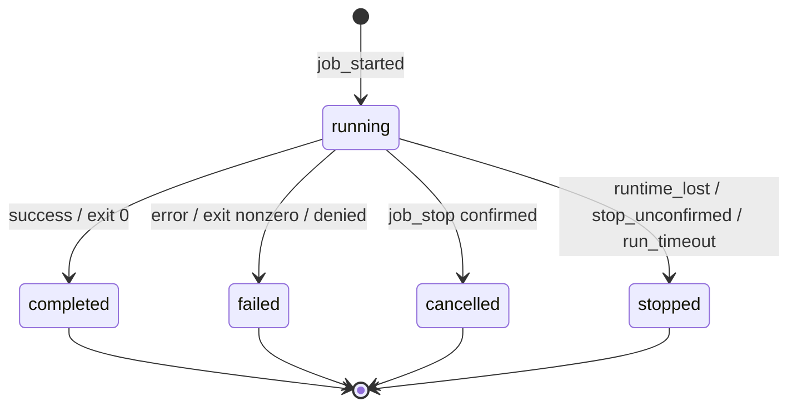
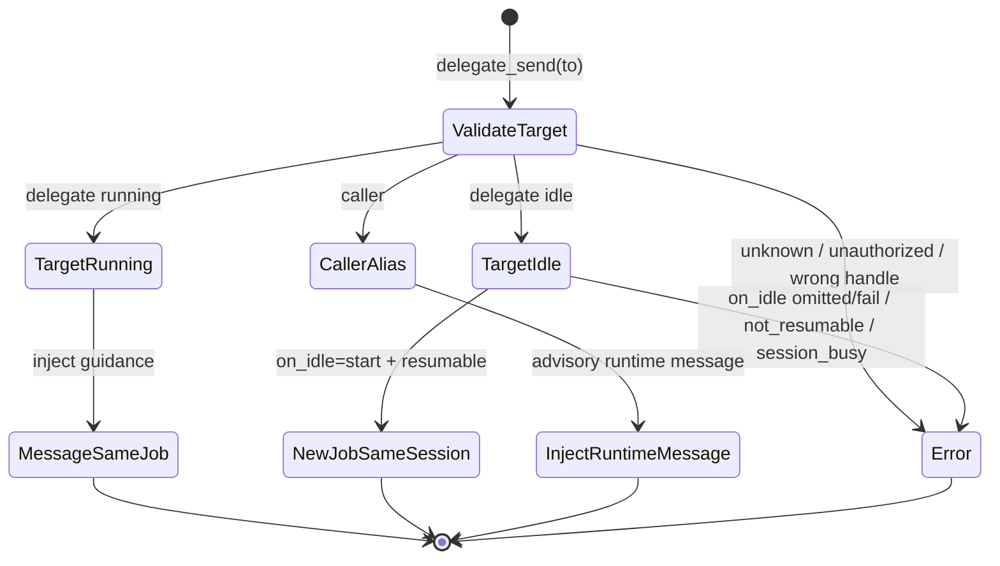
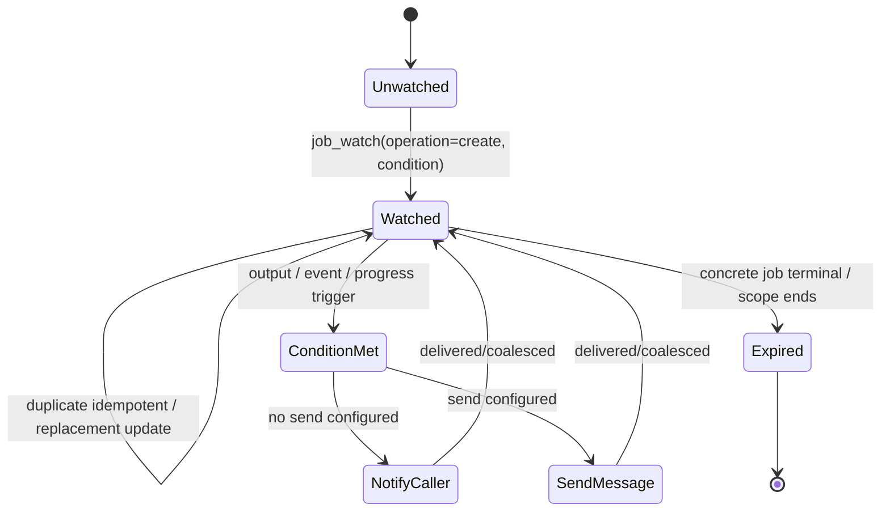
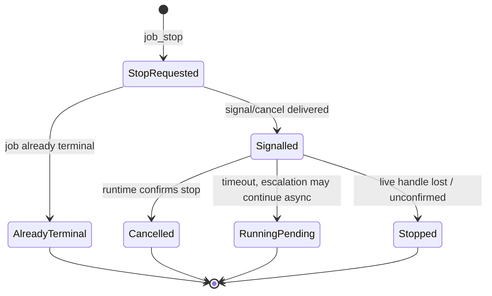
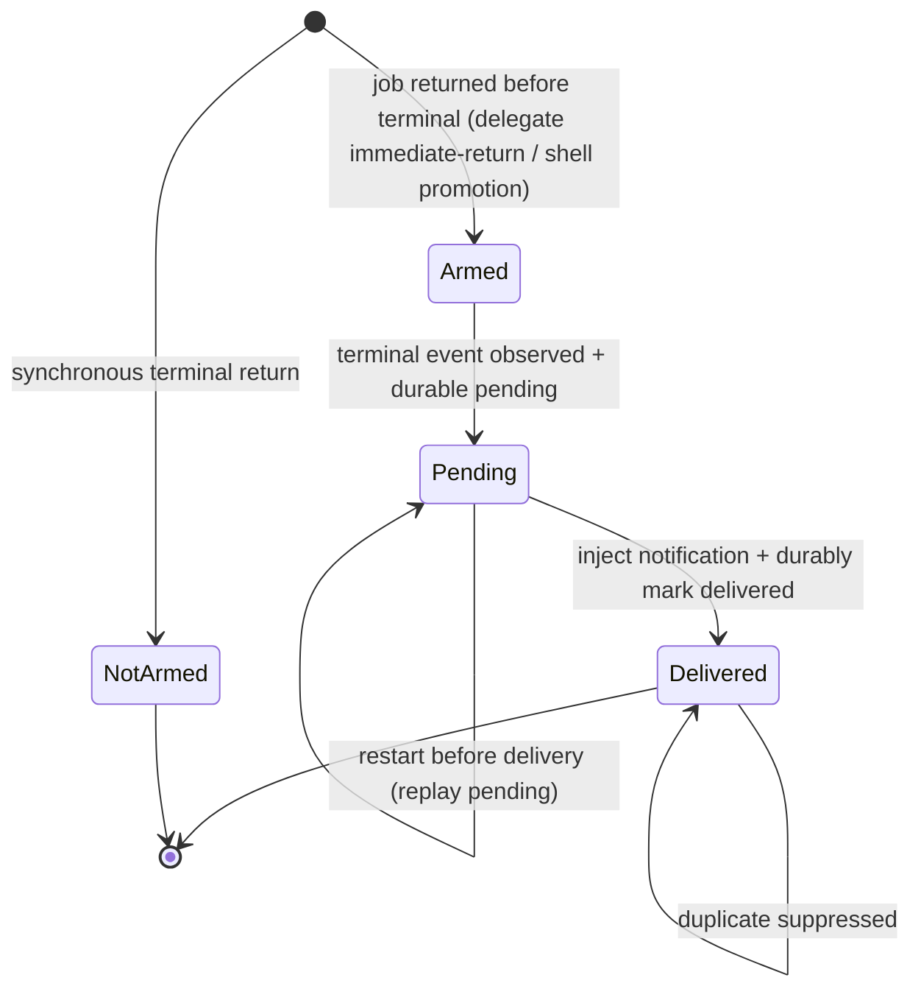
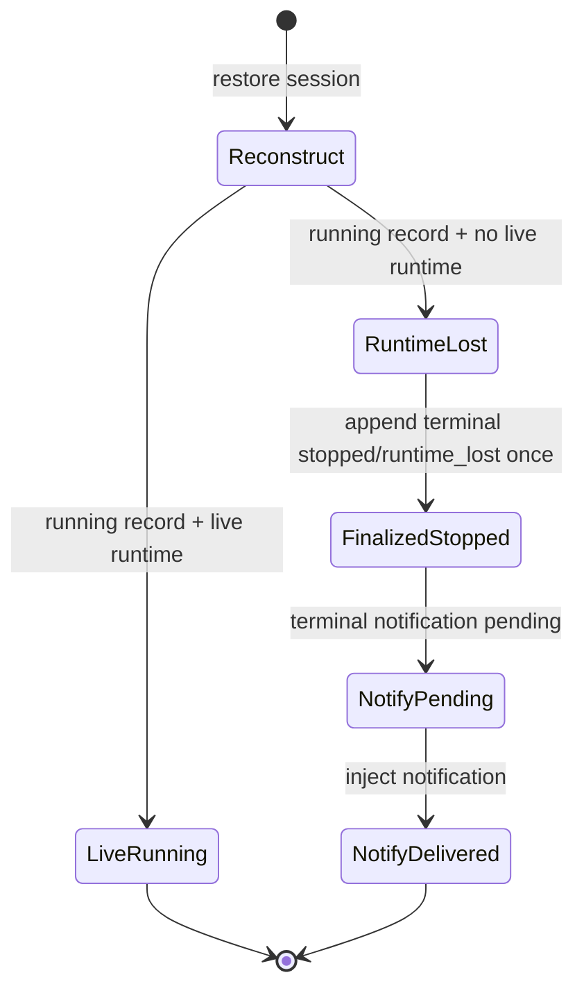
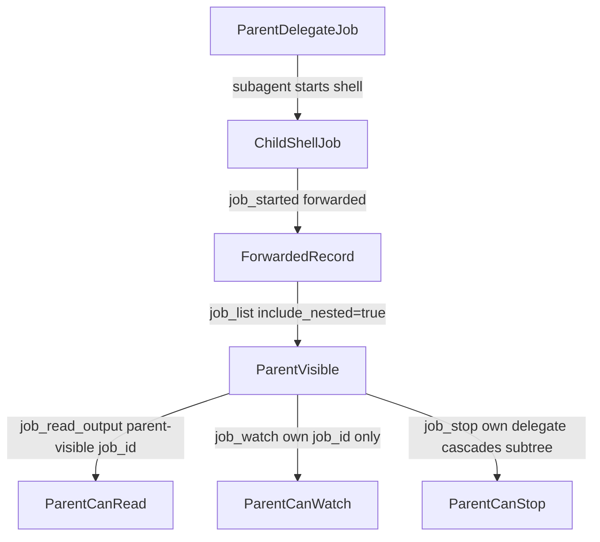

# Job control

Status: Evergreen contract for the shipped job-control system.

This document defines Serf's job-control model. It is an architecture/reference contract for the shipped system, not an implementation plan. Implementation sequencing belongs in separate ephemeral specs or plans.

## Summary

Serf job control is a generic, session-scoped background work system. A **job** is one asynchronous unit of work owned by a Serf session. Jobs are durable enough to list, inspect, notify about, and reconstruct after their creating turn has ended. Running processes are not required to survive a Serf process restart.

Two public job types are in scope:

- **`shell`**: a background-capable invocation of the existing shell/bash command tool.
- **`delegate`**: a background-capable subagent turn that starts a new child Serf conversation. The child transcript remains separate from the job output log.

The default model-facing posture is:

> Shell work runs foreground by default (set `background: true` to launch-and-return) and is promoted to a durable background job when the foreground wait times out. Delegate work returns a `job_id` immediately by default; use `max_wait_ms` to wait inline. Rely on automatic terminal notifications plus one-off `job_read_output`/`job_list` inspection for follow-up. Do not poll.

The target model intentionally does **not** expose:

- `job_kill`
- `job_ack`
- `wait_job`
- `close_agent`
- external `agent_id`

Stopping is handled by `job_stop`. Retention is policy-based, not model-acknowledgement-based. Waiting, when needed, is bounded — `max_wait_ms` on `delegate`/`job_read_output`/`job_stop`, or `background` on shell — not a separate wait tool.

## Model-facing guidance requirements

This reference contract is not itself the runtime system prompt, but the following guidance **must** be reflected in the tool descriptions and in Serf's `Background jobs` system-prompt section. These bullets are normative for model-facing documentation because they shape whether agents use jobs correctly:

- Shell commands run foreground by default and return inline output for quick commands. Set `background: true` to launch-and-return immediately; omit `background` (or set it `false`) for the session-default foreground wait. Foreground shell commands that exceed that wait are promoted to durable background jobs and return a `job_id`.
- Delegate work starts in the background by default (no `job_id` wait); use `max_wait_ms` when you want to wait inline for up to N ms. Shell and delegate defaults differ deliberately: shell commands are usually short decision-producing calls, while delegates are independent agentic work.
- Use `delegate` to start a new delegate conversation/job. It returns both a concrete `job_id` for that turn and a durable `delegate_id` for conversation follow-up. It does not continue an existing conversation.
- Use `delegate_send` for follow-up on a durable delegate conversation: if the delegate is running, it steers the active turn; if the delegate is idle, the default `on_idle="fail"` rejects instead of starting work. Use `on_idle="start"` only when you intend to start the delegate's next job in the same conversation.
- Use `delegate_send` for observer/sidecar commentary too. Runtime alias `caller` is available for delegate/watch-delivered contexts and resolves to the **immediate parent at every level** (a depth-2 worker's `caller` is its coordinator, not the root). `delegate_send` rejects `job_id` and `transcript_ref` handles; ordinary delegate follow-up targets a `delegate_id`.
- After starting a background job, continue useful work or respond to the user. Do not immediately wait, poll `job_list`, or loop on `job_read_output`.
- Serf automatically injects one terminal notification for notification-armed background jobs when they complete, fail, are cancelled, or are stopped/lost. You are told when YOUR delegates finish; your delegates handle their own children's completions in their own turns (you are not interrupted about a job you did not create).
- Use `job_watch` when a condition should notify the caller or send a configured message/frame to another target. `send` is the delivery discriminator: omit it for caller notification, include it for target delivery. Trigger sources are orthogonal: `output_match`, `progress_interval_ms`, and, for event/frame watches, `events` (optionally gated by `every`). Do not use `job_watch` to learn when a job completes.
- Use `job_read_output` for shell stdout/stderr and delegate invocation output/final reports. For delegates, `status="completed"` means the delegate turn ended normally; it does not prove the delegated task succeeded. Read `output`/`structured_result` to judge task outcome.
- Use transcript tools for delegate child conversation history; `job_read_output` is not a transcript reader.
- Use `job_stop` only when the intent is to cancel or stop work. It does not delete output/history and it does not acknowledge results.
- Use `job_list` to recover or inspect job inventory, not to wait for completion. Branch primarily on `status`; treat `reason` as diagnostic detail except for documented operational cases such as `runtime_lost`, `run_timeout`, `awaiting_permission`, and `stop_pending`.

Tool descriptions should avoid these phrases because they train bad behavior:

- Do not describe `job_watch` as subscribing to job completion. Say: “When output/event/progress conditions happen, either notify the caller (`send` omitted) or send the configured bounded frame/message to a target (`send` present).”
- Do not describe `job_read_output(max_wait_ms=...)` as the normal way to wait. Say: “Optionally perform one bounded wait for terminal state, new output, or (with `grep`) a match; do not poll.”
- Do not describe `job_stop` as cleanup. Say: “Request cancellation/stop; retained history/output remains.”
- Do not say `delegate` resumes an old agent. Say: “Start a fresh delegate conversation/job.”
- Do not say `delegate_send` resumes by default. Say: “Send a follow-up message to a delegate_id; running delegates receive it live, while idle delegates require `on_idle="start"` to start the next job.”
- Do not say `job_watch` sends arbitrary unbounded transcript context. Say: “Send the configured message plus bounded frame/excerpt metadata when the watch condition is met.”
- Do not say `job_read_output` reads a delegate transcript. Say: “Read invocation output/final report; use transcript tools for full child conversation.”

## Choosing a wait primitive

Several tools can wait, but they wait on different things. Pick by intent, and do not poll.

| Intent | Use |
| --- | --- |
| Run a command and use its output | `shell` — foreground; promoted to a background job if it exceeds the session timeout |
| Launch a long command without waiting | `shell(background=true)` — returns a `job_id` immediately |
| Start a delegate and wait up to N ms for its result | `delegate(max_wait_ms=N)` — a timeout leaves it running |
| Learn when a backgrounded job finishes | the automatic terminal notification — nothing to call |
| Wait until a job's output contains X | `job_read_output(grep=X, max_wait_ms=N)`, or `job_watch(operation="create", target=<job_id>, output_match=X)` to be notified |
| Re-observe progress on a long job | `job_watch(operation="create", target=<job_id>, progress_interval_ms=N)` (running targets only) |
| Resume an idle delegate and wait for its answer | `delegate_send(to=<delegate_id>, on_idle="start", max_wait_ms=N)` |
| Steer a running delegate | `delegate_send(to=<delegate_id>)` — returns on delivery; `max_wait_ms` is ignored and reported as `wait_ignored_reason` |

There is no "steer a running delegate and wait for its next reply" primitive: a live steer returns on delivery. To get an answer, let the delegate finish its turn (you are notified) and read `job_read_output`, or start its next turn with `delegate_send(on_idle="start", max_wait_ms=N)` once it is idle.

Terminal targets differ by watch type: only an `output_match`-only `job_watch` supports terminal catch-up (a one-shot scan of retained output on an already-terminal job). `events`, `progress_interval_ms`, and `every` watches require a running target and reject a terminal one with `target_terminal`. `job_read_output(grep=...)` reads retained output of terminal jobs directly.

## Vocabulary

| Term | Meaning |
| --- | --- |
| Session | A durable Serf conversation with transcript state. |
| Job | One asynchronous unit of work owned by a session. |
| Job type | The class of work: initially `shell` or `delegate`. |
| `job_id` | Durable opaque identifier for one job/turn. Use it for read, stop, watch, list, and notifications. |
| `delegate_id` | Durable opaque identifier for one delegate conversation. Use it for `delegate_send` and observer watch delivery. |
| `watch_id` | Durable opaque identifier for one watch configuration. Use it for `job_watch` inspect/clear. |
| Parent session | The session containing the job or turn that caused another session/job to exist. |
| Owner session | The session whose runtime/job manager owns the job. |
| Visible session | A session that may list/control the job because the job was forwarded, e.g. parent visibility into nested jobs. |
| Parent job | The job that caused this job to exist, for nested jobs. |
| Delegate session | The child Serf session used by a delegate job. |
| Transcript ref | A safe reference to a Serf session transcript, e.g. `local:<sessionID>`. |
| Notification | Metadata injected into a visible session to tell the agent that a job reached a lifecycle/progress event. |
| Output | Bounded textual/log content associated with a job. |

A **delegate job** is not the same as a **delegate conversation**. Each `delegate` invocation starts a new child conversation and a concrete delegate job/turn. Follow-up on that delegate conversation is performed through `delegate_send` against its `delegate_id`; if the delegate is idle and `on_idle="start"` is supplied, `delegate_send` creates a new job with a new `job_id` in the same delegate conversation. Observer/sidecar comments use the same message-sending surface with runtime-resolved aliases rather than a separate observer-comment command.

For a top-level job, `owner_session_id` and `visible_to_session_id` are the creating session; `parent_session_id` is omitted unless an implementation records a diagnostic lineage field. For a nested forwarded job, `owner_session_id` is the child/delegate session that owns the runtime, `visible_to_session_id` is the parent session that can see the forwarded record, `parent_session_id` identifies the session that caused the child session to exist when that lineage is recorded, and `parent_job_id` links to the delegate job that caused the nested job.

The lifecycle/output/notification contract is generic enough for future job types. The initial public job types are `shell` and `delegate`; clients must not assume type-specific fields exist unless the record's `type` is known.

## Design principles

1. **Generic jobs, not subagent-only handles.** Shell work and delegate/subagent work share lifecycle, output, notification, listing, and stopping infrastructure.
2. **Handles are purpose-specific.** `job_id` identifies a concrete unit of work; `delegate_id` identifies a delegate conversation; `watch_id` identifies a watch configuration. Session IDs and transcript refs identify transcripts, not job control targets.
3. **Defaults match common use.** Shell work is foreground by default with automatic promotion to durable background job on foreground wait timeout. Delegate work returns a `job_id` immediately by default because it is independent agentic work; callers use `max_wait_ms` to wait inline.
4. **Notifications replace waiting.** The parent should not poll or block just to discover completion.
5. **Output reads are non-consuming.** Reading job output never acknowledges, consumes, hides, or deletes a result.
6. **No model-facing ack.** Retention is automatic and policy-based.
7. **No model-facing kill.** `job_stop` is the single model-facing stop primitive; forceful cleanup is an implementation detail when needed.
8. **No automatic process resume after restart.** Durable job history survives; running processes do not have to. Serf must notify when a previously running job is discovered stopped/lost after restart.
9. **Nested shell jobs are supported; nested delegation is allowance-gated.** Subagents may start shell jobs. A subagent may itself delegate only when it was granted a non-zero `delegation_allowance`; a leaf delegate (allowance 0, the default) cannot delegate, so an observer sidecar started without an allowance still must not delegate. See the delegation-allowance amendment below.
10. **Delegate creation and follow-up are separate.** `delegate` starts a new delegate conversation; `delegate_send` follows up on an existing `delegate_id`.
11. **Watches can send messages.** `job_watch` defines conditions over output/events/progress; when a condition is met it may notify the caller or send a configured message/frame to a messageable target.
12. **Observers are composed, not special.** An observer is a delegate plus a watch that sends frames to its `delegate_id`; the observer comments back with `delegate_send`.
13. **Transcript tools stay separate.** Job output is not a transcript. Delegate child transcripts remain readable through transcript tools.

### Delegation allowance (recursive delegation)

`delegate` accepts an optional `delegation_allowance` integer (default 0). The value follows the strict-zero rule used across the job-control surface — absent or 0 means a leaf delegate that cannot itself delegate, exactly today's behavior; there is no `minimum`/`maximum`/`default` keyword on the schema property.

**The grant rule.** A session may grant a child a `delegation_allowance` strictly less than its own allowance, so the chain always shortens and allowance 0 is a leaf. A grant `>=` the granter's own allowance is rejected with `invalid_request: delegation_allowance must be less than your own allowance (<A>); valid grants: <range>`, where `<A>` is the granter's allowance and `<range>` enumerates the grantable values (`0` at allowance 1, otherwise `0..<A-1>`). A session's own allowance rides its `spawnConfig` and its delegate restore descriptor, so it survives restore. The current allowance is also reported on every `job_list` result (see `job_list`), so an agent can read its budget without re-reading its system prompt.

**Availability matrix (allowance-gated).** Whether a child receives the delegation surface is governed by its granted allowance, not by a fixed depth gate. At allowance 0 the child is a leaf: it does not receive `delegate`/`job_watch`, agent-type listings that require those tools are filtered out of its prompt, and its system prompt shows the leaf limits block. At allowance > 0 the child receives `delegate` + `job_watch` (added to the default surface for an untyped child; a typed agent gets them only if its tool list names them), may grant onward allowances strictly smaller than its own, is told its allowance in its prompt, and sees the delegation + background-jobs prompt sections. A typed agent's tool list governs *what* the child gets; allowance governs *whether* the delegation tools are grantable at all — allowance never injects tools into a type that does not list them.

**Double opt-in (dark by default).** A root session's allowance equals `MaxSubagentDepth` (default 1). Under defaults the root's allowance is 1, so the root may grant only 0 — every delegate is a leaf and recursion never happens. Enabling recursion requires **both** raising `MaxSubagentDepth` in config **and** passing a non-zero `delegation_allowance` per spawn. Neither alone unlocks it; recursion stays dark until an operator deliberately does both.

## Job identity and visibility

Serf must mint `job_id` values that are globally unique enough to be used without string namespacing across all jobs visible to a session, including forwarded nested jobs. A parent-visible nested job uses the same opaque `job_id` in notifications, `job_list`, `job_read_output`, `job_watch`, and `job_stop`. Delegate jobs also expose a separate `delegate_id` for conversation follow-up.

The model-facing API must not expose two competing job handles such as `owner_job_id` and `parent_visible_job_id`. If an implementation internally maps child-owned IDs into parent-visible records, that mapping must be durable and invisible to the model-facing tools. The only accepted job handle is the parent-visible `job_id` returned or listed by Serf.

Job-control tools accept their purpose-specific handles, not `transcript_ref`. Transcript tools accept `transcript_ref`, not `job_id` or `delegate_id`, unless a future transcript tool explicitly documents a job-derived lookup. `delegate` creates a new conversation and does not accept any handle for continuation. `delegate_send` accepts `delegate_id` or contextual `caller`; `job_read_output`, `job_stop`, and `job_watch(operation="create")` accept concrete `job_id` targets; `job_watch(operation="inspect"|"clear")` accepts `watch_id`.

## Job status and reason model

Canonical statuses:

| Status | Terminal? | Meaning | Normative reasons | Notification type |
| --- | --- | --- | --- | --- |
| `running` | no | Job has a live or believed-live runtime. | `awaiting_permission`, `stop_pending`, `foreground_timeout` | progress/match |
| `completed` | yes | Work succeeded. | `exit_zero` for shell; otherwise usually `null` | `completed` |
| `failed` | yes | A created job ran or attempted to run and failed. | `exit_nonzero`, `permission_denied`, `startup_failed` | `failed` |
| `cancelled` | yes | Serf intentionally stopped the job and confirmed cancellation. | `stopped_by_parent` | `cancelled` |
| `stopped` | yes | Work did not complete and Serf cannot attribute it to normal failure or confirmed cancellation. | `runtime_lost`, `stop_unconfirmed`, `supervision_lost`, `run_timeout` | `stopped` |

Validation, lookup, and routing errors are synchronous tool errors and do **not** create durable job records. Canonical synchronous errors include `invalid_request`, `permission_required`, `target_not_found`, `target_not_messageable`, `target_terminal`, `target_not_resumable`, `target_not_watchable`, `delegate_session_busy`, and `not_controllable`. If a `job_id` is returned, the job exists and must be listable and readable according to the durable job contract.

`status` is the primary machine branch field. `reason` is optional diagnostic metadata for a job that exists. The normative reason names above are the small portable subset whose behavior this contract defines because they affect recovery, stopping, runtime loss, timeout handling, approval/blocking state, or shell exit interpretation. Tool descriptions must say this plainly: agents should branch on `status` first, and consult `reason` only for documented operational cases such as `runtime_lost`, `run_timeout`, `awaiting_permission`, and `stop_pending`, or when summarizing diagnostics to the user. Implementations may attach additional diagnostic text or implementation-specific reason values, but agents should not need those values for ordinary control flow.

This deliberately differs from the current subagent-only output simplification: generic shell/delegate jobs need a small lifecycle diagnostic vocabulary for runtime loss, stop confirmation, and process exit cases. The vocabulary should stay small; do not add closed-enum reasons for diagnostics that can be represented as free-text `diagnostic` or `error` fields.

`cancelled` is for intentional, confirmed stop. `stopped` is for supervision/runtime loss, runtime timeout, or unconfirmed stop. Restart reconciliation uses `stopped` with reason `runtime_lost`; it means Serf restored durable state and found no live runtime for a previously running job. `supervision_lost` means the supervising owner runtime ended or became unable to supervise a nested job while Serf was otherwise live. Neither is command failure. `not_controllable` is a synchronous routing/control tool error when the owner runtime is believed live but rejects or cannot perform the requested operation; it is not a terminal job status reason.



## Model-facing tools

### Existing shell/bash tool

The existing shell/bash tool becomes job-capable. It is the shell job creation surface; there is no separate `shell_job` tool.

Canonical foreground shape for ordinary commands:

```json
{
  "command": "make test",
  "description": "run tests"
}
```

Shell defaults to foreground because most shell calls are short and decision-producing. Omit `background` (or set it to `false`) for ordinary commands whose output determines the next step — the call waits up to the session command timeout (120s standard), then promotes the command to a durable background job if it is still running. Set `background: true` to launch-and-return immediately for deliberate background work such as a dev server or a long command the agent should not wait on.

Launch-and-return (immediate background) shape:

```json
{
  "command": "npm run dev",
  "background": true,
  "description": "start dev server"
}
```

Foreground with an explicit process-runtime cap:

```json
{
  "command": "go test ./...",
  "max_runtime_ms": 900000,
  "description": "run tests"
}
```

Defaults and timeout semantics:

- `background` unset (or `false`): the call runs the command in the foreground and waits up to the session command timeout (120s in stock provider profiles) for it to finish.
- A foreground shell command that completes within that wait returns inline output and is ephemeral by default: no durable `job_id` is required and it does not appear in `job_list`.
- A foreground shell command still running at the session command timeout is promoted to a durable background job: Serf returns the current bounded output/status with a `job_id`, and the normal terminal notification remains armed for the eventual terminal state.
- `background: true`: Serf starts the command and returns a `job_id` immediately without waiting. The terminal notification fires when it finishes.
- `max_runtime_ms` is an optional process runtime limit for shell jobs. If the process is still running after `max_runtime_ms`, Serf stops it and finalizes the job as `stopped` with reason `run_timeout`. It bounds how long the process may *run*, distinct from the foreground wait.
- Omitted `max_runtime_ms` means implementation-defined shell runtime policy. Recommended policy: default finite runtime for foreground/promoted shell jobs, no default runtime limit for `background: true` shell jobs unless configured by the user/tool call.
- A shell command that completes before the tool returns does not inject a terminal notification; the terminal result is already in the tool result. Return field `timed_out`, when present, means the foreground wait expired; it never means the process hit `max_runtime_ms`.
- To wait for a launch-and-return command to reach a state (e.g. a server printing "ready"), use `job_read_output(job_id, grep, max_wait_ms)` for a synchronous bounded wait, or `job_watch(operation="create", target=<job_id>, output_match=...)` to be notified — an output-match watch catch-up-scans a job's retained output even if it already finished.

Normative foreground-wait bounds:

- The foreground wait is the session command timeout (`DefaultCommandTimeoutMS`, 120000 in stock provider profiles), clamped to `MaxCommandTimeoutMS`. Shell has no per-call wait parameter; `background` chooses foreground (wait, then promote) vs. immediate return.

Normative runtime timeout bounds:

- `max_runtime_ms` is the process-killing deadline and must be distinct from the foreground wait (the session command timeout), which only bounds how long the call waits before promoting to background.
- Minimum positive `max_runtime_ms`: `1000`.
- Implementations must document default/max/clamp behavior for `max_runtime_ms`.
- Negative values fail `invalid_request`.

Ephemeral foreground terminal return shape:

```json
{
  "type": "shell",
  "status": "completed",
  "reason": "exit_zero",
  "running_in_background": false,
  "timed_out": false,
  "exit_code": 0,
  "output": "bounded output text",
  "truncated": false
}
```

Explicit background return shape:

```json
{
  "job_id": "job_...",
  "type": "shell",
  "status": "running",
  "reason": null,
  "running_in_background": true,
  "timed_out": false
}
```

Foreground timeout / promotion return shape:

```json
{
  "job_id": "job_...",
  "type": "shell",
  "status": "running",
  "reason": "foreground_timeout",
  "running_in_background": true,
  "timed_out": true,
  "output": "bounded output text",
  "truncated": false
}
```

Shell approval is not fully designed here. If policy requires approval before a shell command may start, Serf must not execute before approval. The target contract permits either:

1. fail job creation synchronously with reason `permission_required` if no async approval flow is available; or
2. create a durable background job in `running` with reason `awaiting_permission`, then continue after approval or finalize as `failed`/`permission_denied`.

Whichever behavior an implementation chooses must be reflected consistently in `job_list`, `job_read_output`, and notifications.

### `delegate`

`delegate` starts a new delegate/subagent conversation and job. It does not resume or steer an existing delegate conversation. Follow-up on an existing delegate, including observer/sidecar commentary, is handled by `delegate_send` using the returned `delegate_id`.

Canonical background shape:

```json
{
  "task": "Investigate the failing parser test and report findings.",
  "agent_type": "explorer",
  "model": "openai/gpt-5.5",
  "reasoning_effort": "high"
}
```

Full target shape:

```json
{
  "task": "Investigate the failing parser test and report findings.",
  "agent_type": "explorer",
  "model": "openai/gpt-5.5",
  "reasoning_effort": "high",
  "max_wait_ms": 120000,
  "result_schema": {
    "type": "object",
    "properties": {
      "summary": {"type": "string"},
      "files": {"type": "array", "items": {"type": "string"}}
    },
    "required": ["summary"]
  }
}
```

Defaults:

- `max_wait_ms` unset (or `0`) means return the `job_id` immediately without waiting for the delegate to finish.
- Each `delegate` call creates a new delegate job and a new child session.
- `delegate` does not accept `target`, `mode`, `job_id`, `delegate_id`, or `transcript_ref` for continuation.
- With a positive `max_wait_ms`, the tool performs one bounded foreground wait of up to that many ms; timeout leaves the delegate job running in the background with reason `foreground_timeout`.
- Delegates have no model-facing `max_runtime_ms` in v1. Delegate runtime limits, if any, are implementation policy rather than a tool argument.
- `result_schema`, when supplied, is a JSON Schema-like contract for the initial delegate final result and for resumed turns in the same delegate conversation. The delegate output remains readable as prose/log text, and Serf validates and surfaces a structured result when possible. When validation or capture fails for a schema-backed delegate result, Serf omits `structured_result`, sets `structured_result_valid:false`, and includes a machine-readable `structured_result_reason`.
- Delegate interaction is turn-based in this target contract. A delegate that needs more input should finish with a request for that input; the parent follows up with `delegate_send`. Mid-turn interactive input/awaiting-input notifications are not a v1 guarantee. Delegate `status="completed"` means the delegate turn ended normally; it does not assert that the requested task succeeded. Agents must inspect `output`, `structured_result`, or task-specific schema fields for task success/failure.

Background return shape:

```json
{
  "delegate_id": "dlg_...",
  "started_job_id": "job_...",
  "job_id": "job_...",
  "latest_job_id": "job_...",
  "type": "delegate",
  "status": "running",
  "reason": null,
  "running_in_background": true,
  "timed_out": false,
  "transcript_ref": "local:01JCHILD..."
}
```

Foreground terminal return shape:

```json
{
  "delegate_id": "dlg_...",
  "started_job_id": "job_...",
  "job_id": "job_...",
  "latest_job_id": "job_...",
  "type": "delegate",
  "status": "completed",
  "reason": null,
  "running_in_background": false,
  "timed_out": false,
  "transcript_ref": "local:01JCHILD...",
  "output": "bounded final report or invocation output",
  "truncated": false,
  "structured_result": {"summary": "...", "files": ["parser.go"]},
  "structured_result_valid": true
}
```

Foreground timeout return shape:

```json
{
  "delegate_id": "dlg_...",
  "started_job_id": "job_...",
  "job_id": "job_...",
  "latest_job_id": "job_...",
  "type": "delegate",
  "status": "running",
  "reason": "foreground_timeout",
  "running_in_background": true,
  "timed_out": true,
  "transcript_ref": "local:01JCHILD...",
  "output": "bounded output so far",
  "truncated": false
}
```

`transcript_ref` is included once the child session is known. If the implementation cannot know it at creation time, it must persist and expose it later via `job_list` and terminal notification.

### `delegate_send`

`delegate_send` sends a message to a durable delegate conversation or, from a delegate/watch-delivered context, to the contextual caller route. It is the single surface for follow-up with delegates and for observer/sidecar commentary into the parent/watched context.

Target shape:

```json
{
  "to": "dlg_prior_or_running_delegate",
  "message": "Check whether the serializer has the same issue.",
  "on_idle": "start",
  "max_wait_ms": 120000
}
```

Core target resolution:

| Target | Meaning |
| --- | --- |
| `dlg_...` | A durable delegate conversation. |
| `caller` | The contextual immediate parent route, available only from delegate/watch-delivered runtime contexts. |

`delegate_send` rejects `job_id` handles because they identify concrete turns, not delegate conversations. It also rejects `transcript_ref` handles and legacy aliases such as `main` or `watched`. Ordinary delegate follow-up should target a `delegate_id`.

Semantics:

- If `to` identifies a running or currently-driven delegate, Serf injects the message into that active run, returns the current `job_id`, and does not create another terminal notification. The return `action` is `steered`.
- If `to` identifies an idle delegate and `on_idle="fail"` or is omitted, the call fails synchronously with `target_idle`. This default prevents accidental restarts.
- If `to` identifies an idle/resumable delegate and `on_idle="start"`, Serf creates the delegate's next job in the same delegate conversation, with a new `job_id`. The return `action` is `started`.
- If `to` resolves to `caller`, Serf injects a runtime message into that session. The message is advisory/runtime-originated unless the target's tool description says otherwise; it must not impersonate the user.
- If `to` is a `job_id`, `transcript_ref`, unknown delegate, unauthorized delegate, non-resumable delegate, or legacy alias, the call fails synchronously without creating a job record. A `job_id` error should guide the caller to the corresponding `delegate_id` when Serf can resolve it.
- If another job is already running in the same delegate conversation and the target is not that running job, the call fails synchronously with `delegate_session_busy` unless an implementation explicitly supports concurrent child turns.
- Target state is resolved atomically at delivery time. A race between terminal/running state and the tool call is resolved by the observed state at delivery.
- `on_idle` defaults to `fail`. Allowed values are `start` and `fail`.
- `max_wait_ms` unset (or `0`) for a started delegate returns the new `job_id` immediately without waiting. With a positive `max_wait_ms`, the started delegate performs one bounded foreground wait; if that wait expires, the new job remains running in the background with reason `foreground_timeout`. Sending to a running delegate or `caller` returns promptly regardless of `max_wait_ms`. When a positive `max_wait_ms` is supplied to a live steer (which cannot honor it), the return carries `wait_ignored_reason` so the caller does not mistake delivery for a reply. There is no "steer and wait for the next reply" mode; let the live steer's turn finish (you are notified) and read its output, or start the next delegate turn once it is idle.
- `on_idle` and `max_wait_ms` apply to concrete delegate targets. Caller sends are prompt runtime injections and do not create or wait on a job.

`delegate_send` is also the runtime substrate used by `job_watch.send`: when a watch condition fires, Serf sends the configured message/frame to the configured `delegate_id` or `caller` target using the same target-resolution and authorization rules. Watch delivery supplies `on_idle="start"` for delegate targets so an idle observer can receive its frame in a new turn.



Return shape when messaging a running target:

```json
{
  "delegate_id": "dlg_...",
  "current_job_id": "job_...",
  "latest_job_id": "job_...",
  "type": "delegate",
  "status": "running",
  "reason": null,
  "running_in_background": true,
  "timed_out": false,
  "action": "steered",
  "transcript_ref": "local:01JCHILD..."
}
```

Return shape when starting an idle delegate's next job:

```json
{
  "delegate_id": "dlg_...",
  "started_job_id": "job_new...",
  "current_job_id": "job_new...",
  "latest_job_id": "job_new...",
  "type": "delegate",
  "status": "running",
  "reason": null,
  "running_in_background": true,
  "timed_out": false,
  "action": "started",
  "transcript_ref": "local:01JCHILD..."
}
```

Return shape when injecting into the contextual caller route:

```json
{
  "type": "runtime",
  "status": "delivered",
  "running_in_background": false,
  "action": "delivered"
}
```

### `job_watch`

`job_watch` creates, lists, inspects, or clears standing triggers. Create configures what should happen when a running job or the caller session meets a condition. Its create schema has two orthogonal axes:

- **Delivery:** omit `send` to notify the caller; include `send` to deliver a configured message/frame to `send.to`.
- **Trigger source:** use `output_match` for output regex matches, `progress_interval_ms` for periodic progress, and `events` (optionally gated by `every`) for session/job event frames.

Operations:

- `operation="create"` requires `target` and at least one trigger condition.
- `operation="list"` takes no target or watch ID.
- `operation="inspect"` requires `watch_id`.
- `operation="clear"` requires `watch_id`.

The everyday Monitor-like case is `output_match` or `progress_interval_ms` with no `send`. Observer sidecars are the v1 Serf-specific `events`/frame + `send` corner: a watch sends bounded frames to a delegate sidecar, and that sidecar comments back with `delegate_send`. Other useful combinations are allowed when authorized, such as `output_match + send` to nudge a specific delegate when a server prints “ready,” or `events` without `send` to notify the caller with bounded event metadata.

`job_watch` is not a completion subscription: terminal completion/failure/cancellation/stopped notifications are automatic for notification-armed jobs.

Notify caller on output-match shape:

```json
{
  "operation": "create",
  "target": "job_...",
  "output_match": "(?i)(ready|blocked|needs input)"
}
```

Notify caller on periodic-progress shape:

```json
{
  "operation": "create",
  "target": "job_...",
  "progress_interval_ms": 300000
}
```

Clear an existing watch:

```json
{
  "operation": "clear",
  "watch_id": "watch_..."
}
```

Send configured frame/message shape:

```json
{
  "operation": "create",
  "target": "job_...|caller",
  "output_match": "(?i)(ready|blocked|needs input)",
  "events": ["assistant.message", "assistant.tool", "job.notification"],
  "progress_interval_ms": 300000,
  "send": {
    "to": "dlg_observer|caller",
    "message": "Review this frame and comment only if useful.",
    "include_excerpt": true
  }
}
```

Trigger sources:

- `output_match` is level-triggered: it fires once at attach if the job's already-retained output contains a match, then again as appended output matches the regex. It requires a concrete job target; `output_match` on a session target (`caller`) fails `invalid_request`.
- `progress_interval_ms` fires periodically with bounded progress/excerpt metadata even if no match occurred.
- `events` selects session/job event kinds to include in the watch frame. `events: ["*"]` means all visible event kinds allowed by caller permissions and filtering. Event kind names are implementation-defined but must be discoverable by the model; the shipped vocabulary is `assistant.message`, `assistant.tool`, `communicate`, and `job.notification`.
- `every` gates event delivery: `every: N` fires on each Nth occurrence of the watched event kind — for example `events: ["assistant.message"], every: 3` for every third assistant message. `every: 1` is the semantic default (fire on each occurrence) and reads as unset, whatever `events` contains. `every > 1` is valid only when `events` names exactly one concrete kind; supplying it with zero, multiple, or wildcard (`"*"`) kinds fails `invalid_request`.

Delivery modes:

- If `send` is omitted, the watch produces a normal notification to the caller when the condition is met.
- If `send` is present, Serf sends `send.message` plus the requested bounded frame/excerpt to `send.to` using `delegate_send` target-resolution and authorization semantics. Watch sends to delegate targets use `on_idle="start"` and deliver without waiting (unset `max_wait_ms`) for any newly started delegate job. If the target sidecar/delegate is busy, Serf keeps one durable latest-frame-wins pending send per watch key and retries when the target is idle or resumable. Caller-alias (`send.to="caller"`) deliveries surface as a job-notification turn at the next owner-session boundary; delegate-target deliveries steer or start the target as `delegate_send` does. All watch-send delivery happens at owner-session boundaries (between tool rounds, at input end, or on idle wake), not mid-stream.
- Sent frames always carry bounded trigger metadata (the watched `job_id` when one exists, the trigger, and a `delivery_id`); there is no opt-out, and no `include_frame` option exists.
- `include_excerpt=true` attaches a bounded output excerpt and is valid only for concrete job targets; supplying it for a session-target watch (`caller`) fails `invalid_request`. Session-target frames carry the watched session's `transcript_ref` instead of an excerpt; the observer reads context through transcript tools.
- The sent message is the current configured message at the time the watch fires.

Observer/sidecar v1 pattern:

```text
1. delegate(...) starts an observer sidecar -> delegate_id=dlg_obs, current job_id=job_obs.
2. job_watch(operation="create", target=<job_id_or_caller>, events=[...], send={to:"dlg_obs"}) sends frames to the observer.
3. The observer receives frames as messages.
4. The observer advises the watched session with delegate_send(to="caller", message="...").
```

Observer sidecars are v1. No separate `observe` or observer-comment tool is required. Observer comments are ordinary `delegate_send` calls with runtime-resolved targets and permissions.

Rules:

- Every notification-armed background job emits one terminal notification when Serf observes or reconstructs terminal state, subject to durable duplicate suppression. `job_watch` is unrelated to that terminal notification.
- `job_watch` only adds extra notifications or configured sends while the watched target is active/visible.
- For an already-terminal concrete job that still has retained output, an `output_match`-only `job_watch` (no `events` or `progress_interval_ms`) performs a one-shot catch-up scan of that retained output instead of installing a live watch: it returns `terminal_catchup=true` with `watching=false`, `fired=true` and a frame/notification on a match or `fired=false` on none, and the terminal `status`. Any other condition on a terminal target still fails synchronously with `target_terminal` (nothing can ever fire). Unknown or no-longer-retained concrete job targets still fail synchronously with `target_not_found`.
- `job_watch(operation="clear", watch_id=...)` does not stop the watched job. Clearing is by `watch_id`, is idempotent, and returns a no-op success (`watching:false`) when the watch is already inactive or was auto-removed because the target reached terminal state. A genuinely unknown watch ID returns a not-found result rather than requiring the caller to reconstruct the original target/send key.
- `job_watch` fails synchronously with `target_not_watchable` for targets the caller is not allowed to watch. A watch resolves the caller's own jobs only: a target owned by a child or deeper descendant session is not directly watchable. When the target is a known descendant in the live subtree, the failure carries the **delegate-the-watching** guidance — it names the owning descendant session and directs the caller to delegate the watch to that session, which attaches the watch on its own job (the only session that can watch it).
- Self-delivery feedback loops are rejected at creation with `invalid_request`, regardless of target: a watch whose resolved event kinds include a self-generated kind (`assistant.message`, `assistant.tool`, `communicate`, including via `["*"]`) and whose delivery returns to the watching session (`send` omitted, or `send.to="caller"`) would make each delivery cause the next event. Watch self-generated kinds only with `send.to` set to an observer job. `job.notification` self-watches remain allowed.
- Watches expire automatically when their concrete watched job reaches terminal state. Session-level watches remain active until their configured scope ends, the session/job manager closes, or retention policy removes them.
- A watch whose delivery target is a concrete `delegate_id` (the observer/sidecar pattern) grants that observer `job_read_output` on the watched job. Grants are durable read capabilities keyed on the observer's session identity, not the observer's current job handle — they survive observer follow-up turns with new `job_id`s — and are not revoked by watch clear or expiry, because the observer's main read typically happens after the watched job finishes; output retention still bounds what a grant can read. Grants extend `job_read_output` only: no `job_list` visibility, no `job_stop`, and no additional `delegate_send` authorization.
- Watches are not required to survive Serf process restart unless an implementation explicitly marks them durable.
- Already-fired watch-send frames are durable until delivered, replaced by a newer frame for the same durable key, evicted by watch cleanup, or dropped with a caller-visible diagnostic on hard/non-resumable failure. The durable key includes the `watch_id`, visible session, configured watch target, resolved watched identity, resolved send target, and watch generation.
- `job_watch(operation="clear", watch_id=...)` is the model-facing unwatch operation; there is no separate unwatch tool.
- There is at most one active watch configuration per `(visible_session_id, target, send.to)` unless an implementation documents additive watches. For notify-caller watches, `send.to` is the implicit caller notification endpoint, which is distinct from an explicit `send.to="caller"` send: the two are different keys and may coexist for the same target. A duplicate call with the same configuration is idempotent. A different call replaces the previous configuration for that key, and the return value must make replacement explicit with `replaced_existing=true`.
- `output_match` is a Go/RE2 regular expression over the watched job's retained output at attach and then output appended while the watch is active.
- Regex matching is case-sensitive by default; use inline flags such as `(?i)` or `(?i:plugh)` for case-insensitive matching.
- Go/RE2 syntax is leftmost-first and excludes backreferences/lookaround. `.` does not match newline unless `(?s)` is used; use `(?m)` for multiline `^`/`$` behavior.
- Invalid regexes fail synchronously at watch creation time.
- For the retained output present at attach and for bytes successfully appended while a watch is active, Serf must not silently miss a regex match because of preview-window eviction. The no-silent-miss guarantee extends to the attach scan: a token already retained at attach, or one straddling the attach boundary, must still match. Implementations may use line-buffered append-stream matching, chunk-overlap matching, or another mechanism, but the contract is no silent miss for retained/appended watched output.
- Event frames and output excerpts are bounded and filtered before notification or send delivery. Implementations may apply redaction/scrubbing for cross-session or observer delivery, but this contract does not promise perfect secret detection; callers must not treat frames as guaranteed secret-free.
- Default `progress_interval_ms` is absent/no periodic progress wake-up. If supplied, minimum is `1000`, maximum is `3600000`, and omitted/`0` means no periodic progress notification. Negative values fail `invalid_request`.
- Match/event/progress notifications are batched/throttled. Multiple triggers may be coalesced. For watch sends, coalescing is latest-frame-wins by durable key and must not turn a matched condition into silence: Serf either delivers the current pending frame, replaces it with a newer pending frame for the same key, or emits a caller-visible diagnostic for hard failure.
- Each watch configuration has a model-facing delivery budget of 50 (caller notifications plus sent frames, the count `job_list` reports per watch). A watch that exhausts its budget is auto-cleared with one final notification telling the caller to re-arm with a tighter condition (higher `every`, narrower `output_match`, or longer `progress_interval_ms`).
- Terminal notification ordering: flush any queued watch notification/send for a concrete job, then deliver the terminal notification.
- If no watch condition is supplied (`output_match`, `events`, or `progress_interval_ms`) for `operation="create"`, the tool fails because terminal notifications are automatic and there is no condition to watch.

Return shape:

```json
{
  "watch_id": "watch_...",
  "target": "job_...",
  "watching": true,
  "output_match": "(?i)(ready|blocked|needs input)",
  "events": ["assistant.message", "assistant.tool", "job.notification"],
  "progress_interval_ms": 300000,
  "send": {
    "to": "job_observer",
    "include_excerpt": true
  },
  "replaced_existing": false,
  "fired": false
}
```

`replaced_existing` and `fired` are always present, explicitly `false` when they did not happen — `fired` is `true` only for an attach scan or terminal catch-up that matched (§7.1).



### `job_read_output`

`job_read_output` reads bounded retained output and status for a job. It is the only model-facing job-output inspection tool for both shell and delegate jobs. Delegate transcripts remain separate and are read with transcript tools.

Default use is snapshot-only (no `max_wait_ms`). Call `job_read_output` after a terminal/match/progress notification, or when a one-time current snapshot is useful. Do not call it in a loop to wait for completion. Use `max_wait_ms` only when the user explicitly requested a bounded wait or when one bounded wait is necessary to collect immediate output. `max_wait_ms` with `grep` is the sanctioned one-call wait for a specific output token (“wait until the server prints ready”); it is not polling.

Canonical target shape:

```json
{
  “job_id”: “job_...”,
  “grep”: “(?i)(ready|blocked|error)”,
  “max_wait_ms”: 30000
}
```

Canonical behavior:

- Omit `head_lines`/`tail_lines` for the default **head+tail digest**: the first ~100 and last ~100 lines of retained output, with the middle elided and a marker stating how much (bytes, and a permanent-loss note when output was evicted past the retention cap).
- Pass `head_lines` to read that many whole lines from the START of retained output, `tail_lines` from the END, or **both together** for a custom-sized head+tail digest. For an arbitrary middle window, use `from_line` (1-based) + `line_count` (default 100); `from_line` cannot be combined with `head_lines`/`tail_lines`. Omit all of them for the default digest. A per-side byte budget bounds a pathological run of very long lines.
- `grep`, when supplied, searches retained output server-side using Go/RE2 syntax and returns bounded matching lines/chunks plus output metadata. Match entries should include a byte position such as `byte_offset` when available. In the core model-facing contract this is informational/triage metadata; agents can act on it only when an implementation also exposes advanced paging or a UI uses the coordinate to fetch surrounding context.
- `grep` is for inspecting retained output, including terminal jobs. `job_watch.output_match` is for triggering a notification or configured send while a watched running job emits matching output.
- Reads are non-consuming and non-acknowledging.
- The result reports `total_bytes` (lifetime output), `dropped_bytes` (bytes permanently evicted past the retention cap), and `output_status`: `all_retained` (the returned window is the whole retained log), `windowed` (more is retained — read it), or `evicted` (`dropped_bytes` are gone). `output_status` describes the WINDOW, not the job lifecycle — a running job whose window covers everything-so-far still reports `all_retained`.
- `grep` always scans the full retained output; there is no scan-budget parameter, so a grep over retained bytes never silently misses a match for budget reasons. The returned `matches` array is bounded by match-count and per-line caps.
- `max_wait_ms` for `job_read_output` defaults to `5000` when positive; minimum is `1000`; maximum is `60000` (the same bounds as `job_stop`, deliberately tighter than delegate creation: waiting reads are bounded conveniences measured in seconds). `0` and absent mean snapshot-now (no wait). Out-of-range positive values are clamped; negative values fail `invalid_request`.
- With `max_wait_ms > 0`, the tool performs at most one bounded wait, then returns current state/output. Without `grep`, the wait ends on terminal state or more output. With `grep`, the wait ends when the retained output contains a match, on terminal state, or on timeout. Timeout never stops the job.
- `max_wait_ms` is not a polling primitive and must not be used repeatedly in a loop. Terminal notifications remain the normal completion mechanism.
- `job_read_output` must work for terminal durable jobs after the live runtime is gone, as long as the job record/output file is retained.
- An observer delegate granted by a `job_watch` send (see `job_watch`) may `job_read_output` its watched job even though that job lives in the watching session's store; granted cross-session reads are snapshot-only — positive `max_wait_ms` fails `invalid_request`.

Canonical return shape:

```json
{
  "job_id": "job_...",
  "type": "shell",
  "status": "running",
  "reason": null,
  "output": "head+tail digest, requested line slice, or grep excerpt",
  "grep": "(?i)(ready|blocked|error)",
  "matches": [
    {
      "byte_offset": 2048,
      "line": "server ready"
    }
  ],
  "total_bytes": 10000,
  "dropped_bytes": 0,
  "output_status": "all_retained",
  "truncated": false,
  "exit_code": null,
  "last_activity": "..."
}
```

`last_activity` is the most recent parent-observable activity timestamp for the job (an output append, or the job's start when nothing newer is observable). For a terminal record with no live activity stamp it falls back to `ended_at`, then `started_at`. It is a supervision hint for spotting a stalled or quiet job; it is not a substitute for terminal notifications.

#### Advanced output paging

Absolute byte-offset paging, retained-start accounting, next offsets, and detailed truncation-reason arrays are implementation/UI capabilities, not the canonical agent-facing shape. There is no model-facing `limit_bytes` parameter: grep scans the full retained output, and result bounding is fixed policy rather than a knob. Model-facing examples should stay centered on the default digest, `head_lines`/`tail_lines`, `grep`, and `max_wait_ms`. If an implementation exposes absolute paging to models, it must document validation, retention, and truncation behavior separately without making ordinary agents learn the paging algorithm.

`max_wait_ms > 0` with a nonterminal job waits until one of these occurs:

- terminal state;
- without `grep`: retained output advances enough to return new content;
- with `grep`: the retained output contains a match (a match already present at call time returns immediately);
- timeout.

It then returns current status and bytes. Timeout does not stop the job.

If output metadata exists but content was pruned, `job_read_output` returns durable status plus `output_unavailable=true` and reason `retention_pruned`, rather than pretending the job does not exist.

For delegate jobs, output is the parent-visible execution log for that delegate invocation. It must include the delegate's final user-facing report or terminal error/cancellation diagnostic. If the delegate invocation captured a valid structured result, `job_read_output` exposes `structured_result` and `structured_result_valid:true`. If a schema-backed delegate result is invalid, missing, too large to persist, or cannot be captured, `job_read_output` omits `structured_result`, sets `structured_result_valid:false`, and includes `structured_result_reason`. Resumed delegate turns inherit the original delegate conversation's `result_schema`. Delegate output may include streamed assistant text, tool-use summaries, permission/status diagnostics, and nested job notifications. It is not the complete child transcript.

### `job_list`

`job_list` returns durable job records for the current session, optionally filtered.

Target shape:

```json
{
  "status": ["running", "completed", "failed", "cancelled", "stopped"],
  "type": ["shell", "delegate"],
  "limit": 50,
  "include_nested": false
}
```

Rules:

- Default `include_nested=false`.
- Default `limit=50`; maximum `limit=100`. Omitted uses the default. Values above the maximum are clamped downward. Values `<=0` fail `invalid_request`.
- Results are sorted by `started_at` descending, tie-broken by `job_id`.
- `job_list` is authoritative durable inventory for the visible session. Use it to recover known jobs, find `job_id`s, inspect durable state, or include nested jobs. Do not call it repeatedly to wait for completion. For completion, rely on automatic terminal notifications; for output, call `job_read_output` once for the relevant job.
- The owning session can list its own jobs.
- A parent session may list nested jobs owned by delegate child sessions only when those jobs have been forwarded into parent-visible durable job records.
- Delegate records include `delegate_id`, `current_job_id`, `latest_job_id`, `transcript_ref`, `resumable`, and optional `not_resumable_reason`. `delegate_send(to=..., on_idle="start")` uses the same resumability contract when the target delegate is idle. After restart reconciliation, `stopped/runtime_lost` delegate jobs are resumable from retained transcript/session state when strict restore preflight passes. If required retained state is missing, pruned, inconsistent, or otherwise fails strict preflight, Serf reports the delegate as not resumable and follow-up fails synchronously with `target_not_resumable`.
- Most agents should ignore session identity fields and use only `job_id`, `status`, `type`, `reason`, `transcript_ref`, and output metadata. Session fields are for diagnostics and nested/routed job visibility.

Good inventory example:

```json
{
  "status": ["running"],
  "limit": 20
}
```

Bad polling anti-example:

```text
Bad: job_list -> job_list -> job_list waiting for a job to finish.
```

Return shape:

```json
{
  "jobs": [
    {
      "job_id": "job_...",
      "type": "delegate",
      "status": "running",
      "description": "Investigate parser test",
      "owner_session_id": "01JPARENT...",
      "transcript_ref": "local:01JCHILD...",
      "resumable": true,
      "started_at": "...",
      "last_activity": "...",
      "total_bytes": 1234
    }
  ],
  "count": 1,
  "watches": [
    {
      "id": "watch_1",
      "target": "job_...",
      "condition": "output_match: ready",
      "send_to": "",
      "deliveries": 0,
      "created_at": "..."
    }
  ],
  "recent_watches": [
    {
      "id": "watch_0",
      "target": "job_...",
      "condition": "output_match: ready",
      "send_to": "",
      "deliveries": 2,
      "end_reason": "auto_removed_terminal",
      "ended_at": "..."
    }
  ],
  "delegation_allowance": 2
}
```

Rows are lean for scanning: a field that is null/absent for a job is omitted (a running shell row carries no `reason`, `exit_code`, `ended_at`, `transcript_ref`, or resumability keys), `visible_to_session_id` is internal routing and not emitted, and `owner_session_id` is only interesting under tree walks though it is always present. Detail beyond the scan (resumability assessment specifics, the full output) comes from `job_read_output`.

- `delegation_allowance` reports the calling session's current recursive-delegation budget: the largest value it may grant a child is one less (see Delegation allowance). It is omitted when `<= 1` (a leaf with no `delegate` tool, or a budget that can only grant `0` — a no-op knob) and present when the session can actually fan out, so an agent sees a meaningful budget without re-reading its system prompt.
- `watches` enumerates the session's currently active watch configurations (the same set `job_watch` installs), so an agent can re-orient on what it is already watching without re-deriving it. Each entry carries a stable `id` (preserved across an idempotent re-configure; a replacement gets a fresh `id`), `target`, a one-line `condition` summary of the watch's trigger (`output_match`, `progress_interval_ms`, or `events` with an optional `every N`), `send_to` (empty for a notify-caller watch, otherwise the configured delivery target), `deliveries` (model-facing deliveries so far against the per-watch budget), and `created_at`. Drain-only residue from already-terminal watched jobs is not listed. `watches` rides with the result when non-empty (omitted from the lean scan when there are none); it is not subject to the job list's size bounding.
- `recent_watches` is a bounded, latest-first ring of watches that have left the active set, so a watch that fired and then disappeared stays legible (it is not a watch vanishing into ambiguity). Each entry carries the same `id`/`target`/`condition`/`send_to`/`deliveries` plus `end_reason` — `auto_removed_terminal` (the watched job went terminal), `cleared` (`job_watch(operation="clear", watch_id=...)`), `replaced` (a different configuration superseded it), or `budget_exhausted` (it hit the per-watch delivery budget) — and `ended_at`. Combined with `deliveries`, this distinguishes a watch that fired before it was removed from one that never fired, and both from a watch that was never installed (absent from both lists). It is omitted from the lean scan when empty. The ring is a debugging aid, not a durable audit log, and does not survive process restart.

`description` is optional display metadata. For shell jobs it comes from the shell tool's `description` argument. Delegate jobs have no separate `description` argument in v1; implementations may derive a display label from the delegate `task` or leave `description` empty while retaining `task` in durable storage.

`last_activity` is the most recent parent-observable activity timestamp for the job, matching the `job_read_output` field of the same name (an output append, or the job's start when nothing newer is observable; for a terminal record with no live stamp it falls back to `ended_at`, then `started_at`). A running delegate that is working silently stays at its `started_at` until it appends output, which is the signal the quiet-job watchdog (see Notifications) acts on. A per-action "current action" field is intentionally not provided: a running delegate's mid-run action is not cheaply readable from parent-side state.

`total_bytes` is the job's lifetime output byte count: the live so-far count for a running job, the final count once terminal. It carries the same name in the shell result and `job_read_output`, so the field is identical across every tool.

`command` is the shell command line for a shell job, so a row is identifiable without opening the transcript when `description` is sparse. It is omitted for delegate jobs (which have no command).

`exit_code` is the process's own exit status only for a job that exited on its own (`completed`/`failed`). A `cancelled`, `stopped`, or `run_timeout` job was signalled rather than exiting cleanly, so it has no real exit status: `exit_code` is `-1` (a sentinel, not a shell code). Interpret a non-`completed` job from its `status` + `reason`, never from `exit_code`.

`job_list` returns a collection. Control/read tools operate on one `job_id`.

### `job_stop`

`job_stop` requests cancellation of a running job. Use it only when the desired outcome is to stop work. Do not call it after completion, to acknowledge a result, to hide notifications, to delete history, or to free ordinary retained output.

Target shape:

```json
{
  "job_id": "job_...",
  "max_wait_ms": 5000,
  "include_children": false
}
```

Semantics:

- `max_wait_ms` unset (or `0`): the call returns promptly after the stop request is signalled, with whatever status the stop has reached. With a positive `max_wait_ms`, the tool performs one bounded wait of up to that many ms for the stop to finalize.
- `max_wait_ms` is the caller-visible wait budget after Serf sends the stop request. It is not a runtime limit and does not delete the job if it expires. Default `max_wait_ms` for `job_stop` when positive is `5000`; minimum is `1000`; maximum is `60000`; `0` and absent mean return promptly; negative values fail `invalid_request`.
- For shell jobs, signal the process/process group where supported.
- For delegate jobs, cancel the active child run and discard queued `delegate_send` deliveries that have not yet been delivered.
- If graceful stop needs internal forceful cleanup after timeout, that is an implementation detail of `job_stop`; there is no separate model-facing `job_kill`.
- Implementations may continue escalation asynchronously after returning `running/stop_pending`; terminal notification remains armed and must report the eventual final state. If an implementation completes escalation before returning, it must still stay within the caller-visible wait budget or return `running/stop_pending`.
- `job_stop` must actually signal/abort the runtime before finalizing as stopped/cancelled.
- Stopping does not delete output, transcript, or durable job records.
- Stopping does not require or imply acknowledgement.
- If the job already completed before stop lands, return the actual terminal status.
- If stop is confirmed, terminal status is `cancelled` with reason `stopped_by_parent`.
- If no live handle remains and cancellation cannot be confirmed, terminal status is `stopped` with reason `stop_unconfirmed` or `runtime_lost`.
- If still running after timeout, status remains `running` with reason `stop_pending`, and a later terminal notification remains guaranteed.
- The return classifies the result in `outcome`: `cancelled_by_request` (the stop cancelled a live job), `already_terminal` (the job had already finished before the stop), `completed_during_stop` (the job finished on its own as the stop landed), or `stop_requested` (still finalizing, e.g. reason `stop_pending`). `previous_status` reports the status the job held immediately before the stop signal, so a race between completion and cancellation is unambiguous.
- For a shell job, `job_stop` targets exactly the supplied `job_id` and is not recursive by default; pass `include_children=true` only when the user intends to cancel visible active nested jobs too.
- For a delegate job, `job_stop` **cascades into the subtree**: it stops the delegate and the running jobs the delegate's subtree owns (its workers' delegate and shell jobs), recursively. Stopping a coordinator therefore stops its whole live subtree's work rather than leaving the coordinator's workers running orphaned. Each cascade-stopped job finalizes as `cancelled/stopped_by_parent`. The cascade fires **regardless of the coordinator's own terminal status**: a fire-and-return coordinator (one that spawns workers and ends its turn) has its own delegate job go `completed` while its workers keep running, and `job_stop` on it must still halt that live subtree — the cascade targets the subtree's running jobs (already-terminal jobs in the subtree are skipped, so a fully-finished subtree is a harmless no-op). The cascade is keyed on the stopped job being the child's **current** parent delegate: a stale, superseded delegate `job_id` (the child was resumed to a newer job in the same session) does not cascade into the resumed child's current work — stop the current job instead.

Delegate stop (cascades into the subtree):

```json
{
  "job_id": "job_parent_delegate"
}
```

Stopping a delegate job cascades: it stops the delegate and the running jobs in its live subtree (its workers' delegate and shell jobs), recursively, so the workers do not survive orphaned. The cascade stops the running jobs inside the subtree without closing the sessions; Session Close, which tears down whole sessions, is unchanged.

Shell stop with `include_children`:

```json
{
  "job_id": "job_parent_shell",
  "include_children": true
}
```

For a shell job this also stops its visible active nested jobs.

Return shape:

```json
{
  "job_id": "job_...",
  "status": "cancelled",
  "reason": "stopped_by_parent",
  "previous_status": "running",
  "outcome": "cancelled_by_request"
}
```



## V1 tool availability

The v1 model-facing tool matrix is:

| Caller context | Available job tools | Notes |
| --- | --- | --- |
| Root session | shell, `delegate`, `job_watch`, `delegate_send`, `job_read_output`, `job_list`, `job_stop` | Root may create delegates and watches, message its direct delegate conversations by `delegate_id`, and use contextual aliases when authorized. |
| Delegate/subagent session | shell, `delegate_send`, `job_read_output`, `job_list`, `job_stop` | Delegates may start shell jobs. `delegate` and `job_watch` are allowance-gated (a leaf delegate with allowance 0 receives neither; see the delegation-allowance amendment). Delegate `delegate_send` may use `caller`; concrete `delegate_id` targets are scoped to the session's **own direct delegates** at every level — a coordinator may message its own worker delegate by `delegate_id`, but not an arbitrary descendant's delegate (which fails `not_controllable`). `caller` resolves to the immediate parent at every level. |

Tool availability is part of the model-facing contract. If an implementation narrows these permissions for policy reasons, it must make that visible in tool availability or tool descriptions rather than failing late with surprising generic errors.

## Removed / intentionally absent tools

### No `wait_job`

There is no direct replacement for `wait_job`. Normal completion discovery comes from automatic terminal notifications. If a user explicitly asks to block briefly for new output or terminal state, `job_read_output(max_wait_ms=...)` may perform one bounded read/wait. It must not become a polling loop.

### No `job_ack`

There is no model-facing acknowledgement tool. It is unclear when the model should call it, and it creates unnecessary cognitive load.

Retention is policy-based:

- durable job metadata is retained at least as long as the owning session transcript;
- output bytes are capped per job;
- old output may be pruned under session/state retention policies;
- output pruning is reported by `job_read_output` as `output_unavailable`/`retention_pruned` rather than `job not found` when durable metadata remains;
- never require model acknowledgement to make progress.

Notification delivery may have internal delivered/undelivered bookkeeping, but it is not a model tool.

### No `job_kill`

`job_stop` is the single model-facing stop primitive. If an implementation must escalate from graceful stop to forceful process cleanup, it does so inside `job_stop` according to documented timeout/escalation policy.

### No `close_agent` or `agent_id`

Delegate jobs are controlled by `job_id`. Child conversations are identified by session ID/transcript ref. There is no separate `agent_id` namespace and no model-facing close operation for child sessions.

## Legacy Serf surface mapping

The target model removes the current subagent-specific control plane. Replacement mapping:

| Legacy concept | Target replacement | Semantic difference |
| --- | --- | --- |
| `spawn_agent(blocking=false)` | `delegate` (no `max_wait_ms`) | always starts a new delegate conversation and returns `job_id`, not `agent_id` |
| `spawn_agent(blocking=true)` | `delegate(max_wait_ms=...)` | timeout leaves job running |
| `resume_agent` / `send_input` | `delegate_send(to=<delegate_id>, message=..., on_idle="start")` | steers if running; starts the delegate's next job only when `on_idle="start"` is supplied |
| `wait` / `wait_job` | no direct replacement; usually wait for automatic terminal notification | `job_read_output(max_wait_ms=...)` is only an exceptional one-shot bounded read/wait |
| `cancel_agent` / `job_kill` | `job_stop` | graceful stop plus internal escalation |
| `close_agent` | none | retention automatic; transcript remains accessible |
| `subagent_output` | `job_read_output` plus transcript tools | output and transcript are separate |
| `list_agents` | `job_list(type=["delegate"])` | generic job inventory |

## Durable job records

A durable job record exists for promoted shell jobs (including within-bound completions whose output cannot ride inline per the complete-or-handle invariant), delegate jobs, resumed delegate jobs, and other durable asynchronous work. Foreground shell commands that complete inline with output that fits in the tool result are ephemeral and need not create durable job records. A durable job record contains:

```json
{
  "job_id": "job_...",
  "type": "shell|delegate",
  "status": "running|completed|failed|cancelled|stopped",
  "reason": null,
  "description": "...",
  "command": "...",
  "task": "...",
  "parent_session_id": "01J...",
  "owner_session_id": "01J...",
  "visible_to_session_id": "01J...",
  "parent_job_id": "job_...",
  "origin_turn_id": "...",
  "origin_tool_call_id": "...",
  "transcript_ref": "local:01JCHILD...",
  "resumable": true,
  "not_resumable_reason": null,
  "started_at": "...",
  "ended_at": "...",
  "exit_code": 0,
  "output_path": "...",
  "output_bytes": 0,
  "terminal_generation": null,
  "terminal_notification_state": "not_armed|pending|delivered"
}
```

Fields that do not apply to a job type are omitted. `command` is shell-specific. `task`, `transcript_ref`, and resumability fields are delegate-specific. `delegate_session_id` may exist internally or in diagnostics, but `transcript_ref` is the model-facing child-conversation handle.

Retained output start offsets and detailed output availability may be stored with the output store rather than duplicated into the model-facing job record. The invariant is durable reconstruction, not that every storage-level field appears in `job_list`.

## Durable reconstruction invariants

Serf persists job history as append-only session events or equivalent durable records. The physical encoding may be events, database rows, or another durable representation. The contract is that Serf can reconstruct:

- job identity and type;
- parent/owner/visible session identity;
- parent job linkage;
- lifecycle status/reason;
- start/end times;
- shell exit code when meaningful;
- delegate transcript ref and resumability when known;
- output byte count, internal/UI retained start offset, and output availability;
- terminal-notification dedupe and delivery state.

Non-normative event names that can satisfy this contract:

```text
job_started
job_output_delta       optional if output is independently stored
job_session_assigned   delegate jobs only
job_finished           canonical terminal event, including stopped/runtime_lost
job_message_sent            delegate/session message event
job_notification_pending
job_notification_delivered
```

The first canonical terminal durable record/event for a job defines `terminal_generation`. A duplicate reconstructed terminal write for the same job must not create a new `terminal_generation`. Implementations may use a durable event ID, monotonic sequence, or equivalent stable identity, but the identity must be stable across restart and visible-session forwarding.

`job_list` reconstructs from durable job state and overlays in-memory state for currently running jobs.

## Output storage

Each job has a bounded output file under the owning session's state directory. The exact path is implementation-specific, but conceptually:

```text
.serf/sessions/<session_id>/jobs/<job_id>.log
```

Rules:

- Output is capped per job.
- Output appends are serialized enough to avoid corruption.
- Output reads support offset/tail/limit.
- Output reads report truncation and byte offsets.
- Output files are retained according to session/job retention policy.
- Delegate job output is not a substitute for the child transcript.
- Parent-visible nested job output must be readable through parent `job_read_output` either by mirroring output into the parent job store or by durable routing metadata. This routing is not model-visible.

## Notifications

Terminal job notifications are automatic for notification-armed jobs. A model should not need to subscribe to learn that a background job finished.

A job is notification-armed if its creating tool call returned before terminal state, including shell foreground calls that timed out and were promoted to durable background jobs. A job that completed synchronously before the creating tool returned is not required to inject a duplicate terminal notification; the terminal result is already in the tool result. `delegate_send` against a running delegate or `caller` does not arm an additional terminal notification. `delegate_send(on_idle="start")` against an idle/resumable delegate creates a new notification-armed delegate job. V1 sidecars are ordinary delegate jobs for public semantics and notification behavior; Serf keeps only internal watch-origin bookkeeping for frame routing and feedback-loop suppression, plus the durable observer read grants minted by `job_watch` (keyed on the sidecar's session identity, not a marker on any job record).

Notification example:

```xml
<job-notification job_id="job_..." event="completed" job_type="shell|delegate" status="completed" reason="exit_zero" output_bytes="12345">
Job job_... completed. Use job_read_output to inspect output.
excerpt:
<bounded ~400-char result excerpt: shell tail / delegate report head>
[excerpt truncated]
</job-notification>
```

When the excerpt contains the job's complete output (nothing was truncated away), the body says `Complete output below.` instead of the `job_read_output` instruction — a read of what the notification already carries in full must not be nudged. The instruction wording appears only when there is no excerpt or the excerpt is truncated.

Rules:

- Terminal job notifications carry a concrete `job_id`, `event` (the lifecycle/progress notification kind), `job_type` (`shell` or `delegate`), status, reason, output byte count, exit code when known, and optional transcript ref for delegate jobs. `reason` is rendered even when the status carries no reason (`reason=""`), for example an ordinary delegate completion. Watch notifications use `event="watch"` and `job_type="watch"`; output/progress/job-event watches carry the concrete watched `job_id` when one exists, while session-level event watches may omit a concrete `job_id`. Notification `event` must not be named `type`, because durable job records already use `type` for the job class. The v1 event vocabulary is terminal statuses `completed`, `failed`, `cancelled`, and `stopped`, plus `watch` for watch output/event/progress notifications and `watch_send` for caller-delivered watch-send frames (`send.to="caller"`), whose blocks carry `delivery_id` and `trigger` attributes in place of the job status fields.
- Terminal `job_finished` notifications carry a bounded result excerpt in a labeled `excerpt:` section, re-read from the durable job record at render time (consistent on the durable-replay path). The excerpt is directional: a `shell` job shows the last ~400 characters of retained output (the tail); a `delegate` job shows the first ~400 characters of its report (the head). Over-budget excerpts end with a `[excerpt truncated]` marker. A job with no output omits the `excerpt:` section entirely, and a failed output read degrades to no excerpt rather than failing the notification. Watch notifications and watch-send frames carry no `excerpt:` section.
- Notifications include a bounded excerpt that may be the complete output when the whole result fits the budget (rendered with `Complete output below.`), and is otherwise a truncated preview pointing the reader to `job_read_output`.
- Notifications wake the visible session if idle. Notifications render only in their owner's own turns: a session is never asked to render a notification for a job it does not own. A child/delegate session with undelivered attention (a queued owner notification or a pending caller-targeted watch send) is **driven** by its parent at the parent's own loop boundaries — the parent launches one notification turn on the child's own drain loop so the child's model receives its own notifications. The root is driven the same way by serve.go's wake. The drive mints no new job record and notification-arms nothing new; it is the child processing its own durable queue. A child's owner-side notification state remains durable and is delivered when that child is next driven (or resumed).
- A parent **drives** a child for the child's own (delegate-owned) job notifications; it still **renders** its OWN jobs' terminal notifications, including its direct delegates' terminals — the parent is told when its own coordinator finishes, because that is the parent's job ending, not noise about a job it did not create.
- A successful drive handoff settles the parent's forwarded pending COPY of a child-owned terminal (marks it delivered) so the same stale signal does not re-drive forever. The forwarded copy is only a drive signal; the child's own durable queue is the delivery ledger and is never touched by the parent's settle. On restart the parent re-arms only its OWN jobs' terminal notifications; a forwarded copy of a direct child's own job is a drive signal, not the parent's render, so it is not re-armed onto the parent's rail (no restart wake-storm). A child whose latest delegate record (by durable append order) terminated by deliberate stop is not driven for attention that predates the stop; new work clears the gate. If a child cannot be driven (non-resumable, closed, descriptor-less) the parent renders the pending itself prefixed `child unreachable:`, so attention escalates one honest level instead of vanishing.
- If the parent is mid-turn, notifications queue for a safe turn boundary.
- Duplicate terminal notifications for the same job are suppressed.
- Watch wake-ups and configured watch sends are opt-in through `job_watch`.
- Serf supervises running delegate jobs with a built-in quiet-job watchdog. A running delegate that produces no parent-observable activity (no output append; `last_activity` unchanged) for 10 minutes triggers one owner notification reading `quiet for 10m; last activity: <timestamp>`, delivered like a watch notification (`event="watch"`, the delegate's `job_id`). It fires at most once per quiet stretch and re-arms only after the delegate shows fresh activity. This is always-on supervision, not an opt-in `job_watch`; a quiet delegate that is genuinely working (for example reading a large file) is reported the same as a stalled one, because the two are not distinguishable from parent-observable state. The watchdog only notifies the owner; it never steers, resumes, or stops the delegate.
- Notification delivery state is internal; there is no `job_ack`.

Terminal notification dedupe is durable. The dedupe key is `(visible_session_id, job_id, terminal_generation)`, where `terminal_generation` is the stable identity of the first canonical terminal durable event for that job. Serf may implement exactly-once visible delivery or at-least-once delivery with durable duplicate suppression, but it must not repeatedly notify about the same terminal event on every restore.

Notification delivery must also avoid lost notifications, not only duplicates. A notification-armed terminal event must remain in a durable `pending` state until the notification is successfully injected into the visible session. Serf must not mark it `delivered` before injection is durable. This can be implemented as a transactional inject-and-mark-delivered operation or as pending replay with duplicate suppression, but restart between queueing and delivery must not silently lose the terminal notification. This no-loss guarantee is keyed on the OWNER's copy — the session whose own turn renders the notification. A parent's forwarded copy of a child-owned terminal is a drive signal, not the ledger: the parent may settle it at drive handoff (above) without weakening no-loss, because the owner's copy still carries the guarantee.



## Restart behavior

Jobs do not auto-resume after a Serf process restart.

On session restore or job-manager initialization:

1. Reconstruct durable job records.
2. Find records whose latest lifecycle state is `running` but have no live in-memory runtime.
3. Finalize each such job exactly once as `stopped` with reason `runtime_lost`, using the canonical terminal durable record/event and first stable `terminal_generation`.
4. Inject or queue the terminal notification according to durable notification pending/delivered state.

Notification example:

```xml
<job-notification job_id="job_..." event="stopped" job_type="shell|delegate" status="stopped" reason="runtime_lost">
Job job_... stopped because Serf restarted and no live runtime was attached. Use job_list and job_read_output to inspect captured state.
</job-notification>
```

This is not command failure. It is supervision loss.

Parent-visible forwarded nested jobs follow the same reconciliation rule: if the visible record says `running` and the owner runtime is absent after restore, Serf finalizes the parent-visible job exactly once as `stopped/runtime_lost` using the same parent-visible `job_id` and terminal notification dedupe key. Restart loss is never reported as job failure; active control attempts whose owner runtime is believed live but cannot route/control the job fail synchronously with `not_controllable`.

Delegate jobs finalized as `stopped/runtime_lost` are not automatically resumed by restart reconciliation. Their delegate conversations remain resumable through `delegate_send(on_idle="start")` when retained transcript/session state is present and strict restore preflight can reconstruct the conversation safely. Missing or pruned retained state makes the delegate not resumable instead of triggering a best-effort replay.



Graceful shutdown is the deliberate counterpart of restart reconciliation. When an owner session closes cleanly, Serf stop-signals each still-running job and waits a bounded grace period (5 seconds in the shipped implementation) for runtimes to confirm; a job that stops within the grace period finalizes as `cancelled` with reason `stopped_by_parent`, while a job already finalizing under an explicit stop keeps that stop's status/reason. A job that does not confirm in time is abandoned with its durable record still `running`; the next restore of that session finalizes it as `stopped/runtime_lost` through the reconciliation steps above. Child/delegate sessions close before the parent's durable store, so nested jobs finalize through their owner sessions and forward terminal events while the parent can still record them. Undelivered pending watch-send frames are evicted by watch cleanup at close.

## Nested jobs

Subagents must be able to start shell jobs. Nested delegate jobs run on the same parent-job machinery and are allowance-gated: a subagent may itself delegate only when it was granted a non-zero `delegation_allowance` (see the delegation-allowance amendment). An observer sidecar started without an allowance (allowance 0, the default) is a leaf and cannot delegate.

Nested jobs use `parent_job_id` rather than a separate control plane.

Rules:

- Every job has an owner session.
- A nested job records the job that caused it in `parent_job_id`.
- Parent-visible job lists may include nested jobs when `include_nested=true`. This is the one-hop view: the parent's own store, which holds its owned jobs plus the records forwarded up one level from its direct children.
- `job_list(include_descendants=true)` walks the live descendant tree at read time instead of one hop. It returns the caller's own jobs plus every live descendant's jobs, reading each descendant's job store independently under its own lock (no lock is held across the recursion). Each row carries `owner_session_id` and a `depth` annotation: `depth` is the live-walk distance to the store the row was surfaced from — `0` for the caller's own store, `1` for a direct child, and so on. The dedupe rule below applies across the whole walk: a forwarded copy of a `job_id` whose owner is reached live during the walk is suppressed in favor of that owner's record (so each job appears once, at its real owner's depth). The walk is live-only: it recurses only into live child sessions. A dead or terminated descendant contributes just the terminal forwarded copy that survives in an ancestor store (at that ancestor's depth); the walk does not reopen the gone session's store to dig deeper — resume the descendant to inspect its subtree. Default `job_list` and `include_nested` semantics are unchanged; `include_descendants` is additive.
- `job_read_output` resolves a descendant job at depth ≥ 2 (a grandchild-or-deeper session's job) through the recursive owner path: when the one-hop resolver does not find the job locally or in a live direct child, the read recurses the live subtree (the same live-only enumeration the descendant walk uses), applying the single-hop owner resolution at each hop until it reaches the session whose store owns the `job_id`. Each store is read under its own lock; no lock is held across the recursion. The read is served from the resolved owner's store, and the owner session is what the result's owner/resumability projection keys on. Such a deep read is snapshot-only: positive `max_wait_ms` fails `invalid_request` as a cross-session read, exactly as a watch-granted read does. Own-job (depth 0) and direct-child (depth 1) reads are unchanged. The owning branch must be live; if the descendant that owns the job is closed, the read falls back to whatever forwarded terminal copy survives in an ancestor store, the same as the descendant walk.
- For any parent-visible nested job, the parent-visible `job_id` is the only control handle accepted by parent job tools.
- Job IDs must be globally unique enough that parent job tools do not need string namespacing or a separate owner/visible ID choice.
- Notifications, `job_list`, `job_read_output`, `job_watch`, and `job_stop` all use the same parent-visible `job_id`. `delegate_send` uses the corresponding `delegate_id` for delegate conversations.
- Shell jobs created by subagents are visible to the parent through forwarded durable job events.
- Delegate jobs created by subagents join the same one-hop forwarding: delegate-job creation forwards its `job_started` one hop to the parent's store, carrying `parent_job_id` plus owner/type identity (`owner_session_id`, `type=delegate`). This seeds a typed parent-visible record at start, so the later forwarded terminal event merges onto it rather than producing a type-less phantom record.
- Dedupe rule: the owner session's durable record is authoritative for a forwarded job. A forwarded copy of the same `job_id` in an ancestor store is suppressed in favor of the owner record; the forwarded start carries enough identity (owner session + type) to make that suppression unambiguous.
- Terminal notifications for a parent-visible nested background job are **owner-scoped** (spec §3/§10 drive-down): the notification renders only on the OWNER's rail — the subagent that created the nested job — never on the ancestor's. The parent is told only about its OWN jobs, including its direct delegates' terminals (the subagent itself finishing). It is **not** interrupted about a job a descendant created; the forwarded copy is a drive signal for the parent, and the parent drives the subagent so the subagent renders its own notification. The ancestor retains on-demand visibility into the nested job via `job_list(include_descendants=true)`. `job_watch` is only for extra output/event/progress notifications or configured sends.
- Parent `job_stop` on a nested job routes to the owning session/runtime if live.
- If routing is unavailable after restart, Serf reports terminal `stopped/runtime_lost` according to restart reconciliation.
- If routing fails while the owner runtime is believed live, an active control attempt may fail or finalize according to the status matrix by failing synchronously with `not_controllable`.
- For a shell job, `job_stop` is not recursive by default; `job_stop(shell_job_id, include_children=true)` recursively stops visible active nested jobs.
- `job_stop` on a delegate job **cascades into its subtree** (no flag needed): stopping a coordinator's delegate also stops the coordinator's own running jobs (its workers' delegate and shell jobs) and recurses into the live subtree, so stopping a subtree means stopping its direct child. The cascade stops the running jobs inside the subtree without closing the sessions; each cascade-stopped job finalizes as `cancelled/stopped_by_parent`, the same terminal as the directly stopped delegate. It reuses the live-walk leaf-lock discipline — each store's running jobs are read under that store's own lock, only live direct children are recursed into, and no lock is held across the recursion. Session Close still tears down whole sessions recursively and is unchanged.
- `job_stop` on a non-direct descendant — a grandchild-or-deeper job the caller neither owns nor reaches through a direct child it owns the job through — fails synchronously with `not_controllable`. The error names the owning descendant session and the caller's direct delegate that controls that subtree, guiding the caller to stop that direct delegate (which cascade-stops the subtree) rather than silently routing a control attempt the caller is not entitled to make.

Target nested shell support:

- subagents can start shell jobs;
- those jobs are recorded with `parent_job_id`;
- the parent can list/output/watch/stop them through the parent-visible `job_id`; delegate conversations are messaged separately through `delegate_id`;
- nested delegate jobs run on the same parent-job semantics, allowance-gated per the delegation-allowance amendment.

Example flow:

```text
1. Parent starts delegate job job_A.
2. Delegate starts shell job job_B.
3. Parent sees job_B in job_list(include_nested=true) with parent_job_id="job_A".
4. Parent reads shell output with job_read_output(job_B).
5. Parent stops just job_B with job_stop(job_B), or stops the visible tree with job_stop(job_A, include_children=true).
6. job_stop(job_A) on the delegate cascades: it stops the delegate plus the running jobs in its subtree (job_B and anything job_A's child delegated onward), recursively.
```



## Observer and sidecar composition

Observer sidecars are a v1 Serf composition pattern. Claude Monitor covers only the basic stream-notification profile; Serf also supports sidecars that receive bounded event/output frames and comment back through normal message delivery. Serf does not need a separate observer-comment command or a Sprout-style raw handle model. The shipped composition uses existing job primitives:

1. Start a sidecar with `delegate(...)`; this creates an ordinary delegate job with no public marker. (The read grant a later `job_watch` send mints is durable session-keyed bookkeeping, not a job-record marker.)
2. Configure `job_watch(operation="create", ...)` over a concrete job or the `caller` session.
3. Set `send.to` to the sidecar job so the watch condition sends bounded event/output frames to the sidecar.
4. The sidecar responds with `delegate_send(to="caller", message=...)` when it has useful commentary or advice.

This makes observer behavior a composition of two primitives:

```text
job_watch        condition -> notify or send configured message/frame
delegate_send   message delivery -> running delegate, idle delegate with on_idle=start, or caller
```

Safety and behavior rules:

- Watch frames are bounded and filtered. Redaction may be applied for cross-session or observer delivery, but frames are not guaranteed secret-free.
- Observer/sidecar telemetry should be excluded from frames by default to avoid feedback loops.
- Observer advice is runtime-originated commentary, not user instruction.
- Observer failures should not fail the watched session; they produce diagnostics or warnings. A failed watch send must surface as a caller-visible diagnostic notification rather than silently dropping the matched condition.
- Watch sends to busy sidecars/delegates are retried from durable latest-frame-wins pending state. Hard/non-resumable delivery failure drops the pending frame only after emitting a caller-visible diagnostic.
- Access control is target-resolution based: `caller` resolves to the runtime caller/current session; `watched` and `main` are rejected in v1.
- Broad wildcard watches are not part of v1; watch a concrete `job_id` or the `caller` session.

## Relationship to transcript tools

Transcript tools remain separate:

```text
find_session_transcripts
read_session_transcript
```

Use job tools for work-unit lifecycle and output. Use transcript tools for conversation history.

For delegate jobs:

- `job_list` and notifications expose the child `transcript_ref` when known.
- `job_read_output` returns the delegate job output/log/final report for that invocation.
- `read_session_transcript` reads the child conversation.

Decision table:

| Need | Tool |
| --- | --- |
| Did the job finish? | Wait for automatic notification, or check `job_list` once when recovering state |
| Shell stdout/stderr | `job_read_output(job_id)` |
| Delegate invocation final report/log | `job_read_output(job_id)` |
| Delegate full child conversation/tool history | `read_session_transcript(transcript_ref)` |
| Trigger observer/sidecar review | `job_watch(operation="create", ..., send={to:<observer_delegate_id>})` |
| Start a fresh delegate conversation | `delegate(...)` |
| Follow up on an existing delegate conversation | `delegate_send(to=<delegate_id>, message=...)` |
| Start an idle delegate's next turn | `delegate_send(to=<delegate_id>, message=..., on_idle="start")` |

Canonical model-facing delegate conversation field is `transcript_ref`. `delegate_session_id` is diagnostics/internal-only unless an implementation-specific diagnostic view exposes it; ordinary agents should not need to reconcile it with `job_id`.

## Anti-patterns

Tool descriptions and prompts should warn against:

- starting a background job and immediately waiting on it with `max_wait_ms`;
- polling `job_list` for completion;
- using `job_watch` as a terminal completion subscription;
- using `job_read_output` with a large `max_wait_ms` as a blocking read without a clear reason;
- using `job_read_output(max_wait_ms=...)` repeatedly as a wait loop;
- expecting jobs to auto-resume after process restart;
- using job output as a replacement for delegate transcripts;
- passing `transcript_ref` to job-control tools or using `delegate` to resume old conversations;
- stopping a job when the intent is only to inspect output;
- stopping a job as cleanup or acknowledgement;
- assuming a nested job is hidden from the parent;
- expecting `job_stop` to delete durable history.

## V1 non-goals

V1 does not define multi-job barriers, any-of/all-of watches, or named job groups. Agents coordinate multiple background jobs through individual terminal notifications and `job_list` recovery. Fan-in/barrier coordination is the likely first future coordination extension if heavy parallel workflows need less manual state tracking, but it remains out of v1 until that surface is deliberately designed.

Nested delegate jobs are allowance-gated rather than deferred: a subagent delegates only with a granted non-zero `delegation_allowance`, and recursion stays dark by default behind the double opt-in (see the delegation-allowance amendment). Shell jobs are not messageable in v1; long-running REPL stdin is outside this contract.

## Capacity and discovery requirements

Implementations must enforce a documented concurrency policy for jobs. The policy may queue or fail excess work, but it must bound at least:

- concurrent shell jobs;
- concurrent delegate jobs;
- total jobs visible/running in one session;
- observer work within the normal delegate/job concurrency limits.

Exact limits are implementation/configuration details, but unbounded delegate fan-out or unbounded shell process creation is not part of the target contract.

**Tree-wide running-delegate cap.** The number of delegate turns running concurrently across the whole session tree is bounded at 16 by a tree-wide counter shared by every session in the tree. A slot is reserved on each path that launches a running delegate turn — a spawn, a resume, and a drive-down notification turn — and released when that turn ends: on terminal finalize and on the abandon path. An idle (turn-ended) delegate holds no slot, so a coordinator that has ended its turn frees its slot and a later drive re-reserves one for that drive turn. When the tree is already at the cap:

- a spawn or resume from a tool call fails synchronously with `tree_at_capacity: 16 delegate jobs running across this session tree. Wait for completions to free slots, job_stop work you no longer need, or narrow your fan-out and retry.`;
- a drive-down notification turn simply does not launch this pass; the child's durable notification ledger stays queued and the next loop boundary retries (the ledger is durable, so nothing is lost and no retry daemon is needed).

On restart the root rebuilds the counter from its post-reconciliation state (zero); descendants re-reserve as they re-attach or resume. A subtree that is detached from its live parent is uncounted until it is resumed — an accepted v1 looseness, not a leak: such a subtree holds no live runtime to count, and resuming it re-reserves.

This cap binds existing single-level fan-out today: 16 concurrent root delegates now fail loudly with `tree_at_capacity` even with no recursion grants. This is a **live** behavior change at merge, not gated behind any opt-in (see Rollout below). Concurrent **shell** jobs are not bounded by this counter — the shell-job concurrency bound named above remains an acknowledged standing gap, not closed here.

`delegate.agent_type` values must be discoverable by the model. This can be done through the tool description/system prompt, a future discovery tool, or a session context section. If no discovery tool exists, the `delegate` tool description must enumerate the valid agent types available in the current session.

`job_watch.events` event-kind values must be discoverable by the same mechanisms. If no discovery tool exists, the `job_watch` tool description or session context must enumerate the event kinds available in the current session, or document that agents should use `events:["*"]` plus filtering when targeted event names are unavailable.

## Rollout (live vs. dark)

The recursion campaign that landed the delegation-allowance, drive-down, counter, `include_descendants`, and stop-cascade amendments is **dark by default for recursion** but carries **two live behavior changes** that bind existing single-level (root + direct delegates) use at merge with no opt-in. This section discloses both honestly.

**Live — the tree-wide running-delegate cap binds existing fan-out.** The tree-wide counter (cap 16) is wired on the spawn, resume, and drive paths today. Even with no recursion grants, a root that launches a 17th concurrent running delegate now fails loudly with `tree_at_capacity` instead of fanning out unbounded. This is a live change to existing single-level fan-out, not gated behind any config or grant. Idle (turn-ended) delegates hold no slot, so the bound is on *concurrently running* delegate turns, not lifetime fan-out. Shell jobs are not counted.

**Live — nested-job terminal notifications are owner-scoped.** Previously a subagent's nested job pushed a terminal notification onto the parent's model. Under drive-down the notification renders only on the OWNER's rail — the subagent that created the nested job — and the parent is **driven** so the subagent renders its own notification, rather than the parent being interrupted about a job it did not create (Jesse's ruling: an agent is never interrupted about a *subagent's* children). Visibility is preserved, not removed: the parent is still told when its OWN direct delegate finishes (its own job ending), and an ancestor retains on-demand visibility into the whole subtree through `job_list(include_descendants=true)`. This is a live change to the existing nested-shell-job case; it is not dark.

**Live — delegate-start forwarding changes nested-store contents.** Delegate-job creation now forwards a typed `job_started` one hop, so a parent's store carries an owner/type-identified record for a child's delegate job from the start (seeding the later terminal merge rather than producing a type-less phantom). These forwarded records are invisible to a default `job_list` (they surface only under `include_nested`/`include_descendants`), but the nested-store contents differ from before merge. Stated for completeness.

**Dark — recursion (depth > 1) stays behind the double opt-in.** A subagent can itself delegate only when granted a non-zero `delegation_allowance`, and the root's allowance equals `MaxSubagentDepth` (default 1, so the root may grant only 0). Enabling recursion requires **both** raising `MaxSubagentDepth` in config **and** passing a per-spawn `delegation_allowance` — neither alone unlocks it. Recursion stays dark until an operator deliberately does both.

### Why drive-down, not a flat session scheduler

Drive-down delivers the inbox-wakes-an-idle-session behavior using the machinery serf already has: `serve.go` drives the root, and the existing parent-owns-child lifecycle lets a parent drive each direct child at its own loop boundaries — the tree is eventually-driven, level by level (see `docs/architecture.md`, "Drive-down"). The obvious-looking alternative — a flat session scheduler that wakes every session directly from its own inbox, independent of the tree — was war-gamed adversarially in `docs/superpowers/research/2026-06-13-flat-scheduler-wargame.md` and deliberately deferred. The hard part is **teardown quiescence**: making a session's loop goroutine scheduler-owned rather than parent-owned breaks the `sendersWG.Wait()` join and the `closing`-latch "no late goroutine escapes the drain" guarantee that the mailbox and recursion campaigns spent significant effort getting right, converting the simplest, most correct part of the system (Close) into a distributed quiescence protocol. The flat scheduler is therefore a campaign-sized runtime re-architecture — a smaller diff against a far more dangerous invariant — and is deferred under a **named trigger**: measured end-to-end notification latency on deep idle trees, a persistent / cross-process child requirement, or a parent-cadence correctness bug (a child that must take a turn while its parent is blocked in a long LLM call). Until one of those is concretely observed, drive-down is the shipped delivery model. The durable principle drive-down realizes — an agent is never interrupted about a *subagent's* children — is the same principle the owner-scoped notification change above enforces.

## Implementation notes that are not part of the contract

The implementation may choose specific package names, event encodings, output paths, batching windows, and retention limits. Those details belong in implementation specs unless they affect model-facing behavior.

The contract-level requirements are:

- generic jobs for shell and delegate work;
- globally unique opaque `job_id` as primary handle;
- foreground shell default (`background:false` waits the session timeout) with promotion to a durable background job on timeout; delegate default returns the job immediately (unset `max_wait_ms`);
- automatic terminal notification with durable no-loss/dedupe semantics;
- `job_watch` for condition-triggered caller notifications and configured sends, including v1 observer sidecar event/frame delivery;
- bounded output inspection and retained-output grep through `job_read_output`;
- durable listing/history;
- clear stopped/runtime-lost restart behavior;
- observer/sidecar composition through `delegate` + `job_watch` + `delegate_send`;
- nested shell jobs from subagents;
- no model-facing `wait`, `ack`, `kill`, `close_agent`, or `agent_id`.
