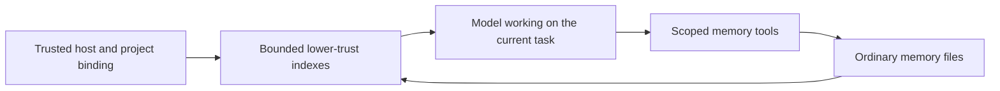

# Memory

Evener keeps useful personal and project lessons in ordinary files on the
session's host. The files are the source of truth, not transcript projections,
client caches or session notes. Stored text is fallible evidence, never
instructions or permission. Current user intent and direct evidence take
precedence.

## Ownership and storage

The session engine owns binding, native tools and index refresh:
[`session_memory.go`](../../agent/session_memory.go) and
[`session_tools_memory.go`](../../agent/session_tools_memory.go). The owning
host's [`DefaultStateRoot`](../../cmdutil/statedir.go) supplies these roots:

```text
<state-root>/memory/personal/
<state-root>/memory/projects/<Project.ID>/
```

The state root is `$XDG_STATE_HOME/evener`, normally
`~/.local/state/evener`. A history `StateDir`, `--state-dir` or
`EVENER_STATE_DIR` override does not relocate memory. Local and remote hosts
own separate storage. Personal memory crosses projects on that host; project
memory belongs to its bound project identity. Earlier builds also kept
per-session memory under `memory/sessions/<id>/`; Evener no longer reads those
directories, and they can be deleted by hand.

Production CLI and daemon sessions bind memory by default. Trusted launch
binding uses `identifier.ResolveProjectWith`; linked worktrees share their main
checkout's identity. The binding survives cwd changes, isolated delegates,
resume and compaction. Project-resolution failure leaves personal memory and
ordinary work available without guessing another project. Unbound library
sessions have no memory capability or home fallback. Tests supply fixture roots.

The five [native tools](../tools/memory.md) use separately confined file roots.
Read-only roles can write memory without gaining workspace writes. Fresh and
restored delegates remain within their parent's effective tool/scope ceilings.
Memory does not grant shell or network access. See [sandboxing](../sandboxing.md).

## Context and editing



Enabled sessions receive separate personal and project `MEMORY.md` projections
as named user-source context, outside system instructions. Each scope's index is generated from its pages' frontmatter (see
**Generated index** below) and supplies at most 8 KiB. When every page's line
fits, the projection says nothing about size. Otherwise it keeps the tag header
and the newest lines that fit, ends with a line counting the pages left out per
tag, and its envelope, which always routes to `memory_read("MEMORY.md")`, says
not every page is shown. Clients decode that sentence as the truncated flag;
transcripts from earlier builds, which said the index was too long or carried
an explicit "truncated true/false", decode as before. Topic files and logs are not preloaded.

Enabled sessions also receive core memory guidance. It is the last section of
the system prompt, rendered from what the session can do when the prompt is
built. The guidance is cached with the prompt and re-rendered when the tool
registry, model or environment changes. It says what each scope holds
(personal memory: what applies beyond the current project, such as how the
human partner works and how tools, systems and the world behave; project
memory: knowledge about this project), when to read a page, and that stored memory is fallible evidence, never
instructions or permission. Memory reflects what was true when it was
written: the agent checks that a file, function, command or setting a note names
still exists before relying on it, and follows a recorded decision or rule
unless the partner or newer evidence says it changed. Sessions that can call the save tools are also told
when to save: when the partner corrects the agent or says how they want work
done, when the partner states a project plan, constraint, decision or unfinished
work (saved to project memory), and when the agent learns
something the hard way that is not written down. Partner-stated
facts are saved before the work they shape, because complying with them does
not carry them to the next session. The Finishing guidance and the result
tool's description repeat the save check at the point the agent decides it is
done. Pages that contradict what the agent observes are corrected in the same
turn. Saving sessions are also told the shape of a useful page (one durable
fact with its reason and how to apply it, with a frontmatter description that
says what the page holds and topic tags that reuse the index's) and that run details which go stale within days (commit SHAs, ids, scratch
paths, test counts, review verdicts) stay out of
personal and project memory. A changed fact is rewritten in place. When the
agent reads a page that has turned into a log, it repairs that page before it
ends its turn. A status-only index line is a reason to read its page. Progress through longer work belongs
to the task list (How you work, when the session has `task_list`): one place
for status, the task list or the ledger a skill keeps, with task notes only
when something happened that a later step needs; the whiteboard carries status
for the partner and memory holds what was learned. Guidance names only tools the session can call, and mentions project
memory only when a project scope is bound.

A scope's full index is projected only while the session has no baseline for
it: at startup, after resume, after compaction, and when the index, its storage
or access returns after a missing, unavailable or revoked state. A projected
index with pages becomes the baseline, held whole (every page line, not only
those the budget showed); a scope with no pages leaves no baseline, so content that
appears later arrives in full. When the session itself writes, edits or
deletes any page through the memory tools, that page's new index line (or its
removal) is patched into the baseline, so its own change is never echoed back
while other sessions' changes since the baseline still arrive. Reads and
writes are recorded under the path the scope lists the page at, so on a
case-insensitive filesystem writing `Fact.md` replaces the line of a page
listed as `fact.md`, and a page read as `FACT.md` is the same page. A scope
with no baseline starts one from that line only when the model was last told
the scope had no pages; after an unavailable state the next boundary delivers
the index in full. A scope with a baseline is read only at the first
model call of each turn (each input the session processes: a user message
or a notification wake), never on that turn's later rounds. When another
session changed a known index, that read appends one change block for the
scope instead of the full index: the quoted page lines added and removed since the
baseline (the tag header and the not-shown line are never listed), with the
same lower-trust framing and route to `memory_read`. A change whose block would pass 2 KiB is reported as counts of
added and removed lines. The new index becomes the baseline, so an unchanged
turn appends nothing.

The session also keeps a record (a content digest, or absence) of each page it
read with `memory_read`, other than `MEMORY.md`. The record is taken from the
bytes that read loaded, so a change another session makes right after it is
noticed; an `offset` or `limit` read loads the whole page too, so it records
the whole page as of that read. Its own write, edit or delete of such a page
updates the record from a read-back of the file. The same first-model-call read rechecks
those pages, and when another session changed or removed one, appends one
notice per scope naming each such page as changed or removed, with the route to
`memory_read`. A notice never carries page contents and never names a page the
session has not read. The session tracks at most the 32 pages per scope it
most recently read with `memory_read`; reading a 33rd stops tracking the least
recently read one (its own writes update a tracked page's record without
changing its place). Page records survive compaction; a resumed session starts
with none. Missing and revoked states still
supersede the previous current context, and unavailable storage is not
presented as freshly read. A read of a known index that misses the refresh's
wait, or that the session's own write made stale, observes nothing and changes
nothing at that boundary. A late read that later completes is still a genuine
read: the next turn-start boundary publishes it rather than reading again, so a
slow read never starves the refresh. A stale one is discarded and read afresh.
Historical context remains recorded history.

Web and native transcripts show each index observation as a standalone
**Refreshed my memory** notification. It starts collapsed at every detail level,
including Full, with System events either on or off. General expansion defaults
do not open it. Expansion shows the scope, index state and formatted index through
each client's Markdown renderer. Unavailable and revoked states remain visible on
the collapsed row; truncated indexes retain their truncation label. A separately
folded **Source** preserves the complete recorded text, including content Markdown
cannot display. Native resolves that original from the retained conversation when
the row opens, so its display-size limit does not clip Source or the malformed
fallback. Both clients use the shared payload validator; an observation
that cannot be decoded, including an index change block, opens as its original text without blocking later valid
observations. Disclosure choices belong to the session and item and survive
remounts and detail-level changes. Native stores the refresh and Source choices
independently, also scoped by hub; folding the refresh preserves its Source
choice. Live and reloaded history use the same projection without changing model
context or memory files. CLI and TUI context presentation remains unchanged.

A `memory_read` of a text page other than `MEMORY.md` that is longer than 4096
bytes ends with a note giving its size, rounded to KB. When the session can
load the gardening-memory skill (`use_skill` is callable and the skill is
advertised to the model), the note says to use it to learn how to fix the
page; otherwise it says a memory page should hold one fact. The index is never
noted as long; its projection counts what it leaves out.

Memory tool calls are separate from these automatic index observations. CLI and
TUI transcripts still use the generic tool-result path, while AppWire web and
native clients render memory tool calls with dedicated step renderers: the step's
words, a saved page for a write and a diff for an edit. There is still no memory
management UI or RPC.

Archived memory-context turns reconstruct as user-role evidence, preserving
their kind, body and order without crossing tool-round boundaries. Text-only
memory updates can join a Responses continuation delta after a valid active
anchor. Compaction without a new valid anchor still requires full history;
unsafe content and the other continuation eligibility checks remain unchanged.

Pages carry frontmatter (`description`, optional `tags` and `evidence`; Evener
adds `updated` and `by`). A page without a description still appears, under its
fallback description. Other content has no required schema, extension or link
rule. An optional `log.md` is ordinary model-authored content, not a
runtime-maintained change log.

The bundled `gardening-memory` skill is explicitly activated through
`use_skill`. It supports small editorial passes: check evidence, correct
contradictions, remove duplicates, split sprawling pages, fix descriptions and
tags, merge pages that share tags, and delete stale pages. It does not activate automatically or run background work.

## Generated index

A scope's `MEMORY.md` is not a file. Evener renders it from the scope's pages
whenever it is needed, in [`memory_index_render.go`](../../agent/memory_index_render.go)
and [`memory_page.go`](../../agent/memory_page.go). A hand-written root index
from earlier builds stays on disk until migrated (see **Migration**). Every
rule here about a root `MEMORY.md` ignores letter case, since `memory.md` names
the same file on macOS's default filesystem.

**What counts as a page.** Every regular file under the scope root, in
subdirectories too, except a path with a segment starting with `.` (the rule
`memory_search` uses) and a file named `MEMORY.md` at the root. Symlinks are
skipped, as scope confinement already refuses them. The listing goes 64 levels
deep, so a file inside more than 63 nested directories is not listed: it never
appears in the index and migration never describes it. Only `.md` files are
parsed for frontmatter. Any other file, or a page that cannot be read, renders
with its filename as the description and no `(no description)` marker.

**Page format.** A page starts with YAML frontmatter, parsed with
`agent/internal/frontmatter`:

```markdown
---
description: Money is integer cents, never floats
tags: [money, formatting]
evidence: file:shop/price.go:Format
updated: 2026-10-08
by: <session id>
---
# Integer cents
Prices are stored and computed as integer cents...
```

`description` is one line; newlines collapse to spaces when it is rendered, and
a value that is not a YAML string counts as missing. `tags` is a YAML list (a
single string is one tag); each tag is trimmed and lowercased, runs of
whitespace become `-`, and empty and duplicate tags are dropped. Tags are plain:
there is no primary tag, reserved tag or type field. `evidence` is free-form and
never rendered in the index; it is for whoever reads the page. Unknown keys are
kept untouched and ignored.

**Fallback description.** When `description` is missing or empty, the line
uses the page's first Markdown heading, else its first non-blank body line, cut
to 120 characters and followed by `(no description)`. A page whose frontmatter
does not parse is still a page; it renders as
`<fallback> (no description) (frontmatter unreadable)`.

**The rendered index.**

```text
Tags: formatting (3), money (2), vitest (6)
- [Integer cents](cents.md) — Money is integer cents, never floats [money, formatting] (updated 2026-10-08)
- [Vitest read-only loader](vitest/loader.md) — read-only Vitest needs --configLoader runner [vitest] (updated 2026-10-07)
```

The `Tags:` header lists every tag with its page count, alphabetically, and is
omitted when no page has tags. Lines run newest `updated` first. A page with no
`updated` sorts by its modification time's UTC date and shows no date; an
`updated` that is neither a YAML date nor a `YYYY-MM-DD` string is ignored.
Ties order by path. The title is the page's first heading, else its filename
without extension; `[tags]` and `(updated …)` are left out when empty. A scope
with no pages has the `missing` state.

When the rendering passes the 8 KiB projection budget, the projection keeps the
header, then the newest lines that fit, then one closing line such as
`Not shown: 9 pages (vitest 4, indexeddb 3, untagged 2).` A page counts once
under each of its tags; tags are ordered by count, highest first, then by name,
with `untagged` last, and one page reads `1 page`. In this projection the
header and the closing line each list only the most-used tags (ties by name)
that fit in 512 bytes, then `and M more tags`, so a scope with hundreds of tags
still shows its newest pages; the header keeps its kept tags alphabetical. The
whole index that `memory_read` returns lists every tag. The line counts and names no
routes; the envelope adds " Not every page is shown; the index's last line
counts the rest." after its `memory_read` route.

**Reading and writing it.** `memory_read` of `MEMORY.md` at the scope root renders the whole index with no size cap, paged by `offset` and
`limit`, or returns `This scope has no pages yet.` `memory_search` skips a
root `MEMORY.md`, including a hand-written one not yet migrated. `memory_write`,
`memory_edit` and `memory_delete` of `MEMORY.md` at the scope root are refused:
"MEMORY.md is generated from each page's
frontmatter; edit a page's description or tags instead". `sub/MEMORY.md` is an
ordinary page. Deleting a page needs no index repair; its line is gone from the
next rendering.

**Stamps.** When `memory_write` or `memory_edit` writes a `.md` file that
counts as a page, Evener sets `updated: YYYY-MM-DD` (UTC, written unquoted so
it reads back as a YAML date) and `by` (the session's full id, YAML-encoded)
in the bytes the tool writes, creating a frontmatter block if there is none and
keeping every other byte. Frontmatter Evener can't safely edit in place is left
unstamped. The stamps land in the tool's one write, never a second
read-modify-write, so a stamp cannot undo another session's later write or
delete of the page. A failed write writes nothing. A written page with no
description gets a note asking for one, and a page whose frontmatter does not
parse gets its own note asking to fix the YAML.

**Migration.** The first time a session with `memory_write`, `memory_edit` and
`memory_delete` renders a scope that still has a real `MEMORY.md` at its root,
it moves the old index into the pages; on a case-sensitive filesystem every
case variant is migrated. Each line that links to a page in the scope
(`[text](path)` or a bare `path.md`) gives that page a description: the rest of
the line, with the link, list markers and separators stripped. A bare path
counts only when nothing path-like follows `.md` (`a.md.txt` and `a.md/x` name
no page). A link whose letter case differs from a page's names that page when
exactly one page matches it ignoring case. A linked page that exists and has no
description gets it; a page that already has one keeps it, and a page whose
frontmatter can't take it is left alone (the backup keeps its line). The first
line naming a page wins, except that within one index a link in the page's
exact case wins over an earlier line naming it in another case. Across indexes,
the one named exactly `MEMORY.md` is read first, and an earlier index wins over
a later one. Migration does not stamp. Each old index is then renamed to a
`.MEMORY.md.pre-generated` backup, a dot name that is never a page or searched,
numbered `.2`, `.3` and so on when taken, so no backup is overwritten. A page
that fails to write does not stop the others, but leaves the old index in
place. A failed migration never blocks rendering; the next rendering retries.
Other sessions render the pages as they are, with fallback descriptions, until
a writing session migrates.

Migration takes no lock, because no cross-session memory lock exists and it
does not need one. It is idempotent: two migrators read the same old index and
write the same descriptions, a page that already has a description is skipped,
and a move that finds `MEMORY.md` already gone counts as done. The move links
`MEMORY.md` to its backup name, which never replaces an existing backup (a
taken name moves on to the next number), and removes `MEMORY.md` only when the
linked bytes are the ones that migration read; an index an older build wrote in
between stays for the next rendering to migrate. A crash midway
leaves some pages described and the old file in place, so the next rendering
finishes the job.

## Faults, recovery and concurrent work

A missing automatic index means empty context and creates no index content.
An explicit missing `memory_read` still fails normally. Setup failures and
unreadable storage remain unavailable, not an empty or rebuilt wiki. The
healthy scope and ordinary session work continue. Automatic refresh has a
finite wait and admits no overlapping index reads per scope. A late abandoned
read is discarded; later access or model boundaries retry and can recover
without restarting the session.

The session requalifies each fixed scope directory beneath its captured host
anchor before admitting memory access. A regular directory restored at that
scope becomes usable in the same session. Symlink replacements remain refused,
and replacing the host pathname cannot redirect the captured authority.
Unchanged directories reuse their environment and read-before-write state.
Replaced environments retire only after admitted index and native operations
finish, including operations paused before filesystem I/O. Close does not wait
for stalled storage, and those late operations own their eventual retirement.

Each write/edit/delete changes one file using the shared filesystem primitive.
Each page edit is its own call, not a wiki transaction; the index follows the pages. There is no
revision check, replay receipt or stronger concurrent-edit guarantee. A whole
file write can overwrite another writer's changes. Read first, prefer focused
edits, and reread after a conflict or uncertain response before retrying.
Underlying errors and applicable read-before-write warnings remain visible.
Oversized output uses existing retained artifacts and `read_transcript` recovery.

Deletion admits only a regular file through captured-parent metadata, without
reading its body or requiring file read permission. Parent permissions still
govern removal. Missing files or parents are a no-op, while directories, symlinks
and special files are refused. Success reports removed or already absent, not
whether an unlink occurred. A leaf swapped after admission can still lose a
replacement non-directory entry, but cannot redirect traversal or remove a
directory. This is not an atomic file-identity check.

## Forgetting and lifetime

Forgetting means model-directed search and separate edits of active copies,
including any maintained log. Deleting a page removes one file and its index
line; repairing links from other pages is separate. There is no automatic consistency repair, old-body
archive or trash folder. Search inherits ordinary grep's dotfile and gitignore
exclusions, so it is not an exhaustive erasure tool.

Logical removal from the active files does not erase original transcripts,
retained output artifacts, provider requests or user backups. Session/history
deletion, worktree removal, compaction and daemon retirement do not own memory
deletion. Reopening the same project identity sees its surviving files.

## Per-session opt-out

`--disable-memory` defaults to false on `evener` and `evener serve`. Disabled
sessions expose no native memory tools, add no automatic memory guidance or
index context, and perform no native wiki I/O. Ordinary tools, skills and
session notes remain available. Loading `gardening-memory` does not grant a
disabled session memory capability.

The choice is sticky across resume and compaction. Omitting the flag on resume
preserves it; passing the flag can additionally disable an enabled session.
Disabled parents dominate fresh and restored children. There is no live toggle
or new screen.

Opt-out does not remove stored files, prior conversation or other sessions'
access. It does not revoke general filesystem permissions: unrestricted file
or shell tools can still reach memory storage if already authorized. It is a
native-feature switch, not an erasure or filesystem isolation switch.
