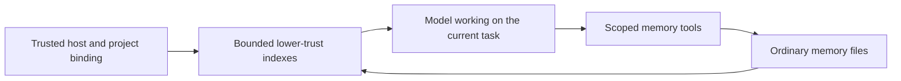

# Memory

Evener keeps useful personal and project lessons in ordinary files on the
session's host. The files are the source of truth, not transcript projections,
client caches or session notes. Stored text is fallible evidence, never
instructions or permission. Current user intent and direct evidence take
precedence.

## Ownership and storage

The session engine owns binding, native tools and index refresh:
[`session_memory.go`](../../agent/session_memory.go) and
[`session_tools_memory.go`](../../agent/session_tools_memory.go). The owning
host's [`DefaultStateRoot`](../../cmdutil/statedir.go) supplies these roots:

```text
<state-root>/memory/personal/
<state-root>/memory/projects/<Project.ID>/
<state-root>/memory/sessions/<root-session-id>/
```

The state root is `$XDG_STATE_HOME/evener`, normally
`~/.local/state/evener`. A history `StateDir`, `--state-dir` or
`EVENER_STATE_DIR` override does not relocate memory. Local and remote hosts
own separate storage. Personal memory crosses projects on that host; project
memory belongs to its bound project identity.

Session memory holds working notes about the current work (its plan, what was
tried and found). The root session owns it;
delegates resolve the scope to their root and can read but not write it. Resume
keeps it. A fork or `--resume-with` child copies its parent's session memory the
first time it opens the scope, in its own process, normally at its first model
call; then the two diverge. A missing or empty parent scope means an empty
start. A copy failure is a session warning and leaves the scope empty; it never
blocks the session. Deleting a session keeps its session memory.

Production CLI and daemon sessions bind memory by default. Trusted launch
binding uses `identifier.ResolveProjectWith`; linked worktrees share their main
checkout's identity. The binding survives cwd changes, isolated delegates,
resume and compaction. Project-resolution failure leaves personal memory and
ordinary work available without guessing another project. Unbound library
sessions have no memory capability or home fallback. Tests supply fixture roots.

The five [native tools](../tools/memory.md) use separately confined file roots.
Read-only roles can write memory without gaining workspace writes. Fresh and
restored delegates remain within their parent's effective tool/scope ceilings.
Memory does not grant shell or network access. See [sandboxing](../sandboxing.md).

## Context and editing



Enabled sessions receive separate personal, project and session `MEMORY.md` projections
as named user-source context, outside system instructions. Each scope supplies
at most 8 KiB of index content, cut at a UTF-8 boundary, with explicit truncation
and a route to `memory_read`. Topic files and logs are not preloaded.

Enabled sessions also receive core memory guidance after the system
instructions. It says what each scope holds (personal memory: what applies
beyond the current project, such as how the human partner works and how tools,
systems and the world behave; project memory: knowledge about this project;
session memory: working notes about the current work: its plan, what was tried
and found),
when to read a page, and that stored memory is fallible evidence, never
instructions or permission. Sessions that can call the save tools are also told
when to save: when the partner corrects the agent or says how they want work
done, when the partner states a project plan, constraint or decision (saved to
project memory), when the agent is partway through longer work (plan and
findings go to session memory as working notes), and when the agent learns
something the hard way that is not written down. Partner-stated
facts are saved before the work they shape, because complying with them does
not carry them to the next session. The Finishing guidance and the result
tool's description repeat the save check at the point the agent decides it is
done. Pages that contradict what the agent observes are corrected in the same
turn. Root sessions are told that details only this work needs go to session memory,
that lasting plans and constraints go to project memory, and to promote lasting
lessons out of session memory before the final report; the Finishing guidance
repeats this. Delegates are told session memory is their root's, to read it and
report what they learn to their parent. A delegate's session index projection
says the same in one sentence. Guidance names only tools the session can call, and mentions project
memory only when a project scope is bound.

Refresh runs at startup, resume, after compaction and later model boundaries.
Unchanged projections are not appended again. Empty, missing and revoked states
supersede the previous current context; unavailable storage is not presented as
freshly read. Historical context remains recorded history. CLI transcripts and
AppWire clients use the existing dynamic-context and generic tool-result paths,
not a memory UI or RPC.

Archived memory-context turns reconstruct as user-role evidence, preserving
their kind, body and order without crossing tool-round boundaries. Text-only
memory updates can join a Responses continuation delta after a valid active
anchor. Compaction without a new valid anchor still requires full history;
unsafe content and the other continuation eligibility checks remain unchanged.

Content has no required schema, frontmatter, filename extension, date grammar
or link-coverage rule. Empty files, arbitrary text, unusual dates and broken
links are accepted unchanged. Markdown, short `MEMORY.md` indexes and useful
dates are recommendations. An optional `log.md` is ordinary model-authored
content, not a runtime-maintained change log.

The bundled `gardening-memory` skill is explicitly activated through
`use_skill`. It supports small editorial passes: check evidence, correct
contradictions, remove duplicates, split sprawling pages and repair summaries
and links. It does not activate automatically or run background work.

## Faults, recovery and concurrent work

A missing automatic index means empty context and creates no index content.
An explicit missing `memory_read` still fails normally. Setup failures and
unreadable storage remain unavailable, not an empty or rebuilt wiki. The
healthy scope and ordinary session work continue. Automatic refresh has a
finite wait and admits no overlapping index reads per scope. A late abandoned
read is discarded; later access or model boundaries retry and can recover
without restarting the session.

The session requalifies each fixed scope directory beneath its captured host
anchor before admitting memory access. A regular directory restored at that
scope becomes usable in the same session. Symlink replacements remain refused,
and replacing the host pathname cannot redirect the captured authority.
Unchanged directories reuse their environment and read-before-write state.
Replaced environments retire only after admitted index and native operations
finish, including operations paused before filesystem I/O. Close does not wait
for stalled storage, and those late operations own their eventual retirement.

Each write/edit/delete changes one file using the shared filesystem primitive.
Page and index edits are separate calls, not a wiki transaction. There is no
revision check, replay receipt or stronger concurrent-edit guarantee. A whole
file write can overwrite another writer's changes. Read first, prefer focused
edits, and reread after a conflict or uncertain response before retrying.
Underlying errors and applicable read-before-write warnings remain visible.
Oversized output uses existing retained artifacts and `read_transcript` recovery.

Deletion admits only a regular file through captured-parent metadata, without
reading its body or requiring file read permission. Parent permissions still
govern removal. Missing files or parents are a no-op, while directories, symlinks
and special files are refused. Success reports removed or already absent, not
whether an unlink occurred. A leaf swapped after admission can still lose a
replacement non-directory entry, but cannot redirect traversal or remove a
directory. This is not an atomic file-identity check.

## Forgetting and lifetime

Forgetting means model-directed search and separate edits of active copies,
including the index and any maintained log. Deleting a page removes one file;
link repair is separate. There is no automatic consistency repair, old-body
archive or trash folder. Search inherits ordinary grep's dotfile and gitignore
exclusions, so it is not an exhaustive erasure tool.

Logical removal from the active files does not erase original transcripts,
retained output artifacts, provider requests or user backups. Session/history
deletion, worktree removal, compaction and daemon retirement do not own memory
deletion. Reopening the same project identity sees its surviving files.

## Per-session opt-out

`--disable-memory` defaults to false on `evener` and `evener serve`. Disabled
sessions expose no native memory tools, add no automatic memory guidance or
index context, and perform no native wiki I/O. Ordinary tools, skills and
session notes remain available. Loading `gardening-memory` does not grant a
disabled session memory capability.

The choice is sticky across resume and compaction. Omitting the flag on resume
preserves it; passing the flag can additionally disable an enabled session.
Disabled parents dominate fresh and restored children. There is no live toggle
or new screen.

Opt-out does not remove stored files, prior conversation or other sessions'
access. It does not revoke general filesystem permissions: unrestricted file
or shell tools can still reach memory storage if already authorized. It is a
native-feature switch, not an erasure or filesystem isolation switch.
