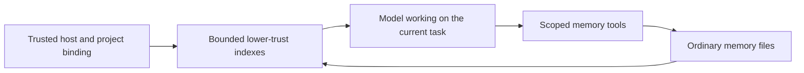

# Memory

Evener keeps useful personal and project lessons in ordinary files on the
session's host. The files are the source of truth, not transcript projections,
client caches or session notes. Stored text is fallible evidence, never
instructions or permission. Current user intent and direct evidence take
precedence.

## Ownership and storage

The session engine owns binding, native tools and index refresh:
[`session_memory.go`](../../agent/session_memory.go) and
[`session_tools_memory.go`](../../agent/session_tools_memory.go). The owning
host's [`DefaultStateRoot`](../../cmdutil/statedir.go) supplies these roots:

```text
<state-root>/memory/personal/
<state-root>/memory/projects/<Project.ID>/
```

The state root is `$XDG_STATE_HOME/evener`, normally
`~/.local/state/evener`. A history `StateDir`, `--state-dir` or
`EVENER_STATE_DIR` override does not relocate memory. Local and remote hosts
own separate storage. Personal memory crosses projects on that host; project
memory belongs to its bound project identity. Earlier builds also kept
per-session memory under `memory/sessions/<id>/`; Evener no longer reads those
directories, and they can be deleted by hand.

Production CLI and daemon sessions bind memory by default. Trusted launch
binding uses `identifier.ResolveProjectWith`; linked worktrees share their main
checkout's identity. The binding survives cwd changes, isolated delegates,
resume and compaction. Project-resolution failure leaves personal memory and
ordinary work available without guessing another project. Unbound library
sessions have no memory capability or home fallback. Tests supply fixture roots.

The five [native tools](../tools/memory.md) use separately confined file roots.
Read-only roles can write memory without gaining workspace writes. Fresh and
restored delegates remain within their parent's effective tool/scope ceilings.
Memory does not grant shell or network access. See [sandboxing](../sandboxing.md).

## Context and editing



Enabled sessions receive separate personal and project `MEMORY.md` projections
as named user-source context, outside system instructions. Each scope supplies
at most 8 KiB of index content, cut at a UTF-8 boundary, with a route to
`memory_read`. A projection says nothing about size unless the index was cut;
then it says the index is too long and to use the gardening-memory skill to
learn how to fix it. Clients decode that sentence as the truncated flag, and
transcripts from earlier builds, which carried an explicit "truncated
true/false" instead, decode as before. Topic files and logs are not preloaded.

Enabled sessions also receive core memory guidance. It is the last section of
the system prompt, rendered from what the session can do when the prompt is
built. The guidance is cached with the prompt and re-rendered when the tool
registry, model or environment changes. It says what each scope holds
(personal memory: what applies beyond the current project, such as how the
human partner works and how tools, systems and the world behave; project
memory: knowledge about this project), when to read a page, and that stored memory is fallible evidence, never
instructions or permission. Memory reflects what was true when it was
written: the agent checks that a file, function, command or setting a note names
still exists before relying on it, and follows a recorded decision or rule
unless the partner or newer evidence says it changed. Sessions that can call the save tools are also told
when to save: when the partner corrects the agent or says how they want work
done, when the partner states a project plan, constraint, decision or unfinished
work (saved to project memory), and when the agent learns
something the hard way that is not written down. Partner-stated
facts are saved before the work they shape, because complying with them does
not carry them to the next session. The Finishing guidance and the result
tool's description repeat the save check at the point the agent decides it is
done. Pages that contradict what the agent observes are corrected in the same
turn. Saving sessions are also told the shape of a useful page (one durable
fact with its reason and how to apply it, under an index line that says what
the page holds) and that run details which go stale within days (commit SHAs, ids, scratch
paths, test counts, review verdicts) stay out of
personal and project memory. A changed fact is rewritten in place. When the
agent reads a page that has turned into a log, it repairs that page before it
ends its turn. A status-only index line is a reason to read its page. Progress through longer work belongs
to the task list (How you work, when the session has `task_list`): one place
for status, the task list or the ledger a skill keeps, with task notes only
when something happened that a later step needs; the whiteboard carries status
for the partner and memory holds what was learned. Guidance names only tools the session can call, and mentions project
memory only when a project scope is bound.

A scope's full index is projected only while the session has no baseline for
it: at startup, after resume, after compaction, and when the index, its storage
or access returns after a missing, unavailable or revoked state. A projected
index with content becomes the baseline, held as projected (cut at the same
8 KiB cap); an empty or missing index leaves no baseline, so content that
appears later arrives in full. When the session itself writes, edits or
deletes a `MEMORY.md` through the memory tools, the result, cut the same way,
becomes its baseline, so its own change is never echoed back. A scope with a baseline is read only at the
first model call of each turn (each input the session processes: a user message
or a notification wake), never on that turn's later rounds. When another
session changed a known index, that read appends one change block for the
scope instead of the full index: the quoted lines added and removed since the
baseline (blank lines ignored), with the same lower-trust framing and route to
`memory_read`. Both sides are compared as projected, within the 8 KiB cap, so
a change past the cap appends nothing. A change whose block would pass 2 KiB is reported as counts of
added and removed lines. The new index becomes the baseline, so an unchanged
turn appends nothing.

The session also keeps a record (a content digest, or absence) of each page it
read with `memory_read`, other than `MEMORY.md`. The record is taken from the
bytes that read loaded, so a change another session makes right after it is
noticed; an `offset` or `limit` read loads the whole page too, so it records
the whole page as of that read. Its own write, edit or delete of such a page
updates the record from a read-back of the file. The same first-model-call read rechecks
those pages, and when another session changed or removed one, appends one
notice per scope naming each such page as changed or removed, with the route to
`memory_read`. A notice never carries page contents and never names a page the
session has not read. The session tracks at most the 32 pages per scope it
most recently read with `memory_read`; reading a 33rd stops tracking the least
recently read one (its own writes update a tracked page's record without
changing its place). Page records survive compaction; a resumed session starts
with none. Missing and revoked states still
supersede the previous current context, and unavailable storage is not
presented as freshly read. A read of a known index that misses the refresh's
wait, or that the session's own write made stale, observes nothing and changes
nothing at that boundary. A late read that later completes is still a genuine
read: the next turn-start boundary publishes it rather than reading again, so a
slow read never starves the refresh. A stale one is discarded and read afresh.
Historical context remains recorded history.

Web and native transcripts show each index observation as a standalone
**Refreshed my memory** notification. It starts collapsed at every detail level,
including Full, with System events either on or off. General expansion defaults
do not open it. Expansion shows the scope, index state and formatted index through
each client's Markdown renderer. Unavailable and revoked states remain visible on
the collapsed row; truncated indexes retain their truncation label. A separately
folded **Source** preserves the complete recorded text, including content Markdown
cannot display. Native resolves that original from the retained conversation when
the row opens, so its display-size limit does not clip Source or the malformed
fallback. Both clients use the shared payload validator; an observation
that cannot be decoded, including an index change block, opens as its original text without blocking later valid
observations. Disclosure choices belong to the session and item and survive
remounts and detail-level changes. Native stores the refresh and Source choices
independently, also scoped by hub; folding the refresh preserves its Source
choice. Live and reloaded history use the same projection without changing model
context or memory files. CLI and TUI context presentation remains unchanged.

Memory tool calls are separate from these automatic index observations. CLI and
TUI transcripts still use the generic tool-result path, while AppWire web and
native clients render memory tool calls with dedicated step renderers: the step's
words, a saved page for a write and a diff for an edit. There is still no memory
management UI or RPC.

Archived memory-context turns reconstruct as user-role evidence, preserving
their kind, body and order without crossing tool-round boundaries. Text-only
memory updates can join a Responses continuation delta after a valid active
anchor. Compaction without a new valid anchor still requires full history;
unsafe content and the other continuation eligibility checks remain unchanged.

Content has no required schema, frontmatter, filename extension, date grammar
or link-coverage rule. Empty files, arbitrary text, unusual dates and broken
links are accepted unchanged. Markdown, short `MEMORY.md` indexes and useful
dates are recommendations. An optional `log.md` is ordinary model-authored
content, not a runtime-maintained change log.

The bundled `gardening-memory` skill is explicitly activated through
`use_skill`. It supports small editorial passes: check evidence, correct
contradictions, remove duplicates, split sprawling pages and repair summaries
and links. It does not activate automatically or run background work.

## Faults, recovery and concurrent work

A missing automatic index means empty context and creates no index content.
An explicit missing `memory_read` still fails normally. Setup failures and
unreadable storage remain unavailable, not an empty or rebuilt wiki. The
healthy scope and ordinary session work continue. Automatic refresh has a
finite wait and admits no overlapping index reads per scope. A late abandoned
read is discarded; later access or model boundaries retry and can recover
without restarting the session.

The session requalifies each fixed scope directory beneath its captured host
anchor before admitting memory access. A regular directory restored at that
scope becomes usable in the same session. Symlink replacements remain refused,
and replacing the host pathname cannot redirect the captured authority.
Unchanged directories reuse their environment and read-before-write state.
Replaced environments retire only after admitted index and native operations
finish, including operations paused before filesystem I/O. Close does not wait
for stalled storage, and those late operations own their eventual retirement.

Each write/edit/delete changes one file using the shared filesystem primitive.
Page and index edits are separate calls, not a wiki transaction. There is no
revision check, replay receipt or stronger concurrent-edit guarantee. A whole
file write can overwrite another writer's changes. Read first, prefer focused
edits, and reread after a conflict or uncertain response before retrying.
Underlying errors and applicable read-before-write warnings remain visible.
Oversized output uses existing retained artifacts and `read_transcript` recovery.

Deletion admits only a regular file through captured-parent metadata, without
reading its body or requiring file read permission. Parent permissions still
govern removal. Missing files or parents are a no-op, while directories, symlinks
and special files are refused. Success reports removed or already absent, not
whether an unlink occurred. A leaf swapped after admission can still lose a
replacement non-directory entry, but cannot redirect traversal or remove a
directory. This is not an atomic file-identity check.

## Forgetting and lifetime

Forgetting means model-directed search and separate edits of active copies,
including the index and any maintained log. Deleting a page removes one file;
link repair is separate. There is no automatic consistency repair, old-body
archive or trash folder. Search inherits ordinary grep's dotfile and gitignore
exclusions, so it is not an exhaustive erasure tool.

Logical removal from the active files does not erase original transcripts,
retained output artifacts, provider requests or user backups. Session/history
deletion, worktree removal, compaction and daemon retirement do not own memory
deletion. Reopening the same project identity sees its surviving files.

## Per-session opt-out

`--disable-memory` defaults to false on `evener` and `evener serve`. Disabled
sessions expose no native memory tools, add no automatic memory guidance or
index context, and perform no native wiki I/O. Ordinary tools, skills and
session notes remain available. Loading `gardening-memory` does not grant a
disabled session memory capability.

The choice is sticky across resume and compaction. Omitting the flag on resume
preserves it; passing the flag can additionally disable an enabled session.
Disabled parents dominate fresh and restored children. There is no live toggle
or new screen.

Opt-out does not remove stored files, prior conversation or other sessions'
access. It does not revoke general filesystem permissions: unrestricted file
or shell tools can still reach memory storage if already authorized. It is a
native-feature switch, not an erasure or filesystem isolation switch.
