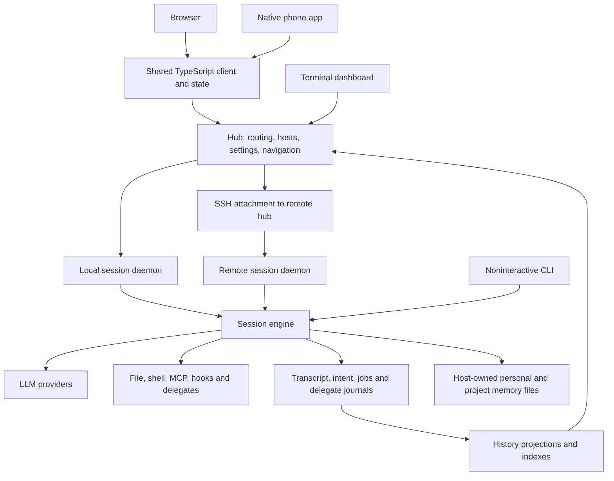

# Product subsystem map

Use this map to follow a user's action to the component that owns the work, its
durable state, and its recovery. It describes the implementation, including gaps;
the [principles](principles.md) describe product intent and the
[punchlist](friction.md) records open gaps and their product decisions.

Ownership here means code responsibility, not a team or person. A client can show
a failure while another component owns its cause. Follow both sides before adding
a retry, refusal, banner, or repair action.

## How the product fits together

Arrows show responsibility and data flow, not shared memory. Local and remote
daemons have their own state roots. AppWire carries client control, daemon control,
and ordered events; the hub also exposes HTTP surfaces. The installed `evener`
executable provides the commands that launch these processes. See
[architecture](../architecture.md) for module boundaries.

## Find the owner from the user's task

| User's task | Start here | Then follow |
| --- | --- | --- |
| Start work with a chosen model and directory | S01 launch; S16 model catalog | S06 hub routing, S08 daemon, S15 provider configuration |
| Read, find, or scroll through a conversation | S02–S04 client; S10 history | S05 protocol and S06 remote/local routing |
| Send, queue, steer, stop, or recover submitted input | S11 durable intent | S05 transport, S08 daemon, S09 session owner |
| Return after a disconnect or phone backgrounding | S02 browser, S03 native or S04 TUI; S05 transport | S06 connection binding, S10 history, S11 pending work |
| Use another machine | S07 hosts | S06 routing, S08 daemon, S20 installation |
| Delegate work, follow a job, or maintain a goal | S12 background work; S09 session | S13 worktrees/scratch, S10 history, S11 attention delivery |
| Recall, correct or forget durable lessons | S24 memory | S09 session context, S14 scoped execution, S10 historical evidence |
| Use a plugin, skill, hook, or external tool | S17–S19 extensions | S14 execution boundaries, S15 credentials |
| Approve access beyond a selected sandbox | S14 execution boundaries | S05 approval requests and decisions; S02–S04 client controls |
| Diagnose a stuck session or repair setup | S21 diagnostics; S15 settings | The affected subsystem's authority and recovery owner below |

## Clients and interaction

| ID and responsibility | Entry points and implementation | State authority and recovery ownership | Owning references |
| --- | --- | --- | --- |
| **S01 Launch** — turn prompt, model, directory, attachments and selected extensions into a session | [Hub thread lifecycle](../../cmd/evener-hub/app_threadlifecycle.go), [shared preview preparation](../../cmd/evener-hub/app_launch_preview.go), [web Spawn](../../cmd/evener-hub/frontend/src/panes/spawn/Spawn.tsx), [native new session](../../mobile-native/src/newSession.ts), [CLI](../../cmd/evener/main.go) | The client owns the draft; the hub owns creation and initial input delivery; the daemon owns the resulting session. Shared preview preparation owns user-only and disposable-probe launch resolution and probe cleanup for plugin preview and slash catalog; slash's existing-directory branch retains its resolver errors and seams. A disconnected creation can finish server-side. Creation-outcome discovery and turn-mutation replay are different contracts. | [Getting started](../getting-started.md), [provider launch configuration](../llm-provider-config-and-launch.md) |
| **S02 Browser workspace** — browse sessions, read, compose, inspect activity and change settings | [Frontend](../../cmd/evener-hub/frontend/src), [thread store](../../cmd/evener-hub/frontend/src/stores/threads.ts), [transcript flow](../../cmd/evener-hub/frontend/src/panes/session/transcript/flow), [older-history reader](../../cmd/evener-hub/frontend/src/panes/session/transcript/useTranscript.ts), [session activity binding](../../cmd/evener-hub/frontend/src/stores/sessionActivity.ts) | Stores bind visible state to the selected session and connection. The workspace store owns exact living pane records, current slots and focus across desktop/phone host changes. Its `sourcePaneSessionRef` projection supplies conversation-source ownership to document opening and route reconciliation, including a job transcript's parent session. Desktop reconstruction restores dockview geometry without replacing those records or replaying their selection; document Back owners, captured file references and reopen generations remain runtime-only. After a session route settles, filename Open/reopen retains document selection beside its exact live source promoted to main, including secondary sessions and transcripts; reconnect and settled location refresh preserve this binding. Route reconciliation waits for the opening stack to publish the exact source owner when hydration publishes a reference first. New or pending URL intent, generic documents and stale or mismatched bindings still follow route reconciliation. Cold restore creates fresh records, honors route intent and never resurrects runtime owners from saved layouts. The rail projects own session failure and live child work from compact navigation summaries, preserving questions, approvals and failed-child context. The launcher and session composer share the atomic skill/command editor; target-scoped catalogs authorize offered rows, and the pane-owned composer source retains text, ordered skill/command selections and UTF-16 mention locations beside attachments across remount, inspection and Return; structured drafts persist that editing metadata. Launch drafts own the [selection restoration signal](../web-ui/parity/contracts-composer-queue-pending.md#atomic-skill-and-command-selections) used by the mounted editor when submitted image cleanup finishes after a remount. Explicit commands expand with empty arguments, while typed leading commands and built-in controls keep their existing behavior. The Dock integration preserves mounted transcript scroll positions when focusing an already selected pane in another group. The existing transcript registration retains visible-entry intent and approximate usable-depth progress across viewport width and height changes, including later composer-height settlement, while VirtualList owns measurement and committed geometry. The [readonly adapter](../../cmd/evener-hub/frontend/src/panes/transcript/ReadOnlyThreadContent.tsx) admits a retained source capture through the existing registry before scroll initialization on remount or hydration, keeping away-reading intent out of fresh end-follow initialization. Restoration waits for useful committed content and scroll read-back; the pane-lifetime [transcript read view](../../cmd/evener-hub/frontend/src/panes/session/transcript/transcriptReadView.ts) lets newer viewport movement or explicit positioning supersede older work without moving focus. Passive bottom-follow admission also uses committed VirtualList geometry, preserving an away reader through temporary reflow clamping. Existing end-follow intent survives passive same-viewport measurement corrections; newly measurable viewports still require true-end admission. End following, keyed prepend and history recovery retain their existing owners. DockHost excludes the empty floating overlay mirror from layout during native resize; Dockview owns resize observation and populated floating placement, overhang and input. Each visible desktop session pane owns a footer bound to its explicit ref; opening activity from that footer focuses its pane before the shared sidebar reads focus. Mobile session panes omit the working-directory/repository row and reserve only keyboard-aware safe-area clearance below the composer. The composer keeps exited-session model, session-action and Send controls visible at rest, with only the empty editor shrinking to one line. It tracks focus while live and across stopping, controls and portaled overlays; focus, drafts and attachments keep the editor expanded. Its inline chrome remains the activity discovery owner across editor engagement. Model selection follows the advertised capability and the hub-owned cold-session resume path. Session action menus expose Overview with session-scoped Agents, Jobs, Watches, Tasks and shared-model About. Tasks and Details remain registered workspace panels. Workspace restore omits saved Activity placements through unknown-pane recovery, preserves useful survivors and valid primary routes, and leaves independent Overview preferences intact. DockHost retains saved tab labels while session names are unavailable, then accepts bounded-navigation or live thread-name updates; a type or ref change retires the old title hint. Hydrated pane headings can own their tab labels, while the cascade tab retains its registered selected-leaf title. Standalone Details, the recursive Activity Sheet and inline discovery retain their existing owners; retirement performs no deletion or lifecycle mutation. Session menus offer Delete only for local top-level sessions whose lifecycle is stopped, including confirmed crashes; live sessions and ordinary non-crashed errors keep Delete hidden. A session fenced behind an incompatible daemon protocol presents a degraded notice in its pane instead of action buttons: it states the session is still working and everything already saved is kept, that the session runs a different Evener version and cannot receive new messages, and the stop-and-start loop that restores interaction (Force shutdown in the session menu stops it, interrupting in-progress work, and the next message starts it again). The pane follows the fenced daemon's exit by itself through the hub's `evener/thread/resync` re-read, with no manual refresh control, and then offers the ordinary resume-fold or Send-driven recovery. A session fenced by its own recovery (stopped under uncertainty) makes Send the single action: pressing it resumes the session, reconciling any delivery-uncertain messages, and then dispatches the pressed send once. The pane offers no standalone Resume control for that shape; a resume failure reports its reason on the send path with the pressed text preserved as durable pending work, and shapes Send cannot recover keep their existing notice and controls. An identity-changing resume moves the pane to the resumed identity carrying the newer stored draft (text, selections, command names, mentions); staged image attachments are per-mount composer state and do not follow the identity or survive a reload ([C14](friction.md#c14-staged-image-attachments-across-identity-changes)). Scroll supplies older-page demand; `useTranscript` binds its shared retry owner to the committed session and retains demand across navigation. Jump to live cancels demand from the returned pane and its removed predecessors while independently open panes keep their demand. The thread store owns hydration, page merging and replay. Activity views share session-scoped summary and collection demand; transcript entity reads share that binding, and the visible recursive panel owns subtree demand. The recursive Activity Sheet folds every settled job and delegate, including failures, into its existing per-session Inactive groups with quiet truthful rows; active descendants and their ancestor paths stay visible, while live questions, approvals and current errors retain attention. Folding leaves authoritative output actions and recovery information intact, independently of Overview and native histories. The panel view store retains mobile sheet, disclosure and per-collection loaded-boundary intent across child/Back navigation while its workspace pane remains retained; restoration uses the existing page boundary and ends on close or resolved-session replacement. Read-only child transcripts show proven ancestry from the same session binding without replacing their chosen title. AppShell ends route deferral when the resolved location confirms an already placed session, preserving subsequent read-only child focus and the parent URL. Desktop Agents activation opens or reuses a read-only secondary [automatic cascade](session-activity.md#automatic-agent-cascade): two readable scopes, live ancestor spines with shared session-list indicators and selected-leaf chrome; a live origin pane collapses its duplicate immediate parent to a spine. Spine runtime metadata and navigation-summary arbitration retain their separate owners. The ordinary center source stays mounted with its composer and semantic scroll position; secondary origins retain work under normal inactive-tab mounting rules. Return closes only the inspector and focuses the exact surviving source lifetime. The [workspace owner](../../cmd/evener-hub/frontend/src/shell/workspace.ts) owns logical panel records and successful restore; the [pane lifetime](../../cmd/evener-hub/frontend/src/shell/paneLifetime.ts) owns retained composers and transcript readers. The [cascade origin owner](../../cmd/evener-hub/frontend/src/panes/zoom/inspectionOrigin.ts) binds validated saved locators during successful workspace restore before publication, and retirement removes stale locators without adopting a reused pane ID. Saved inspection focus survives boot and late route recovery only when the actual ordinary route is already satisfied; fresh pathname navigation keeps priority. Saved intent retains edges and origin while unrelated panes keep their placement; image bytes remain lifetime-owned. Existing saved cascades without inspection intent retain their recorded Return behavior. AppShell recognizes a matching legacy cascade source during initial route reconciliation regardless of whether location or DockHost restoration finishes first; different routes keep precedence and later navigation retains its placement rules. Mounted composers apply image gestures to their own text and selection; background marker cleanup and detached continuations cannot claim another pane's newer shared draft. Close/reset retires the source lifetime even when the panel ID and ref are reused; late recovery completion cannot change the replacement's work, while the existing dispatcher still owns durable input. Cascade and sidebar breadcrumbs share reconciled requested bindings. Read-only columns consume the existing thread deletion fence and scope availability state for terminal explanations while healthy parents and ordinary hydration recovery remain usable. The [real-stack guard](../../cmd/evener-hub/frontend/scripts/cascadeguard/README.md) exercises the producer, hub and production browser boundary. The desktop sidebar store retains bounded per-session/category open, disclosure and semantic scroll intent across reload; its viewport restores through the existing visible page boundary, with no persisted resource rows or second read/retry owner. Jobs folds every terminal background job under Completed while later-page current work remains discoverable. Terminal Jobs and Agents retain true outcomes with quiet glyphs; live input and approvals keep attention, and job output opens through its authoritative owner in a secondary pane. That pane retains a single paced output reader under its existing lifetime, with 512 KiB older and 512 KiB live source-byte windows. VirtualList owns viewport rendering and end-follow; the adapter preserves byte/pixel anchors and loads adjacent unloaded intervals without skipping them. Hidden/disconnected panes preserve cached reading and demand for recovery; close or owner/job replacement fences late replies. Terminal observation requires a fresh latest drain, and Refresh preserves older reading. Transcript and activity lifetimes share additive subscriptions; delegate cards and status indicators resolve the same owned activity entity without requiring a diagnostics roster. Browser storage retains drafts, outbox state and a session-history cache: a durable copy of recorded history for a fast reload paint, cleared from Settings. It is never the authority for an accepted turn or transcript record. | [Web guide](../web-ui/README.md), [design system](../web-ui/design-system.md), [session activity](session-activity.md) |
| **S03 Native app** — phone navigation, conversation, composition, connection and foreground recovery | [Native screens](../../mobile-native/src/screens.tsx), [connection lifecycle](../../mobile-native/src/hubConnection.ts), [connection binding](../../mobile-native/src/ConnectionProvider.tsx), [pairing/profiles](../../mobile-native/src/connection.ts), [mutation runtime](../../mobile-native/src/nativeMutationRuntime.ts), [outbox](../../mobile-native/src/outbox), [shared mobile services](../../mobile/src), [older-history reader](../../mobile-native/src/session/useOlderHistory.ts), [session history memory](../../mobile-native/src/session/historyMemory.ts), [activity binding](../../mobile-native/src/subagents/subagentTree.ts) | Native persisted drafts/outbox retain local intent; connection and route bindings govern re-entry and stale-response rejection. Shared client services obtain authoritative reads. BoardController/NavigationPages deliver compact navigation summaries; Board status projects own failure and live child work while preserving questions, approvals and running-delegate chips. The alert feed follows Board bands, delaying new nonblocking Warnings until child work settles and omitting those that clear first; blocking Warnings remain eligible, and combined banners, counts and Next share Board attention membership. The native activity binding projects subtree resources through the shared recovering owner and transfers its same-ref/scope loaded snapshot when replacing a client, so the shared fresh walk restores later-page membership without a native retry loop. Activity separates independent Done delegate and Completed background-job histories, includes all terminal outcomes under Done, preserves truthful quiet rows and active-descendant controls, and keeps summary counts independent of loaded search results. The native view retains observed end demand across same-height folded pages, gated by shared per-resource loading/errors, focus and current layout; changed rows/geometry or scrolling away require a new edge observation. The existing shared store owns admission, cursors, backoff and recovery. Shell output uses the portable raw-page codec for its latest-only view, preserving successful output through failures and the focused two-second reread cadence. Native Board, project/location and pin rows show running-delegate chips only; the session header keeps neutral authoritative totals and unknown-count access without settled-failure suffixes. A session's own errors, current questions and approvals retain their attention and priority, with existing offline and stale-input rules. Transcript and activity holders use additive thread leases. Screen controllers supply browse and Find demand; `useOlderHistory` retains pending browse and Find intent across inactivity and native route disposal using per-hub/session memory. Only committed readers attach a store and service; disposed readers run no timers. Confirmed new bindings, explicit abandonment and hub removal retire the corresponding demand; settled unobserved sessions are reclaimed. A resumed Find rebuilds its saved match boundary before stepping older. Find distinguishes incomplete search from confirmed history end. Automatic memory-refresh rows start folded at every detail level, retain formatted and literal-source access, and keep explicit disclosure choices per hub, session and item. Review backgrounding, connection recovery and draft recovery together. | [Native README](../../mobile-native/README.md), [native instructions](../../mobile-native/AGENTS.md), [session activity](session-activity.md) |
| **S04 Terminal dashboard** — the same sessions and actions through a terminal | [TUI entry](../../cmd/evener-tui/main.go), [commands](../../cmd/evener-tui/hub_commands.go), [reconnect](../../cmd/evener-tui/hub_reconnect.go), [attachments](../../cmd/evener-tui/hub_attachments.go) | The model owns composer state and optimistic feedback. Reconnect continually redials and resubscribes; the pending coordinator reconciles authoritative notifications. A connection recovering does not itself replay every failed user action. | [Hub guide](../evener-hub.md), [architecture](../architecture.md) |
| **S05 Protocol and shared client** — identities, requests, subscriptions, results, ordered events and capabilities | [AppWire catalog](../../appwire/protocol.go), [Go client](../../appwire/client.go), [server transport](../../internal/appserver), [TypeScript client](../../appwire-client/typescript), [shared state](../../appwire-client/typescript/state) | Generated contracts describe requests and results; fixed result discriminators come from the Go catalog so clients can narrow its method-specific unions directly. AppWire owns the catalog of methods eligible for forwarding. The SDK constrains host-scoped requests and remote-capable launch/extension store ports to that generated catalog, owns request wrapping and host spelling rules for browser and native clients, and retains the broad transport for valid local operations; the hub owns forwarding authorization and retry classification. Mutation identity and acceptance state determine replay semantics; connection owners handle reattachment and resubscription. The shared session activity store owns collection demand and recovery, driven by scoped activity invalidations rather than legacy lifecycle/tree notifications; Jobs pages and counts consume the domain reader's durable background eligibility without a client-side filter. Its retained-snapshot constructor input preserves matching ref/scope membership across client replacement while resetting read state, runtime and cursors, and the existing resolved-session fence retires former-session evidence. The shared recursive row builder groups settled entries without rewriting outcomes or counts; its entity index includes all loaded entries independently of folds and preserves truthful fold origin and authoritative action identities. Authoritative delegate counts retain all outcomes; native quiet-chip presentation neither rewrites these counts nor changes shared navigation selectors used by the web rail. Connection/ref leases share transcript and activity subscription membership. The portable job-output codec validates lossless raw pages and typed pruning bounds for browser and phone, without owning their read lifetimes. Protocol v7 coordinates the six-field output contract across clients and owners; incompatible live daemons retain their work and require an explicit restart for current reads. Wire compatibility, a stale cache, a lost response and an authoritative refusal are distinct states. | [AppWire protocol](../appwire-protocol.md), [TypeScript package](../../appwire-client/typescript/README.md), [session activity](session-activity.md) |

S02's workspace store owns current logical pane slots; DockHost mirrors only
actual slot transitions into Dockview placement. Params, document bindings and
pane add/remove publications preserve every unchanged-slot pane's chosen group.
Source promotion isolates the current main without collecting unaffected
secondary splits. Cold and live desktop restore retain saved geometry; live
phone-side slot changes reconcile against restored placements while pane records,
source bindings and focus remain workspace-owned. See
[desktop recovery](../../cmd/evener-hub/frontend/src/shell/DockHost.tsx) and the
[design system](../web-ui/design-system.md#design-model-an-editorial-instrument).

S02's Rail owns the sidebar boundary and session-row geometry for navigation
context cards. HoverCard's shared floating layer owns the body portal,
measurement and reveal/dismiss lifetime. It observes the visible card and its
side-anchored row so placement follows sidebar resizing. Session cards float beside the rail
with viewport-aware fallback; other floating descriptions keep their placement.
Scroll and viewport resize cancel both visible and pending reveals without
changing navigation state. See the [sidebar placement contract](../web-ui/design-system.md).

For shared-notes transcript updates, S05's shared projector owns the
Conversation/System events visibility rule and prevents terminal fallback from
restoring hidden snapshots. S02's browser renderer and S03's native labelled
notice preserve complete literal text behind an initially folded disclosure,
with explicit expansion scoped to session and item. S03 keeps list-row text
bounded and resolves expanded snapshots from retained canonical turns, falling
back to available row text when that lookup misses.
Native's Conversation-only
presentation also suppresses snapshots because its display adapter projects at
Intent before applying that mode. Saved human-note messages and the Notes panel
remain independent. See the [shared-notes guide](../web-ui/shared-notes.md).

Task rows use the shared `appwire.Task` representation for persistence and protocol reads;
`agent/task` retains aliases for the store API. A task-list result of `null` means data is
unavailable, while `[]` is an authoritative empty list. SDK generation preserves this
distinction, and client adapters own validation and display-field normalization.

S02's browser Tasks tab shows aggregate counts in its tab label, with task groups
directly in the body. Standalone task surfaces retain their aggregate headers.
Activity resource rows share one padding inset at each row or disclosure summary
boundary. See [session activity](session-activity.md#client-lifetimes) for the
presentation and retained-row recovery contracts.

## Hub, hosts and sessions

| ID and responsibility | Entry points and implementation | State authority and recovery ownership | Owning references |
| --- | --- | --- | --- |
| **S06 Hub routing and discovery** — connect clients to local and remote sessions and keep navigation current | [Hub startup](../../cmd/evener-hub/main.go), [RPC routing](../../cmd/evener-hub/app_rpc.go), [hubcore](../../cmd/evener-hub/internal/hubcore), [appsource](../../cmd/evener-hub/internal/appsource), [rendezvous](../../rendezvous) | Hub registries and source connections describe reachable work; daemon reads establish live session identity. Mutation forwarding classifies response loss from transport provenance before mapping errors; the representation of error data does not authorize replay. Reconciliation and connection owners refresh routing and subscriptions. The hub retains future event membership across subscribed saved-history reads and orders resumed events after hydration; reads alone never launch a daemon. Navigation representation 3 carries compact session summaries; the separate archived list retains bounded fork-original conversations. Session activity routes resolve logical owners independently of navigation children. Startup failures can affect the whole hub; [H01](friction.md#h01-credential-store-failure-scope) and [H03](friction.md#h03-host-journal-failure-scope) describe specific failure-scope decisions. | [Session activity](session-activity.md), [Hub guide](../evener-hub.md), [web routing](../evener-hub-web-routing.md) |
| **S07 Remote host lifecycle** — provision, connect, deploy, detach and remove machines | [sshconn](../../cmd/evener-hub/internal/sshconn), [host registry](../../cmd/evener-hub/internal/hostreg), [host operations](../../cmd/evener-hub/internal/hostops) | Host registry records identify hosts; the operations journal and teardown remnants record in-flight effects. SSH connection workers own attachment/reconnect, while lifecycle handlers own provisioning and teardown reconciliation. Version deployment and wire compatibility are separate checks. | [Remote operations](../evener-hub-remote-operations.md) |
| **S08 Daemon lifecycle** — start, restore, retire and resume session processes | [serve](../../cmd/evener/serve.go), [server](../../server), [hub session lifecycle](../../cmd/evener-hub/app_threadlifecycle.go) | Persisted session state survives the process; rendezvous and instance identity describe the live owner. Admission coordinates retirement and input. The hub owns process discovery/start; the session owns durable restoration. Roster watching owns daemon-exit discovery (rendezvous fsnotify plus a paced tick) and fans the `evener/thread/resync` re-read out to subscribers; a daemon on an incompatible protocol stays fenced read-only until its process exits, and moving it to the current build keeps Force shutdown as the stop path ([H13](friction.md#h13-wind-down-for-an-incompatible-session-daemon)). The recovery fence's explicit `thread/resume` requirement is unchanged: the web client sequences the resume behind its single Send action, because the delivery-uncertain rows live in the client's outbox. | [Idle retirement](../daemon-idle-retirement.md), [runtime contracts](../subagent-runtime-contracts.md) |
| **S09 Session execution and goals** — own turns, model/tool rounds, questions, compaction and ongoing goals | [Session](../../agent/session.go), [execution](../../agent/session_execution.go), [model calls](../../agent/session_model_call.go), [goals](../../agent/session_goal.go), [context manager](../../agent/internal/contextmgr) | The session loop owns conversation mutation. Metadata and journals retain progress; context management builds the next request. Model retries, goal continuations and turn-finalization retries have different owners and termination conditions. The drain-loop settle owns the resting state: awaiting only for a pending question or an accepted turn-ending communicate whose `end_reason` is `needs_response`, idle otherwise. A `needs_response` rest arms awaiting after a quiet period, announced by `STATUS_SETTLED`, unless a turn, a close or new work arrives first; restore derives the same from the transcript, where that call's result carries the reason in its tool state. The session binds memory identity, persists sticky opt-out, and refreshes bounded lower-trust indexes at model boundaries, independently of history storage. See [memory](memory.md). | [Architecture](../architecture.md), [runtime contracts](../subagent-runtime-contracts.md) |
| **S10 History and transcript** — preserve work and provide readable, paged history | [Transcript](../../agent/transcript), [session persistence failure](../../agent/session_fail_closed.go), [server history](../../server/history_read.go), [history queue](../../server/thread_history.go), [transcript index](../../internal/transcriptindex), [transcript projection](../../internal/apptranscript), [live overlay](../../internal/appoverlay), [older-page demand](../../appwire-client/typescript/historyPaging.ts) | Transcript records are authoritative; indexes, client projections and the browser session-history cache are derived storage. Writers handle record/durability errors; server readers can rebuild projections; client stores own cursors and page merging. `HistoryPaging` coalesces older-page demand, paces unresolved reads without an attempt limit, and resumes retained demand when a reader becomes active. The browser reader classifies retained demand by its live read handle, so pane promotion cannot transfer or cancel another reader's intent. Ordinary navigation can adopt a disposed predecessor's demand. Explicit abandonment cancels only the requesting consumer; proven permanent errors retain their explanation. Distinguish a failed projection from an authoritative write failure. Memory-context turns remain historical user-source evidence. Projection preserves their original text and supplies typed display data; the browser renders a standalone, initially folded memory-refresh notification with formatted and literal-source inspection. Native context presentation remains generic. Decode failure keeps the original observation inspectable without affecting surrounding history. History deletion and compaction never own deletion of active memory files, and logical forgetting does not erase recorded context or retained tool artifacts. | [Transcript tools](../tools/transcripts.md), [AppWire](../appwire-protocol.md), [browser session-history cache](../superpowers/specs/2026-09-29-web-session-cache-design.md) |
| **S11 Input, queues and attention** — retain sends, steers, interrupts, queued messages and pending delivery | [Client mutations](../../agent/session_client_mutation.go), [mutation schema](../../appwire/input.go), [shared outbox](../../appwire-client/typescript/state/mutation/outbox.ts), [browser pending turns](../../cmd/evener-hub/frontend/src/panes/session/composer/queue/pendingTurnsStore.ts), [native outbox](../../mobile-native/src/outbox) | Client storage owns unsent intent; daemon mutation/queue state owns accepted work, including text-owned UTF-16 atom locations beside canonical activation identities. Queue reads and pushes preserve those locations for editing from a fresh client without its original outbox. Automatic transcript-refusal recovery clones the original `pending.Input` through `returnClaimedQueuedMutation`; direct promotion also keeps the original input items. The separate `pushQueueHead` helper has no production callers but retains locations on explicit push-back. Public drains shift locations into joined text, counting only retained text and its separators. Durable recovery and mutation replay retain this editing metadata without authorizing activation. Mutation IDs allow reconciliation without guessing from text. The client flush owner, transport and session drain loop must each arrange re-entry after a temporary failure. A send pressed on a recovery-fenced session is durably retained and parks without a request until the resume's reconciliation clears the fence, then dispatches exactly once; presses while fenced keep offering Send and re-drive the resume, with every parked row draining in order. A reconcile that fails only because storage will not answer or refuses records the ref as storage-blocked instead of failed - at the reconcile's rejection, or earlier when the send fallback's own storage failure observes it while that reconcile is still pending - and discovery owns its recovery: every pass retries the reconcile, and a successful one clears the state. A web composer send whose durable write storage fails - a wedge or a write the browser refuses, such as a full origin - goes out as a plain RPC instead; a failure that judges the record stays a send failure ([C13](friction.md#c13-storage-unavailable-send-fallback-ordering-and-stop-fence)). The send fallback is the one consumer that may admit a storage-blocked ref - its own in-memory ordering guards carry the ordering responsibility - while the durable dispatcher, a queued record's Retry press and the recovery banner stay fenced; a genuine reconciliation failure recorded beside a storage-blocked record keeps its stricter fence and still refuses the fallback. | [Stop/outbox ownership](../design/stop-cancellation-outbox.md), [AppWire](../appwire-protocol.md) |
| **S12 Jobs, delegates and watches** — run background work, inspect descendants and deliver relevant attention | [Jobs](../../agent/jobs.go), [watches](../../agent/job_watch.go), [delegate runtime](../../agent/delegate_runtime.go), [activity reads](../../agent/session_activity.go), [activity invalidations](../../agent/session_activity_events.go) | Shell/watch journals, delegate records and transcript attention have separate authorities. Shell start events own durable background eligibility through completion, forwarding and restart; retained foreground output and detached commands remain separate. Immutable delegate descriptors supply compact display names; owner refs and delegate IDs remain the addressing authority. Session activity reads project these authorities through disposable indexes. One domain-owned durable background predicate controls both Jobs page admission and summary job counts; unclassified and foreground records stay available through complete diagnostics, saved output and job transcript reads. Job output reads select and encode one coherent raw byte snapshot with lifetime offsets and the actual retention floor; live and remote owners remain authoritative, with saved fallback only for the existing dead-local condition. The domain validates supplied backward ends against that snapshot, preserves explicit zero and returns typed pruning below the floor. EOF describes a snapshot, not permanent completion. Summary reads recover previously established job/watch sources within shared budgets and signal paced warm recovery without scanning cold sources. Watches are selected by logical receiver; their physical source ref qualifies target-job labels from already loaded entities without adding reads, and retained delegates remain visible without live child runtimes. Owner loops drain notifications; parents drive their children. Stable attention starts revalidate transcript work after claiming a retained child; a delegate generation consumes the attention its settled requests already presented, so only attention that arrives after its last request starts another generation; accepted starts retain their exact generation through journal-commit retries. Pending watch sends can survive a restart even when an active registration ends as `runtime_lost`. | [Session activity](session-activity.md), [Job control](../job-control.md), [runtime contracts](../subagent-runtime-contracts.md) |
| **S13 Worktrees and scratch** — preserve working files across isolation and resume, and give each session a scratch directory for its lifetime | [Worktree tools](../../agent/session_tools_worktree.go), [worktree resume](../../agent/session_worktree_resume.go), [session scratch](../../agent/sandbox/session_scratch.go) | Git owns working trees/commits. A session's scratch lives in its root's tree (`<tmp>/evener-scratch-<root>/<session>`), is kept across the session's ends with its caches pruned, and is reopened on resume; the hub deletes the tree when the root is archived (explicitly, by age, or with its project) or deleted, once no daemon is running it. The sweep at startup reclaims disposable scratch a crash left. Environment swaps move scratch ownership between live environments. | [Worktrees](../developing-evener/worktrees.md), [sandboxing](../sandboxing.md) |

S06's document server resolves each read from the owning live daemon descriptor
or freshly loaded archived metadata, independently of cached navigation roots.
Missing archived metadata is a not-found result; other metadata read or decode
failures are session-unavailable results. S05's shared document read demand
preserves and paces visible, connected readers' retry intent through those faults.
The next read after metadata recovery uses its fresh directory without an index
rebuild. Browser DocPane, native Reader, raw HTTP and image HTTP retain the same
owning-session boundary. See [session document reads](../evener-hub-web-routing.md#session-document-reads).

## Capabilities and configuration

| ID and responsibility | Entry points and implementation | State authority and recovery ownership | Owning references |
| --- | --- | --- | --- |
| **S14 Tool execution and boundaries** — let the agent inspect, edit and run commands under the selected execution policy | [Tool dispatch](../../agent/session_tools.go), [registry/breaker](../../agent/internal/tool), [shell](../../agent/session_tools_shell.go), [execution environment](../../agent/execenv), [sandbox](../../agent/sandbox), [escalation](../../agent/session_escalation.go), [web approval](../../cmd/evener-hub/frontend/src/panes/session/transcript/tools/sandboxEscalation.tsx), [native approval](../../mobile-native/src/approvalControls.ts), [TUI approval](../../cmd/evener-tui/hub_escalation.go) | Session configuration and resolved environment determine access; sandboxing defaults off. Unconfined file tools and command working directories impose no workspace boundary; explicit policies and derived read-only roles retain their boundaries. Attachment reads have their own root scope. Dispatch owns argument repair, hook results, loop intervention and execution. Eligible file denials in an interactive root session can request approval through an attached client. Approval currently grants one invocation without changing session policy; [T05](friction.md#t05-approval-scope-and-lifetime) records the deferred approval design. A human's Allow or Deny is recorded in the transcript as approval history (an `approval_decision` notice whose `raw.approvalDecision` the web and native rows read), shown at every detail level and never folded into a run of system events; a stopped turn or closed session records no decision. A parked tool call has its own recovery limitations. Native memory wrappers use independently confined roots and ordinary file/search output retention, without widening workspace, shell or network grants. A root session's read-only role can write authorized memory; a delegate only reads and searches it, whatever its role, and parent tool/scope ceilings still apply. | [Sandboxing](../sandboxing.md), [architecture](../architecture.md) |
| **S15 Providers and credentials** — configure an account/endpoint and keep requests usable | [Provider configuration](../../cmd/evener-hub/app_instances.go), [file recovery](../../cmd/evener-hub/app_provider_reload.go), [child configuration](../../cmd/evener-hub/child_provider_config.go), [credential store](../../internal/credentials/store.go), [LLM registry](../../llm/registry), [providers](../../llm/providers), [auth](../../auth), [launch wiring](../../cmdutil) | Configuration files and credential stores supply registry snapshots; providers own request/authentication behavior. The hub notice watcher adopts valid external provider edits, retries load failures and invalidates clients. In-app writes acknowledge their persisted bytes to avoid repeated invalidations. Observed invalid edits retain the previous hub registry. When a user file was successfully loaded, new launches, model lists and credential checks use a private copy of those exact bytes without replacing edited source. The owning child or probe keeps that copy until exit. The [provider guide](../llm-providers.md#providerstoml) names observation, startup and filesystem limits. OAuth refresh and session model retry have separate owners. | [Connecting a provider](../connecting-a-provider.md), [provider launch configuration](../llm-provider-config-and-launch.md), [providers](../llm-providers.md) |
| **S16 Model catalog and capabilities** — make the chosen models/options available without repeated discovery work | [Hub models](../../cmd/evener-hub/app_models.go), [registry](../../llm/registry), [web launch](../../cmd/evener-hub/frontend/src/panes/spawn/Spawn.tsx), [native launch](../../mobile-native/src/newSession.ts) | A usable live listing owns base-catalog ID visibility; curated overlay and user-config IDs remain additive. Snapshot/cache rows recover selection when live discovery is unsupported, fails or has no usable rows, while the fetch failure remains diagnostic. Fact precedence is base, overlay, live, then user config. The launch-model cache is keyed by working directory; startup warms only the unscoped entry, while scoped requests populate their own entries. [C07](friction.md#c07-model-discovery-and-default-launch) connects that scope to picker and launch behavior. | [Providers](../llm-providers.md), [launch configuration](../llm-provider-config-and-launch.md) |
| **S17 Extension installation and selection** — install/update plugins and choose their contributions | [Plugin store](../../internal/plugins), [plugin loading](../../agent/plugin), [CLI plugin commands](../../cmd/evener/plugincmd.go) | Marketplace records, installed revisions, enablement and source paths own selected content. The store recovers interrupted marketplace renames and isolates individual auto-upgrade failures; session loading skips broken plugin instances rather than aborting the batch. | [Skills and commands](../skills.md), [hooks](../hooks.md) |
| **S18 Skills, commands and hooks** — use reusable instructions and lifecycle automation | [Skills](../../agent/skill), [skill source recovery](../../agent/session_skill_source.go), [skill reload](../../agent/session_skill_reload.go), [plugin commands](../../agent/plugin/commands.go), [hook runner](../../agent/internal/hooks) | Catalog identity and activation state determine which instruction source is in use. The owning Session's loaded command map supplies path-free `thread.evener.diagnostics.commands` through DetailedStatus and `thread/read`; live completion never borrows the controller palette's global inventory. Explicit command input resolves exact canonical identity at claim and expands once per input with empty arguments using its source-dependent expansion; original prose and selected names survive failed consumption. Public skill roots discover readable immediate-child directory links, including outside-root targets, while retaining lexical source/base paths and existing permissions. Broken links are diagnosed without hiding healthy siblings; restored targets recover on the next discovery, and retained descriptors can load again under existing identity/current-byte validation. Live sessions and cold catalogs share discovery; completion and inspection remain path-free. The private builtin cache keeps its separate validation policy. Fresh invocations can recover collected plugin revisions; durable continuations retain their source identity. Hooks distinguish an explicit denial from an execution error; unsupported behavior is diagnosed. Bundled `gardening-memory` is an ordinary explicit activation, not background maintenance or a grant of memory capability in disabled sessions. | [Skills](../skills.md), [hooks](../hooks.md) |
| **S19 MCP tools** — expose external services to an active session | [MCP manager](../../agent/internal/mcp/manager.go), [session MCP initialization](../../agent/session_init.go), [MCP config](../../agent/mcpconfig) | The manager owns connections and discovered registrations; the tool registry owns dispatch. Existing tools attempt lazy reconnect after a dropped transport. A restored connection emits an informational notice before the tool retry returns; clients retain it quietly at Full without hiding the retry outcome. Initial discovery failure contributes no registrations, so it does not share that recovery path. | [Hub configuration](../evener-hub.md), [sandboxing](../sandboxing.md) |
| **S20 Installation and upgrades** — install the application and keep local/remote processes compatible | [Installer](../../install.sh), [self-update](../../internal/selfupdate), [remote install](../../internal/remoteinstall), [binary resolution](../../internal/binresolve), [build metadata](../../buildinfo) | Published archive/checksum and install prefix determine the executable. Upgrades replace the installed binary; hub/remote lifecycle code owns running-process transitions. A running process, installed file and connected protocol version are separate facts. | [Getting started](../getting-started.md), [building](../developing-evener/building.md), [remote operations](../evener-hub-remote-operations.md) |
| **S24 Memory** — keep useful personal and project lessons in ordinary host-owned files | [Memory context and roots](../../agent/session_memory.go), [native wrappers](../../agent/session_tools_memory.go), [page parsing](../../agent/memory_page.go), [index rendering](../../agent/memory_index_render.go), [index migration](../../agent/memory_migrate.go), [host state root](../../cmdutil/statedir.go), [gardening skill](../../internal/bundled/skills/gardening-memory/SKILL.md) | Files under `memory/personal/` and `memory/projects/<Project.ID>/` are authoritative, outside history. Trusted launch binding owns scope identity, and restore binds a root session saved without one from its own home (never the resume cwd) and persists it; a delegate always takes its live parent's binding, on spawn and every restore; the session owns bounded lower-trust index refresh, the per-scope baseline (the full rendering, whatever the 8 KiB projection budget showed) that limits full index projections to start, resume, compaction and recovery, delivers every scope's index news, other sessions' index changes and notices of other sessions' changes to pages the session read as one memory-context system notification per turn boundary, and keeps its own writes from echoing back, and per-session sticky opt-out. Storage faults affect the failing scope, later access/boundaries requalify its fixed directory beneath captured host authority without symlink traversal, and healthy work continues. The session retires replaced environments after admitted memory operations drain. The session owns the generated `MEMORY.md` (rendering from page frontmatter, write refusal, page stamps, one-time migration of a hand-written index); the model owns page edits and link repair, not an atomic wiki transaction. Only root sessions save: a delegate gets read and search alone and no save guidance, and reports what it learned to its parent, which decides what to keep. The projector splits that message into one item per section; web and native transcripts own compact memory-refresh disclosures at every detail level, using the shared AppWire payload validator and retaining scope/state, truncation and literal source. Their existing disclosure stores own explicit reader choices; native keys include hub, session and item. Web and native memory tools have dedicated step renderers; these projections never become a second memory store. History/worktree cleanup does not delete memory; logical removal does not erase old transcripts, artifacts or backups. | [Memory](memory.md), [memory tools](../tools/memory.md), [sandboxing](../sandboxing.md) |

## Diagnostics and shared foundations

| ID and responsibility | Entry points and implementation | State authority and recovery ownership | Owning references |
| --- | --- | --- | --- |
| **S21 Diagnosis and recovery guidance** — explain where work is stuck and what can restore it | [Doctor](../../agent/doctor), [doctor command](../../cmd/evener-doctor), [diagnostics](../../agent/diagnostic), [bundled doctor guidance](../../internal/bundled/skills/doctoring-evener) | Doctor reads persisted evidence without constructing a live session. Diagnostic text and repair authority in bundled instructions affect what the agent can do next. Diagnosis alone does not own a runtime repair; trace the finding to the subsystem that does. | [Doctor README](../../cmd/evener-doctor/README.md), [repair guidance](../../internal/bundled/skills/doctoring-evener/references/repair-guardrails.md) |
| **S22 Shared foundations** — consistent identities, environment/config values and process mechanics | [Environment](../../envvars), [identifiers](../../identifier), [execution support](../../execsupport), [invariants](../../invariant), [wire types](../../appwire) | These modules provide primitives; their callers own user intent and retry decisions. Normal-build invariant calls are no-ops. Process-group and pipe handling affect cancellation and shutdown across providers, tools and host operations. | [Execution support](../../execsupport/README.md), [environment](../developing-evener/environment.md), [architecture](../architecture.md) |
| **S23 Development and qualification** — keep changes verifiable and docs consistent | [Makefile](../../Makefile), [dev tooling](../../cmd/evener-dev), [scripts](../../scripts), [scenarios](../../test/scenarios), [fuzz tooling](../../fuzz), [.github workflows](../../.github/workflows) | Source, generated contracts, deterministic test fixtures and explicit live-test evidence establish different claims. Gate membership comes from workspace/module lists. Failure-oriented tests also need recovery and user-work preservation coverage when behavior changes. | [Developing](../developing-evener/README.md), [testing](../developing-evener/testing.md), [fuzzing](../developing-evener/fuzzing.md) |

## Maintaining the map

When a change moves an owner, adds a persistent store, changes a recovery trigger,
introduces a surface, or changes a user-visible boundary, update the affected row
and its owning guide in that change. Keep the user-task table and diagram aligned
with the rows. Link to stable source paths and named responsibilities; avoid line
numbers and duplicated protocol field lists in this map.

For a failure path, be able to name the retained intent, the authoritative state,
the smallest affected scope, the component that detects recovery, and the event
that resumes work. If the implementation has no such owner or event, record the
gap in the punchlist rather than describing an intended repair as implemented.
