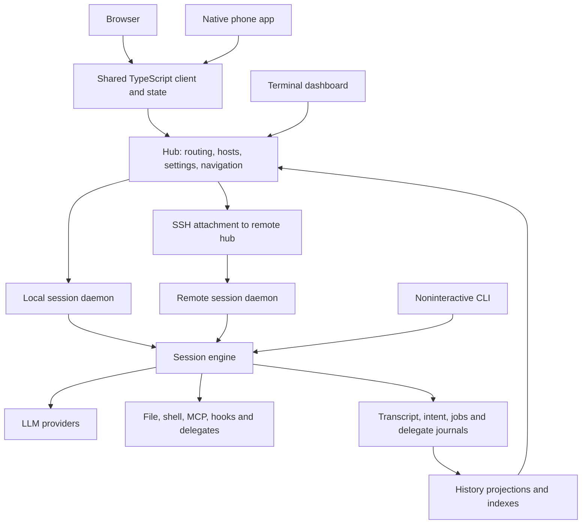

# Product subsystem map

Use this map to follow a user's action to the component that owns the work, its
durable state, and its recovery. It describes the implementation, including gaps;
the [principles](principles.md) describe product intent and the
[punchlist](friction.md) records open gaps and their product decisions.

Ownership here means code responsibility, not a team or person. A client can show
a failure while another component owns its cause. Follow both sides before adding
a retry, refusal, banner, or repair action.

## How the product fits together

Arrows show responsibility and data flow, not shared memory. Local and remote
daemons have their own state roots. AppWire carries client control, daemon control,
and ordered events; the hub also exposes HTTP surfaces. The installed `evener`
executable provides the commands that launch these processes. See
[architecture](../architecture.md) for module boundaries.

## Find the owner from the user's task

| User's task | Start here | Then follow |
| --- | --- | --- |
| Start work with a chosen model and directory | S01 launch; S16 model catalog | S06 hub routing, S08 daemon, S15 provider configuration |
| Read, find, or scroll through a conversation | S02–S04 client; S10 history | S05 protocol and S06 remote/local routing |
| Send, queue, steer, stop, or recover submitted input | S11 durable intent | S05 transport, S08 daemon, S09 session owner |
| Return after a disconnect or phone backgrounding | S02 browser, S03 native or S04 TUI; S05 transport | S06 connection binding, S10 history, S11 pending work |
| Use another machine | S07 hosts | S06 routing, S08 daemon, S20 installation |
| Delegate work, follow a job, or maintain a goal | S12 background work; S09 session | S13 worktrees/scratch, S10 history, S11 attention delivery |
| Use a plugin, skill, hook, or external tool | S17–S19 extensions | S14 execution boundaries, S15 credentials |
| Approve access beyond a selected sandbox | S14 execution boundaries | S05 approval requests and decisions; S02–S04 client controls |
| Diagnose a stuck session or repair setup | S21 diagnostics; S15 settings | The affected subsystem's authority and recovery owner below |

## Clients and interaction

| ID and responsibility | Entry points and implementation | State authority and recovery ownership | Owning references |
| --- | --- | --- | --- |
| **S01 Launch** — turn prompt, model, directory, attachments and selected extensions into a session | [Hub thread lifecycle](../../cmd/evener-hub/app_threadlifecycle.go), [web Spawn](../../cmd/evener-hub/frontend/src/panes/spawn/Spawn.tsx), [native new session](../../mobile-native/src/newSession.ts), [CLI](../../cmd/evener/main.go) | The client owns the draft; the hub owns creation and initial input delivery; the daemon owns the resulting session. A disconnected creation can finish server-side. Creation-outcome discovery and turn-mutation replay are different contracts. | [Getting started](../getting-started.md), [provider launch configuration](../llm-provider-config-and-launch.md) |
| **S02 Browser workspace** — browse sessions, read, compose, inspect activity and change settings | [Frontend](../../cmd/evener-hub/frontend/src), [thread store](../../cmd/evener-hub/frontend/src/stores/threads.ts), [transcript flow](../../cmd/evener-hub/frontend/src/panes/session/transcript/flow), [older-history reader](../../cmd/evener-hub/frontend/src/panes/session/transcript/useTranscript.ts) | Stores bind visible state to the selected session and connection. Scroll supplies older-page demand; `useTranscript` binds its shared retry owner to the committed session and retains demand across navigation. Jump to live cancels demand from the returned pane and its removed predecessors while independently open panes keep their demand. The thread store owns hydration, page merging and replay. Browser storage retains drafts and outbox state; it is not the authority for an accepted turn. | [Web guide](../web-ui/README.md), [design system](../web-ui/design-system.md) |
| **S03 Native app** — phone navigation, conversation, composition, connection and foreground recovery | [Native screens](../../mobile-native/src/screens.tsx), [connection lifecycle](../../mobile-native/src/hubConnection.ts), [connection binding](../../mobile-native/src/ConnectionProvider.tsx), [pairing/profiles](../../mobile-native/src/connection.ts), [mutation runtime](../../mobile-native/src/nativeMutationRuntime.ts), [outbox](../../mobile-native/src/outbox), [shared mobile services](../../mobile/src), [older-history reader](../../mobile-native/src/session/useOlderHistory.ts), [session history memory](../../mobile-native/src/session/historyMemory.ts) | Native persisted drafts/outbox retain local intent; connection and route bindings govern re-entry and stale-response rejection. Shared client services obtain authoritative reads. Screen controllers supply browse and Find demand; `useOlderHistory` retains pending browse and Find intent across inactivity and native route disposal using per-hub/session memory. Only committed readers attach a store and service; disposed readers run no timers. Confirmed new bindings, explicit abandonment and hub removal retire the corresponding demand; settled unobserved sessions are reclaimed. A resumed Find rebuilds its saved match boundary before stepping older. Find distinguishes incomplete search from confirmed history end. Review backgrounding, connection recovery and draft recovery together. | [Native README](../../mobile-native/README.md), [native instructions](../../mobile-native/AGENTS.md) |
| **S04 Terminal dashboard** — the same sessions and actions through a terminal | [TUI entry](../../cmd/evener-tui/main.go), [commands](../../cmd/evener-tui/hub_commands.go), [reconnect](../../cmd/evener-tui/hub_reconnect.go), [attachments](../../cmd/evener-tui/hub_attachments.go) | The model owns composer state and optimistic feedback. Reconnect continually redials and resubscribes; the pending coordinator reconciles authoritative notifications. A connection recovering does not itself replay every failed user action. | [Hub guide](../evener-hub.md), [architecture](../architecture.md) |
| **S05 Protocol and shared client** — identities, requests, subscriptions, results, ordered events and capabilities | [AppWire catalog](../../appwire/protocol.go), [Go client](../../appwire/client.go), [server transport](../../internal/appserver), [TypeScript client](../../appwire-client/typescript), [shared state](../../appwire-client/typescript/state) | Generated contracts describe requests and results. Mutation identity and acceptance state determine replay semantics; connection owners handle reattachment and resubscription. Wire compatibility, a stale cache, a lost response and an authoritative refusal are distinct states. | [AppWire protocol](../appwire-protocol.md), [TypeScript package](../../appwire-client/typescript/README.md) |

## Hub, hosts and sessions

| ID and responsibility | Entry points and implementation | State authority and recovery ownership | Owning references |
| --- | --- | --- | --- |
| **S06 Hub routing and discovery** — connect clients to local and remote sessions and keep navigation current | [Hub startup](../../cmd/evener-hub/main.go), [RPC routing](../../cmd/evener-hub/app_rpc.go), [hubcore](../../cmd/evener-hub/internal/hubcore), [appsource](../../cmd/evener-hub/internal/appsource), [rendezvous](../../rendezvous) | Hub registries and source connections describe reachable work; daemon reads establish live session identity. Reconciliation and connection owners refresh routing and subscriptions. Startup failures can affect the whole hub; [H01](friction.md#h01-credential-store-failure-scope) and [H03](friction.md#h03-host-journal-failure-scope) describe specific failure-scope decisions. | [Hub guide](../evener-hub.md), [web routing](../evener-hub-web-routing.md) |
| **S07 Remote host lifecycle** — provision, connect, deploy, detach and remove machines | [sshconn](../../cmd/evener-hub/internal/sshconn), [host registry](../../cmd/evener-hub/internal/hostreg), [host operations](../../cmd/evener-hub/internal/hostops) | Host registry records identify hosts; the operations journal and teardown remnants record in-flight effects. SSH connection workers own attachment/reconnect, while lifecycle handlers own provisioning and teardown reconciliation. Version deployment and wire compatibility are separate checks. | [Remote operations](../evener-hub-remote-operations.md) |
| **S08 Daemon lifecycle** — start, restore, retire and resume session processes | [serve](../../cmd/evener/serve.go), [server](../../server), [hub session lifecycle](../../cmd/evener-hub/app_threadlifecycle.go) | Persisted session state survives the process; rendezvous and instance identity describe the live owner. Admission coordinates retirement and input. The hub owns process discovery/start; the session owns durable restoration. | [Idle retirement](../daemon-idle-retirement.md), [runtime contracts](../subagent-runtime-contracts.md) |
| **S09 Session execution and goals** — own turns, model/tool rounds, questions, compaction and ongoing goals | [Session](../../agent/session.go), [execution](../../agent/session_execution.go), [model calls](../../agent/session_model_call.go), [goals](../../agent/session_goal.go), [context manager](../../agent/internal/contextmgr) | The session loop owns conversation mutation. Metadata and journals retain progress; context management builds the next request. Model retries, goal continuations and turn-finalization retries have different owners and termination conditions. | [Architecture](../architecture.md), [runtime contracts](../subagent-runtime-contracts.md) |
| **S10 History and transcript** — preserve work and provide readable, paged history | [Transcript](../../agent/transcript), [session persistence failure](../../agent/session_fail_closed.go), [server history](../../server/history_read.go), [history queue](../../server/thread_history.go), [transcript index](../../internal/transcriptindex), [transcript projection](../../internal/apptranscript), [live overlay](../../internal/appoverlay), [older-page demand](../../appwire-client/typescript/historyPaging.ts) | Transcript records are authoritative; indexes and client projections are derived. Writers handle record/durability errors; server readers can rebuild projections; client stores own cursors and page merging. `HistoryPaging` coalesces older-page demand, paces unresolved reads without an attempt limit, and resumes retained demand when a reader becomes active. Explicit abandonment cancels only the requesting consumer; proven permanent errors retain their explanation. Distinguish a failed projection from an authoritative write failure. | [Transcript tools](../tools/transcripts.md), [AppWire](../appwire-protocol.md) |
| **S11 Input, queues and attention** — retain sends, steers, interrupts, queued messages and pending delivery | [Client mutations](../../agent/session_client_mutation.go), [mutation schema](../../appwire/input.go), [shared outbox](../../appwire-client/typescript/state/mutation/outbox.ts), [browser pending turns](../../cmd/evener-hub/frontend/src/panes/session/composer/queue/pendingTurnsStore.ts), [native outbox](../../mobile-native/src/outbox) | Client storage owns unsent intent; daemon mutation/queue state owns accepted work. Mutation IDs allow reconciliation without guessing from text. The client flush owner, transport and session drain loop must each arrange re-entry after a temporary failure. | [Stop/outbox ownership](../design/stop-cancellation-outbox.md), [AppWire](../appwire-protocol.md) |
| **S12 Jobs, delegates and watches** — run background work, inspect descendants and deliver relevant attention | [Jobs](../../agent/jobs.go), [watches](../../agent/job_watch.go), [delegate runtime](../../agent/delegate_runtime.go), [activity](../../agent/jobs_activity.go) | Shell/watch journals, delegate records and transcript attention have separate authorities. Owner loops drain notifications; parents drive their children. Pending watch sends can survive a restart even when an active registration ends as `runtime_lost`. | [Job control](../job-control.md), [runtime contracts](../subagent-runtime-contracts.md) |
| **S13 Worktrees and retained scratch** — preserve working files and execution environments across isolation and resume | [Worktree tools](../../agent/session_tools_worktree.go), [worktree resume](../../agent/session_worktree_resume.go), [session scratch](../../agent/session_scratch_retention.go), [scratch retention](../../agent/sandbox/scratch_retention.go) | Git owns working trees/commits; retention manifests, pins and consumer bindings own scratch lifetime. Resume repair and environment-swap logic reconcile those identities. Missing references, missing pins and unavailable actual data are different repair cases. | [Worktrees](../developing-evener/worktrees.md), [sandboxing](../sandboxing.md) |

## Capabilities and configuration

| ID and responsibility | Entry points and implementation | State authority and recovery ownership | Owning references |
| --- | --- | --- | --- |
| **S14 Tool execution and boundaries** — let the agent inspect, edit and run commands under the selected execution policy | [Tool dispatch](../../agent/session_tools.go), [registry/breaker](../../agent/internal/tool), [shell](../../agent/session_tools_shell.go), [execution environment](../../agent/execenv), [sandbox](../../agent/sandbox), [escalation](../../agent/session_escalation.go), [web approval](../../cmd/evener-hub/frontend/src/panes/session/transcript/tools/sandboxEscalation.tsx), [native approval](../../mobile-native/src/approvalControls.ts), [TUI approval](../../cmd/evener-tui/hub_escalation.go) | Session configuration and resolved environment determine access; sandboxing defaults off. Unconfined file tools and command working directories impose no workspace boundary; explicit policies and derived read-only roles retain their boundaries. Attachment reads have their own root scope. Dispatch owns argument repair, hook results, loop intervention and execution. Eligible file denials in an interactive root session can request approval through an attached client. Approval currently grants one invocation without changing session policy; [T05](friction.md#t05-approval-scope-and-lifetime) records the deferred approval design. A parked tool call has its own recovery limitations. | [Sandboxing](../sandboxing.md), [architecture](../architecture.md) |
| **S15 Providers and credentials** — configure an account/endpoint and keep requests usable | [Provider configuration](../../cmd/evener-hub/app_instances.go), [file recovery](../../cmd/evener-hub/app_provider_reload.go), [child configuration](../../cmd/evener-hub/child_provider_config.go), [credential store](../../internal/credentials/store.go), [LLM registry](../../llm/registry), [providers](../../llm/providers), [auth](../../auth), [launch wiring](../../cmdutil) | Configuration files and credential stores supply registry snapshots; providers own request/authentication behavior. The hub notice watcher adopts valid external provider edits, retries load failures and invalidates clients. In-app writes acknowledge their persisted bytes to avoid repeated invalidations. Observed invalid edits retain the previous hub registry. When a user file was successfully loaded, new launches, model lists and credential checks use a private copy of those exact bytes without replacing edited source. The owning child or probe keeps that copy until exit. The [provider guide](../llm-providers.md#providerstoml) names observation, startup and filesystem limits. OAuth refresh and session model retry have separate owners. | [Connecting a provider](../connecting-a-provider.md), [provider launch configuration](../llm-provider-config-and-launch.md), [providers](../llm-providers.md) |
| **S16 Model catalog and capabilities** — make the chosen models/options available without repeated discovery work | [Hub models](../../cmd/evener-hub/app_models.go), [registry](../../llm/registry), [web launch](../../cmd/evener-hub/frontend/src/panes/spawn/Spawn.tsx), [native launch](../../mobile-native/src/newSession.ts) | Embedded/live catalogs and launch configuration determine metadata. The launch-model cache is keyed by working directory; startup warms only the unscoped entry, while scoped requests populate their own entries. [C07](friction.md#c07-model-discovery-and-default-launch) connects that scope to picker and launch behavior. | [Providers](../llm-providers.md), [launch configuration](../llm-provider-config-and-launch.md) |
| **S17 Extension installation and selection** — install/update plugins and choose their contributions | [Plugin store](../../internal/plugins), [plugin loading](../../agent/plugin), [CLI plugin commands](../../cmd/evener/plugincmd.go) | Marketplace records, installed revisions, enablement and source paths own selected content. The store recovers interrupted marketplace renames and isolates individual auto-upgrade failures; session loading skips broken plugin instances rather than aborting the batch. | [Skills and commands](../skills.md), [hooks](../hooks.md) |
| **S18 Skills, commands and hooks** — use reusable instructions and lifecycle automation | [Skills](../../agent/skill), [skill source recovery](../../agent/session_skill_source.go), [skill reload](../../agent/session_skill_reload.go), [plugin commands](../../agent/plugin/commands.go), [hook runner](../../agent/internal/hooks) | Catalog identity and activation state determine which instruction source is in use. Fresh invocations can recover collected plugin revisions; durable continuations retain their source identity. Hooks distinguish an explicit denial from an execution error; unsupported behavior is diagnosed. | [Skills](../skills.md), [hooks](../hooks.md) |
| **S19 MCP tools** — expose external services to an active session | [MCP manager](../../agent/internal/mcp/manager.go), [session MCP initialization](../../agent/session_init.go), [MCP config](../../agent/mcpconfig) | The manager owns connections and discovered registrations; the tool registry owns dispatch. Existing tools attempt lazy reconnect after a dropped transport. A restored connection emits an informational notice before the tool retry returns; clients retain it quietly at Full without hiding the retry outcome. Initial discovery failure contributes no registrations, so it does not share that recovery path. | [Hub configuration](../evener-hub.md), [sandboxing](../sandboxing.md) |
| **S20 Installation and upgrades** — install the application and keep local/remote processes compatible | [Installer](../../install.sh), [self-update](../../internal/selfupdate), [remote install](../../internal/remoteinstall), [binary resolution](../../internal/binresolve), [build metadata](../../buildinfo) | Published archive/checksum and install prefix determine the executable. Upgrades replace the installed binary; hub/remote lifecycle code owns running-process transitions. A running process, installed file and connected protocol version are separate facts. | [Getting started](../getting-started.md), [building](../developing-evener/building.md), [remote operations](../evener-hub-remote-operations.md) |

## Diagnostics and shared foundations

| ID and responsibility | Entry points and implementation | State authority and recovery ownership | Owning references |
| --- | --- | --- | --- |
| **S21 Diagnosis and recovery guidance** — explain where work is stuck and what can restore it | [Doctor](../../agent/doctor), [doctor command](../../cmd/evener-doctor), [diagnostics](../../agent/diagnostic), [bundled doctor guidance](../../internal/bundled/skills/doctoring-evener) | Doctor reads persisted evidence without constructing a live session. Diagnostic text and repair authority in bundled instructions affect what the agent can do next. Diagnosis alone does not own a runtime repair; trace the finding to the subsystem that does. | [Doctor README](../../cmd/evener-doctor/README.md), [repair guidance](../../internal/bundled/skills/doctoring-evener/references/repair-guardrails.md) |
| **S22 Shared foundations** — consistent identities, environment/config values and process mechanics | [Environment](../../envvars), [identifiers](../../identifier), [execution support](../../execsupport), [invariants](../../invariant), [wire types](../../appwire) | These modules provide primitives; their callers own user intent and retry decisions. Normal-build invariant calls are no-ops. Process-group and pipe handling affect cancellation and shutdown across providers, tools and host operations. | [Execution support](../../execsupport/README.md), [environment](../developing-evener/environment.md), [architecture](../architecture.md) |
| **S23 Development and qualification** — keep changes verifiable and docs consistent | [Makefile](../../Makefile), [dev tooling](../../cmd/evener-dev), [scripts](../../scripts), [scenarios](../../test/scenarios), [fuzz tooling](../../fuzz), [.github workflows](../../.github/workflows) | Source, generated contracts, deterministic test fixtures and explicit live-test evidence establish different claims. Gate membership comes from workspace/module lists. Failure-oriented tests also need recovery and user-work preservation coverage when behavior changes. | [Developing](../developing-evener/README.md), [testing](../developing-evener/testing.md), [fuzzing](../developing-evener/fuzzing.md) |

## Maintaining the map

When a change moves an owner, adds a persistent store, changes a recovery trigger,
introduces a surface, or changes a user-visible boundary, update the affected row
and its owning guide in that change. Keep the user-task table and diagram aligned
with the rows. Link to stable source paths and named responsibilities; avoid line
numbers and duplicated protocol field lists in this map.

For a failure path, be able to name the retained intent, the authoritative state,
the smallest affected scope, the component that detects recovery, and the event
that resumes work. If the implementation has no such owner or event, record the
gap in the punchlist rather than describing an intended repair as implemented.
