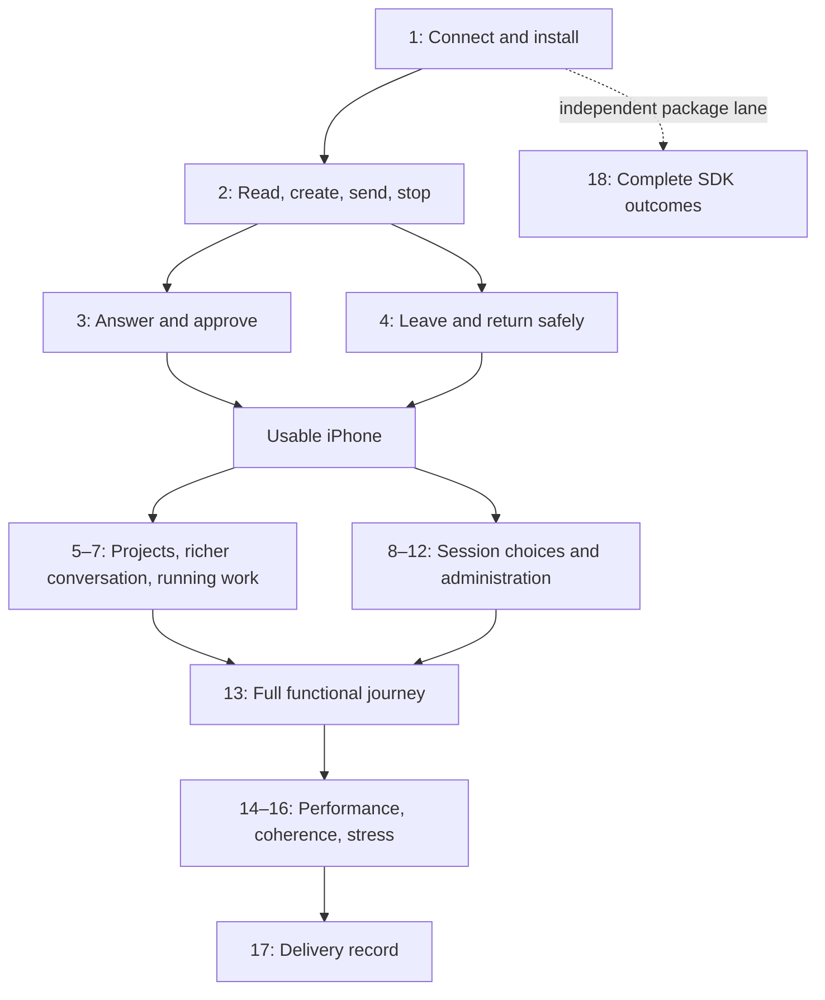

# iPhone: usable, useful, then good — implementation plan

> **For agentic workers:** REQUIRED SUB-SKILL: Use superpowers:subagent-driven-development for bounded implementation packages and superpowers:executing-plans for coordinated native verification. Jesse selected Luna-medium implementers and testers. Steps use checkboxes; completion requires the stated result, not merely running the step.

**Goal:** Make Evener dependable for daily work on an iPhone, then complete its supported workflows, then improve fluency, performance and delivery quality.

**Architecture:** Keep the approved Expo/React Native app and the shared AppWire v4 services/stores. Work in the existing external `live-concepts-plan2-integrate` worktree. Extend existing controllers and screens with small changes; protocol methods, capabilities and hub readback remain authoritative.

**Tech Stack:** Expo SDK 57, React Native 0.86.3, React Navigation, SecureStore, SQLite, TypeScript AppWire client, isolated Evener v4 hubs and scripted external providers.

**Spec:** [Native capability scope](../specs/2026-09-05-native-mobile-coverage.md), [current iPhone scope](../../design/mobile/ios-v1-remaining.md), [product philosophy](../../design/mobile/philosophy.md), [acceptance ledger](../../design/mobile/acceptance.md), and Jesse's 8 September instruction to order delivery as usable, useful, then good.

## Execution checkpoint — 8 September

`bc519b1c1` implements Task 8 and passes the recorded deterministic and host/controller real-hub checks. The current `bfe632f44` iPhone simulator build additionally verifies one valid creation, all three vision choices with events, a second-client change and cold restoration, plus the acknowledged-by-server uncertainty branch with manual check/dismissal and no replay. These receipts do not claim packet loss, restore-to-draft, full lifecycle or physical qualification. The integrated Tasks 1–4 journey and broader Task 8 acceptance remain open; Apple now reports the first TestFlight beta Installed on Jesse’s iPhone 16 Pro; physical smoke and update remain open. See the [detailed execution checkpoint](../../design/mobile/2026-09-08-iphone-execution-checkpoint.md) for receipts, corrected worker findings and remaining inputs.

The current `bfe632f44` app has now passed the specific checked daily-loop actions below. [Creation/vision](../../design/mobile/assets/2026-09-08-native-creation-vision.json), [uncertain delivery](../../design/mobile/assets/2026-09-08-native-uncertain-delivery.json), [Recovery](../../design/mobile/assets/2026-09-08-native-recovery-journey.json), [cold/link/copy](../../design/mobile/assets/2026-09-08-native-leave-return.json), [Reader/reconnect](../../design/mobile/assets/2026-09-08-native-reader-reconnect.json) and [two-hub isolation](../../design/mobile/assets/2026-09-08-native-two-hub-isolation.json) retain the exact scope. The uncertainty boundary is server completion before local confirmation after process suspension, not an intercepted RPC acknowledgment or packet-loss test. Unchecked convergence, full lifecycle and physical-device gates still prevent closing the full Usable milestone.

Distribution signing, IPA upload, VALID processing and exact Evener Internal build membership have since succeeded. Apple now reports Jesse’s first beta Installed on iPhone 16 Pro, iOS 27.0. Physical smoke/update and remaining Task 17 delivery gates stay open. Drew’s external tester record and build assignment exist, but Apple rejected the invitation pending external beta review; expanded internal account access awaits Jesse’s choice. The original lane failed after processing on unsupported internal-group assignment; fix `213a21131` passes independent behavior checks, but has not performed a new live upload. Workflow registration PR #1039 passed its initial checks and was updated to current main; all checks passed at `1f1bd61353` and an approving review remains required; no CI workflow dispatch is claimed.

## Global constraints

- iPhone is active. iPad and dedicated accessibility work are paused. Android qualification is deferred. Preserve their sources and evidence; none is a gate for these milestones.
- Voice/barge-in is outside v1; retain every other current supported workflow.
- Current web/server behavior and Jesse's requirements define scope. The old Tauri UI is not a feature reference. An RPC's existence does not automatically require a separate native screen.
- Model/reasoning belong in the composer. Input uses full width; Submit shares the controls area below it. Keep existing accessibility behavior intact while its dedicated work is paused.
- Read [testing policy](../../developing-evener/testing.md) before test changes. Default tests use deterministic external boundaries, never ambient credentials or live model calls.
- Preserve drafts, original profiles and the two pre-existing generated Tauri Apple edits. Do not clear the app database or replace the user's install as a convenient fixture reset.
- No automatic replay of uncertain mutations, no action sent to a stale hub/session, and no silent loss of a draft are invariants from the first milestone onward.
- Reuse existing evidence within its actual scope. Fix a reproduced mechanism before adding a regression test or patch; qualification tasks may close without code changes when existing behavior passes.
- No dependency/framework migration, general state rewrite, or new generic test harness is part of this plan.

---

## The ordering decision

The first milestone starts with an already configured hub. It must let Jesse open or create a conversation, do work, answer questions/approvals, leave, and return. Basic creation and decisions are part of usability: an app that cannot start a task or unblock its tool execution is not a usable agent client.

The second milestone completes the working environment: larger sessions, queue control, projects, session management, goals/delegates, configuration and administration. Vision-model selection belongs here, after the daily loop works. It is a confirmed native capability gap, but it is not the prerequisite for basic conversation with an already configured model.

The third milestone improves the complete experience and prepares delivery. It does not postpone ordinary correctness, readable content or reachable keyboard controls. A crash, duplicate send, lost draft, blocked approval or unusable input latency interrupts the current phase and gets fixed immediately.

Physical-iPhone access starts in the first task, alongside simulator work. Signed development installation is needed for daily use; public distribution is a later gate. The SDK's exhaustive independent qualification runs alongside the app and has its own completion decision.

| Milestone | What Jesse can do | What closes it |
| --- | --- | --- |
| **Usable** | Use a configured hub for a complete conversation, including basic creation, decisions, stop, ordinary interruptions and return | Tasks 1–4 pass as one iPhone journey; no browser detour to unblock that journey |
| **Useful** | Start, manage and supervise real projects and sessions, including provider/plugin/settings administration | Tasks 5–13 close every supported functional area and the integrated workflow record |
| **Good** | Use the complete app fluently with representative data and a trustworthy install/update path | Tasks 14–17 meet the recorded quality budgets and delivery checks |
| **SDK complete** | Build another client from the package and protocol documentation | Task 18's independent method/outcome and producer matrix passes; counts alone do not close it |



## Starting state and what not to redo

Planning baseline is `f25db50ff`. Compiled source remains `fe403ee3a`; the last canonical gate and separate vet passed, including 685 native tests in 74 files and package qualification. Native simulator source `7944778e0` has repeated iPhone reader cold-restoration evidence. SDK producer fixtures and backend binaries have separate identities; see the [status page](../../design/mobile/status.md) and [verification receipt](../../design/mobile/assets/2026-09-08-status-verification.json).

Creation, questions, sandbox Allow/Deny, queue/goal actions, activity/delegate reads, interrupted sign-in, two-hub isolation and hub upgrade already have real, scoped evidence. Do not rebuild these implementations from their historical “partial” labels. Some ledger summaries lag the newer linked receipts; inspect the receipt before scheduling a repeat.

A planning or documentation commit does not change the installed app. Do not rebuild or rerun the whole repository merely to replace a documentation-only commit ID in an evidence table. After code changes, rebuild the affected app/package and rerun the relevant journeys. At each milestone, run one integrated journey over the converged source.

## Execution, ownership and test discipline

There are four active slots: the coordinator plus at most three Luna-medium workers. Workers receive one bounded task with exact file ownership and acceptance checks. A completed implementer does not certify their own result: use a fresh Luna review of scope/correctness and independently inspect important runtime evidence.

- The coordinator owns `screens.tsx`, `ConnectionProvider.tsx`, shared service/store integration, native installation, the shared iPhone, acceptance updates and final commits. A worker can propose changes to these files, but one named writer owns them at a time.
- Workers may edit disjoint controller/test files in parallel. If two tasks require the same controller or type, finish the shared change first, then fan out its consumers. Do not invent abstraction layers to create parallelism.
- Independent providers, hub fixtures and package tests can run concurrently. Each has its own credentials, state, working directory and process ownership. UI actions on one device, shared-hub mutations, installs and heavyweight builds are serialized.
- The SDK slot is not reserved while the usable loop is blocked. Use all available workers for the critical path, then return a worker to independent SDK work as dependencies allow.
- Preserve a usable installed build between batches. Do not install unreviewed changes from three workers and then try to attribute failures.

Suggested waves:

| Wave | Coordinator | Luna A | Luna B | Luna C |
| --- | --- | --- | --- | --- |
| Usable foundation | Task 1 install/fixture; integrate shell | Task 2 reader/composer contracts | Task 3 decision contracts | Task 4 draft/connection contracts |
| Usable convergence | Run Tasks 2–4 as one native journey | Fix the highest blocking defect | Review completed fixes | Reproduce remaining blocker or prepare Task 18 |
| Useful daily workflows | Integrate, then serialize device journeys | Task 5 navigation/management | Task 6 media/queue, then 7 work | Task 8 vision; Task 18 when shared files are free |
| Useful administration | Integrate shared shell and qualify batches | Task 9 providers, then 10 plugins | Task 11 settings, then 12 upgrade | Task 18 and independent fix reviews |
| Useful convergence | Task 13 full journey | Fix functional failures | Review fixes | SDK outcomes |
| Good | Own measurements and device/distribution | Task 14 performance fixes | Task 15 presentation fixes, then 16 stress | Task 18 and independent reviews |

Before changing a behavior, reproduce it using the existing test/fixture. Add a targeted failing regression for the actual defect, confirm that it fails for that defect, make the smallest fix, run the focused tests, review, and commit the explicit paths. Do not add tests just to restate existing code. Tasks below give the scenarios and current tests; their unknown defects must be diagnosed rather than filled in with speculative patches.

The native test runner exercises controllers and headless shared code. Do not add a new native component-test dependency merely to assert markup. Native interaction and geometry are observed on the installed app.

## Usable

### Task 1: Connect from an identified iPhone build

**Depends on:** nothing. Start physical-device provisioning immediately; continue simulator/controller work if device access or an authorized signing identity is unavailable. Record that as an outstanding input, not a physical pass.

**Files to inspect; change only for a reproduced blocker:** `mobile-native/src/connection.ts`, `ConnectionProvider.tsx`, `HubEditor.tsx`, `hubSelection.ts`, `pairingImport.ts`, `mobile-native/app.json`, `mobile-native/ios/Evener/Evener.entitlements`. Native generated build inputs remain distinct from the preserved Tauri Apple edits.

**Tests:** `connection.test.ts`, `hubSelection.test.ts`, `pairingImport.test.ts`, `removeHub.test.ts` under `mobile-native/src`.

- [ ] Check branch, dirty files, installed app and dependency identity. Compare source against the last passing receipt before deciding what must run again.
- [ ] Build the intended Release source using normal signing, install on the owned simulator, and prepare signed development installation on a physical iPhone using the available authorized identity. Do not disable signing to make SecureStore appear to build successfully.
- [ ] Start an authenticated disposable v4 hub using the real Evener daemon and a scripted provider. Reuse the setup from [multiple hubs](../../design/mobile/multiple-hubs.md) and `test/e2e/fakellm/cmd`; do not trust old `/tmp` paths or historical PIDs as live fixtures.
- [ ] Add the hub, verify credential persistence, select a known project/session, relaunch and reconnect. On the phone use the actual reachable host address, not simulator loopback.
- [ ] Check invalid bearer, unreachable hub and incompatible protocol version: show a useful error and an explicit recovery path; retain the profile/draft.
- [ ] Retain native/backend/SDK hashes, device/OS, fixture configuration fingerprint, command exit results and scoped observations in the acceptance record. Commit a fix only if needed.

```sh
npm --prefix mobile-native test -- src/connection.test.ts src/hubSelection.test.ts src/pairingImport.test.ts src/removeHub.test.ts
xcodebuild -workspace mobile-native/ios/Evener.xcworkspace -scheme Evener -configuration Release -destination 'generic/platform=iOS Simulator' -derivedDataPath mobile-native/ios/build build
```

Discover the actual device destination and signing settings before the physical build; do not paste a historical device ID or invent a development team. Re-run prebuild/pods only when the native dependency/configuration change requires it, following `mobile-native/README.md`.

**Exit:** an identified iPhone artifact opens the intended authenticated hub and restores its credentials after relaunch. Physical-phone access is either observed or explicitly pending; simulator success is labeled as such.

### Task 2: Complete the everyday conversation loop

**Depends on:** Task 1's working connection; controller tests can be prepared concurrently.

**Files:** `mobile-native/src/screens.tsx`, `NewSessionScreen.tsx`, `newSession.ts`, `CreationComposerSettings.tsx`, `timeline.ts`, `readerPosition.ts`, `MarkdownResponse.tsx`, `composerCommand.ts`, `composerSteering.ts`; shared `mobile/src/services/conversation.ts`, `mobile/src/state/conversation.ts`, `mobile/src/conversation/project.ts`.

**Contract:** existing session and basic new-session paths lead to the same reader/composer. A configured hub supplies project/harness/model choices. Sending dispatches once; Stop visibly reconciles to the hub result. Reading history does not follow the live tail until Latest is selected.

- [x] Open a known session through the real roster/search and create another with existing valid project/harness/model defaults. Confirm its identity and working directory from the hub; the current receipt records one native creation and authoritative location readback.
- [x] Send a prompt that produces text, code, a link and tool activity; verify native rendering, code copying, link return and completion. Use ordinary iPhone text size and the software keyboard for this milestone.
- [x] Read older content while a new response streams; return to Latest and verify no missing/duplicated items or stolen reading position.
- [x] Start a held turn, stop it, then send another prompt. Confirm the intended turn stopped and the second prompt appears exactly once in provider input/transcript.
- [ ] Fix any blocked input, unreachable Send/Stop, accidental navigation, unusable rendering or ordinary latency discovered here. Preserve the approved full-width composer layout.
- [ ] Run the focused suites, install changed native source, repeat the failed journey and retain results.

```sh
npm --prefix mobile-native test -- src/newSession.test.ts src/rosterSearch.test.ts src/navigationPages.test.ts src/timeline.test.ts src/readerPosition.test.ts src/composerInput.test.ts src/composerCommand.test.ts src/composerSteering.test.ts
npm --prefix mobile test -- src/services/conversation.test.ts src/state/conversation.test.ts src/conversation/project.test.ts
```

**Exit:** create/open → read → send → see work → stop/continue → leave/return is possible entirely in the app. Advanced queue operations and configuration are not prerequisites for this first pass.

### Task 3: Keep ordinary work from getting stuck on decisions

**Depends on:** Task 2's bound conversation; preparation may run alongside Task 2.

**Files:** `mobile-native/src/ApprovalSheet.tsx`, `approvalControls.ts`, `QuestionSheet.tsx`, `questionAnswers.ts`, `questionBatches.ts`, `screens.tsx`. Reuse [real questions](../../design/mobile/real-question-harness-evidence.md) and [sandbox execution](../../design/mobile/approval-evidence.md).

- [x] Have the scripted provider trigger an actual restricted tool operation against a fixture-owned temporary directory outside that disposable session's workspace. Native Allow must permit the owned file effect; Deny must prevent it. Confirm both through the daemon and filesystem result, then clean up only the fixture-owned files. Do not use Jesse's workspace or personal files as approval targets.
- [x] Ask a real question batch with a selected option and free-text answer. Keep a separate unsent composer draft, answer the questions, and confirm only the answers reached the waiting tool.
- [x] Verify decisions stay reachable with the keyboard open and the app returns to the conversation after completion.
- [x] Resolve an open decision through a second client. The phone must refresh its state and prevent a stale second submission.
- [ ] Reuse passing outcomes already recorded when dependencies are unchanged; rerun changed paths and the integrated journey. Fix reproduced decision/controller defects and commit their focused regressions.

```sh
npm --prefix mobile-native test -- src/approvals.test.ts src/questionAnswers.test.ts src/questionBatches.test.ts
```

**Exit:** a normal conversation can request permission or information and continue without a web UI rescue. Concurrent batches and wider fault combinations continue in Tasks 7 and 16.

### Task 4: Leave and return without losing work

**Depends on:** Tasks 1–3 for the integrated journey. This completes Usable.

**Files:** `mobile-native/src/draftDocument.ts`, `draftRecovery.ts`, `draftRepository.ts`, `creationDraftRepository.ts`, `location.ts`, `nativeLocation.ts`, `readerPosition.ts`, `nativeReaderPosition.ts`, `hubSelection.ts`, `connectionRecovery.ts`, `ConnectionProvider.tsx`; shared connection/conversation stores.

- [x] Save an unsent draft and a non-tail reading anchor; background and cold-launch, then verify exact draft content, selected hub/session and item/offset restoration. Preserve the existing `7944778e0` regression.
- [x] Interrupt a live connection through real app background/process or owned hub stop/start. Verify a clear reconnect state and authoritative rehydration before mutations resume.
- [ ] Exercise deterministic lost-acknowledgment delivery: one dispatch, retained uncertainty and manual readback/recovery. For a native journey use direct app/hub lifecycle transitions; do not introduce a forwarding proxy to claim intercepted wire behavior. The current receipt verifies the narrower server-completed branch after process suspension, with retained uncertainty and native check/dismissal without replay. A later [unaccepted-send receipt](../../design/mobile/assets/2026-09-08-native-unaccepted-delivery.json) verifies an unaccepted message, explicit Restore to draft and one manual resend without automatic replay. Final UI cleanup is verified: all seven draft tables, eight reader anchors, original session selection and the keyboard setting are preserved. Pending-RPC overlap and the integrated journey remain open.
- [x] Switch between two owned hubs with overlapping identifiers while A has a pending operation. Verify B's transcript/draft is unchanged by late A results. Remove only an owned profile and prove other-hub data survives.
- [ ] Run the complete Tasks 1–4 journey on the converged build. On the physical iPhone verify ordinary network/background/keychain behavior once access is available.
- [ ] Record a Usable milestone with remaining limitations and hand over a working build for ordinary use. If physical access is pending, label the milestone simulator-qualified and keep the phone check open.

```sh
npm --prefix mobile-native test -- src/draftDocument.test.ts src/draftRecovery.test.ts src/draftRepository.test.ts src/creationDraftRepository.test.ts src/location.test.ts src/readerPosition.test.ts src/hubSelection.test.ts src/removeHub.test.ts
make test-native
```

**Usable exit journey:** connect → create/open → send → answer/approve → stop/continue → read history → leave an unsent draft → background/relaunch → continue in the same session. No lost draft, duplicate send, wrong-hub action, blocked decision or unusable keyboard state may remain.

## Useful

### Task 5: Find, organize and manage the work

**Depends on:** Usable. Run before deep administration because it directly improves daily use.

**Files:** `ProjectsScreen.tsx`, `navigationPages.ts`, `navigationActions.ts`, `navigationReveal.ts`, `organizationNavigation.ts`, `pinNavigation.ts`, `PinAssignmentScreen.tsx`, `PinSectionsScreen.tsx`, `PinSectionEditorScreen.tsx`, `SessionSheet.tsx`, `sessionControls.ts`, `forkActions.ts`, `ForkScreen.tsx`, `SessionDeletionScreen.tsx`, `sessionDeletionNavigation.ts`, all under `mobile-native/src`.

- [ ] Exercise paged search, current/recent/archived projects and sessions; preserve the query and list position after opening/returning.
- [ ] Favorite/archive/unarchive, assign/unpin a session, create/rename/delete a pin section and browse its contents. Verify exact target and refreshed navigation revision.
- [ ] Rename, compact, clear, fork and delete an owned session. Verify actual compaction output/continuation, fork ancestry, removed-session recovery and correct return destination.
- [ ] Repeat the mutation-specific stale target/conflict and uncertain response cases using existing controllers. After a deleted selection, navigate to a valid parent without silently selecting a similarly named session on another hub.
- [ ] Qualify supported source links against actual opener behavior; retain the [parity audit](../../design/mobile/web-parity-audit.md) distinction between a copyable path and an implemented remote-file viewer. Do not invent a file browser to fill an undefined capability.

```sh
npm --prefix mobile-native test -- src/navigationPages.test.ts src/navigationActions.test.ts src/navigationReveal.test.ts src/organizationNavigation.test.ts src/pinNavigation.test.ts src/pinNavigationRecovery.test.ts src/sessionControls.test.ts src/forkActions.test.ts src/sessionDeletion.test.ts src/sessionDeletionNavigation.test.ts
```

**Exit:** every offered organization/management action has a usable native result, accurate hub readback and recovery from stale selection; existing controllers remain the implementation unless a concrete defect requires change.

### Task 6: Finish media and active-turn control

**Depends on:** Usable; can run beside Task 5 with separate file ownership. Coordinate `screens.tsx` and shared conversation edits.

**Files:** `ImageAttachments.tsx`, `TranscriptImages.tsx`, `transcriptImageSource.ts`, `nativeImagePicker.ts`, `draftImages.ts`, `creationImageDraft.ts`, `MarkdownResponse.tsx`, `markdownLinks.ts`, `QueueSheet.tsx`, `composerSteering.ts`, `composerCommand.ts`; shared conversation service/store and attachment helpers.

- [ ] Select multiple native images, remove one, reopen the picker, send and view authenticated transcript images. Test cancelled selection and an expired/unavailable image response without losing the draft.
- [ ] Persist an attachment draft through navigation and cold launch; test image replacement arriving during live paging. Confirm full content and no duplicate rows.
- [ ] Hold a model turn; queue two distinct entries, cancel one, promote/drain the other, steer, stop and resume. Verify provider input and authoritative queue identities/revisions.
- [ ] Test stale queue entries, a lost reply and reconnect. An unconfirmed action requires readback; it must not manufacture success or replay automatically.
- [ ] Exercise supported built-in commands and catalog/skill completion through the same draft/attachment rules as submission. Do not advertise a command that native dispatch cannot execute.

```sh
npm --prefix mobile-native test -- src/imageSelection.test.ts src/liveImages.test.ts src/transcriptImageSource.test.ts src/markdownLinks.test.ts src/draftLibrary.test.ts src/composerSteering.test.ts src/composerCommand.test.ts src/commandCatalog.test.ts
npm --prefix mobile test -- src/services/conversation.test.ts src/state/conversation.test.ts src/services/attachments.test.ts
```

**Exit:** rich input/output and every advertised turn-control action work in a real conversation, including conservative recovery after uncertainty.

### Task 7: Supervise real goals, tasks and delegates

**Depends on:** Tasks 3, 4 and 6. Seeded output establishes reading behavior; actual execution must establish lifecycle behavior.

**Files:** `goalCommand.ts`, `TasksSheet.tsx`, `taskList.ts`, `ActivitySheet.tsx`, `ActivityDelegateDetails.tsx`, `delegateDetails.ts`, `jobOutput.ts`, `AnsiOutputLine.tsx`, question/approval controllers; shared `mobile/src/services/activity.ts` and `mobile/src/state/activity.ts`.

- [ ] Set/edit/clear a real goal, observe automatic continuation, and confirm the resulting file/tool effects. Preserve the ordinary composer draft.
- [ ] Run a real parent/child work scenario; follow task/delegate status through completion, navigate into the child and return, and page branches/output without losing the loaded prefix or parent cursor.
- [ ] Verify output selection, ANSI presentation, tool errors, zero/omitted usage fields and reports on the phone.
- [ ] Resolve a question/approval from another client while the phone is open; test a new batch replacing an old one, reconnect and hub switch. Refresh before allowing another decision.
- [ ] Verify goal/work replay after restart against retained turn/item identity. Fix only newly reproduced gaps; keep the existing real queue, goal and sandbox evidence linked.

```sh
npm --prefix mobile-native test -- src/goalCommand.test.ts src/taskList.test.ts src/activityList.test.ts src/jobOutput.test.ts src/delegateDetails.test.ts src/AnsiOutputLine.test.ts src/approvals.test.ts src/questionBatches.test.ts
npm --prefix mobile test -- src/services/activity.test.ts src/state/activity.test.ts
```

**Exit:** Jesse can supervise and intervene in actual running work; stale decisions cannot affect the wrong live task.

### Task 8: Add the missing existing-session vision-model control

**Depends on:** Usable; land before final composer/settings qualification. Do not serialize unrelated navigation work behind this small feature.

**Confirmed gap:** generated types support `thread/vision-model/set`, `thread/vision-model/changed`, `changeVisionModel` and optional `thread.evener.visionModel`. The shared mobile model, action, notification reducer and native settings omit the complete path. Creation's generic launch fields are a separate contract.

**Modify:** `mobile/src/conversation/model.ts`, `project.ts`, `mobile/src/services/conversation.ts`, `mobile/src/state/conversation.ts`, `mobile-native/src/sessionControls.ts`, `ComposerSettings.tsx`, `ComposerSettingsSheet.tsx`, `ModelPicker.tsx` only if its existing picker needs a small extension, and coordinator-owned `screens.tsx`.

**Tests:** shared `conversation/project.test.ts`, `services/conversation.test.ts`, `state/conversation.test.ts`; native `sessionControls.test.ts`. Update required typed test doubles; do not introduce optional-method fallback compatibility.

**Interfaces to add:**

```ts
// ConversationService
setVisionModel(visionModel: string): Promise<void>;

// MobileConversation: preserve the wire's optional value
visionModel?: string;

// ComposerSetting
export type ComposerSetting = "model" | "reasoning" | "vision";
```

- [ ] Add a failing service contract using the existing `setup()` and `EMPTY_RESPONSE` helpers in `mobile/src/services/conversation.test.ts`:

```ts
it.each(["", "off", "provider/model"])(
  "sets the reviewed vision choice %j once for the bound session",
  async (visionModel) => {
    const { client, service } = setup();
    client.on("thread/vision-model/set", () => EMPTY_RESPONSE);
    await service.open("ref-1");
    await service.setVisionModel(visionModel);
    expect(client.calls.filter((call) =>
      call.method === "thread/vision-model/set"
    )).toEqual([
      { method: "thread/vision-model/set", params: { ref: "ref-1", visionModel } },
    ]);
  },
);
```

- [ ] Confirm failure before implementation. Add the action using the same capability/binding guard as `changeModel`:

```ts
async setVisionModel(visionModel) {
  requireCap("changeVisionModel", "setVisionModel");
  const threadRef = requireRef();
  await withCapabilityRefresh("setVisionModel", () =>
    client.request("thread/vision-model/set", { ref: threadRef, visionModel }),
  );
},
```

- [ ] Project `thread.evener.visionModel` into the mobile model. Handle `thread/vision-model/changed` in the existing identity-scoped store notification switch; preserve `""` and `"off"` distinctly. Add projection/readback, current-binding notification and wrong-session notification cases to the existing suites.
- [ ] Extend `SessionControls` with `setVisionModel(value: string): Promise<boolean>` using its serialized `run` path and authoritative refresh. The existing `withCapabilityRefresh` helper is currently a pass-through: do not assume it refreshes capabilities. Use the controller's injected refresh/readback path after an action-unavailable response while preserving its current-binding guards; never replay the mutation as part of refresh. Add capability-false/no-dispatch, pending-open/no-dispatch, stale binding, duplicate press, action-unavailable refresh and rejected/lost-reply cases. A failed acknowledgment is not permission to retry automatically.
- [ ] Put Vision alongside the existing session choices, using the current sheet and catalog where applicable. Offer the protocol's actual meanings: use the session model (`""`), disable the side channel (`"off"`), or select a server-supported model reference. Preserve a valid current value absent from a refreshed catalog; do not invent vision capability metadata or hard-code model names.
- [ ] Ensure model-setting notices and errors in `screens.tsx` recognize the new action and preserve the draft/keyboard context. Refresh after another client changes the setting.
- [x] On the identified iPhone build, set all three supported choice forms and verify `thread/read` plus the changed event; the receipt also records second-client change and cold restoration. Broader Task 8 qualification remains open.

```sh
npm --prefix mobile test -- src/services/conversation.test.ts src/conversation/project.test.ts src/state/conversation.test.ts
npm --prefix mobile-native test -- src/sessionControls.test.ts
make test-native
```

**Exit:** the current session's vision choice is visible, mutable when advertised, scoped correctly and reflected after reconnect/second-client change. No protocol schema change is expected; if the contract actually changes, regenerate with `make generate`.

### Task 9: Configure providers without leaving the phone

**Depends on:** Usable. This can run alongside Tasks 5–8; use an isolated credential registry.

**Files:** `ProvidersScreen.tsx`, `ProviderEditor.tsx`, `providerForm.ts`, `providerInstances.ts`, `ProviderSignInSheet.tsx`, `providerSignIn.ts`, `HubSettingsScreen.tsx`.

- [ ] List/create/edit/remove/default a provider instance; save an API key and credential JSON, clear a custom endpoint and verify exact server status without echoing secrets.
- [ ] Repeat scripted browser/device sign-in success, pending, cancel, denial and expiry with a real native background/return and cold restart. Reuse the existing interrupted OAuth journey.
- [ ] Rotate/revoke credentials in the owned fixture; verify current status and session/catalog refresh. Switch hubs during pending sign-in and prove credential isolation.
- [ ] Fix form errors or recovery failures exposed by these cases. Confirm a newly configured provider can run a session, not just appear “configured.”

```sh
npm --prefix mobile-native test -- src/providerForm.test.ts src/providerInstances.test.ts src/providerSignIn.test.ts src/providerSignInRecovery.test.ts src/hubOverview.test.ts
```

**Exit:** provider setup and recovery work natively. Real external-account consent/denial tests remain explicitly separate from scripted OAuth results; use authorized accounts only.

### Task 10: Manage plugins and marketplaces

**Depends on:** Usable and an owned configured hub; Task 9 only blocks this if the fixture needs provider setup. Independent existing fixtures can run in parallel.

**Files:** `PluginsScreen.tsx`, `MarketplaceBrowser.tsx`, `marketplaces.ts`, `installedPlugins.ts`, `CreationPlugins.tsx`; reuse `mobile-native/scripts/plugin-fixture.mts` and [plugin evidence](../../design/mobile/plugins-evidence.md).

- [ ] Add/refresh/remove an owned marketplace; browse and preview its entries.
- [ ] Install, enable/disable, update, select automatic-update policy and remove a plugin. Confirm installed metadata and behavior in a new session.
- [ ] Cause an owned Git/update failure and reconnect. Keep the last confirmed state and show a recoverable error; verify actual readback before repeating a mutation.
- [ ] Check the creation selector's explicit one/none/inherited choices against current server semantics. Keep selection when returning from plugin administration.

```sh
npm --prefix mobile-native test -- src/marketplaces.test.ts src/installedPlugins.test.ts src/creationPlugins.test.ts
```

**Exit:** every advertised marketplace/plugin action has a correct native result and recovery path. Existing direct-v4 Git upgrade evidence is a starting point, not a missing implementation.

### Task 11: Complete launch, creation and preference settings

**Depends on:** Tasks 2 and 8; coordinate provider/plugin fixture prerequisites with Tasks 9–10. Native basic creation already works at Usable.

**Files:** `NewSessionScreen.tsx`, `newSession.ts`, `CreationComposerSettings.tsx`, `LaunchOverrides.tsx`, `LaunchSettingsScreen.tsx`, `LaunchFieldEditor.tsx`, `LaunchResourceEditor.tsx`, `LaunchScalarEditor.tsx`, `LaunchEnvironmentEditor.tsx`, `LaunchFallbackEditor.tsx`, `launchSettings.ts`, `launchPaths.ts`, `launchMcp.ts`, `RepositoryLaunchReview.tsx`, `TranscriptPreferencesScreen.tsx`, `KeybindingPreferencesScreen.tsx`, `NativePreferencesProvider.tsx` and their existing repositories/controllers.

- [ ] Compare advertised launch schema fields with native editors. Cover each actual field family: scalar, list/path, environment, fallback and MCP. Add only confirmed missing mappings; no invented configuration fields.
- [ ] Verify inherited/effective/explicit values, overrides and reset-to-inherit across project and session scope. Test stale revision, invalid path/MCP command, hub switch and reconnect without overwriting unrelated fields.
- [ ] Finish creation with large catalogs, directory assistance, plugin/image selection and launch overrides. Verify repository trust approval/rejection and changed repository content requiring refreshed review.
- [ ] Test uncertain creation and storage failure: retain the draft and checked intent, read authoritative results, and never create a second session automatically. Verify actual runtime settings for the created session.
- [ ] Exercise transcript preferences and keybinding edits, conflict/rebase, restore/reset and cold recovery. Keep optional capabilities server-derived. Dedicated hardware-keyboard polish is later; configuration correctness is here.
- [ ] If launch schema exposes vision at creation, verify that field through the generic layer. Do not infer a creation field solely from the existing-session vision RPC.

```sh
npm --prefix mobile-native test -- src/newSession.test.ts src/creationDraftRepository.test.ts src/launchSettings.test.ts src/launchScalar.test.ts src/launchPaths.test.ts src/launchMcp.test.ts src/launchEnvironment.test.ts src/launchFallbacks.test.ts src/nativePreferences.test.ts src/preferenceDraftRepository.test.ts src/keybindingRecovery.test.ts src/keybindingRules.test.ts src/keybindingPatterns.test.ts
```

**Exit:** current server-supported creation/configuration/preferences are reachable and survive valid edits, conflicts and interruption. The iOS path/MCP editors already exist; qualify and fix them rather than recreate them.

### Task 12: Finish disposable-hub upgrade recovery

**Depends on:** Task 4's lifecycle guarantees and Task 11's admin navigation. Keep this late in Useful because it is infrequent and replaces fixture processes.

**Files:** `HubUpgradeSection.tsx`, `hubUpgrade.ts`, `hubUpgradeRepository.ts`, `nativeHubUpgrade.ts`, `hubUpgradeValidation.ts`; reuse [actual upgrade evidence](../../design/mobile/hub-upgrade-evidence.md).

- [ ] On a disposable owned hub, review target identity and perform the supported upgrade; verify installed files and the independently observed replacement process identity.
- [ ] Exercise failed attempt, cold-launch recovery, deliberate retry, successful replacement followed by lost response and another hub with overlapping state.
- [ ] Verify the UI distinguishes an uncertain result from a failed installation and reads the replacement before offering a second mutation.
- [ ] Preserve other-hub credentials/drafts and clean up only the owned old/new processes. Public release-service availability is a separate external check; do not equate a local fixture with public distribution.

```sh
npm --prefix mobile-native test -- src/hubUpgrade.test.ts src/hubUpgradeRepository.test.ts src/hubOverview.test.ts
```

**Exit:** the existing hub-upgrade feature has trustworthy success/failure/uncertainty recovery from the phone.

### Task 13: Declare full iPhone functionality from one joined workflow

**Depends on:** Tasks 5–12, with Tasks 1–4 still passing.

**Record:** update `docs/design/mobile/acceptance.md`, `status.md` and `ios-v1-remaining.md`; add a scoped `docs/design/mobile/assets/iphone-useful-receipt.json` only after observation.

- [ ] Integrate reviewed changes and run the source-appropriate gates. Build once from that converged source and record the installed artifact.
- [ ] Use the phone to configure a provider/plugin, create a configured session, send images, steer/queue, answer/approve, follow delegated work, fork/organize it, edit preferences and return after interruption. Use a separate disposable hub for upgrade.
- [ ] Retain UI observations and authoritative results for each boundary; verify drafts and other-hub state remain intact at the end.
- [ ] Review every functional ledger row. Missing required actions, wrong results, ordinary recovery failures and unusable controls block this milestone. Cosmetic issues with reachable working controls may continue to Good.
- [ ] Publish the local milestone record and a working installed build. Keep SDK completion, quality/distribution and paused work separately labeled.

**Useful exit:** all currently supported functional areas can be used through native iPhone workflows, with correct real-hub results and ordinary recovery. This is the full-functionality milestone, not a percentage derived from source files or recipe counts.

## Good

### Task 14: Measure and fix representative-data performance

**Depends on:** Useful for the complete measurement matrix. If ordinary performance blocked Usable/Useful, fix that earlier.

**Files to profile before choosing changes:** `ProjectsScreen.tsx`, `navigationPages.ts`, `screens.tsx`, `TimelineItem.tsx`, `MarkdownResponse.tsx`, `TranscriptImages.tsx`, `ActivitySheet.tsx`, `jobOutput.ts`; shared conversation/activity projections. Investigate the real server roster path when measurements locate the delay there.

- [ ] Record physical phone, OS, Release build, network and dataset. Use a reproducible corpus with 500 sessions across projects, a 10,000-item transcript, mixed code/images, and a live stream; then sample Jesse-authorized representative data read-only.
- [ ] Measure tap-to-feedback, first useful roster/session content, typing during streaming, scroll frame behavior and memory across ten repeated open/close/background cycles. Record cold versus cached cases separately.
- [ ] Use these proposed product budgets: p95 local action feedback within 100 ms, cached session display within 300 ms, and first useful remote roster/session content within 2 s on the controlled LAN dataset. Measure at least 30 interactions per timing case. These are proposed goals, not pre-existing test results or CI gates.
- [ ] Investigate sustained input/scroll stalls or memory that continues growing over repeated identical cycles. Profile the bottleneck; do not hide it by raising timeouts, trimming required data or disabling verification.
- [ ] Add a regression only for the identified mechanism, such as repeated projection work or unbounded retained pages. Repeat the relevant measurement on the same device/data/build conditions and report both before and after.

**Exit:** ordinary work stays responsive on representative data, measured gaps have fixes or explicit product decisions, and repeated use does not show unbounded memory growth. Do not silently relax the proposed budgets to produce a pass.

### Task 15: Make the complete screen coherent and comfortable

**Depends on:** Useful; coordinate with Task 14 so presentation edits do not contaminate timing comparisons.

**Files:** `mobile-native/src/ui.tsx`, `screens.tsx`, `SessionMenu.tsx`, `TimelineItem.tsx`, `MarkdownResponse.tsx`, `ComposerSettings.tsx`, shared native sheet/form components; approved [style guide](../../design/mobile/style-guide.md), [workflow studies](../../design/mobile/workflow-studies.md) and [lookbook](../../design/mobile/lookbook.html).

- [ ] Review a whole-screen study with identical realistic content for reading, keyboard-open composition, running work, a blocking decision and a recoverable error. Work within the approved direction; discuss material design changes with Jesse.
- [ ] Reduce redundant status chrome and competing secondary actions while preserving full information through existing disclosures. Maintain a legible hierarchy between content, progress, decisions and metadata.
- [ ] Make settings/sheets consistent in title, target hub, pending state, validation, dismissal and return. Use understandable times/messages and no implementation-only IDs in normal flows.
- [ ] Verify portrait/landscape, ordinary software keyboard, light/dark appearance, touch targets, gestures and copy/open/return on iPhone. Do not add an iPad or dedicated accessibility qualification lane while paused.
- [ ] Capture the complete before/after journeys and verify the touched behavior. Avoid string/screenshot snapshots that merely pin incidental markup.

**Exit:** the working app has consistent hierarchy, understandable state and comfortable interaction across its full workflows. Existing accessibility labels/scaling remain preserved without claiming completed accessibility qualification.

### Task 16: Stress combinations and close remaining recovery defects

**Depends on:** Useful; baseline uncertainty protections already closed in Usable.

**Files:** only the owning controllers/services implicated by a reproduced case. Extend existing deferred-operation, storage, socket and real-provider tests; do not introduce proxy interception.

- [ ] Cross pending writes with hub/session switch, background, process death and server restart at pre-dispatch, in-flight and post-commit/pre-ack boundaries. Deterministic tests cover exact boundaries; native lifecycle checks prove the observed native subset.
- [ ] Combine live item/image replacement with older paging and reader restoration; verify item identity, loaded prefixes and stable user position.
- [ ] Combine concurrent decisions, plugin/settings updates and credential changes with stale forms; require refreshed authoritative state before a new action.
- [ ] Include storage rejection, deleted targets and incompatible protocol negotiation. Preserve the last good content and actionable recovery.
- [ ] Treat any data loss, wrong-hub action, duplicate irreversible work, crash or dead-end decision as a blocker; add a focused failing regression, fix its mechanism, and rerun only the affected combinations plus the joined journey if shared state changed.

**Exit:** the recorded recovery matrix has no unresolved correctness blocker. Do not label a deterministic simulated lost reply as a native interception result.

### Task 17: Prepare delivery and retain a final usable build

**Depends on:** Tasks 14–16 for quality completion; physical development installation began in Task 1.

**Files:** `mobile-native/app.json`, `mobile-native/ios` build/signing inputs when needed, native package configuration and delivery evidence. Preserve the unrelated Tauri Apple files.

- [ ] Verify clean installation and an update over the prior usable build on a physical iPhone. Confirm profile/keychain/draft persistence, network pairing, launch and continued conversation after update.
- [ ] Verify available real account/network integrations with authorized credentials where scripted fixtures cannot establish the external contract. Record any unavailable input explicitly.
- [ ] Build the reviewed distribution/archive artifact and check its identity, signing and install path. Keep local readiness separate from App Store/TestFlight publication; external publication requires Jesse's explicit direction.
- [ ] Run final repository gates for the converged source, including the separately owned browser and race checks required by the repository/CI. Record each actual exit result; do not infer success from partial output.
- [ ] Produce one delivery record linking Usable, Useful, quality measurements, device/update evidence, remaining paused work and independent SDK status. Leave Jesse's ordinary profiles, drafts and working install intact.

```sh
make merge-approval-gate
make vet
make test-web-browser
make test-race
```

**Exit:** a verified installable build and an honest delivery record. App publication, SDK completion and paused-platform/accessibility work retain their own explicit statuses.

## Parallel SDK work

### Task 18: Complete the independently usable SDK without blocking unrelated iPhone work

**Depends on:** existing package baseline; each native task identifies the SDK operations it relies on. Run when a worker slot is available, starting during Usable convergence.

**Files:** `cmd/evener-hub/frontend/src/protocol/client.ts`, `types.gen.ts` through generation only, `examples/coverage.mjs`, `examples/session-settings-logic.mjs`, `examples/session-notifications-logic.mjs` and their contract files; protocol package `README.md`/package configuration and `docs/design/mobile/sdk-*-evidence.md`.

- [ ] Build/pack/install outside the checkout and retain content/hash/declaration/runtime identity. Use that installed package for workflow evidence, not source imports that bypass packaging.
- [ ] Maintain a catalog-derived table for each supported method: successful effect/readback, invalid/unsupported input, permission/capability denial where applicable, conflict/stale binding, disconnect/uncertainty and lifecycle outcome. Mark truly inapplicable cases with a reason; do not invent an error a method does not support.
- [ ] First close cases required by the active native package, sharing the isolated hub's scenario setup while keeping independent SDK observations. An SDK defect in the daily loop is a current app blocker; an unrelated missing recipe outcome is not.
- [ ] Consolidate or reproduce the nine notification names outside the audited 27-name union: `thread/started`, `item/agentMessage/reset`, `evener/thread/resync`, `evener/launch/updated`, `evener/attention/changed`, `evener/marketplace/updated`, `evener/plugin/updated`, `evener/sandbox/escalation/requested`, `evener/sandbox/escalation/resolved`. Inspect real existing receipts before declaring a producer untested.
- [ ] For each producer, cause the actual backend state transition, observe its event through the installed package, then read the authoritative result. Injected events establish decoder behavior only. Preserve exact hub/session/turn identities and exclude incidental unrelated notifications.
- [ ] Exercise reconnect, re-subscription/resync, in-flight request rejection and continued observation without duplicate handler effects. Do not assume transport replay guarantees absent from the protocol.
- [ ] Complete the documentation and outcome matrix. The reserved `thread/turns/items/list` remains intentionally unsupported. Keep local package qualification distinct from package publication.

```sh
make test-api-package
node cmd/evener-hub/frontend/src/protocol/examples/coverage.mjs
```

The second command prints the checkout recipe inventory after the package build; it is not an outcome gate. In the outside-checkout consumer, run `node node_modules/@evener/appwire-client/examples/coverage.mjs` and use that installed package for producer evidence.

**Exit:** all supported method/outcome cells and all notification producers have evidence or explicit contract-based inapplicability, plus verified installed-package imports/types. 90/91 method recipes and 36 notification recipes alone are not SDK completion.

## Verification and evidence rules

1. Focused tests run after each code change. `make test-native` covers native test/typecheck integration. Shared mobile services also run their suites through `mobile/package.json`; the native runner alone does not prove all shared-service behavior.
2. Run the canonical gate at converged source milestones and before merge/delivery, not after every small local test or documentation edit. A protocol/package change also runs `make test-api-package`; protocol schema changes run `make generate` and freshness checks.
3. Before frontend gates, format touched frontend `src/` files with their project's Biome. Use `make test-web` as the canonical frontend gate. Browser geometry and Go race checks are separate from the canonical gate and retain their repository/CI owners.
4. A source or package change requires a new artifact identity and affected-workflow checks. Unchanged, unrelated earlier evidence can remain a regression reference with the dependency review recorded. Do not relabel its original source/build as the new one.
5. Native bundle, native binary, backend binary and SDK tarball identities are separate. Generated docs/commit movement alone does not change those bytes. Device/OS, configuration and fixture state delimit each observation.
6. Store only sanitized outcomes, hashes and references in committed receipts. Keep raw captures, credentials and machine/process details private. Every gate receipt records command, relevant source, exit code and durable result; a running handle or partial log is not success.
7. The coordinator reviews worker findings against actual files and outputs. Verify file paths, test counts, executable build metadata and event IDs; a worker summary alone is not acceptance.
8. Commit focused work with explicit paths and a detailed body. Preserve the original Apple diff. After each milestone retain a runnable build and update the acceptance row, not just an ever-growing historical checkpoint.

## Coverage and stop rules

| Requirement family | Primary tasks |
| --- | --- |
| Profiles/authenticated connection/basic physical access | 1, 4 |
| Basic creation, reading, send/stop, drafts | 2, 4 |
| Approvals/questions and continued execution | 3, 7, 16 |
| Discovery, organization, session management | 5 |
| Rich transcript/images/attachments/commands/queue | 6 |
| Goals/tasks/delegates/output | 7 |
| Existing-session vision/model/reasoning | 8 |
| Providers/credentials/sign-in | 9 |
| Plugins/marketplaces | 10 |
| Full creation/launch/trust/preferences | 11 |
| Hub upgrade/recovery | 12 |
| Full functional integration | 13 |
| Performance, coherent interaction, deeper recovery | 14–16 |
| Physical update/distribution readiness | 17 |
| Independent protocol/SDK | 18 |
| iPad/accessibility/Android/voice | Paused or deferred exactly as in Global constraints; no new execution tasks |

Usable does not wait for plugin administration, exhaustive SDK coverage or public distribution. Useful does not wait for dedicated accessibility or iPad work. Good does not erase the paused work or turn a local archive into a published release. Each milestone closes only its own stated result.
