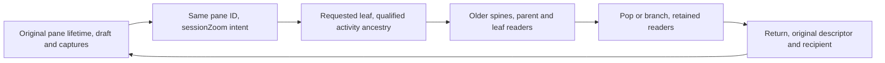

# Automatic Agent Cascade Implementation Plan

> **For agentic workers:** REQUIRED SUB-SKILL: Use superpowers:executing-plans to implement this plan task-by-task. Jesse chose native execution. Steps use checkbox (`- [ ]`) syntax for tracking. After implementation, dispatch one fresh whole-branch reviewer on the most capable available model.

**Goal:** Make ordinary desktop Agents-row clicks reveal nested transcripts in one reversible cascade without losing the original conversation's work.

**Architecture:** Promote the source conversation pane to `sessionZoom` in place. The pane owns navigation intent and geometry; existing thread, activity, mutation and history owners retain authority. Keep composer state and transcript captures in the original pane's runtime lifetime, outside component mounts and outside layout JSON.

**Tech Stack:** React, TypeScript, Zustand, Dockview, existing Motion/Popover widgets, Vitest, Go AppWire handlers, scripted local `fakellm`, and Chrome CDP.

**Spec:** `docs/superpowers/specs/2026-10-01-automatic-agent-cascade-design.md`. Jesse approved this amendment in conversation. Its introductory status line still says proposed; that historical line does not reopen approval. The amendment overrides conflicting opt-in/navigation-tree language in `docs/superpowers/specs/2026-09-29-zoom-activity-surfaces-design.md`.

## Global Constraints

- “No new dependencies, AppWire methods, provider behavior or navigation-tree format are required.”
- “Persist no activity rows, transcript contents, continuation cursors or retry state in the workspace layout.”
- “There is no separate root-global cascade store.”
- “Image bytes never enter layout JSON or localStorage.”
- “Inspection itself never sends, resumes, steers or stops work.”
- “Spines observe summaries only.” Open peeks alone admit collection demand. Tasks use their existing scoped thread binding while open.
- Preserve the “52px spine”, “400px parent column” and “440px minimum leaf column”. A root plus six delegate edges has five spines and two readable columns.
- Use `--motion-duration-spatial` and `--motion-easing-standard`; reduced motion is instant. Reconnect, status and late ancestry never animate geometry or move focus.
- “Mobile agent rows keep their current transcript behavior.” A saved cascade on mobile shows its selected read-only transcript and Return.
- Prove source handoff before automatic entry. No replacement transcript engine, history scheduler, mutation owner, recovery authority, or compatibility layer.
- Follow `docs/developing-evener/testing.md`. Script only transport/provider boundaries. Default tests use no live-provider credentials, external service or ambient session state.
- Work in the existing isolated `activity-sidebar-followups` worktree. Planning base is `f6fbe32ccfdf21de373eb3584e06dabd8958c9cb`; earlier product work is already merged.
- No implementation, dependency installation or new test files before Jesse reviews this plan. Commit this document alone at the plan gate.

## Review Focus

1. Close/reset reuses a pane ID while an image encode or recovery write is pending: late work must not mutate the new pane or draft. Task 1 owns the lifetime test; Task 5 owns the workspace reset test.
2. Two independent reading paths contain the same requested ref: collapse, Jump to live and pop affect only their own demand/capture. Task 2 owns named-demand and capture tests.
3. An ancestor routing alias resolves to a replacement while its descendant remains loaded: retire the old branch before showing replacement evidence. Task 4 owns identity reconciliation; Task 3 owns metadata fencing.
4. Saved edge intent is malformed or cyclic beside healthy documents/job panes: restore the valid panes and safely reduce/skip only the invalid cascade. Task 4 owns validation and Task 5 owns Dockview restore.
5. Rapid pop/drill precedes ancestry/transport completion: late responses must not resurrect abandoned descendants, steal focus or animate. Task 4 owns transition fences; Tasks 5–6 prove rendering and browser behavior.

---

## Grounded seams and file ownership

All frontend `src/` paths below are under `cmd/evener-hub/frontend/`. Read the named files before editing. The findings below came from source inspection, not newly run tests.

| Owner | Current seam | Change |
|---|---|---|
| `shell/workspace.ts` | `OpenPaneRecord { id, type, params, slot }`; `openPane`, `focusPane`, `closePane`, `restoreLayout`, `layoutJSON` | Add targeted compare-and-retype. Preserve transcript Back origins. Never call `replacePrimary`, which clears all panes. |
| `shell/DockHost.tsx` | `PaneHost` selects `params.paneType`; reconciliation currently caches only `pane.params` | Compare type as well as params, call `updateParameters` on the existing panel, schedule existing layout persistence after params changes. |
| `shell/paneRegistry.ts`, `shell/AppShell.tsx` | Typed pane union and eagerly imported registration modules | Register `sessionZoom` before restore. No route is added. |
| `panes/session/composer/Composer.tsx` | Draft/recovery revisions and listener at approximately 259–540; `useAttachments(textEditor)` at 567 | Retain only source editor/work continuity outside mounts. Keep existing queue/outbox submission authority. |
| `composer/attachments/useAttachments.ts` | `createAttachmentStore()`, `useAttachments(editor, backingStore?)` | Use the existing backing store. Encode failure calls the captured editor, so that editor must stay live and source-bound after unmount. |
| `panes/transcript/Transcript.tsx` | Private `ThreadTranscript`, lines 77–214 | Extract its content and coordinator; keep job dispatch and pane scaffold outside. |
| `panes/session/transcript/useTranscript.ts` | `useTranscript(ref, viewId = ref)`; `HistoryPaging` per binding | Extend retained consumer membership and named activity. Current membership assumes session/transcript pane IDs. |
| `flow/transcriptViewRegistry.ts` | `CapturedTranscriptView`, `registerTranscriptView`, `captureTranscriptViews`, `restoreTranscriptViews` | Add targeted capture/restore access, using the same registered capture callbacks. |
| `appwire-client/typescript/historyPaging.ts` | `activate()`, `request(consumer)`, `cancel(consumer)` | Require named activation. Current active count can retry a collapsed reader's demand when another view stays active. |
| `appwire-client/typescript/threadSubscription.ts` | Additive per-client/ref leases, `ensure()` performs `includeTurns:false` | Retain only identity/status metadata from the already-required subscription read. No additional spine thread read. |
| `appwire-client/typescript/sessionActivityStore.ts` | Shared summary/collections and alias-session retirement | Expose qualified metadata and process matching status notifications. Existing retry/cursor owner remains unchanged. |
| `stores/sessionActivity.ts` | `useSessionActivity(ref, 'session', collection?)` | Reuse this owner unchanged except exposing the added snapshot metadata. |
| `shell/activitybar/AgentsTab.tsx` | `drill(sub)` calls `openTranscript(sub.childRef, sub.ownerRef)` | Shared desktop opener, with an explicit owner callback inside peeks. Preserve page/fold and mobile paths. |
| `ActivitySidebar.tsx`, `statusbar/ScopeCrumbs.tsx` | Shared leaf scope and default navigation | Optional explicit pop callback when the focused pane is a cascade. |
| `statusbar/StatusBar.tsx` | Explicit `sessionRef`, `paneId`, `leading`; focus published before opening sidebar | One cascade footer bound to the selected leaf. |
| `widgets/popover`, `motion` | Portal/focus/Escape ownership; `domAnimation`, not `domMax` | Reuse Popover with `closeOnScroll={false}`. Animate explicit width/x only on user transitions. |

New focused units:

- `src/shell/paneLifetime.ts`: runtime lifetime identity, disposal and retained source/read handles for every conversation pane. No cascade navigation state.
- `src/panes/session/composer/sourceState.ts`: retained original editor state and existing recovery/submission guards.
- `src/panes/session/transcript/transcriptReadView.ts`: pane/ref/role-qualified read handles and semantic captures.
- `src/panes/transcript/ReadOnlyThreadContent.tsx`: reusable thread content, projection and existing scroll coordination.
- `src/panes/zoom/intent.ts`: serializable types, validation, edge edits and authority reconciliation.
- `src/panes/zoom/actions.ts`: targeted workspace actions and Open conversation.
- `src/panes/zoom/Zoom.tsx`, `CascadeColumn.tsx`, `CascadeSpine.tsx`, `ActivityPeek.tsx`, `zoom.module.css`, `index.tsx`: presentation and registration.
- `cmd/evener-hub/cascade_browser_test.go`, `frontend/scripts/cascadeguard/run.mjs`: real-stack browser journey, not a frontend fixture route.

The source preservation and reader tasks are prerequisites. Task 4 first produces an explicitly invoked, working two-column cascade. Task 5 adds full interaction and automatic entry. Task 6 supplies the real-stack delivery proof.



The lifetime persists across promotion and component remounts. Params store only navigation/return intent. Real removal or layout replacement ends the lifetime, even when a new layout reuses the pane ID.

## Execution and checks

Read `docs/developing-evener/README.md` and testing guidance before changing tests. Verify `git status --short` and `git config --get core.hooksPath`; hooks are `scripts/hooks` and must remain enabled.

Frontend commands run from `cmd/evener-hub/frontend` unless labeled root. Use the pinned installation. Do not run `npm ci` through a symlinked `node_modules`. Root `make` gates perform their own preflight. Before each task commit, run frontend Biome on its touched `src/` and AppWire files, inspect `git diff --check`, stage the exact task paths, inspect `git diff --cached`, and commit. Never stage other lanes' work.

Every test step below is RED first, then production changes, then GREEN. When a new import is absent, add only its type/export shell so the RED result is an actual behavior failure, not an unresolved-module error. Test snippets show the key assertions; add their explicit cases to the existing setup identified in that step. Do not replace a real owner with a mock to shorten the setup.

Native execution uses the executing-plans ledger. Record interface rulings, commands and red/green evidence. Do not pause between implementation tasks. The final review covers the entire range from the branch base, not merely the final task commit.

---

### Task 1: Retain source work across conversation-pane remounts

**Files:**
- Create: `src/shell/paneLifetime.ts`, `src/shell/paneLifetime.test.ts`
- Create: `src/panes/session/composer/sourceState.ts`, `sourceState.test.ts`
- Modify: `src/panes/session/composer/Composer.tsx`, `attachments/useAttachments.ts` only where sharing attachment operations is needed
- Modify: `src/panes/session/Session.tsx`, `src/shell/workspace.ts`
- Test: `src/panes/session/composer/Composer.integration.test.tsx`, `attachments/useAttachments.test.ts`

**Interfaces:**
- Consumes: `createAttachmentStore(): AttachmentStore`, `TextEditor.read/write`, existing draft/recovery/pending-turn exports.
- Produces the following runtime-only interfaces. Use Zustand vanilla state for the original draft values; retain the existing revision refs and promise chain in the same handle. Do not store files or callbacks in workspace params.

```ts
export interface PaneLifetime {
  readonly paneId: string;
  readonly serial: number;
  readonly sourceRef: string;
  readonly alive: boolean;
  readonly composer: ComposerSourceState | null;
  dispose(): void;
}
export function conversationPaneLifetime(pane: OpenPaneRecord): PaneLifetime;
export function disposeConversationPaneLifetime(pane: OpenPaneRecord): void;

export interface ComposerSourceState {
  readonly ref: string;
  readonly attachments: AttachmentStore;
  readonly editor: TextEditor;
  getSnapshot(): ComposerSourceSnapshot;
  subscribe(listener: () => void): () => void;
  bindEditor(editor: TextEditor): () => void;
  dispose(): void;
}
export interface ComposerSourceSnapshot {
  text: string;
  skillNames: string[];
  activeRecoveryId: string | null;
  freshRecoveryRef: string | null;
  restoreEpoch: number;
}
export function createComposerSourceState(ref: string): ComposerSourceState;
```

`Composer` receives `source: ComposerSourceState` from its owning Session. Tests mount it with an explicitly created source. All production callers migrate together; do not add an optional fallback that silently creates a second owner. The owner is created lazily for actual session panes. A transcript lifetime has `composer: null`.

- [ ] **Step 1: Write the retained-source RED cases.** Extend the existing real Composer integration wrapper (`Composer.integration.test.tsx:41–49`, `connectFakeClient`, `readResponse`, `replaceEditorText`, real IndexedDB setup). Test unmount/remount before introducing promotion:

```tsx
test('source draft and skills survive a view remount without a send', async () => {
  const fake = connectFakeClient();
  fake.on('thread/read', () => readResponse('root'));
  await threadsStore.getState().ensureThread('root');
  const source = createComposerSourceState('root');
  const first = render(<Composer ref="root" focused={false} source={source} />);
  const message = screen.getByRole('textbox', { name: 'Message' });
  await userEvent.setup().type(message, 'keep this draft');
  first.unmount();
  render(<Composer ref="root" focused={false} source={source} />);
  expect(screen.getByRole('textbox', { name: 'Message' }).textContent).toBe('keep this draft');
  expect(source.getSnapshot().text).toBe(readComposerDraft('root').text);
  expect(fake.calls.filter(c => c.method === 'turn/start' || c.method === 'turn/steer')).toEqual([]);
  source.dispose();
});
```

Add real skill-chip selection to a separate case using the existing Composer skill test catalog. Assert the same canonical `skillNames` before/after remount. Use existing paused IndexedDB helpers to repeat existing delayed acceptance tests with the Composer unmounted during the outcome: unchanged input retires once; a newer ordinary draft/chip selection survives; active recovery ID and durable mutation ID remain the original values. Assert outbound method/ref/clientMutationId counts, not mock callback counts.

- [ ] **Step 2: Write image/lifetime RED cases.** In attachment tests keep only the encoder at its browser-platform boundary; the real hook/store/editor runs. Add the following exact sequences to `sourceState.test.ts` and the Composer integration suite:

```ts
// Close/reset versus pending encoding, with the ID intentionally reused.
const old = conversationPaneLifetime(oldRootPane);
const pending = old.composer!.attachments.getState().generationRef.current;
disposeConversationPaneLifetime(oldRootPane);
const replacement = conversationPaneLifetime(newRootPaneWithSameId);
expect(replacement.serial).not.toBe(old.serial);
expect(old.alive).toBe(false);
expect(replacement.composer!.attachments.getState().items).toEqual([]);
expect(old.composer!.attachments.getState().generationRef.current).toBeGreaterThan(pending);
```

Define `oldRootPane` and `newRootPaneWithSameId` as distinct real `OpenPaneRecord` objects with `{id:'session-1',type:'session',params:{ref:'root'},slot:'main'}`. Also resolve success and failure of an encode after view unmount but before lifetime disposal: success settles original bytes; failure strips only its original marker from the current original draft; neither writes a child's draft. On disposal both continuations become no-ops. Add staged/encoding success and decode-failure cases with a newer draft revision owned by another source pane; stale cleanup cannot overwrite that draft. Capture and assert the expected rejection toast.

- [ ] **Step 3: Run RED.**

Run: `npm test -- src/shell/paneLifetime.test.ts src/panes/session/composer/sourceState.test.ts src/panes/session/composer/Composer.integration.test.tsx src/panes/session/composer/attachments/useAttachments.test.ts`

Expected: the new remount/lifetime cases fail on discarded state, old-editor writes or detached recovery ownership. Existing cases remain green. Save the complete output in the plan workspace.

- [ ] **Step 4: Move continuity, preserving existing rules.** Extract the draft state/revision ownership, recovery ID/write version/replacement epoch, last-drain snapshot and commit listener into `sourceState.ts`. Keep UI focus, slash completion, DOM selection and busy presentation in Composer. Keep submit/drain/outbox calls in the existing owners. The stable editor delegates to the currently bound editor while mounted and applies the existing source draft guards while detached:

```ts
// Source identity is immutable, and disposal invalidates pending work.
const editor: TextEditor = {
  read: () => boundEditor?.read() ?? {
    text: currentDraftText(),
    cursor: snapshot.text.length,
    selection: { start: snapshot.text.length, end: snapshot.text.length },
  },
  write: (text, cursor, source) => {
    if (disposed) return;
    if (boundEditor) { boundEditor.write(text, cursor, source); return; }
    // Apply the extracted revision/recovery guards before persisting.
    writeDetachedSourceDraft(text, cursor, source);
  },
};
```

`currentDraftText()` re-reads the ref-bound draft if its revision no longer equals the handle's owned revision. `writeDetachedSourceDraft` uses the same `restoredSkillNames`, `markDraftEdited`, recovery write/version guards and submission ownership predicate currently in Composer at 438–565. A submission-origin cleanup only persists when the source still owns `readDraftRevision(ref)`. An encode failure never claims a newer foreign draft; remove its item and report failure without overwriting foreign text. Relocate these existing functions rather than introduce parallel implementations.

The extracted private signatures are `currentDraftText(): string` and `writeDetachedSourceDraft(text: string, cursor: number, source?: 'edit' | 'submission'): void`. Both close over the immutable source ref and retained revision/recovery state.

Pass `source.editor` and `source.attachments` to `useAttachments`. Extract attachment operations to a plain store-backed factory only if the detached committed listener needs `clearSubmitted`; the hook and source both call that one implementation. Do not call `reset` on promotion or view unmount. On actual lifetime disposal, remove the committed listener, invalidate recovery continuations and bump/reset attachment generation. Keep already durable queue/outbox entries untouched.

Acquire lifetime from the committed pane record. Promotion later explicitly transfers it to the replacement record. Real close, `replacePrimary`, successful layout replacement and reset dispose removed lifetimes. Same-ID layout replacement does not transfer. Failed restore leaves lifetimes intact. Retain no hidden mounted editor or submission effect.

- [ ] **Step 5: GREEN and commit.** Rerun Step 3, then `npm run typecheck`. Expected: zero failures, restored draft/chips/files belong to root, and no extra mutation is emitted. Full real-browser encoding is deliberately proved in Task 6, not claimed here.

Stage only the Task 1 files actually changed. Commit: `refactor(web): retain source composer work for pane lifetimes`.

---

### Task 2: Share read-only content and retain independent history views

**Files:**
- Create: `src/panes/session/transcript/transcriptReadView.ts`, `transcriptReadView.test.ts`
- Create: `src/panes/transcript/ReadOnlyThreadContent.tsx`, `ReadOnlyThreadContent.test.tsx`
- Modify: `src/panes/transcript/Transcript.tsx`, `transcript.module.css`
- Modify: `src/panes/session/Session.tsx`, `src/shell/paneLifetime.ts`
- Modify/Test: `src/panes/session/transcript/useTranscript.ts`, `useTranscript.test.ts`
- Modify/Test: `src/panes/session/transcript/flow/transcriptViewRegistry.ts`, its tests, `transcriptAnchors.test.tsx`
- Modify/Test: `appwire-client/typescript/historyPaging.ts`, `historyPaging.test.ts`
- Modify: `mobile-native/src/session/useOlderHistory.ts`; Test: its existing history suites

**Interfaces:**
- Consumes: Task 1 `PaneLifetime.serial/paneId/sourceRef`.
- Produces: content without a scaffold and retained view handles. Handles are owned by pane lifetimes; component unmount only marks them unreadable.

```ts
export type TranscriptReadRole = 'session' | 'transcript' | 'cascade';
export interface TranscriptReadView {
  readonly id: string;
  readonly paneId: string;
  readonly requestedRef: string;
  readonly role: TranscriptReadRole;
  readonly alive: boolean;
  getCapture(): CapturedTranscriptView | undefined;
  setCapture(value: CapturedTranscriptView): void;
  setReadable(value: boolean): void;
  dispose(): void;
}
export function retainedTranscriptReadView(
  lifetime: PaneLifetime, ref: string, role: TranscriptReadRole,
): TranscriptReadView;
export function captureTranscriptView(id: string): CapturedTranscriptView | undefined;
export function restoreTranscriptView(id: string, capture: CapturedTranscriptView): void;
export function ReadOnlyThreadContent(props: {
  ref: string; view: TranscriptReadView;
}): React.ReactElement;
// Replace anonymous activation, migrate every current caller.
HistoryPaging.activate(consumer: string): () => void;
```

Build IDs with `JSON.stringify(['read', paneId, serial, ref, role])`, never joined strings. The lifetime retains handles by `(ref, role)`. No capture/history state enters serialized params.

- [ ] **Step 1: Write independent-demand RED.** Add to the real `historyPaging.test.ts`, with its existing fake-clock setup:

```ts
test('another active reader does not retry a collapsed reader demand', async () => {
  let reads = 0;
  const paging = new HistoryPaging(() => 'older', async () => {
    reads += 1;
    throw new Error('offline');
  });
  const leaveA = paging.activate('path-a');
  const leaveB = paging.activate('path-b');
  await expect(paging.request('path-a')).rejects.toThrow('offline');
  leaveA();
  await vi.advanceTimersByTimeAsync(31_000);
  expect(reads).toBe(1);
  expect(paging.getSnapshot().pending).toBe(true);
  const returnA = paging.activate('path-a');
  await vi.advanceTimersByTimeAsync(1000);
  expect(reads).toBe(2);
  returnA(); leaveB(); paging.cancel('path-a');
});
```

Add request/cancel cases where both views have demand: cancel A leaves B; an in-flight shared successful page can satisfy both, but a failure cannot schedule A while only B is readable. Use counters around the actual scheduler's `loadPage` boundary, not a mocked scheduler.

- [ ] **Step 2: Write retained view/content RED.** Use real handles and production content with a FakeClient at the transport boundary. In the existing `useTranscript.test.ts` setup, create two real pane records/lifetimes for the same ref, retain two cascade handles, request both, mark A unreadable and cancel B. Assert A stays pending without retries, reopening A retries, and disposing A does not cancel an independently requested B. Keep the existing same-binding reconnect and replacement-binding cases.

```ts
const a = retainedTranscriptReadView(lifetimeA, 'shared', 'cascade');
const b = retainedTranscriptReadView(lifetimeB, 'shared', 'cascade');
expect(a.id).not.toBe(b.id);
a.setCapture({ anchorId: 'turn-20', anchorOffset: 12,
  normalizedOffset: 0.4, followingBottom: false });
a.setReadable(false);
expect(a.getCapture()?.anchorId).toBe('turn-20');
expect(b.getCapture()).toBeUndefined();
a.setReadable(true);
expect(a.getCapture()?.anchorOffset).toBe(12);
```

Extend `transcriptAnchors.test.tsx` to register real TranscriptBody captures, prepend older rows, unmount a readable column and restore it. Assert semantic entry/offset after measurement, not only a retained object. Source session/transcript captures seed the first root cascade reader once and restore the original view on Return. Test different disclosure state in two same-ref panes. `job:` still renders JobLog and sends no thread/history read.

- [ ] **Step 3: Run RED.**

Run: `npm test -- ../../../appwire-client/typescript/historyPaging.test.ts src/panes/session/transcript/useTranscript.test.ts src/panes/session/transcript/transcriptReadView.test.ts src/panes/transcript/ReadOnlyThreadContent.test.tsx src/panes/session/transcript/transcriptAnchors.test.tsx`

Expected: named pause and retained membership/capture cases fail for the targeted behaviors. Frontend `vite.config.ts:154–157` explicitly collects AppWire tests. The AppWire package has no `npm test` script; run its Vitest suites through this frontend command.

- [ ] **Step 4: Implement within the existing owners.** Replace `readers: number` with refcounted active consumer names; retain pending `consumers` separately. Schedule only if a pending consumer is active:

```ts
private eligibleConsumer(): string | undefined {
  for (const consumer of this.consumers) {
    if ((this.activeConsumers.get(consumer) ?? 0) > 0) return consumer;
  }
  return undefined;
}
```

`activate(consumer)` increments/decrements that name with idempotent cleanup. `schedule` and `request` check eligibility. A paused request stays pending; cancelled demand does not restart after in-flight failure. Migrate all tests and production callers without an anonymous fallback. Browser useTranscript activates its exact view ID. Native `useOlderHistory` activates both existing names `reader` and `find` while its screen is active/foreground, and releases both together. This is the only native behavior change.

Extend useTranscript membership to a retained handle/lifetime rather than assuming view ID equals pane ID. Ordinary pane views retain their existing history behavior across temporary unmounts. Cascade collapse pauses; pop calls `dispose` and cancels only that handle; binding replacement retires that binding's old demand. Keep current per-ref `HistoryPaging` and thread older-cursor merge.

Extract projection, rows, loading/empty states, older row, announcement, liveness and `useTranscriptScroll` from `ThreadTranscript` into `ReadOnlyThreadContent`. Transcript keeps its PaneScaffold, ancestry and JobLog branch. Content supplies `view.id` for both view registration and disclosure scope. Mounting acquires existing `ensureThread` ownership; unmount releases only that claim. Capture before collapse; restore through the existing registered callback after measurement. Do not introduce a second list or coordinator.

- [ ] **Step 5: GREEN and commit.** Rerun Step 3 and frontend `npm run typecheck`. From `mobile-native`, run `npm test -- src/session/useOlderHistory.test.tsx` and `npm run check`. Expected: all existing and new cases pass. Native activation remains capable of both reader and Find demand. Record command/output in the ledger.

Stage only Task 2 paths. Commit: `refactor(web): retain independent transcript readers for cascade columns`.

---

### Task 3: Publish authoritative spine metadata from existing membership

**Files:**
- Modify/Test: `appwire-client/typescript/threadSubscription.ts`, `threadSubscription.test.ts`
- Modify/Test: `appwire-client/typescript/sessionActivityStore.ts`, `sessionActivityStore.test.ts`
- Modify/Test as needed: root package exports, `src/stores/sessionActivity.test.tsx`

**Interfaces:**
- Consumes: existing additive thread lease and existing activity context's resolved `sessionId`.
- Produces: metadata from the already-required subscription read, never another spine reader.

```ts
export interface ThreadSubscriptionMetadata {
  readonly threadId: string;
  readonly sessionId: string;
  readonly status: ThreadStatus;
}
// Add to the existing lease. Do not change ensure/read request behavior.
ThreadSubscriptionLease.metadata(): ThreadSubscriptionMetadata | null;
// Add to SessionActivitySnapshot; null is explicitly unknown/stale.
runtime: ThreadSubscriptionMetadata | null;
```

- [ ] **Step 1: Write metadata RED.** Extend actual lease tests: two leases share one `thread/read`; both metadata accessors return only `{threadId,sessionId,status}` from the admitted result. Releasing one does not unsubscribe. Disconnect clears metadata. A late old-generation read cannot repopulate it. Rich reads by another owner must not cause the metadata object to retain transcript bytes.

Extend activity tests using distinct `sessionId` values:

```ts
expect(store.getSnapshot().runtime?.sessionId).toBe('root-session');
expect(fake.calls.filter(c => c.method === 'thread/read')).toHaveLength(1);
expect(fake.calls.find(c => c.method === 'thread/read')?.params).toEqual(
  expect.objectContaining({ includeTurns: false, subscribe: true, replaceSubscription: false }),
);
// After the scripted activity context changes the requested alias binding:
expect(store.getSnapshot().context?.sessionId).toBe('replacement-session');
expect(store.getSnapshot().runtime).toBeNull();
```

Also send a matching `thread/status/changed` frame and assert authoritative status changes without a collection read. A mismatched old threadId/ref or a disconnected generation leaves metadata null/unchanged. Reconnect with an in-flight older snapshot and newer status notification cannot overwrite newer status. A summary context epoch change for the same session does not retire valid status.

- [ ] **Step 2: Run RED.** Run from the frontend directory: `npm test -- ../../../appwire-client/typescript/threadSubscription.test.ts ../../../appwire-client/typescript/sessionActivityStore.test.ts`. Expected: metadata/identity assertions fail; no extra wire reads are accepted.

- [ ] **Step 3: Implement metadata extraction, not a status store.** Retain a projected metadata object in the existing shared membership. Set it only on a current-generation `acquireWire`/`read` result; clear on connection loss/final release. Resolve identity from wire `thread.sessionId ?? thread.id`. Never retain the response's turns.

The activity owner publishes metadata only when its resolved context matches that identity. It consumes matching `thread/status/changed` notifications while its existing listener is installed. Track a local status revision so a read begun before a newer status notification cannot overwrite that notification. On alias retirement or disconnect publish `runtime:null`. Existing summary/collection pacing and lease ownership stay unchanged. This satisfies summary-only spine demand and avoids the watchThread alternative, which would add a reader and can retain rich models.

- [ ] **Step 4: GREEN and commit.** Run Step 2 plus frontend typecheck and `npm test -- src/stores/sessionActivity.test.tsx`. Expected: green, no ancestor collection/history demand, unknown state never defaults to idle.

Stage only Task 3 paths. Commit: `feat(appwire): expose qualified status on shared activity subscriptions`.

---

### Task 4: Build targeted Zoom intent and the first working cascade

**Files:**
- Create: `src/panes/zoom/intent.ts`, `intent.test.ts`, `actions.ts`, `actions.test.ts`
- Create: `src/panes/zoom/Zoom.tsx`, `Zoom.test.tsx`, `index.tsx`, `zoom.module.css`
- Modify/Test: `src/shell/workspace.ts`, `workspace.test.ts`, `paneRegistry.ts`, `AppShell.tsx`, `paneLifetime.ts`
- Modify: `src/shell/DockHost.tsx` targeted type/params reconciliation

**Interfaces:**
- Consumes Tasks 1–3 lifetimes, content, handles and `snapshot.runtime`.
- Produces serializable intent and targeted synchronous actions. `SessionDelegate` is imported by name from the shared client. Source descriptor params use the existing exported Session/Transcript types.

```ts
export interface DelegateEdgeIntent {
  ownerRef: string; childRef: string; delegateId: string;
}
export type ConversationReturnDescriptor =
  | { type: 'session'; params: SessionPaneParams }
  | { type: 'transcript'; params: TranscriptParams };
export interface SessionZoomParams {
  ref: string;
  source: ConversationReturnDescriptor;
  edges: DelegateEdgeIntent[];
}
export interface CascadeScope {
  requestedRef: string;
  sessionId?: string;
  title: string;
}
export interface CascadePath {
  scopes: CascadeScope[];
  ancestryKnown: boolean;
}
export function parseZoomParams(value: unknown): SessionZoomParams | null;
export function deriveCascadePath(
  params: SessionZoomParams, context: SessionActivityContext | null,
): CascadePath;
export function drillZoomIntent(params: SessionZoomParams, edge: DelegateEdgeIntent): SessionZoomParams;
export function popZoomIntent(params: SessionZoomParams, ref: string, path: CascadePath): SessionZoomParams;
// Add to WorkspaceStoreState. Compare the record, not just its reusable ID.
retypePane(expected: OpenPaneRecord, type: PaneTypeId, params: unknown): boolean;
export function enterAgentCascade(sub: SessionDelegate, sourcePaneId?: string): string;
export function popAgentCascade(paneId: string, ref: string): void;
export function returnFromAgentCascade(paneId: string): void;
export function openCascadeConversation(paneId: string, ref: string): void;
```

Do not wire AgentsTab yet. Explicit calls in tests make this task independently runnable; Task 5 supplies ordinary entry.

- [ ] **Step 1: Write intent/workspace RED.** Use real pane registrations in `actions.test.ts`, actual workspace state, and real `activityDelegate`. Preserve a document, a job transcript and two independent session panes. Set distinct activity identities instead of the fixture default `sessionId='owner'`.

```ts
const before = workspaceStore.getState().panes;
const source = before.find(p => p.id === sourceId)!;
enterAgentCascade(activityDelegate({ ownerRef: 'root', childRef: 'child', delegateId: 'd1' }), sourceId);
const promoted = workspaceStore.getState().panes.find(p => p.id === sourceId)!;
expect(promoted.type).toBe('sessionZoom');
expect(promoted.slot).toBe(source.slot);
expect((promoted.params as SessionZoomParams).ref).toBe('child');
expect(workspaceStore.getState().panes.filter(p => p.id !== sourceId))
  .toEqual(before.filter(p => p.id !== sourceId));
returnFromAgentCascade(sourceId);
expect(workspaceStore.getState().panes.find(p => p.id === sourceId))
  .toEqual(source);
```

Add explicit branch/pop tests using the pure intent functions:

```ts
const child: SessionZoomParams = {
  ref: 'child', source: { type: 'session', params: { ref: 'root' } },
  edges: [{ ownerRef: 'root', childRef: 'child', delegateId: 'd1' }],
};
const deep = drillZoomIntent(child, { ownerRef: 'child', childRef: 'grandchild', delegateId: 'd2' });
const sibling = drillZoomIntent(deep, { ownerRef: 'root', childRef: 'sibling', delegateId: 'd3' });
expect(sibling.ref).toBe('sibling');
expect(sibling.edges).toEqual([{ ownerRef: 'root', childRef: 'sibling', delegateId: 'd3' }]);
expect(deriveCascadePath(deep, null)).toEqual({
  ancestryKnown: false,
  scopes: [
    { requestedRef: 'root', title: 'root' },
    { requestedRef: 'child', title: 'child' },
    { requestedRef: 'grandchild', title: 'grandchild' },
  ],
});
```

The incomplete path is a proven segment, not a certified root. Test authoritative ancestors overriding cached presentation; no navigation children are read. Test source transcript Back origin survives return, including origins pointing to another promoted pane.

- [ ] **Step 2: Write the five identity/validation failures.** Add these explicit cases:

```ts
test.each([
  null, { ref: 'job:output' }, { ref: '' },
  { ref: 'child', source: { type: 'sessionZoom', params: {} }, edges: [] },
])('invalid base Zoom params are rejected locally', value => {
  expect(parseZoomParams(value)).toBeNull();
});
```

For a valid leaf/source but malformed, cyclic, disconnected or duplicate edge array, reduce `edges` to an empty valid segment and preserve direct leaf reading. Use `root→child→root` as the cycle case. Restore beside healthy document/job records and assert they remain byte-equivalent. Reject nonstring fields and nested Zoom return descriptors.

For alias replacement, feed root context with `sessionId='old-root'`, drill to an already hydrated child, then publish `sessionId='new-root'` for the same requested root alias. Assert old child column/edge/demand is retired before replacement content appears. Pop back to that ancestor; preserve the original requested return ref. Same-session epoch changes preserve the branch.

For rapid navigation, hold the old leaf's transport response at FakeClient, pop to root and drill a sibling before resolving it. Assert params still name sibling, abandoned views are disposed, no old-grandchild column returns, and focus is unchanged by the late response. Add a stale `retypePane(oldRecord, ...)` call after close/reset with a reused ID and assert it returns false.

- [ ] **Step 3: Run RED.** Run: `npm test -- src/panes/zoom/intent.test.ts src/panes/zoom/actions.test.ts src/panes/zoom/Zoom.test.tsx src/shell/workspace.test.ts`. Expected: targeted promotion/path/restore cases fail against missing behavior, not fake bodies.

- [ ] **Step 4: Implement targeted transitions and the minimal pair.** `retypePane` changes exactly one matching current record, retaining ID/slot/focus and transferring its lifetime. Remap `transcriptOpenOrigins` keys and values from old to replacement records. Capture original source views before retype; do not replace all panes. On return use the exact saved descriptor. Contextual cascades from unrelated/job panes create a secondary pane whose return descriptor is a readonly transcript of the clicked owner.

```ts
// Geometry is a pure partition of the reconciled path.
const readable = path.scopes.slice(-2);
const ancestors = path.scopes.slice(0, -2);
```

Render one PaneScaffold, column headers and the Task 2 content. This task can show older scopes as plain labeled spine buttons; peeks/motion follow in Task 5. No composer mounts in columns. When two scopes exist, parent is 400px and leaf has flex growth/min-width 440px. With one scope, render one flex leaf.

Authority: selected context establishes a full path only with `ancestryKnown:true`. Before that, display the contiguous owner-qualified clicked segment ending at params.ref and label ancestry incomplete. Watch summaries for the retained path to fence resolved identities. Runtime binding evidence lives in the pane lifetime, never params. A changed previously resolved identity retires the descendant suffix immediately, selects the rebound ancestor and prunes its edges/readers. New context/cursor for the same session retains reading. A request-generation fence prevents late abandoned results from editing current intent. All response-driven changes have no motion/focus side effects.

Validation checks leaf/source before accepting a saved pane. Malformed edge intent does not reject a usable leaf/source; discard the invalid segment. Invalid base params reject only that pane. Add real `sessionZoom` registration/import and keep `paneToURL` null. `currentSessionRef` already reads `params.ref`; preserve focusedSession's stricter session-only composer logic.

DockHost caches `{paneType, paneParams}` rather than params alone and pushes a same-panel `updateParameters` when either changes. Keep Dockview ID/group/order. Do not remove/re-add the panel. Explicitly schedule the existing layout-save debounce after these structural changes.

Open conversation focuses an existing full session for the ref. If it is the original source session of this promotion, restore that original session in place first. Otherwise open secondary, with no `replacePrimary` call. A standalone transcript source returns to its transcript descriptor; its Open conversation action opens/focuses a session in secondary.

- [ ] **Step 5: GREEN and commit.** Run Step 3 and typecheck. Expected: same pane ID and unrelated records survive every transition; explicit root/child/grandchild content runs through real readers.

Stage only Task 4 paths. Commit: `feat(web): add reversible agent cascade panes`.

---

### Task 5: Add live spines, peeks, automatic desktop entry and persistence

**Files:**
- Create/Test: `src/panes/zoom/CascadeColumn.tsx`, `CascadeSpine.tsx`, `ActivityPeek.tsx`, `ActivityPeek.test.tsx`
- Modify/Test: `src/panes/zoom/Zoom.tsx`, `Zoom.test.tsx`, `zoom.module.css`, `actions.ts`
- Modify/Test: `src/shell/activitybar/AgentsTab.tsx`, `activityTabs.tsx`, `ActivitySidebar.tsx`, `ActivitySidebar.test.tsx`
- Modify/Test: `src/shell/statusbar/ScopeCrumbs.tsx`, its tests
- Modify/Test: `src/shell/DockHost.tsx`, `DockHost.test.tsx`, `src/shell/mobile/StackHost.test.tsx`, `workspace.test.ts`

**Interfaces:**
- Consumes all earlier task APIs.
- Add optional `onDrill?: (sub: SessionDelegate) => void` to shared activity body props. AgentsTab uses it for a peek's explicit pane/owner; its ordinary action selects mobile `openTranscript` or desktop `enterAgentCascade` at press time.
- Add optional `onNavigate?: (ref: string) => void` to ScopeCrumbs. Default behavior remains unchanged; focused cascade crumbs use `popAgentCascade`.
- `ActivityPeek` takes `{paneId:string, scope:ActivityScope, tab:ActivityTab, open:boolean, onClose:()=>void, trigger:ReactElement}`. Import the existing `ActivityTab` union from `shell/statusbar/statusScope.ts`, not a new vocabulary.

- [ ] **Step 1: Write real component RED journeys.** Extend ActivitySidebar's nested journey using real workspace/components and activityClient scripted transport:

```tsx
// Within its existing real-store/ClientProvider/MotionProvider setup:
await user.click(screen.getByRole('button', { name: /child/ }));
expect(workspaceStore.getState().panes.find(p => p.id === sourceId)?.type).toBe('sessionZoom');
expect(screen.getAllByTestId('cascade-column')).toHaveLength(2);
await user.click(screen.getByRole('button', { name: /grandchild/ }));
expect(screen.getAllByTestId('cascade-spine')).toHaveLength(1);
expect(screen.getAllByTestId('cascade-column')).toHaveLength(2);
expect(workspaceStore.getState().panes.filter(p => p.type === 'transcript')).toHaveLength(0);
```

Populate six delegate edges with unique resolved session IDs; assert five spines/two columns. Parent text selection and ordinary transcript reading leave params.ref at leaf. Footer counts/sidebar Tasks/Agents/Jobs/Watches all supervise leaf. Explicit parent activity opens its peek without changing selected scope. An ancestor peek row truncates the branch.

Test peeks with actual shared tab bodies: visible PAGE=20 boundary admits direct pages; initially empty incomplete page retains continuation; close releases only that collection; another sidebar on the same ref remains subscribed. Tasks peek mounts only the existing scoped Tasks body. Unknown counts/state remain unknown. No collection/history prefetch for closed spines.

Keyboard cases: Tab reaches distinct pop and count buttons; opening a peek moves focus inside; Escape closes only that peek, then a second Escape may dismiss the sidebar; pop never has its own Escape listener. `closeOnScroll={false}` keeps the peek open while paging/scrolling.

- [ ] **Step 2: Write DockHost/mobile RED.** Promote a real mounted Dockview panel with unchanged params object but a changed type; assert body changes through `updateParameters` and panel/group/order remain. Save through the 400ms existing debounce, inspect the `evener.workspace.layout.v2` value, then restore the layout using real registration:

```ts
expect(savedPanel.params.paneType).toBe('sessionZoom');
expect(savedPanel.params.paneParams).toEqual(expect.objectContaining({ ref: 'grandchild' }));
expect(JSON.stringify(savedLayout)).not.toContain('data:image');
expect(JSON.stringify(savedLayout)).not.toContain('olderCursor');
```

Use the actual Dockview JSON shape read from the existing test, not an invented serialization shape. Reset a workspace with a pending old source encode, restoring a new same-ID pane; assert the Task 1 lifetime is replaced and old callbacks cannot change the new source.

At the existing max-width:899px mobile boundary: ordinary Agents row still opens a transcript; restored Zoom shows one selected readonly transcript plus Return; switching back restores columns/edges. Keep params intent unchanged across viewport changes. No new mobile route.

- [ ] **Step 3: Run RED.** Run: `npm test -- src/panes/zoom/ src/shell/activitybar/ActivitySidebar.test.tsx src/shell/statusbar/ScopeCrumbs.test.tsx src/shell/DockHost.test.tsx src/shell/mobile/StackHost.test.tsx src/shell/workspace.test.ts`. Expected: auto-entry, peeks, type-only retype, save/restore and mobile cases fail before wiring.

- [ ] **Step 4: Implement the full production presentation.** Use the recovered prototype's geometry, not its fixture state/transcripts:

```css
.cascade { flex: 1; min-height: 0; display: flex; overflow-x: auto; }
.spine { width: 52px; flex: none; }
.spineName { writing-mode: vertical-rl; transform: rotate(180deg); }
.column { width: 400px; flex: none; display: flex; flex-direction: column; min-height: 0; min-width: 0; }
.leaf { flex: 1; min-width: 440px; }
```

Use existing design-system colors/type/spacing. Every readable column has Open conversation and owner-specific activity controls. Spine pop and count controls are separate accessible buttons. Counts come from direct summary state; runtime state comes only from Task 3 qualified metadata, with explicit unknown when null. Do not use rail state helpers that default unknown to idle.

An open ActivityPeek wraps the existing shared tab Body in Popover and DisclosurePersistenceContext with a scope/tab identity. Its overflow/page boundary reuses the body and existing store. Do not mount sidebar-specific ActivityViewport, whose currentness predicate depends on the real sidebar. Use the existing always-current default for a committed peek and release by unmount. No peek scheduler or activity database.

Animate explicit `width`/`x` through `m` and `spatialTransition()` only while applying a synchronous user drill/pop command. The existing provider uses domAnimation; do not add `layout` transitions requiring domMax. Honor reduced-motion by omitting transitions. Clear the user-transition token after commit; hydration/reconnect/status/late authority render immediately. Reveal the selected leaf horizontally after a user transition without changing keyboard focus. Keep each transcript's vertical scroller independent.

Bind one footer `StatusBar` to params.ref and paneId. Activity controls focus/publish that pane before opening the sidebar. Sidebar/Zoom ScopeCrumbs pop only this cascade. Ordinary explicit transcript links and job opens still call their existing functions. Capture the focused source record when the Agents action is pressed; an asynchronous response never chooses a different later-focused pane. Main-pane close policy stays unchanged; secondary tabs retain normal close.

- [ ] **Step 5: GREEN and commit.** Run Step 3 and `npm run typecheck`. Expected: all targeted tests green. Browser dimensions/focus remain Task 6 proof, not jsdom claims.

Stage only Task 5 paths. Commit: `feat(web): restore automatic nested agent columns and peeks`.

---

### Task 6: Prove the real producer-to-browser journey and publish the contract

**Files:**
- Create: `cmd/evener-hub/cascade_browser_test.go` (browserguard build tag)
- Create: `cmd/evener-hub/frontend/scripts/cascadeguard/run.mjs`, `README.md`
- Modify: `cmd/evener-dev/webbrowser.go` to register `TestAgentCascadeBrowser`
- Modify/Test: `cmd/evener-hub/app_session_activity_test.go`, `app_session_activity_relay_test.go`
- Extend producer-boundary cases in `agent/session_activity_test.go` only where real archived/runtime-release evidence is missing
- Modify: `docs/product/session-activity.md`, `docs/product/subsystems.md`, `docs/web-ui/design-system.md`

**Interfaces:**
- Existing `fakellm.New`, `Server.Next(done)`, `Call.Body`, `RespondToolCall`, `RespondText`.
- Existing `startHubStack(t, provider)`, `hubStack.dialRPC(ctx,t)`, `appwire.Client.ThreadStart`, real archive methods and real hub `/rpc`.
- Existing `Driver` export from `frontend/scripts/skillguard/run.mjs`, `navigateTo`/`evaluate` from `browserGuardCdp.mjs`.
- Proposed test/driver contract: Go passes one JSON fixture argument `{url,artifactDir,rootRef,childRef,grandchildRef,controlPath,milestonePath}`. Driver emits condition-backed milestones and exits nonzero on any failure. Go asserts milestones plus backend/socket evidence. Tokens appear only in the temporary authenticated URL and private artifacts, never reports.

- [ ] **Step 1: Add a real-stack RED journey.** Read `e2e_turn_control_test.go:516–729`, `skill_composer_browser_test.go:307–421`, and both driver files before reuse. Build the production frontend first; missing dist is a failure, never a pass or fixture substitution.

```go
// In a browserguard-tagged test in package hub.
provider, err := fakellm.New()
if err != nil { t.Fatal(err) }
t.Cleanup(provider.Close)
stack := startHubStack(t, provider)
client := stack.dialRPC(ctx, t)
depth := 2
started, err := client.ThreadStart(ctx, appwire.ThreadStartParams{
    Harness: "evener", CWD: stack.workDir, Model: stack.model,
    Input: []appwire.InputItem{{Type: "text", Text: "CASCADE_ROOT_SENTINEL"}},
    LaunchOverrides: &appwire.LaunchConfigLayer{Sandbox: "off", MaxSubagentDepth: &depth},
})
if err != nil { t.Fatal(err) }
_ = started // Obtain the public root ref from this real response.
```

Script root → child → grandchild by returning actual `delegate` tool calls (`delegation_allowance:1`, then `0`). Do not synthesize SessionDelegate rows or transcripts. Loop over `provider.Next(ctx.Done())`, inspect the request's last user message in `Call.Body["messages"]`, and distinguish unique root/child/grandchild sentinels; maintain a phase map per fixture role. Child delegate prompts contain only their own fixture role sentinel and `fork_context:false`. Reply with `RespondText` after each role's delegate is admitted. Requests may interleave; do not assume three global Next calls correspond to three sessions. Fail on a request that cannot be assigned unambiguously. Session naming is already handled by fakellm.

Read real direct `SessionDelegatesList` pages through client AppWire to obtain child/grandchild refs and delegate IDs; await the real resource/event condition, never sleep. Initial browser action still clicks production delegate rows. Their existing anchor is `delegate:${JSON.stringify([childRef,delegateId])}` on `data-activity-anchor`.

Create the new driver from existing CDP lifecycle/input methods:

```js
import assert from 'node:assert/strict';
import { Driver } from '../skillguard/run.mjs';
import { evaluate, navigateTo } from '../browserGuardCdp.mjs';
const fixture = JSON.parse(process.argv[2]);
const driver = new Driver(fixture);
try {
  await driver.start();
  await navigateTo(driver.page, fixture.url);
  await driver.openSession(fixture.rootRef);
  await driver.click('[data-testid="statusbar"] button[aria-label^="Agents,"]');
  const edge = JSON.stringify([fixture.childRef, fixture.childDelegateId]);
  const anchor = `delegate:${edge}`;
  const selector = `[data-activity-anchor=${JSON.stringify(anchor)}]`;
  await driver.waitPage(`document.querySelector(${JSON.stringify(selector)}) !== null`, 'child row');
  await driver.click(selector);
  await driver.waitPage(`document.querySelectorAll('[data-testid="cascade-column"]').length === 2`, 'root-child columns');
  const columns = await evaluate(driver.send,
    `[...document.querySelectorAll('[data-testid="cascade-column"]')].map(n => n.getAttribute('data-scope-ref'))`);
  assert.deepEqual(columns, [fixture.rootRef, fixture.childRef]);
  driver.milestone('root-child');
} finally {
  await driver.stop();
}
```

Expand the passed fixture with `childDelegateId` and `grandchildDelegateId`; keep these exact keys in Go and JS. After child → grandchild, assert root spine, child/leaf columns, real transcript sentinels, unchanged source Dockview panel ID, and no accumulated transcript tabs. Save DOM/screenshot/console and measured boxes through existing capture helpers. New selectors (`cascade-column`, `cascade-spine`, `data-scope-ref`) are added to the actual components in Task 5, not a dev fixture.

- [ ] **Step 2: Run and inspect browser RED.** Run root: `make build-web`, then `go test -tags browserguard ./cmd/evener-hub -run '^TestAgentCascadeBrowser$' -count=1`. Expected: failure if production cascade/real nested route is missing; a launch error, absent browser/dist or ambiguous scripted provider request is a harness defect to fix and rerun. Preserve complete output. The harness must be capable of failing if AgentsTab is reverted to openTranscript.

- [ ] **Step 3: Extend real boundary coverage before fixing gaps.** Add root/child/grandchild archive decisions via the real `Client.ArchiveSet` method (read its actual params type at `appwire/client.go:793`). Assert both archive state in navigation and direct retained activity/ancestry remain routable; no fabricated activity children occur in navigation. Existing retained-public-hierarchy test alone does not prove archive.

Extend the existing real relay test with socket close/reconnect while columns/sidebar/peek share a ref. Assert only additive membership is admitted, current retained pages remain useful, observed page extent is recovered, and a closed peek no longer causes delegate-page reads. Use the relay test's actual producer/runtime machinery, not injected frontend rows. Keep the existing real collector test after idle runtime release and pin direct rows still drillable. Add initially empty incomplete-page progression at the real handler boundary with an explicit producer readiness barrier.

Run root:

```sh
go test ./agent -run '^TestSessionActivityRealDelegateTree$' -count=1
go test ./cmd/evener-hub -run '^TestSessionActivity(RetainedPublicHierarchyAndSourceFences|LiveProducerRelayAndIndependentSubscribers|ArchivedNestedHierarchy|NestedReconnect)$' -count=1
```

The last two test names are new tests created in this step. Expected: new archive/reconnect assertions fail for any demonstrated missing behavior. If existing production behavior already satisfies them, record that they pin previously uncovered behavior; do not manufacture a production change merely to obtain RED.

- [ ] **Step 4: Prove work, geometry and interaction in Chrome.** Extend the driver with these independent condition-backed assertions:

| Browser action | Required measured evidence |
|---|---|
| Six delegate edges | Five spine boxes at 52px, parent box at 400px, leaf at least 440px, two readable columns. |
| Narrow desktop | Horizontal overflow exists; selected leaf is brought into view; both transcript scrollers move independently. |
| Ancestor peek/paging/branch | Real direct page progresses; keyboard can activate rows; branch truncates at owner; Tasks stays inside peek. |
| Escape | One press closes only topmost peek; sidebar and path survive. |
| Parent text selection | Leaf ref, footer and sidebar scope remain leaf. |
| Reconnect/status/late ancestry | No geometry animation or unsolicited focused element change. |
| Reduced motion | Emulate `prefers-reduced-motion:reduce`; user drill changes geometry without running geometry animation. |
| Layout reload | Same selected ref/edges/return descriptor restore after real page reload, preserving unrelated pane placement. |
| Original source Return | Original pane/type/ref/draft/skills/staged real PNG bytes return; no second mutation reaches the provider. |
| Pending real image decode | Hold only the Chrome Image/canvas platform completion boundary, promote, then release; original attachment settles or rejects safely. No fake encoder implementation. |
| Queued/unresolved mutation | Hold actual provider/storage acknowledgement at its existing boundary, promote/return, resolve; original clientMutationId/recipient retained and applied once. |
| Mobile | Existing viewport boundary keeps Agents transcript action; saved cascade shows selected readonly content/Return. |

Go owns archive/release/provider barriers. Driver owns UI gestures and CDP network disconnect/reconnect (`Network.emulateNetworkConditions` or existing socket-close boundary after inspecting support). Use the existing control/milestone JSONL protocol for coordination; wait for observed milestones with bounded context, not sleeps. Browser platform holds are component/geometry evidence only; the required nested producer journey always runs unmodified real daemon/hub/provider plumbing.

Fix any exposed product gap RED→GREEN at its owning layer. Do not mask it by relaxing geometry, replacing AppWire handlers or hiding stderr. Assert expected negative-error messages; unexpected console/hub/driver errors fail the guard. Gate registration in `cmd/evener-dev/webbrowser.go` must name the new test explicitly, or `make test-web-browser` will omit it.

- [ ] **Step 5: Update durable docs and run delivery gates.** Record automatic desktop entry, two-column/deep-spine geometry, direct activity demand, source restoration, selected-leaf sidebar/footer, mobile fallback and unknown metadata in the three product/design-system docs. The Browser workspace subsystem row links this contract and the new guard.

Run touched-path Biome from the frontend directory, then root:

```sh
make test-web
make test-api-package
make test-web-browser
go test ./agent -run '^TestSessionActivityRealDelegateTree$' -count=1
go test ./cmd/evener-hub -run '^TestSessionActivity' -count=1
make vet
```

Expected: each command completes with exit 0 and no unaccounted failures/errors. Inspect the scripts/target definitions before reporting counts. Follow repository guidance: targeted local Go checks, then CI for full lint/all-module/race gates after push. No unapproved publish or merge. If Chrome or another prerequisite is unavailable, report the exact failed command and missing evidence; do not claim completion.

- [ ] **Step 6: Commit and whole-branch review.** Stage only Task 6 files and any explicitly ledgered red-green fixes. Commit: `test(web): prove automatic cascade through real nested delegates`.

Run the executing-plans review-package helper for the full branch range. Load `superpowers:requesting-code-review`, explicitly select the most capable available model and dispatch one fresh reviewer with this plan, the approved spec, ledger rulings and Review Focus verbatim. Check Critical/Important findings by effect, fix once RED→GREEN and rerun relevant suites. Record all deferred minors/rulings for Jesse. Before a PR, use `simplify-code:simplify-code`; subsequent push/CI/review rounds follow `shepherd-pr:shepherd-pr` and repository rules. Never infer a clean review from a green review-job status.

## Self-review coverage and plan handoff

- Entry/drill/return and contextual/independent panes: Tasks 4–5.
- Two columns, six-edge geometry, ancestor peeks, selected-leaf footer/sidebar, motion/Escape/mobile: Tasks 5–6.
- Requested aliases versus resolved identity, incomplete ancestry, cursor epochs, malformed saved intent: Tasks 3–5.
- Shared readonly transcript/capture/history, collapse/reopen/pop/Jump independence: Task 2, browser proof Task 6.
- Draft/skills/staged/pending files/queue/recovery and no duplicate submission: Task 1 before entry, actual promotion in Task 5, real platform/producer evidence Task 6.
- Direct activity demand, empty progress, retained/archive/reconnect/missing child: existing owners retained in Tasks 3–5, required real boundary cases in Task 6. A proven missing selected child shows a scoped explanation inside its column while parent, Return and Open conversation remain available.
- Each Review Focus failure has an owning RED test above. Every proposed exported interface is defined before consumption. No new wire method, dependency or navigation-tree format is introduced.

Plan-only verification: compare each approved spec section against this list, scan for placeholders, inspect cross-task signatures, and run `git diff --check`. Commit only this plan after checking the staged diff. Ask Jesse to review whether it captures the requested behavior. Native execution is already chosen; do not ask for execution method again.
