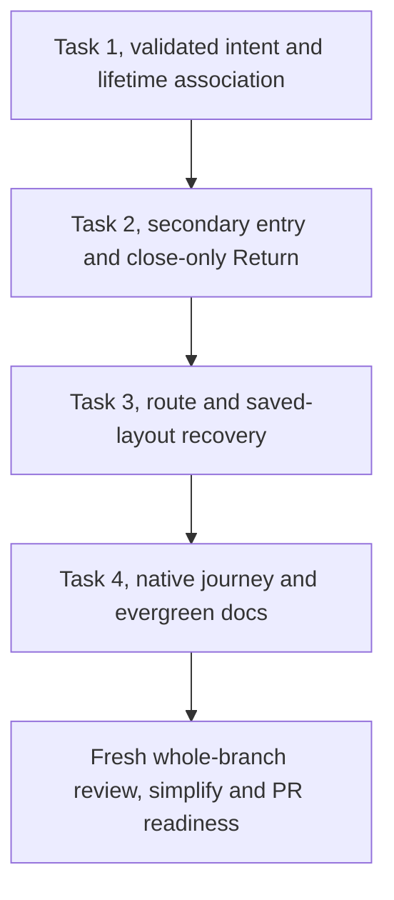

# Secondary Agent Cascade Implementation Plan

> **For agentic workers:** REQUIRED SUB-SKILL: Use superpowers:subagent-driven-development (recommended) or superpowers:executing-plans to implement this plan task-by-task. Steps use checkbox (`- [ ]`) syntax for tracking.

**Goal:** Open and reuse one read-only agent cascade beside the center conversation, then close that inspector and focus its exact surviving origin on Return.

**Architecture:** Keep the original conversation record, composer and reader in place. Give the secondary inspector its own read-only lifetime, a validated saved Return locator, and a runtime association to the original committed lifetime. Resolve saved associations once during restore and retire them when their origin disappears.

**Tech Stack:** TypeScript, React, Zustand, Dockview, Vitest, Testing Library, the existing Go daemon/hub browser fixture, and native Chrome CDP input.

**Spec:** `docs/superpowers/specs/2026-10-04-secondary-agent-cascade-design.md`, approved blob `b41235e09a5b9bf680cefc24e45eabcef5977eae`. Read its inherited contracts in `docs/superpowers/specs/2026-10-01-automatic-agent-cascade-design.md` too.

**Status:** Awaiting Jesse's plan review. Native execution is already chosen. Implementation starts only after that review.

## Global Constraints

The following requirements are copied from the approved amendment. Each task inherits them.

- “The original center conversation stays mounted. One separate read-only agent cascade opens beside it.”
- “The change belongs in the browser workspace. It adds no backend method, provider behavior, shared-client subscription owner, native-app feature, or new retry loop.”
- “Explicit transcript links and Open conversation retain their existing meanings.”
- “The separate spine-status PR is held. This work authorizes no merge, deployment, or live-hub restart.”
- “Do not add a third group or move that origin to keep it mounted.”
- “Runtime Return and reuse bind to the original committed pane lifetime, not just its ID or ref.”
- “Subsequent removal cannot rebind it to a new pane. Retired locators must not become valid again through a later layout save/reload.”
- “Malformed or unavailable Return metadata must not discard a readable cascade or unrelated saved panes.”
- “Keep the existing Return behavior for already-saved cascades: Return restores their source view in that same pane. This includes in-place cascades that occupy the center and older secondary fallback cascades.”
- “Keep 52px ancestor spines, a 400px immediate-parent column, and a 440px minimum leaf. Horizontal overflow belongs to the cascade track.”
- “Phone Agents entry remains `openTranscript`.”
- “Image bytes and pending encodes remain lifetime-owned and stay out of layout JSON/localStorage. Page reload does not restore those bytes.”
- “Keep existing detached-continuation tests as detached tests; do not describe the newly mounted center journey as editor detachment.”

Read `docs/product/README.md`, the Browser workspace row in `docs/product/subsystems.md`, `docs/product/session-activity.md`, and `docs/developing-evener/testing.md` before execution. Honor `AGENTS.md`. Keep default tests deterministic and script only the external provider boundary.

## Review Focus

Each condition has a concrete test below.

1. Origin removal followed by an identical ID, type and ref: Return and root re-entry must never claim the replacement. Task 1 binding tests, Task 2 action tests and Task 3 saved-layout tests.
2. Return metadata is absent, corrupt or points to an unavailable pane: retain readable inspection and unrelated work, preserve the approved old-layout policy, and close new inspectors without creating a parent. Tasks 1–3.
3. Location or ancestry arrives after saved-layout restore: retain the real center, inspector path, neighbors and saved focus, while an explicit new pathname still wins. Task 3 and Task 4.
4. A center reader and inspector read the same ref: keep separate reader identities and history demand, and release a peek's collection only when that peek is the last holder. Task 2 mounted tests and Task 4 reconnect scenes.
5. A pending PNG encode or admitted mutation completes during inspection: preserve the mounted editor's newer draft, atoms, bytes and mutation identity, including failure cleanup. Keep genuine detached-source cases separate. Task 2 ownership checks and Task 4 real-provider scenes.

---

## Execution boundary and evidence

Work in the existing isolated `agent-cascade-secondary` worktree. Its product base is `f3663d00ee9935d6af3e92f783d17decc594284c`. The approved spec was frozen at `0c469e2f1eee47961d69fbae4414d8c0597beca9`; the plan commit follows it.

The untouched baseline actually ran `actions.test.ts`, `intent.test.ts`, `ActivitySidebar.test.tsx` and `DockHost.test.tsx`: four files, 110 cases, exit 0. That establishes the starting point, not the new behavior.

Before each task, check the current head and worktree. Preserve these local refs:

```sh
git status --short
git branch --show-current
git rev-parse HEAD
test "$(git rev-parse refs/heads/cascade-spine-status)" = fe0a537d80533e6505bac96a98acb32cd428c53f
test "$(git rev-parse refs/heads/automatic-agent-cascade)" = e978ed43e635783407b77430ed3be4a5e2800b76
```

Use `make help` and read each invoked script or target before running it. The web and API preflights already passed in this lane. Re-run them if the lockfiles or installs change. Never run `npm ci` through a `node_modules` symlink. Run Biome from `cmd/evener-hub/frontend`, and `make` targets from the repository root.

Record each actual command, exit status, relevant failure and passing assertion in an execution ledger under `.superpowers/sdd/2026-10-04-secondary-agent-cascade/`. Logs belong in `$EVENER_SCRATCH_DIR`; retain only evidence cited by the handoff. Do not report examples in this plan as executed tests.

The routing RED must exercise existing `enterAgentCascade` or native Agents activation and fail because the center is promoted. A missing new export, a loader error or a timeout alone is not that evidence.

## File map

Paths below are relative to the repository root.

| File | Responsibility |
| --- | --- |
| `cmd/evener-hub/frontend/src/panes/zoom/intent.ts` | Validate separated-inspection intent and its saved locator, retain legacy intent semantics. |
| `cmd/evener-hub/frontend/src/panes/zoom/inspectionOrigin.ts` (new) | Bind inspection to a committed origin lifetime, resolve restoration once, retire associations and locators. |
| `cmd/evener-hub/frontend/src/panes/zoom/index.tsx` | Load the small origin owner at the existing eager pane-registration boundary. |
| `cmd/evener-hub/frontend/src/shell/workspace.ts` | Publish a successful validated restore to runtime owners before committing it, serialize current logical pane params. |
| `cmd/evener-hub/frontend/src/panes/zoom/actions.ts` | Secondary entry/reuse, close-and-focus Return and explicit Open conversation. |
| `cmd/evener-hub/frontend/src/shell/AppShell.tsx` | Distinguish real route conversations from read-only inspectors, preserve legitimate restore focus. |
| `cmd/evener-hub/frontend/src/shell/sessionPlacement.ts` | Limit the old promoted-cascade route role to legacy intent. |
| `cmd/evener-hub/frontend/src/shell/DockHost.tsx` | Merge the captured route with a restored layout without stealing valid inspection focus. |
| `cmd/evener-hub/frontend/src/panes/zoom/intent.test.ts` | Codec and path preservation cases. |
| `cmd/evener-hub/frontend/src/panes/zoom/inspectionOrigin.test.ts` (new) | Exact lifetime binding, independent contexts and origin retirement. |
| `cmd/evener-hub/frontend/src/panes/zoom/actions.test.ts` | Entry, repeated drill, Return, Open and legacy policies. |
| `cmd/evener-hub/frontend/src/shell/activitybar/ActivitySidebar.test.tsx` | Real mounted desktop journey and unchanged phone entry. |
| `cmd/evener-hub/frontend/src/panes/session/transcript/useTranscript.test.ts` | Mounted source and inspector history demand, plus explicit legacy promotion controls. |
| `cmd/evener-hub/frontend/src/panes/session/transcript/transcriptReadView.test.ts` | Unchanged independent reader identity and disposal controls. |
| `cmd/evener-hub/frontend/src/stores/threads.history.test.ts` | Unchanged versioned history, paging and resync controls. |
| `cmd/evener-hub/frontend/src/shell/DockHost.test.tsx` | Real Dockview layout round trips and retirement persistence. |
| `cmd/evener-hub/frontend/src/shell/AppShell.test.tsx` | Real boot, held location, settled route and fresh-navigation recovery. |
| `cmd/evener-hub/frontend/src/shell/sessionPlacement.test.ts` | New versus legacy route-role behavior. |
| `cmd/evener-hub/frontend/src/panes/zoom/Zoom.test.tsx` | Read-only columns, phone restored leaf, pop and peeks. |
| `cmd/evener-hub/frontend/scripts/cascadeguard/run.mjs` | Native production-SPA proof with independent source and inspector IDs. |
| `cmd/evener-hub/cascade_browser_test.go` | Keep independent real-provider delivery assertions and accurate browser milestone names. |
| `docs/product/session-activity.md` | Evergreen cascade placement, ownership, Return and restore contract. |
| `docs/product/subsystems.md` | Browser workspace source of truth and recovery ownership. |
| `cmd/evener-hub/frontend/scripts/cascadeguard/README.md` | Native guard coverage and remaining limits. |

Read `paneLifetime.ts`, `Session.tsx`, `transcriptReadView.ts`, `sourceState.test.ts`, the shared transcript-history tests and the phone host tests as dependencies. Their owners stay intact. No shared-client, native-app, status-dot or transcript-scheduler change is planned.



Task 1 establishes ownership without changing desktop entry. Task 2 makes the new interaction work. Task 3 proves restart recovery. Task 4 verifies the production journey and updates its contracts. Execute these tasks in order and commit each checked deliverable.

## Task 1: Validated inspection intent and exact origin ownership

**Files:**
- Modify: `cmd/evener-hub/frontend/src/panes/zoom/intent.ts`.
- Create: `cmd/evener-hub/frontend/src/panes/zoom/inspectionOrigin.ts`.
- Modify: `cmd/evener-hub/frontend/src/panes/zoom/index.tsx`.
- Modify: `cmd/evener-hub/frontend/src/shell/workspace.ts`, restore publication and `layoutJSON()` only.
- Test: `cmd/evener-hub/frontend/src/panes/zoom/intent.test.ts`.
- Create test: `cmd/evener-hub/frontend/src/panes/zoom/inspectionOrigin.test.ts`.

**Interfaces:**
- Consumes: `conversationPaneLifetime(pane: OpenPaneRecord): PaneLifetime`, `PaneLifetime.alive`, `workspaceStore`, and `parseZoomParams(value: unknown): SessionZoomParams | null`.
- Produces: `CascadeReturnOrigin`, `SessionZoomParams.inspection`, `recordCascadeOrigin(inspector: OpenPaneRecord, origin: OpenPaneRecord | null): void`, `cascadeOrigin(inspector: OpenPaneRecord): OpenPaneRecord | null`, and `associatedCascade(origin: OpenPaneRecord): OpenPaneRecord | null`.
- Produces: `onWorkspaceRestore(listener: (panes: readonly OpenPaneRecord[]) => void): () => void`. Invoke it only after validation and before the successful restored record list is published. Ordinary open, retype and reset are not restore events.

- [ ] **Step 1: Add a codec regression against the existing parser.**

Add this case to `intent.test.ts` using its existing imports:

```ts
test("separated inspection retains its locator and owns only a read-only source", () => {
  const parsed = parseZoomParams({
    ref: "child",
    source: { type: "session", params: { ref: "root" } },
    edges: [{ ownerRef: "root", childRef: "child", delegateId: "d1" }],
    inspection: { origin: { paneId: "original-root", type: "session", ref: "root" } },
  });
  expect(parsed).toEqual({
    ref: "child",
    source: { type: "transcript", params: { ref: "root" } },
    edges: [{ ownerRef: "root", childRef: "child", delegateId: "d1" }],
    inspection: { origin: { paneId: "original-root", type: "session", ref: "root" } },
  });
});
```

Add a table over `inspection` values `null`, `false`, `{}`, `{ origin: {} }`, `{ origin: { paneId: "", type: "session", ref: "root" } }`, a job ref, an unknown type and a mismatched origin ref. Each must preserve the readable selected ref/source/edges and normalize to `inspection: { origin: null }`. A truly absent `inspection` key must preserve the exact previous parsed shape and session source type. Test a transcript source with `parentRef`, and verify drill/pop carry the locator unchanged.

- [ ] **Step 2: Run the codec RED.**

```sh
cd cmd/evener-hub/frontend
npx vitest run src/panes/zoom/intent.test.ts -t 'separated inspection'
```

Expected: the new equality fails because the parser drops `inspection` and leaves the source type as `session`. Save that actual failure before editing `intent.ts`.

- [ ] **Step 3: Implement the smallest intent extension.**

Add these types:

```ts
export interface CascadeReturnOrigin {
  paneId: string;
  type: "session" | "transcript";
  ref: string;
}

export interface SessionZoomParams {
  ref: string;
  source: ConversationReturnDescriptor;
  edges: DelegateEdgeIntent[];
  inspection?: { origin: CascadeReturnOrigin | null };
}
```

Keep the existing selected-ref, source and edge validation. Add this helper beside the parser:

```ts
function inspectionOrigin(value: unknown, sourceRef: string): CascadeReturnOrigin | null {
  const raw = object(object(value)?.origin);
  if (
    !raw ||
    typeof raw.paneId !== "string" ||
    raw.paneId.trim() === "" ||
    (raw.type !== "session" && raw.type !== "transcript") ||
    !sessionRef(raw.ref) ||
    raw.ref !== sourceRef
  ) return null;
  return { paneId: raw.paneId, type: raw.type, ref: raw.ref };
}
```

Replace the parser's final return with:

```ts
const edges = edgeSegment(raw.edges, raw.ref);
if (!Object.hasOwn(raw, "inspection")) return { ref: raw.ref, source: descriptor, edges };
return {
  ref: raw.ref,
  source: { type: "transcript", params: descriptor.params },
  edges,
  inspection: { origin: inspectionOrigin(raw.inspection, descriptor.params.ref) },
};
```

An invalid locator is still separated inspection. Never make corruption select the legacy retype-on-Return branch. The read-only descriptor ensures a new inspector lifetime has `composer === null` even if its input source descriptor named a full session.

- [ ] **Step 4: Add the exact-lifetime binding cases before implementing the owner.**

Use the real workspace store and existing pane registrations. Define the new test helper completely:

```ts
function record(id: string): OpenPaneRecord {
  const pane = workspaceStore.getState().panes.find((candidate) => candidate.id === id);
  if (!pane) throw new Error(`Missing committed pane ${id}`);
  return pane;
}

function inspectorFor(origin: OpenPaneRecord): OpenPaneRecord {
  const ref = refParam(origin.params);
  if (!ref || (origin.type !== "session" && origin.type !== "transcript")) {
    throw new Error("Expected an ordinary conversation origin");
  }
  const inspector = record(workspaceStore.getState().openPane("sessionZoom", {
    ref: "child",
    source: { type: "transcript", params: { ref } },
    edges: [{ ownerRef: ref, childRef: "child", delegateId: "d1" }],
    inspection: { origin: { paneId: origin.id, type: origin.type, ref } },
  }, { slot: "secondary" }));
  recordCascadeOrigin(inspector, origin);
  return inspector;
}

test("removal retires the locator before an identical replacement can claim it", () => {
  const origin = record(workspaceStore.getState().openPane("session", { ref: "root" }));
  const originLifetime = conversationPaneLifetime(origin);
  const inspector = inspectorFor(origin);
  expect(cascadeOrigin(inspector)).toBe(origin);
  workspaceStore.getState().closePane(origin.id);
  const replacement: OpenPaneRecord = { ...origin, params: { ref: "root" } };
  workspaceStore.setState({
    panes: [replacement, ...workspaceStore.getState().panes],
    focusedPaneId: replacement.id,
  });
  expect(conversationPaneLifetime(replacement)).not.toBe(originLifetime);
  const survivor = record(inspector.id);
  expect(cascadeOrigin(survivor)).toBeNull();
  expect(associatedCascade(replacement)).toBeNull();
  expect(parseZoomParams(survivor.params)?.inspection).toEqual({ origin: null });
  expect(conversationPaneLifetime(survivor).composer).toBeNull();
});
```

Import the actual `OpenPaneRecord`, `refParam`, lifetime, parser and owner exports. Reset workspace and install `MemoryStorage` before each case, as `actions.test.ts` does. Also cover source reset, inspector close, two independent same-ref origins, inspector retype during drill, stale original records, and an unbound live locator. A live locator is never lazily resolved by ID. New API import failures are setup evidence only; observe the concrete binding assertions once the module loads.

- [ ] **Step 5: Implement the origin owner and successful-restore event.**

Add the generic listener set beside `onPaneRetype` in `workspace.ts`:

```ts
const workspaceRestoreListeners = new Set<(panes: readonly OpenPaneRecord[]) => void>();

export function onWorkspaceRestore(listener: (panes: readonly OpenPaneRecord[]) => void): () => void {
  workspaceRestoreListeners.add(listener);
  return () => workspaceRestoreListeners.delete(listener);
}
```

In `restoreLayout()`, invoke these listeners after constructing and validating `panes`, and before `bumpPastRestoredIds(panes)` and the successful `set({ panes, focusedPaneId })`:

```ts
for (const listener of workspaceRestoreListeners) listener(panes);
```

Create `inspectionOrigin.ts` with this implementation:

```ts
import { conversationPaneLifetime, type PaneLifetime } from "../../shell/paneLifetime";
import { refParam } from "../../shell/routing";
import { onWorkspaceRestore, type OpenPaneRecord, workspaceStore } from "../../shell/workspace";
import { parseZoomParams, type SessionZoomParams } from "./intent";

const bindings = new WeakMap<PaneLifetime, PaneLifetime | null>();

function isConversation(pane: OpenPaneRecord): boolean {
  const ref = refParam(pane.params);
  return ref !== null && !ref.startsWith("job:") &&
    (pane.type === "session" || pane.type === "transcript" ||
      (pane.type === "sessionZoom" && parseZoomParams(pane.params) !== null));
}

function restoredOrigin(params: SessionZoomParams, panes: readonly OpenPaneRecord[]): OpenPaneRecord | null {
  const locator = params.inspection?.origin;
  if (!locator) return null;
  return panes.find((pane) => pane.id === locator.paneId &&
    pane.type === locator.type && refParam(pane.params) === locator.ref) ?? null;
}

function boundOrigin(lifetime: PaneLifetime): OpenPaneRecord | null {
  const originLifetime = bindings.get(lifetime);
  if (!originLifetime?.alive) return null;
  return workspaceStore.getState().panes.find((pane) =>
    isConversation(pane) && conversationPaneLifetime(pane) === originLifetime) ?? null;
}

export function recordCascadeOrigin(inspector: OpenPaneRecord, origin: OpenPaneRecord | null): void {
  const panes = workspaceStore.getState().panes;
  const params = inspector.type === "sessionZoom" ? parseZoomParams(inspector.params) : null;
  if (!params?.inspection || !panes.includes(inspector)) return;
  const valid = origin !== null && panes.includes(origin) &&
    restoredOrigin(params, panes) === origin;
  bindings.set(conversationPaneLifetime(inspector), valid ? conversationPaneLifetime(origin) : null);
  if (!valid && params.inspection.origin !== null) {
    workspaceStore.getState().retypePane(inspector, "sessionZoom", {
      ...params, inspection: { origin: null },
    });
  }
}

export function cascadeOrigin(inspector: OpenPaneRecord): OpenPaneRecord | null {
  if (!workspaceStore.getState().panes.includes(inspector)) return null;
  if (inspector.type !== "sessionZoom" || !parseZoomParams(inspector.params)?.inspection) return null;
  return boundOrigin(conversationPaneLifetime(inspector));
}

export function associatedCascade(origin: OpenPaneRecord): OpenPaneRecord | null {
  if (!workspaceStore.getState().panes.includes(origin)) return null;
  return workspaceStore.getState().panes.find((pane) =>
    pane.slot === "secondary" && cascadeOrigin(pane) === origin) ?? null;
}

onWorkspaceRestore((panes) => {
  for (const pane of panes) {
    const params = pane.type === "sessionZoom" ? parseZoomParams(pane.params) : null;
    if (!params?.inspection) continue;
    const origin = restoredOrigin(params, panes);
    bindings.set(conversationPaneLifetime(pane), origin ? conversationPaneLifetime(origin) : null);
    if (!origin) pane.params = { ...params, inspection: { origin: null } };
  }
});

workspaceStore.subscribe((state, previous) => {
  if (state.panes === previous.panes) return;
  for (const pane of state.panes) {
    const params = pane.type === "sessionZoom" ? parseZoomParams(pane.params) : null;
    if (!params?.inspection) continue;
    const lifetime = conversationPaneLifetime(pane);
    if (!bindings.has(lifetime) || boundOrigin(lifetime) !== null) continue;
    bindings.set(lifetime, null);
    if (params.inspection.origin !== null) {
      workspaceStore.getState().retypePane(pane, "sessionZoom", {
        ...params, inspection: { origin: null },
      });
    }
  }
});
```

Import `./inspectionOrigin` in `panes/zoom/index.tsx` before the pane registration. The module must load even when the lazy Zoom component or ancestry response is still held. Only fresh, unpublished restore records may be normalized in the restore callback. Runtime records change through `retypePane`, which already transfers their lifetime before removal observers run.

Finally, serialize current logical params rather than a stale host mirror. Keep Dockview geometry intact. Replace only the body of `layoutJSON()` with:

```ts
if (!dockviewApi) return null;
const layout = dockviewApi.toJSON();
for (const pane of get().panes) {
  const panel = layout.panels?.[pane.id];
  if (panel) panel.params = { ...panel.params, paneType: pane.type, paneParams: pane.params };
}
return layout;
```

Task 3 proves this against real Dockview, including a save before React has reconciled retired params. It introduces no image or composer state into pane params.

- [ ] **Step 6: Check the foundation and commit it.**

```sh
cd cmd/evener-hub/frontend
npx biome check --write src/panes/zoom/intent.ts src/panes/zoom/intent.test.ts src/panes/zoom/inspectionOrigin.ts src/panes/zoom/inspectionOrigin.test.ts src/panes/zoom/index.tsx src/shell/workspace.ts
npx vitest run src/panes/zoom/intent.test.ts src/panes/zoom/inspectionOrigin.test.ts src/panes/zoom/actions.test.ts src/shell/workspace.test.ts src/shell/paneRestore.test.ts
npm run typecheck
```

Expect all existing cases plus the new codec/binding cases to pass. Desktop entry still has its old behavior at this boundary.

From the repository root, stage only the six named foundation files, read the staged diff, and commit normally:

```sh
git add cmd/evener-hub/frontend/src/panes/zoom/intent.ts cmd/evener-hub/frontend/src/panes/zoom/intent.test.ts cmd/evener-hub/frontend/src/panes/zoom/inspectionOrigin.ts cmd/evener-hub/frontend/src/panes/zoom/inspectionOrigin.test.ts cmd/evener-hub/frontend/src/panes/zoom/index.tsx cmd/evener-hub/frontend/src/shell/workspace.ts
git diff --cached --check
git diff --cached
git commit -m "feat(web): retain secondary cascade origins by pane lifetime"
```

## Task 2: Secondary entry, reuse and close-only Return

**Files:**
- Modify: `cmd/evener-hub/frontend/src/panes/zoom/actions.ts`.
- Test: `cmd/evener-hub/frontend/src/panes/zoom/actions.test.ts`.
- Test: `cmd/evener-hub/frontend/src/shell/activitybar/ActivitySidebar.test.tsx`.
- Test: `cmd/evener-hub/frontend/src/panes/zoom/Zoom.test.tsx`.
- Test: `cmd/evener-hub/frontend/src/panes/session/transcript/useTranscript.test.ts`.
- Test: `cmd/evener-hub/frontend/src/shell/DockHost.test.tsx`, existing legacy-promotion fixture only; new restore cases belong to Task 3.

**Interfaces:**
- Consumes: all Task 1 intent/origin exports, existing `SessionDelegate` identities, `updateIntent`, `drillZoomIntent`, `requestPaneFocus` and `cancelPaneFocus`.
- Preserves: `enterAgentCascade(sub: SessionDelegate, sourcePaneId?: string): string`, `returnFromAgentCascade(paneId: string): void`, `openCascadeConversation(paneId: string, ref: string): void`, pop and reconciliation signatures.
- Produces: unchanged source records/lifetimes plus one associated secondary `sessionZoom`; repeated entry returns that inspector ID.

- [ ] **Step 1: Add the actual routing regression.**

Keep the existing generic targeted-retype and transcript-Open-origin tests. Replace the old automatic-promotion expectation with the new behavior, and preserve legacy Return coverage by constructing old intent explicitly.

Add this regression using `pane()` and `rootChild()` already defined in `actions.test.ts`:

```ts
test("Agents entry keeps the center and Return removes only its secondary inspector", () => {
  const source = pane(workspaceStore.getState().openPane("session", { ref: "root" }));
  const lifetime = conversationPaneLifetime(source);
  const composer = lifetime.composer;
  if (!composer) throw new Error("Expected source composer");
  composer.editText("keep the source draft");
  composer.editSkillNames(["source-skill"]);
  const view = retainedTranscriptReadView(lifetime, "root", "session");
  const independent = pane(workspaceStore.getState().openPane("session", { ref: "independent" }));
  const inspectorId = enterAgentCascade(rootChild(), source.id);
  expect(inspectorId).not.toBe(source.id);
  expect(pane(source.id)).toBe(source);
  expect(pane(inspectorId)).toMatchObject({ type: "sessionZoom", slot: "secondary" });
  expect(conversationPaneLifetime(pane(inspectorId))).not.toBe(lifetime);
  expect(conversationPaneLifetime(pane(inspectorId)).composer).toBeNull();
  expect(conversationPaneLifetime(source).composer).toBe(composer);
  expect(view.alive).toBe(true);
  expect(retainedTranscriptReadView(lifetime, "root", "session")).toBe(view);
  expect(pane(independent.id)).toBe(independent);
  returnFromAgentCascade(inspectorId);
  expect(workspaceStore.getState().panes).toEqual([source, independent]);
  expect(workspaceStore.getState().focusedPaneId).toBe(source.id);
  expect(consumePaneFocus(source.id)).toBe(true);
  expect(composer.getSnapshot()).toMatchObject({ text: "keep the source draft", skillNames: ["source-skill"] });
  expect(view.alive).toBe(true);
});
```

Add `consumePaneFocus` to the existing workspace import. Exercise these cases with real store records and retained read views:

| Input | Required assertions |
| --- | --- |
| Root → child → grandchild → root's sibling | Same inspector ID/lifetime/slot, original source object survives, only abandoned inspector views dispose. |
| Focus root again after grandchild, then activate root's child | Reuse associated inspector, replace only the suffix, focus inspector. |
| Two independent same-ref source records | Distinct inspector contexts, no source or inspector stolen by ref equality. |
| Non-job transcript in secondary | Preserve its exact record/lifetime/params and return to it; no composer acquired. |
| Doc or job transcript with no matching origin | New read-only secondary inspector, unrelated record unchanged, Return closes it without a replacement. |
| Close origin, insert same ID/type/ref, then Return | Replacement lifetime untouched, old locator remains null, no focus request to replacement. |
| Same replacement followed by root re-entry | New inspector association, retired inspector never reused. |
| Open original full conversation from new inspector | Close inspector, focus exact source, no duplicate composer and no pending focus for removed inspector. |
| Open child full conversation | Focus an existing full child or create one secondary session, keep inspection read-only. |
| Old in-place or older secondary intent with no marker | Retype that exact old pane to its source; keep its existing lifetime/source work and neighbors. |

Pin the removed-origin case explicitly, using the same `pane()` and `rootChild()` helpers:

```ts
test("Return never requests focus for an identical replacement origin", () => {
  const source = pane(workspaceStore.getState().openPane("session", { ref: "root" }));
  const inspectorId = enterAgentCascade(rootChild(), source.id);
  workspaceStore.getState().closePane(source.id);
  const replacement: OpenPaneRecord = { ...source, params: { ref: "root" } };
  workspaceStore.setState({ panes: [replacement, ...workspaceStore.getState().panes] });
  workspaceStore.getState().focusPane(inspectorId);
  const replacementLifetime = conversationPaneLifetime(replacement);
  returnFromAgentCascade(inspectorId);
  expect(workspaceStore.getState().panes).toEqual([replacement]);
  expect(workspaceStore.getState().focusedPaneId).toBeNull();
  expect(consumePaneFocus(replacement.id)).toBe(false);
  expect(conversationPaneLifetime(replacement)).toBe(replacementLifetime);
  expect(replacementLifetime.alive).toBe(true);
});
```

This store-only assertion distinguishes an explicit Return target from the host's later ordinary survivor selection. Return must not issue an origin-specific focus request when the bound lifetime is gone.

In `useTranscript.test.ts`, preserve the four ordinary-reader-before/after-promotion controls as genuine legacy promotion tests. Replace only their two automatic-entry calls with explicit old intent. Their later `first.unmount()`, collapsed-demand, independent cancellation and legacy Return assertions remain unchanged:

```ts
act(() => {
  a.setReadable(false);
  workspaceStore.getState().retypePane(source, "sessionZoom", {
    ref: "grandchild",
    source: { type: sourceType, params: source.params },
    edges: [
      { ownerRef: "ref_a", childRef: "child", delegateId: "edge-child" },
      { ownerRef: "child", childRef: "grandchild", delegateId: "edge-grandchild" },
    ],
  });
});
```

Add this separate new-entry test using that file's existing imports and `connectFakeClient()`/`testThread()` helpers:

```ts
test("secondary inspection cannot cancel its still-mounted source's same-ref demand", async () => {
  vi.useFakeTimers();
  const fake = connectFakeClient();
  fake.on("thread/read", () => ({ thread: testThread("ref_a"), olderCursor: "older" }));
  let reads = 0;
  let healed = false;
  fake.on("thread/turns/list", () => {
    reads += 1;
    if (!healed) throw new Error("offline");
    return { data: [{ id: "older-turn", status: "completed", itemsView: "full", items: [] }], nextCursor: undefined };
  });
  await act(async () => { await threadsStore.getState().ensureThread("ref_a"); });
  const source: OpenPaneRecord = { id: "source", type: "session", params: { ref: "ref_a" }, slot: "main" };
  workspaceStore.setState({ panes: [source], focusedPaneId: source.id });
  const a = retainedTranscriptReadView(conversationPaneLifetime(source), "ref_a", "session");
  const first = renderHook(() => useTranscript("ref_a", a));
  await act(async () => { await first.result.current.loadOlder().catch(() => {}); });
  let inspectorId = "";
  act(() => {
    inspectorId = enterAgentCascade(activityDelegate({
      ownerRef: "ref_a", childRef: "child", delegateId: "edge-child",
    }), source.id);
  });
  expect(inspectorId).not.toBe(source.id);
  expect(workspaceStore.getState().panes.find((pane) => pane.id === source.id)).toBe(source);
  const inspector = workspaceStore.getState().panes.find((pane) => pane.id === inspectorId);
  if (!inspector) throw new Error("Missing secondary inspector");
  const b = retainedTranscriptReadView(conversationPaneLifetime(inspector), "ref_a", "cascade");
  expect(b.id).not.toBe(a.id);
  const second = renderHook(() => useTranscript("ref_a", b));
  await act(async () => { await second.result.current.loadOlder(); });
  act(() => second.result.current.cancelOlder());
  expect(a.alive).toBe(true);
  expect(a.readable).toBe(true);
  healed = true;
  await act(async () => { await vi.advanceTimersByTimeAsync(1000); });
  expect(reads).toBe(2);
  expect(first.result.current.model?.turns.map((turn) => turn.id)).toEqual(["older-turn"]);
  act(() => returnFromAgentCascade(inspectorId));
  expect(b.alive).toBe(false);
  expect(a.alive).toBe(true);
  expect(a.readable).toBe(true);
  expect(workspaceStore.getState().panes).toEqual([source]);
  second.unmount();
  first.unmount();
});
```

The hook test pins the real history scheduler. The real Session/Zoom journey below and Task 4 separately prove mounted transcript DOM and native anchors. Keep existing timer cleanup and strict console handling intact.

Keep `DockHost.test.tsx`'s existing `a real promoted $sourceType restores saved intent against route $routedRef` cases as legacy layout controls. Replace only their two automatic-entry fixture calls with a real targeted retype into the old saved shape:

```tsx
const sourceRecord = workspaceStore.getState().panes.find((pane) => pane.id === id);
if (!sourceRecord) throw new Error("Missing legacy source fixture");
await act(async () => {
  workspaceStore.getState().retypePane(sourceRecord, "sessionZoom", {
    ref: "grandchild",
    source: { type: sourceType, params: sourceRecord.params },
    edges: [
      { ownerRef: "root", childRef: "child", delegateId: "edge-child" },
      { ownerRef: "child", childRef: "grandchild", delegateId: "edge-grandchild" },
    ],
  });
});
```

Keep their grid, ID, path, source-type and explicit-route assertions unchanged. Remove imports made unused by this fixture change. New separated-layout evidence supplements these controls in Task 3.

- [ ] **Step 2: Observe the routing RED before editing `actions.ts`.**

```sh
cd cmd/evener-hub/frontend
npx vitest run src/panes/zoom/actions.test.ts -t 'Agents entry keeps the center'
```

Expected: `inspectorId` equals `source.id`, so the distinct-ID assertion fails. Record that actual failure and the untouched `actions.ts` blob.

Adapt the existing six-edge `ActivitySidebar.test.tsx` journey to render the original real `Session` and the secondary `Zoom`, each keyed by its pane ID. Before the first row activation, retain the main record, lifetime, source editor DOM node and transcript DOM node. After each activation assert identity, two workspace panes, unchanged source footer scope, selected-leaf inspector footer scope, and the original column/spine/parent-text assertions. Observe its source-identity failure on the old action too.

The existing test-local `JourneyPane` selects only ID `root`; replace that fixture renderer with:

```tsx
function JourneyPane() {
  const state = useStore(workspaceStore);
  return state.panes.map((pane) => {
    if (pane.type === "session") return (
      <div key={pane.id} data-testid={`conversation-${pane.id}`}>
        <Session paneId={pane.id} params={pane.params as SessionPaneParams}
          focused={state.focusedPaneId === pane.id} />
      </div>
    );
    if (pane.type === "sessionZoom") return (
      <div key={pane.id} data-testid={`inspection-${pane.id}`}>
        <Zoom paneId={pane.id} params={pane.params as SessionZoomParams}
          focused={state.focusedPaneId === pane.id} />
      </div>
    );
    return null;
  });
}
```

Import the real default `Session` and `SessionPaneParams`. Keep `cascadeClient`, `cascadeContext`, the real transcript content and native `userEvent`/Testing Library activation. Scope footer queries to the corresponding wrapper. The existing 500px viewport shim stays a jsdom geometry precondition, not browser evidence.

- [ ] **Step 3: Replace new entry and Return at their existing seams.**

In `intentFor`, retain the exact runtime source descriptor only for legacy intent. New inspection must use the parsed read-only descriptor:

```ts
return parsed ? (parsed.inspection ? parsed : {
  ...parsed, source: (pane.params as SessionZoomParams).source,
}) : null;
```

Keep the existing focused-cascade drill branch and its authoritative requested-owner matching. Replace the ordinary matching-source promotion branch with:

```ts
const existing = associatedCascade(source);
if (existing) {
  const intent = intentFor(existing);
  if (!intent) throw new Error("Associated cascade has invalid intent");
  updateIntent(existing, drillZoomIntent(intent, { ...edge, ownerRef: ref }), true);
  workspaceStore.getState().focusPane(existing.id);
  return existing.id;
}
const sourceParams = source.params as TranscriptParams;
const params: SessionZoomParams = {
  ref: sub.childRef,
  source: { type: "transcript", params: {
    ref,
    ...(source.type === "transcript" && sourceParams.parentRef !== undefined
      ? { parentRef: sourceParams.parentRef } : {}),
  } },
  edges: [{ ...edge, ownerRef: ref }],
  inspection: { origin: { paneId: source.id, type: source.type, ref } },
};
userTransitions.add(params);
const id = workspace.openPane("sessionZoom", params, { slot: "secondary" });
const inspector = workspaceStore.getState().panes.find((pane) => pane.id === id);
if (!inspector) throw new Error("Opened cascade was not committed");
recordCascadeOrigin(inspector, source);
return id;
```

Here `source.type` is already narrowed by the enclosing ordinary-session/non-job-transcript check. Remove only this branch's source capture, `setReadable(false)`, source-lifetime mutation and `retypePane(source, ...)`. Remove now-unused imports. The source's mounted reader owns its anchor; the new inspector owns different readers.

Add `inspection: { origin: null }` to the existing no-matching-origin fallback. Its new lifetime is read-only and Return must close it. Keep fallback edge identities from the actual row.

Insert this branch immediately after parsing params in `returnFromAgentCascade`:

```ts
if (params.inspection) {
  const origin = cascadeOrigin(pane);
  const originLifetime = origin ? conversationPaneLifetime(origin) : null;
  cancelPaneFocus(pane.id);
  workspace.closePane(pane.id);
  const current = origin ? workspaceStore.getState().panes.find((record) => record.id === origin.id) : undefined;
  if (current && originLifetime?.alive &&
      conversationPaneLifetime(current) === originLifetime) {
    workspaceStore.getState().focusPane(current.id);
    requestPaneFocus(current.id);
  }
  return;
}
```

The original legacy prune/retype branch follows unchanged. A replacement with the same ID fails lifetime equality. A missing origin creates nothing and receives no origin-specific focus request. The existing host may select a useful survivor under its normal tab rules.

Before the existing legacy-source branch in `openCascadeConversation`, add:

```ts
const origin = params.inspection ? cascadeOrigin(pane) : null;
if (origin?.type === "session" && refParam(origin.params) === ref) {
  returnFromAgentCascade(paneId);
  return;
}
```

Keep the existing search for a real full session and its secondary creation. Never focus the removed inspector ID in the new path. Import the Task 1 origin functions and `cancelPaneFocus` by their exact names.

- [ ] **Step 4: Check owning behavior and unchanged detachment contracts.**

```sh
cd cmd/evener-hub/frontend
npx biome check --write src/panes/zoom/actions.ts src/panes/zoom/actions.test.ts src/shell/activitybar/ActivitySidebar.test.tsx src/panes/zoom/Zoom.test.tsx src/panes/session/transcript/useTranscript.test.ts src/shell/DockHost.test.tsx
npx vitest run src/panes/zoom/actions.test.ts src/panes/zoom/intent.test.ts src/panes/zoom/inspectionOrigin.test.ts src/panes/zoom/Zoom.test.tsx src/panes/zoom/ActivityPeek.test.tsx src/shell/activitybar/ActivitySidebar.test.tsx src/shell/DockHost.test.tsx src/panes/session/composer/sourceState.test.ts src/panes/session/transcript/useTranscript.test.ts src/panes/session/transcript/transcriptReadView.test.ts src/stores/threads.history.test.ts
npm run typecheck
```

Keep the independent identity/disposal cases in `transcriptReadView.test.ts` and versioned paging/resync cases in `threads.history.test.ts` unchanged. Run the mounted-source demand case from Step 1 in its actual hook owner, `useTranscript.test.ts`.

Keep `sourceState.test.ts`'s detached submitted-marker, command-only recovery, mixed-atom decode and original-source encode cases unchanged. New mounted-source assertions supplement them. No test-local registry callback stands in for a real reader capture.

- [ ] **Step 5: Commit the checked routing change.**

Stage only the six named Task 2 test/source paths. Read the staged diff and commit with normal hooks:

```sh
git add cmd/evener-hub/frontend/src/panes/zoom/actions.ts cmd/evener-hub/frontend/src/panes/zoom/actions.test.ts cmd/evener-hub/frontend/src/shell/activitybar/ActivitySidebar.test.tsx cmd/evener-hub/frontend/src/panes/zoom/Zoom.test.tsx cmd/evener-hub/frontend/src/panes/session/transcript/useTranscript.test.ts cmd/evener-hub/frontend/src/shell/DockHost.test.tsx
git diff --cached --check
git diff --cached
git commit -m "fix(web): inspect agents beside the original conversation"
```

## Task 3: Restore both panels and preserve legitimate route focus

**Files:**
- Modify: `cmd/evener-hub/frontend/src/shell/AppShell.tsx`.
- Modify: `cmd/evener-hub/frontend/src/shell/sessionPlacement.ts`.
- Modify: `cmd/evener-hub/frontend/src/shell/DockHost.tsx`.
- Test: `cmd/evener-hub/frontend/src/shell/AppShell.test.tsx`.
- Test: `cmd/evener-hub/frontend/src/shell/DockHost.test.tsx`.
- Test: `cmd/evener-hub/frontend/src/shell/sessionPlacement.test.ts`.

**Interfaces:**
- Consumes: `parseZoomParams`, the eager Task 1 restore association, Task 2 actions, existing `routePlacementIsApplied`, `openTopLevelSession` and real `DockviewApi` serialization.
- Preserves: public placement signatures, `restoreLayout(json: unknown): boolean`, route-primary uniqueness and explicit pathname priority.
- Produces: main full conversation plus distinct secondary inspection survive save/reload, with exact restored Return association and valid focus.

- [ ] **Step 1: Add a real saved-layout helper and late-location RED.**

In `AppShell.test.tsx`, use its existing real `AppShell`, `FakeClient`, `installLocationForRoute`, navigation store resets and layout key. Import the real cascade actions and `activityDelegate`. Define:

```tsx
async function saveRealSecondaryCascadeLayout() {
  window.history.pushState({}, "", "/s/local:session-a");
  installLocationForRoute("local:session-a");
  const { unmount } = render(<AppShell client={new FakeClient("ready")} />);
  await screen.findByText(/loading transcript/i);
  let mainId = "";
  let cascadeId = "";
  let secondaryId = "";
  act(() => {
    const source = workspaceStore.getState().mainPane();
    if (!source || source.type !== "session") throw new Error("Expected real center session");
    mainId = source.id;
    secondaryId = workspaceStore.getState().openPane("sessionTasks", { ref: "local:neighbor" }, { slot: "secondary" });
    cascadeId = enterAgentCascade(activityDelegate({
      ownerRef: "local:session-a", childRef: "local:child", delegateId: "edge-child",
    }), source.id);
    workspaceStore.getState().focusPane(cascadeId);
  });
  await waitFor(() => expect(getDockviewApi()?.panels).toHaveLength(3));
  unmount();
  expect(localStorage.getItem(LAYOUT_KEY)).not.toBeNull();
  resetWorkspaceStoreForTests();
  return { mainId, cascadeId, secondaryId };
}

test("deferred location preserves a restored secondary inspector and its real center", async () => {
  const { mainId, cascadeId, secondaryId } = await saveRealSecondaryCascadeLayout();
  resetNavigationStoreForTests();
  navigationStore.setState({ mode: "v3" });
  window.history.pushState({}, "", "/s/local:session-a");
  render(<AppShell client={new FakeClient("ready")} />);
  await waitFor(() => expect(workspaceStore.getState().focusedPaneId).toBe(cascadeId));
  act(() => installLocationForRoute("local:session-a"));
  await waitFor(() => expect(workspaceStore.getState().mainPane()?.id).toBe(mainId));
  expect(workspaceStore.getState().mainPane()?.type).toBe("session");
  expect(workspaceStore.getState().panes.map((pane) => pane.id)).toEqual([mainId, secondaryId, cascadeId]);
  expect(workspaceStore.getState().focusedPaneId).toBe(cascadeId);
  act(() => returnFromAgentCascade(cascadeId));
  expect(workspaceStore.getState().panes.map((pane) => pane.id)).toEqual([mainId, secondaryId]);
  expect(workspaceStore.getState().focusedPaneId).toBe(mainId);
});
```

Also add the already-known-location boot case, a nested route with a real owner and real child, and explicit `/s` ↔ `/thread` navigation. The latter must still focus the requested ordinary session. Leave legacy saved-main and saved-secondary cases in place.

Pin both settled-route contexts that cannot be recognized by source-ref equality:

```tsx
test.each(["transcript", "fallback"] as const)(
  "a settled route preserves focus for %s inspection and its explicit child conversation",
  async (originKind) => {
    window.history.pushState({}, "", "/s/local:session-a");
    installLocationForRoute("local:session-a");
    render(<AppShell client={new FakeClient("ready")} />);
    await screen.findByText(/loading transcript/i);
    const main = workspaceStore.getState().mainPane();
    if (!main || main.type !== "session") throw new Error("Expected real route session");
    let inspectorId = "";
    await act(async () => {
      const originId = workspaceStore.getState().openPane("transcript", {
        ref: originKind === "transcript" ? "local:outside" : "job:outside",
      }, { slot: "secondary" });
      inspectorId = enterAgentCascade(activityDelegate({
        ownerRef: "local:outside", childRef: "local:inspected", delegateId: "edge-outside",
      }), originId);
    });
    expect(workspaceStore.getState().mainPane()).toBe(main);
    expect(workspaceStore.getState().focusedPaneId).toBe(inspectorId);
    expect(workspaceStore.getState().panes.find((pane) => pane.id === inspectorId)?.slot).toBe("secondary");
    await act(async () => { openCascadeConversation(inspectorId, "local:inspected"); });
    const child = workspaceStore.getState().panes.find((pane) =>
      pane.type === "session" && refParam(pane.params) === "local:inspected");
    if (!child) throw new Error("Expected explicit full child conversation");
    expect(workspaceStore.getState().mainPane()).toBe(main);
    expect(workspaceStore.getState().focusedPaneId).toBe(child.id);
    expect(window.location.pathname).toBe("/s/local:session-a");
  },
);
```

Import `openCascadeConversation` and the existing `refParam` by name. These assertions follow flushed React effects rather than inspecting only the action's immediate state. Fresh-pathname tests must still replace/focus the ordinary requested route in both contexts.

In the real `DockHost.test.tsx` fixture, save a main session, unrelated secondary tab and new inspector through `workspaceStore.layoutJSON()`. Restore with the actual registered Dockview API. Assert main/secondary slots, distinct IDs, path, active panel and `cascadeOrigin`. Then close the origin and insert an identical ID/type/ref record. Save in the same action before the host reconciles; the inspector's serialized locator must already be null. Restore that JSON and prove Return cannot focus the replacement.

Add variants for missing locator targets, corrupt locator fields, one unloadable unrelated saved panel, failed `fromJSON` preserving existing live records, and old intent with no marker. Use real Dockview for these origin/geometry proofs, not a new `fromJSON` double.

- [ ] **Step 2: Observe recovery failures.**

```sh
cd cmd/evener-hub/frontend
npx vitest run src/shell/AppShell.test.tsx -t 'deferred location preserves a restored secondary inspector'
npx vitest run src/shell/DockHost.test.tsx -t 'secondary inspector'
```

Expected: current route reconciliation refocuses the main session after location arrives, or boot re-apply loses saved inspection focus. Record the actual assertion and state. If a planned case already passes, retain that control and find the specific failing focus transition before changing its owner.

- [ ] **Step 3: Limit route impersonation to legacy cascades.**

In `sessionPlacement.ts`, make `cascadeMainCoversRef` reject new inspection:

```ts
const params = parseZoomParams(main.params);
return !params?.inspection && params?.source.type === "session" && params.source.params.ref === ref;
```

In AppShell's `routeRole`, map only old intent to its original conversation type:

```ts
const params = allowFocusedCompanion && pane.type === "sessionZoom" ? parseZoomParams(pane.params) : null;
const source = params && !params.inspection ? params.source : null;
return source ? { ...pane, ...source } : pane;
```

Add a sixth private argument `allowRestoredInspection = false` to `routePlacementIsApplied`. Compute a separate focused-inspector predicate after `transcriptMatchesRoute`:

```ts
const rawFocused = workspace.panes.find((pane) => pane.id === workspace.focusedPaneId);
const focusedIntent = rawFocused?.type === "sessionZoom" ? parseZoomParams(rawFocused.params) : null;
const focusedSeparatedInspection =
  (allowFocusedCompanion || allowRestoredInspection) &&
  rawFocused?.slot === "secondary" && !!focusedIntent?.inspection;
```

Include this predicate in `focusIsApplied`, without mapping inspection into the arrays that count full sessions. Counts still require one actual main and, for a nested route, one actual secondary child. A valid inspector may originate from an unrelated secondary transcript or an activity row without a matching conversation; its source ref need not equal the already-satisfied route.

```ts
const focusIsApplied = (paneId: string): boolean =>
  workspace.focusedPaneId === paneId ||
  (allowFocusedCompanion && focusedCompanion) || focusedSeparatedInspection;
```

Preserve explicit Open conversation focus. In the existing `focusedCascadeConversation` check, derive its source-context test separately from the route-role count:

```ts
const role = routeRole(pane);
const coversSource = !!params.inspection ||
  (role.type === "session" && sessionRefOf(role) === ref) || transcriptMatchesRoute(role);
if (!coversSource) return false;
```

Keep its enclosing `allowFocusedCompanion` guard and authoritative `deriveCascadePath` check for the focused full conversation. This allows an explicitly opened child from either a matching or unrelated inspector without treating inspection as another editor. A fresh pathname still disables companion focus.

At the route effect, pass the new flag only for the pathname already being recovered:

```ts
const allowRestoredInspection = route.type === "session" &&
  openedForPathnameRef.current === pathname &&
  (placedPathnameRef.current === null || pendingSessionRef.current === refParam(route.params));
if (routePlacementIsApplied(pathname, location, locationTerminal, locationGone,
    allowFocusedCompanion, allowRestoredInspection)) {
  pendingSessionRef.current = null;
  placedPathnameRef.current = pathname;
  return;
}
```

A later explicit pathname has a different `openedForPathnameRef`; it gets the existing ordinary-route placement. Do not add a blanket “focused cascade means route complete” shortcut.

- [ ] **Step 4: Preserve valid inspection focus during DockHost boot merge.**

Immediately after successful saved-layout restore and before reapplying the captured route, capture the restored focused inspector only when the actual route conversations already survived:

```ts
const restoredWorkspace = workspaceStore.getState();
const restoredFocus = restoredWorkspace.panes.find((pane) => pane.id === restoredWorkspace.focusedPaneId);
const focusedInspection = restoredFocus?.type === "sessionZoom" ? parseZoomParams(restoredFocus.params) : null;
const capturedRoutePresent = routedPrimary?.type === "session" &&
  restoredWorkspace.mainPane()?.type === "session" &&
  refParam(restoredWorkspace.mainPane()?.params) === refParam(routedPrimary.params) &&
  routed.every((expected) => restoredWorkspace.panes.some((pane) =>
    pane.type === expected.type && pane.slot === expected.slot &&
    JSON.stringify(pane.params) === JSON.stringify(expected.params)));
const preservedInspection = capturedRoutePresent && restoredFocus?.slot === "secondary" &&
  focusedInspection?.inspection ? restoredFocus : null;
```

Keep the existing primary re-apply. For captured secondary reopening, pass `keepExistingFocus: preservedInspection !== null`. After that loop, refocus `preservedInspection` only if its exact record is still committed:

```ts
if (preservedInspection && workspaceStore.getState().panes.includes(preservedInspection)) {
  workspaceStore.getState().focusPane(preservedInspection.id);
}
```

Import `parseZoomParams` and `refParam` from their existing modules. No preserved candidate means the existing fresh-route behavior. This logic never manufactures a missing child, adopts a reused origin ID or relocates a source.

- [ ] **Step 5: Run recovery gates and commit.**

```sh
cd cmd/evener-hub/frontend
npx biome check --write src/shell/AppShell.tsx src/shell/AppShell.test.tsx src/shell/sessionPlacement.ts src/shell/sessionPlacement.test.ts src/shell/DockHost.tsx src/shell/DockHost.test.tsx
npx vitest run src/shell/AppShell.test.tsx src/shell/DockHost.test.tsx src/shell/sessionPlacement.test.ts src/shell/workspace.test.ts src/shell/paneRestore.test.ts src/panes/zoom/inspectionOrigin.test.ts src/panes/zoom/actions.test.ts src/shell/mobile/StackHost.test.tsx
npm run typecheck
```

Expected: recovery and explicit-navigation cases pass, every existing route uniqueness and legacy saved-layout case stays green, failed restore preserves source work.

From the repository root, stage only the six listed Task 3 paths, read the staged diff, and commit normally:

```sh
git add cmd/evener-hub/frontend/src/shell/AppShell.tsx cmd/evener-hub/frontend/src/shell/AppShell.test.tsx cmd/evener-hub/frontend/src/shell/sessionPlacement.ts cmd/evener-hub/frontend/src/shell/sessionPlacement.test.ts cmd/evener-hub/frontend/src/shell/DockHost.tsx cmd/evener-hub/frontend/src/shell/DockHost.test.tsx
git diff --cached --check
git diff --cached
git commit -m "fix(web): restore secondary inspection without stealing route focus"
```

## Task 4: Native production journey and evergreen contracts

**Files:**
- Modify: `cmd/evener-hub/frontend/scripts/cascadeguard/run.mjs`.
- Modify: `cmd/evener-hub/cascade_browser_test.go`, milestone names and additional independent observations only.
- Modify: `cmd/evener-hub/frontend/scripts/cascadeguard/README.md`.
- Modify: `docs/product/session-activity.md`.
- Modify: `docs/product/subsystems.md`.

**Interfaces:**
- Consumes: the unchanged real six-edge producer, stdin-only fixture transport, actual production SPA, existing `Driver`, `read`, `wait`, `column`, `placement`, `sent`, `answered`, `reconnect` and `capture` helpers.
- Produces: native evidence for separate panel identity, mounted source preservation, exact Return, reload focus, secondary overflow and unchanged delivery ownership.
- Preserves: provider delivery counts, recipient and mutation-ID assertions in Go; all geometry thresholds, direct paging, text selection, keyboard, reduced-motion and phone assertions.

- [ ] **Step 1: Pin the native source and distinguish the inspector.**

Keep the existing producer and real SPA. Add a main DOM snapshot after the source composer and reader have mounted:

```js
await read(`(() => {
  const scope = ${driver.paneScopeExpr(fixture.rootRef)};
  const editor = document.querySelector(${q(driver.composerSelector(fixture.rootRef))});
  const reader = scope?.querySelector('[data-testid="transcript-virtual-list"]');
  if (!scope || !editor || !reader) throw new Error('Source DOM is not mounted');
  window.__cascadeSourceDom = { scope, editor, reader };
})()`);
```

After the first drill, require those exact nodes to remain connected and equal the corresponding current nodes. Find the separate cascade's ID from its own footer, not the first page footer:

```js
const inspectorRoot = '[data-pane-scaffold="cascade"]';
const inspectorFooter = `${inspectorRoot} [data-testid="statusbar"]`;
const inspectorIdExpr = `document.querySelector(${q(`${inspectorFooter} [data-pane-id]`)})?.dataset.paneId`;
const id = await wait(inspectorIdExpr, "secondary inspector has a committed pane ID");
assert.notEqual(id, fixture.sourcePaneId, "inspection never replaces the source panel");
fixture.inspectorPaneId = id;
assert.equal(await read(`(() => {
  const previous = window.__cascadeSourceDom;
  return previous.scope.isConnected && previous.editor.isConnected && previous.reader.isConnected &&
    previous.scope === ${driver.paneScopeExpr(fixture.rootRef)} &&
    previous.editor === document.querySelector(${q(driver.composerSelector(fixture.rootRef))}) &&
    previous.reader === previous.scope.querySelector('[data-testid="transcript-virtual-list"]');
})()`), true, "the exact source DOM survives inspection");
```

In `drill`, expect the active inspector ID and one additional tab, rather than the old promoted-source ID and unchanged tab count. On subsequent source re-entry, use the existing inspector ID, not a selected-ref lookup. Keep every exact column-pair and real transcript-content assertion.

Move `inspectorRoot`, `inspectorFooter` and `inspectorIdExpr` to the top-level helper declarations. At the end of `drill`, replace only its two promoted-source assertions with:

```js
const id = await wait(inspectorIdExpr, "secondary inspector has a committed pane ID");
assert.notEqual(id, fixture.sourcePaneId);
if (fixture.inspectorPaneId) assert.equal(id, fixture.inspectorPaneId, "drill reuses the inspector");
else fixture.inspectorPaneId = id;
assert.equal(await read("document.querySelectorAll('.dv-tab').length"), fixture.sourceTabCount + 1);
```

Clear `fixture.inspectorPaneId` only after proving Return removed it. `fixture.sourceTabCount` counts ordinary and unrelated panels; the live inspector adds one. The explicit child Open scene therefore sees two additional tabs before incrementing the ordinary count, then returns to one additional tab while inspection remains open. Opening the original conversation removes inspection and restores the ordinary count. Preserve each assertion with these independent counts.

For the native before/after comparison, apply only the source-retention regression to a throwaway baseline checkout at the product base, build its SPA, and run the real browser test there. Expected: the original source nodes disconnect or the inspector ID equals the source ID. Record the concrete failure. Never change the held spine lane or its protected browser driver to obtain this RED.

- [ ] **Step 2: Scope existing proof to its actual owner.**

Change global “no editor/file picker in the document” checks to “none inside the cascade”, and separately require the center's original editor/file picker. Scope cascade footer, scope-ref, read-only and column checks to `inspectorRoot`; source draft/attachment operations stay scoped by `driver.paneScopeExpr(fixture.rootRef)`.

Use these owner-specific assertions wherever the existing guard asserts document-wide read-only state:

```js
assert.equal(await read(`document.querySelector(${q(inspectorRoot)}).querySelectorAll('[role="textbox"], input[type="file"]').length`), 0);
assert.ok(await read(`document.querySelector(${q(driver.composerSelector(fixture.rootRef))})?.querySelector('[role="textbox"]') != null`));
assert.ok(await read(`${driver.paneScopeExpr(fixture.rootRef)}?.querySelector('input[type="file"]') != null`));
```

The optional source checks must reject both null and undefined. Keep the existing absence-of-input/control-RPC assertion alongside the DOM checks.

Keep all transcript paint records. Add `surface: list.closest('[data-pane-scaffold]')?.dataset.paneScaffold` to `capture()`'s returned record. Select the two `surface === "cascade"` records for the existing 398.5/439.5px paint checks and require exactly two. The mounted source is a third legitimate transcript viewport, not a reason to weaken the two-column checks.

Capture the source's first intersecting `[data-row-id]` within its actual reader viewport before entry. After the split settles, require that semantic row to remain at the visible source anchor. Capture it again before Return and compare after closure settles. Do not compare the pre-split numeric `scrollTop`. Continue to prove parent/leaf scroll independence with the existing exact offsets.

Add this read-only observation helper beside `capture()`:

```js
const sourceAnchorExpr = `(() => {
  const port = ${driver.paneScopeExpr(fixture.rootRef)}?.querySelector('[data-testid="transcript-virtual-list"] > div');
  if (!port) return null;
  const bounds = port.getBoundingClientRect();
  if (bounds.height <= 0 || bounds.width <= 0) return null;
  const row = [...port.querySelectorAll('[data-row-id]')].find(node => {
    const r = node.getBoundingClientRect();
    return r.bottom > bounds.top && r.top < bounds.bottom;
  });
  return row?.dataset.rowId ?? null;
})()`;

async function sourceAnchor() {
  return wait(sourceAnchorExpr, "real center transcript has a visible semantic anchor");
}
```

Before the preservation scene, use native `Input.dispatchMouseEvent` with `type: "mouseWheel"`, `deltaX: 0`, `deltaY: -200`, and the actual center-reader midpoint. Wait for an older visible anchor outside bottom-following mode. Save `const beforeEntryAnchor = await sourceAnchor()` immediately before native Agents activation. After `readableGeometrySettled`, assert `await sourceAnchor()` equals that saved ID. Repeat immediately around Return after the actual inspector tab disappears. An observed anchor mismatch is a failure to diagnose, not permission to replace the assertion with a pixel-only check.

Assert center visibility at the existing 1000px desktop scene. Keep desktop cascade geometry when the secondary group is narrow. Require the selected leaf to be revealed after the existing native parent pop and final-row drill.

For reconnect, retain the root peek's real paging proof. Add a separate closed-peek demand test at `fixture.refs[4]`, an ancestor with no main source or unrelated collection holder. Open its Agents peek, prove its read, close it, reconnect, and require zero direct delegate-list reads for that ref. The selected-leaf sidebar must still recover. Report any root reads as the center's legitimate shared demand; do not forbid them globally.

- [ ] **Step 3: Prove close-only Return and persisted retirement.**

After native Return require zero cascade scaffolds, no inspector tab, exact source focus and keyboard focus, preserved source DOM, draft/skill chips/PNG bytes, and unchanged unrelated panels. Wait for the actual debounced saved layout and assert it omits `fixture.inspectorPaneId` while retaining the source panel as `session`.

Use the removed inspector's ID captured before the click. For desktop Return, insert:

```js
const removedInspectorId = fixture.inspectorPaneId;
assert.ok(removedInspectorId, "Return begins with an actual inspector");
await driver.clickByText("Return to previous view");
await wait(`document.querySelector(${q(inspectorRoot)}) === null`, "Return removes only inspection");
await wait(`document.querySelector(${q(driver.composerSelector(fixture.rootRef))})?.querySelector('[role="textbox"]')?.contains(document.activeElement) === true`, "Return requests keyboard focus in the exact source editor");
const returnedLayout = await wait(`(() => {
  const saved = ${layoutExpr};
  return saved?.panels[${q(fixture.sourcePaneId)}]?.params?.paneType === 'session' &&
    !saved.panels[${q(removedInspectorId)}] ? saved : null;
})()`, "debounced layout records inspector removal and surviving source");
assert.equal(returnedLayout.activeGroup, placement(returnedLayout, fixture.sourcePaneId).group.id);
assert.equal(await read("document.querySelectorAll('.dv-tab').length"), fixture.sourceTabCount);
fixture.inspectorPaneId = null;
```

Retain the existing source payload, source DOM and unrelated-panel assertions around this closure check. After page reload, pin the new source nodes before checking desktop DOM continuity. The phone Return case retains its StackHost contract and does not require an unmounted desktop Dockview host to save a new layout.

Update the existing reload scene's independent expected intent to:

```js
const expectedIntent = {
  ref: fixture.refs[6],
  source: { type: "transcript", params: { ref: fixture.rootRef } },
  edges: fixture.edges.map(({ ownerRef, childRef, delegateId }) => ({ ownerRef, childRef, delegateId })),
  inspection: { origin: { paneId: fixture.sourcePaneId, type: "session", ref: fixture.rootRef } },
};
```

Read it from the inspector panel; read the source separately and assert `session`. Require distinct grid groups, retained unrelated panel params/order/placement, selected path and inspector focus before and after reload. Keep held ancestry and add held location recovery at the actual public response boundary. Release each hold in `finally`. Return after reload must focus the surviving restored source. A page reload starts a new DOM/lifetime observation; it must not pretend image bytes or old DOM nodes survived the page itself.

Extend the existing `installLateAncestryHold()` rather than adding a second socket wrapper. Change `hold.requests` from `new Set()` to `new Map()`. Replace its `send` predicate with:

```js
const isAncestry = methods.has(request.method) && request.params?.ref === ${q(fixture.refs[6])};
const isLocation = request.method === 'evener/navigation/read' &&
  request.params?.resource === 'location' && request.params.ref === ${q(fixture.rootRef)};
if (hold.active && (isAncestry || isLocation)) {
  hold.requests.set(request.id, isLocation ? 'location' : 'ancestry');
}
```

This snippet belongs inside the helper's existing new-document source template, where `request`, `methods` and `hold` are already defined. Keep `hold.requests.has(response.id)` at the response boundary. Replace the held-reply record with:

```js
hold.replies.push({
  id: response.id,
  location: hold.requests.get(response.id) === 'location',
  response: response.result,
  error: response.error,
  context: response.result?.context,
  release: () => listener.call(this, event),
});
```

Preserve the actual response object and native listener; the shim delays delivery only. Require both the real six-ancestor context and a successful held location response before releasing them. `NavigationReadResponse` in `appwire-client/typescript/types.gen.ts` has `status`, `representation`, `generationId`, `revision`, `etag`, optional `base` and optional `data`. It has no `resource` field. The recorded request ID and request parameters identify the location reply.

Store the `Page.addScriptToEvaluateOnNewDocument` response in `const installed`, and return `installed.result.identifier` from `installLateAncestryHold()`. Wrap the reload/recovery assertions with:

```js
const holdScriptId = await installLateAncestryHold();
try {
  await driver.send("Page.reload", { ignoreCache: true });
  await wait(`window.__cascadeLate?.replies.some(reply => reply.context?.ancestryKnown && reply.context.ancestors.length === 6)`, "real leaf ancestry is held");
  await wait(`window.__cascadeLate?.replies.some(reply => reply.location && reply.response && !reply.error)`, "real route location is held");
  assert.equal(await read(inspectorIdExpr), fixture.inspectorPaneId);
  await read("(() => { const hold = window.__cascadeLate; hold.active = false; for (const reply of hold.replies) reply.release(); hold.replies = []; })()");
  await wait("!document.querySelector('[data-pane-scaffold=\"cascade\"]').textContent.includes('Earlier ancestry is incomplete')", "actual ancestry and route recovery settle");
  assert.equal(await read(inspectorIdExpr), fixture.inspectorPaneId);
} finally {
  await read("(() => { const hold = window.__cascadeLate; if (!hold) return; hold.active = false; for (const reply of hold.replies) reply.release(); hold.replies = []; })()");
  await driver.send("Page.removeScriptToEvaluateOnNewDocument", { identifier: holdScriptId });
}
```

Keep the existing path, saved active-group and exact focused-element/geometry assertions inside this `try` block. Inspector ID alone proves identity, not active focus. No envelope or location is synthesized.

The real Dockview retirement cases from Task 3 prove missing/reused origins and malformed locator persistence. Do not seed frontend stores to invent those native scenes.

- [ ] **Step 4: Keep delivery proof and accurate mounted/detached evidence.**

Run the existing real PNG success/failure, queued-source delivery and held IndexedDB acknowledgement scenes while the center remains mounted. Keep their newer-draft, UTF-16 atom, selected catalog command, exact PNG, one recipient, one mutation identity and independent Go provider assertions. Inspection itself sends no new input/control RPC.

The old browser `mixed-detached-image-return` scene now exercises a mounted center. Rename that scene and its required Go milestone to `mixed-mounted-image-return`; preserve every payload/atom/image assertion. Keep the actual detached tests in `sourceState.test.ts` and their absent-editor preconditions unchanged. The report must distinguish mounted browser proof from detached-source unit proof.

Keep mobile native Agents activation as plain transcript entry. Reload a saved new cascade at phone width, require only the selected read-only leaf and usable Return, then prove Return closes that inspector and leaves the source useful. Do not introduce native-app entry or a desktop column track at phone width.

- [ ] **Step 5: Run the actual full frontend and native-browser gates.**

Read the scripts/targets first. From the repository root:

```sh
make test-web
make build-web
go test -tags browserguard ./cmd/evener-hub -run '^TestAgentCascadeBrowser$' -count=1 -v
BROWSER_GUARD_CONCURRENCY=4 make test-web-browser
make vet
```

Run affected checks first, then use these integration gates. If a browser launch or Vite startup fails, diagnose it and rerun the actual cases; do not count the failed launch as native evidence or extend sleeps/timeouts to hide it. Do not start a production hub or touch port 9180. The fixture owns its isolated daemon/hub/Chrome lifecycle.

Read the complete output and inspect the retained milestone, console, source/inspector layout, geometry, paint and native-hit artifacts. Preserve the actual runtime logs named in the handoff. No new browser store seeding, fake RPC implementation, provider credential, live model or network quota is allowed.

- [ ] **Step 6: Update the evergreen docs with verified behavior.**

Replace the guide's old automatic in-place entry description with the verified contract:

> Desktop Agents opens a read-only cascade in the secondary group. The center conversation keeps its original composer and transcript reader. Repeated entry from that conversation reuses its inspector. Return closes the inspector and focuses the exact surviving original pane. An unavailable origin is never recreated or replaced by a matching ID. Saved layouts retain separate conversation and inspection panels, with Return bound once during restore. Cascades saved before this change keep their in-place source restoration.

Document the inactive-tab rule for an origin already in secondary, valid saved focus during deferred route recovery, and the distinction between mounted-center and detached-source delivery evidence. Keep ancestry, widths, pop/peek, additive demand, phone entry and image-storage limits unchanged.

In the Browser workspace subsystem row, name `workspace.ts` as logical record/restore authority, `paneLifetime.ts` as composer/reader lifetime owner, and `panes/zoom/inspectionOrigin.ts` as Return association owner. Explain retired-locator serialization and which healthy panes survive unavailable return context. Update the cascade guard README with native source-versus-inspector IDs, scoped read-only checks, semantic anchors, restore/reconnect, and the separate detached unit controls. Keep dated execution logs out of these evergreen files.

- [ ] **Step 7: Commit only the five verified Task 4 paths.**

```sh
git add cmd/evener-hub/frontend/scripts/cascadeguard/run.mjs cmd/evener-hub/cascade_browser_test.go cmd/evener-hub/frontend/scripts/cascadeguard/README.md docs/product/session-activity.md docs/product/subsystems.md
git diff --cached --check
git diff --cached
git commit -m "test(web): prove secondary cascade preserves the center conversation"
```

Verify staged/committed blobs match the checked artifacts. Normal hooks stay enabled.

## Whole-branch review and delivery

After all four tasks pass, use `superpowers:verification-before-completion` and obtain one fresh whole-branch correctness review on the most capable available model, selected from `model_list`. The brief includes the immutable base/head, approved spec, this plan, actual RED/GREEN commands, the five Review Focus conditions, native artifacts and unverified limits. Read the full report before acting on it.

Run `simplify-code:simplify-code` before submitting a PR. Apply only behavior-preserving changes, run the owning checks again and keep the final review evidence accurate. Fix actual defects red-first at their owner. Keep checks at least as strict as before.

Then follow `shepherd-pr:shepherd-pr` for `agent-cascade-secondary`: explicit-path staging, one push per complete correction round, one CI run, one exact-head RoboRev read and one bounded settle. CI owns the complete repository suite. Read both combined and per-commit findings. Integrate a pinned current main before asking for approval, with ref and dirty-path guards.

Stop at verified PR readiness. This plan authorizes no PR merge, release, deploy, live-hub restart or resumption of the held spine-status push. Report the routing PR, the plan and approved spec, the actual source/Return/reload evidence, any review findings left open, and phone/Safari/live-provider limits that were not tested.

## Self-review coverage

| Approved spec section | Owning task and check |
| --- | --- |
| Authority, browser-only scope and center/inactive-secondary distinction | Global constraints, Task 2 identity/secondary-origin tests, Task 4 native visibility. |
| Entry, authoritative drill, repeated root reuse and independent same-ref contexts | Task 1 binding, Task 2 actions and six-edge mounted journey. |
| Pop, peek, selected-leaf and center footer scope | Task 2 mounted controls, Task 4 native text selection/keyboard/paging/reconnect. |
| Close-only Return, exact surviving origin and explicit Open | Task 2 action matrix, Task 3 restored Return, Task 4 native closure/save. |
| Drafts, atoms, selections, images, pending encode and delivery identity | Task 2 source ownership/detached controls, Task 4 real mounted provider/storage scenes. |
| Anchor, unrelated work and retired origin across save/reload | Task 3 real Dockview cases, Task 4 semantic-anchor and unrelated-tab scene. |
| Invalid/unavailable metadata and old layouts | Task 1 parser normalization, Task 2 legacy/missing-origin controls, Task 3 restore variants. |
| Deferred location/ancestry and fresh-route priority | Task 3 route flags and boot merge tests, Task 4 held public-response scenes. |
| Desktop widths/overflow, reduced motion and phone behavior | Task 4 preserved native geometry and mobile cases, existing Zoom/phone tests. |
| Whole-journey proof, evergreen docs and readiness-only handoff | Task 4 gates/docs and whole-branch delivery boundary. |

Before handing this plan to Jesse, check these mappings, the exact file names and interfaces, the five failure classes, placeholder patterns, relative links and the documentation-only diff. The examples above are planned implementation and tests, not proof that the feature is already built.
