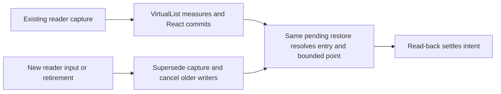

# Shared Transcript Reader Reflow Implementation Plan

> **For agentic workers:** REQUIRED SUB-SKILL: Use superpowers:subagent-driven-development (recommended) or superpowers:executing-plans to implement this plan task-by-task. Steps use checkbox (`- [ ]`) syntax for tracking.

**Goal:** Keep the same transcript entry and approximate reading point visible through width changes, without undoing newer reader input.

**Architecture:** Extend the existing shared reader's capture and `pendingRef`; do not add a manager, queue or Return-specific restore. VirtualList supplies one committed-layout handoff and cancels its older positioning. The retained read view supplies a small supersession counter across remounts.

**Tech Stack:** Existing React/TypeScript, TanStack react-virtual 3.14.7 / virtual-core 3.17.5, Vitest/Testing Library, and the existing real daemon/hub/production-SPA Chrome guard. No dependency change.

**Spec:** Approved external amendment [task4-shared-reader-scroll-design-amendment.md](../specs/2026-10-04-shared-transcript-reader-reflow-design.md), SHA256 `f75bf0065ebb9066af56c1f4535b5d53d42feede6d6fe0bd4a3a87ee477657ca`; approved routing spec `docs/superpowers/specs/2026-10-04-secondary-agent-cascade-design.md`, blob `b41235e09a5b9bf680cefc24e45eabcef5977eae`; inherited automatic-cascade contracts remain binding.

**Status:** Jesse approved revision `26ea67deb187b019155cf54bf5de8b38f35fb289afff19f3d9b5a8194767f9e7` for native execution on 2026-10-05. Written amendment approval and both independent spec reviews are complete. Implementation and behavior evidence remain unfinished. Original approved external bytes and sealed review inputs are retained; archival differences are approval status and evidence links only.

## Global Constraints

These routing requirements are copied verbatim from the original approved plan and remain in force:

- “The original center conversation stays mounted. One separate read-only agent cascade opens beside it.”
- “The change belongs in the browser workspace. It adds no backend method, provider behavior, shared-client subscription owner, native-app feature, or new retry loop.”
- “Explicit transcript links and Open conversation retain their existing meanings.”
- “The separate spine-status PR is held. This work authorizes no merge, deployment, or live-hub restart.”
- “Do not add a third group or move that origin to keep it mounted.”
- “Runtime Return and reuse bind to the original committed pane lifetime, not just its ID or ref.”
- “Subsequent removal cannot rebind it to a new pane. Retired locators must not become valid again through a later layout save/reload.”
- “Malformed or unavailable Return metadata must not discard a readable cascade or unrelated saved panes.”
- “Keep the existing Return behavior for already-saved cascades: Return restores their source view in that same pane. This includes in-place cascades that occupy the center and older secondary fallback cascades.”
- “Keep 52px ancestor spines, a 400px immediate-parent column, and a 440px minimum leaf. Horizontal overflow belongs to the cascade track.”
- “Phone Agents entry remains `openTranscript`.”
- “Image bytes and pending encodes remain lifetime-owned and stay out of layout JSON/localStorage. Page reload does not restore those bytes.”
- “Keep existing detached-continuation tests as detached tests; do not describe the newly mounted center journey as editor detachment.”

These approved amendment clauses also apply to every task:

- “Fixed-height VirtualList consumers and transcript previews keep their current behavior.”
- “Reader identity and lifetime distinguish independent same-ref panes.”
- “Use supported upstream APIs.”
- “Detecting changed width and then capturing already-reflowed boxes is too late.”
- “An entry no taller than the viewport lands at its start.”
- “Do not infer disappearance merely because virtualization has not mounted the target row.”
- “Ordinary display-only transitions retain their existing policy; overlapping width reflow uses the bounded policy above.”
- “No polling, arbitrary sleep or healthy-reader retry loop is added.”
- “DOM and virtual offsets agree within the pinned core's 1.5px read-back tolerance.”
- “The widget's existing 4px bottom threshold has a separate meaning and stays intact.”
- “A retired reader cannot write to a replacement, even with the same pane ID/ref.”
- “Reflow corrects scroll position only.”
- “Ordinary pure prepend, append and height settling outside width reflow keep their existing owners.”

Read `AGENTS.md`, `docs/product/README.md`, the Browser workspace row in `docs/product/subsystems.md`, `docs/product/session-activity.md`, `docs/web-ui/README.md` and `docs/developing-evener/testing.md` before execution. Keep provider fakes at the external LLM boundary and browser geometry seams outside production code. Never weaken console guards or classify a launch error as a behavioral RED.

## Review Focus

Each accepted nonblocking review hazard has owner-level tests below:

1. A shrink or a second resize displaces the row before capture: retain the last valid pre-reflow intent, not the intermediate position. Task A.
2. React commits estimates or a clamped write before the final measurement: keep intent until useful content, committed geometry and read-back agree. Task A.
3. New input arrives with semantic, widget-clamp and core-index writers outstanding: cancel all three, including across display changes and remounts. Task B, native interruption in Task C.
4. The entry folds, is virtualized out, or genuinely disappears: use the visible summary, mount the existing source target, or apply the existing preceding-message tie break respectively. Task A.
5. Same-ref readers, reader retirement and focus movement overlap reflow: isolate lifetimes, release subscriptions and never move editor/neighbor focus. Task B, native host proof in Task C.

---

## Accepted plan-review corrections

Jesse authorized revision of this external plan only. [The adjudication](file:///tmp/evener-sandbox-2768502204/agent-cascade-secondary-zAZ4cYoo/task59-plan-review-adjudication.md), SHA256 `b397da1a454d5a95d5933e4cb9b75b7275d78cc7f3f7a7fe360ad6f25d5d540e`, accepts five causal defects. The original reports remain at `local:034aNlSpoNg8lPrUG2JlQX`, displayed Turn 101, and `local:034aNmIzWAXplVP6GhZfOI`, displayed Turn 88. The reviewed 832-line plan is preserved in `/tmp/evener-sandbox-2768502204/task59-plan-review-eby6cjci/task4-shared-reader-native-plan.md`, SHA256 `d5c43c292fd82b39619942901c94f7d01a6347de633dc4addee2502b1f23eab2`. Do not overwrite that copy or its 1788-input manifest, SHA256 `ad907738965be2df298124ceda79b69b53f742b274d9813cd70e83bdc081bd41`.

Source paths below use the adjudication's exact `F` and `U` roots. The remedies are proposed mechanisms, not verified fixes. Each requires its stated behavioral RED/GREEN during approved execution.

| Accepted defect and original evidence | Correction and deciding check |
| --- | --- |
| Zero-delta measurements never enter the size cache: adjudication §1, P390–405/428–436, U/virtual-core/src/index.ts:1504–1524,1549–1598, F/src/panes/session/transcript/TranscriptBody.tsx:34,474–480. | Task A records actual measurement occurrence through `measureElement`, including 96px equal-estimate rows, and schedules the missing commit without manufacturing a cache entry. Equal-estimate rendered/overscan regressions retain the existing 96px fixtures. |
| Same-range resize never wakes React: adjudication §2, P387–437/444–470, U/virtual-core/src/index.ts:722–743,803–807,1549–1598, U/react-virtual/src/index.tsx:144–180,203–209, F/src/panes/session/transcript/flow/useTranscriptScroll.ts:1541–1562,1577–1583. | Task A delegates rectangle observation to the pinned public observer and requests a commit for changed dimensions. An idle same-range 152→352px, 400→500px viewport with unchanged 1600px entry must land at literal 825 without a synthetic rerender. |
| Capture transfer reads displaced boxes before pending is armed: adjudication §3, P444–470, F/src/panes/session/transcript/flow/useTranscriptScroll.ts:538–549, F/src/panes/session/transcript/transcriptReadView.ts:55–59, F/src/panes/session/transcript/flow/transcriptViewRegistry.ts:80–85,158–167. | Task A's registration capture selects original pending or last valid pre-reflow intent before any live read. Real unreadable/remount and display-transition transfers in that pre-arm window retain the source and literal 225 landing. |
| Cancellation clears backward direction and the movement interface is missing: adjudication §4, P139–144/421–426/525–540/613–634, F/src/panes/session/transcript/flow/useTranscriptScrollKeys.ts:67–70,95–120, F/src/widgets/virtuallist/index.tsx:170–179, U/virtual-core/src/index.ts:811–866,998–1055,1549–1598. | Task A supplies a movement read-back method distinct from cancellation. Task B routes actual before-offsets through the existing retained-view subscription. A backward key landing at 100 must survive held partial shrink after the absolute retarget settles and after observer idle publication. |
| Queued native observations do not witness outstanding positioning: adjudication §5, P693–736, U/virtual-core/src/index.ts:119–140,1504–1524, U/react-virtual/src/index.tsx:172–180,203–209. | Task C holds selected real row measurements, permits port/other observations, and requires a matched no-cancellation behavioral replay witness. A queue count alone cannot admit or pass an interruption scene. |

The core exports `measureElement`, `observeElementRect` and `observeElementOffset`; the pinned React package re-exports core. `TranscriptDetailControl.tsx:137–139` calls real `setLocal`; `stores/transcriptDisplay.ts:525–529` routes it through `stores/transcriptDisplay/transitions.ts:24–45` into the registry's capture-before-publication transition. These source facts support the planned seams. They establish neither cancellation correctness nor native timing.

## Resume boundary

Tasks 1–3 of `docs/superpowers/plans/2026-10-04-secondary-agent-cascade.md` are DONE at `0fcdd45bde`, `1125a1329e` and `3defe45027`. Do not replay them. This plan supplies three checked substeps for its unfinished Task 4. Keep its ledger and all existing rulings; add a separate ledger for this plan when execution is approved, and cross-reference the two.

Current frozen HEAD is `3defe45027cc2b0596fab421b22e60d671b5d2c9`. [The eleven-path manifest](file:///tmp/evener-sandbox-2768502204/agent-cascade-secondary-zAZ4cYoo/task4-scroll-ownership-frozen-blobs.json) remains authoritative until plan approval. The index is empty. Keep `cascade-spine-status` at `fe0a537d80533e6505bac96a98acb32cd428c53f` and `automatic-agent-cascade` at `e978ed43e635783407b77430ed3be4a5e2800b76`. No port-9180 operation, push or merge belongs to these tasks.

After approval, archive this plan at `docs/superpowers/plans/2026-10-04-shared-transcript-reader-reflow.md` and the approved amendment at `docs/superpowers/specs/2026-10-04-shared-transcript-reader-reflow-design.md`. Change only their local relative evidence links and historical status lines needed to describe approval; retain the original approved external bytes and hashes as evidence. Add a short link in the original plan's Task 4 to these checked substeps. Do not overwrite its completed task descriptions or execution ledger. Any consequential policy change requires Jesse's approval and affected spec re-review.

## File map

All source paths here are relative to `cmd/evener-hub/frontend/`; document and Go paths use the repository root.

| File | Bounded responsibility |
| --- | --- |
| `src/widgets/virtuallist/index.tsx` | Actual measurement provenance, rectangle/zero-delta commit wake-up, committed geometry, supported absolute positioning, older-write cancellation and signed movement read-back. No semantic entry policy. |
| `src/widgets/index.ts` | Export the one new committed-layout type. |
| `src/panes/session/transcript/flow/transcriptViewRegistry.ts` | Extend transient capture data only; keep existing registration/transition/remount maps. |
| `src/panes/session/transcript/flow/useTranscriptScroll.ts` | Extend existing entry capture and registration pending restore, reuse source/alias selection, admit newer input through the existing scroll policy. |
| `src/panes/session/transcript/TranscriptBody.tsx` | Pass the retained reader and wire one post-commit callback. Preserve the trailing-row count and preview path. |
| `src/panes/session/transcript/transcriptReadView.ts` | One supersession counter and transient signed movement through existing lifetime/listeners, no new owner or persisted target. |
| `src/panes/session/Session.tsx`, `src/panes/transcript/ReadOnlyThreadContent.tsx` | Pass the same retained view to the scroll hook and body; no per-pane reflow logic. |
| `src/panes/session/transcript/flow/useTranscriptScrollKeys.ts` | Supersede before the existing explicit top command; preserve focused-pane and actual-movement rules. |
| `src/widgets/virtuallist/virtuallist.test.tsx` | Real pinned-core commit/clamp/index controls. |
| `src/panes/session/transcript/transcriptAnchors.test.tsx` | Mounted real TranscriptBody reflow/fold/range/settlement proofs. |
| `src/panes/session/transcript/transcriptReadingGeometryTestUtils.ts` (new) | Only external DOM sizes, browser clamping and ResizeObserver delivery, never capture/restore policy. |
| `src/panes/session/transcript/flow/useTranscriptScroll.test.ts`, `flow/useTranscriptScrollKeys.test.tsx` | Existing gesture/key/pill/history controls plus newer-input cases. |
| `src/panes/session/transcript/transcriptReadView.test.ts`, `flow/transcriptViewRegistry.test.ts` | Real retained lifetime and remount-transfer controls. |
| `src/shell/activitybar/ActivitySidebar.test.tsx`, `src/panes/zoom/Zoom.test.tsx` | Actual Session/read-only/cascade wiring, independent readers and focus controls. |
| `scripts/cascadeguard/run.mjs`, `scripts/cascadeguard/README.md` | Preserve original native journey and add useful-entry/shared-width/interruption evidence. |
| `cmd/evener-hub/cascade_browser_test.go` | Keep independent delivery/recipient/mutation-ID proof; accurate required milestones only. |
| `docs/web-ui/README.md`, `docs/product/subsystems.md`, `docs/product/session-activity.md` | Verified current ownership, recovery and affected browser surfaces. |
| The two new archived design/plan paths and original plan above | Approved design and native execution record, only after freeze is lifted. |

No new production file, generalized restore service, second queue, new browser listener owner, shared-client change, source-text index, exact-word locator or persisted reflow state is planned. The test-only geometry helper is not an alternate scroll engine.



A supplies the reading intent; B supplies the geometry. C does not clear the capture merely because it wrote an offset. F invalidates the old operation; C can act again only on newer valid intent.

## Disposition of the eleven frozen paths

Keep every frozen edit while drafting and during the initial RED. None is permission to roll back existing work.

| Frozen path | Classification and execution disposition |
| --- | --- |
| `cmd/evener-hub/cascade_browser_test.go` | Preservation/proof: keep `mixed-mounted-image-return` and every independent provider assertion. |
| `scripts/cascadeguard/README.md` | Coverage correction: keep mounted-source versus detached-source distinction; finish verified scope/limits in Task C. |
| `scripts/cascadeguard/run.mjs` | Preservation/proof plus diagnostics: keep separate panel/footer scopes, exact DOM/editor identity, close-only Return, saved layout, strict row checks and native trace. Extend observations, never substitute an offset-equality check. |
| `src/panes/session/Session.tsx` | Preservation fix: keep source `focusSelector`; Task B adds shared-view wiring only. |
| `src/shell/activitybar/ActivitySidebar.test.tsx` | Preservation regression: keep exact editor identity/focus after Return. Add shared-reader scenarios. |
| `src/widgets/panescaffold/index.tsx` | Preservation fix: keep scoped editor focus and no unsolicited focus on ordinary activation. No reflow logic here. |
| `src/widgets/panescaffold/panescaffold.test.tsx` | Preservation regressions: retain editor-present/fallback and no-focus-stealing cases. |
| `src/widgets/virtuallist/index.tsx` | Physical experiments insufficient for the native contract, with valuable controls: retain fully-above backward adjustment and committed clamp replay. Add cancellation and post-commit handoff, never unconditional partial-row adjustment. |
| `src/widgets/virtuallist/virtuallist.test.tsx` | Keep six directional/end/start controls, batched clamping, newer native scroll and explicit-offset regressions. Extend real core-index cancellation. |
| `docs/product/session-activity.md` | Routing/preservation documentation, not passing reflow evidence yet. Finish ownership and coverage only after native GREEN. |
| `docs/product/subsystems.md` | Routing/authority documentation, not passing reflow evidence yet. Add shared-reader/geometry responsibilities after verification. |

If a real failing regression proves either frozen physical mechanism must be removed or replaced, stop for Jesse's explicit permission to discard that implementation. This plan proposes extending them, not deleting them.

## Task A: Existing reader remembers and restores the reading point

**Deliverable:** Width-only reflow works on a mounted TranscriptBody without invoking cascade entry, Return or a synthetic display transition.

**Files:** Modify `src/widgets/virtuallist/index.tsx`, `src/widgets/index.ts`, `src/panes/session/transcript/flow/transcriptViewRegistry.ts`, `src/panes/session/transcript/flow/useTranscriptScroll.ts` and `src/panes/session/transcript/TranscriptBody.tsx`. Extend `src/widgets/virtuallist/virtuallist.test.tsx` and `src/panes/session/transcript/transcriptAnchors.test.tsx`. Create only the external-geometry test helper `src/panes/session/transcript/transcriptReadingGeometryTestUtils.ts`. Archive the approved design/plan and link the original plan only after approval, as specified in the resume boundary.

**Interfaces, exact proposed additions:**

```ts
// src/widgets/virtuallist/index.tsx, re-export type from src/widgets/index.ts
export interface CommittedVirtualListLayout {
  readonly virtualizer: Virtualizer<HTMLDivElement, HTMLDivElement>;
  isCurrent(): boolean;
  scrollToOffset(offset: number): void;
  cancelPendingScroll(): void;
  syncReaderMovement(beforeOffset: number): void;
}
// VirtualListProps addition
onLayout?: (layout: CommittedVirtualListLayout) => void;

// CapturedTranscriptView additions, transient and never serialized
readonly readingPoint?: {
  readonly entryHeight: number;
  readonly viewportHeight: number;
  readonly viewportWidth: number;
};
readonly positioningRevision?: number;

// UseTranscriptViewRegistrationResult addition
restoreAfterLayout(layout: CommittedVirtualListLayout): void;

// Pure policy helper in the existing useTranscriptScroll.ts
export function readingPointOffset(
  captured: CapturedTranscriptView,
  entryHeight: number,
  viewportHeight: number,
): number;
```

Consume existing `captureTranscriptView`, `readAnchorPositions`, `topVisiblePosition`, `anchorFromCapture`, `restoreTopAnchor`, folded-member/source mappings, `listRef.scrollToIndex` and registration `pendingRef`. Keep `VirtualListHandle` unchanged. `restoreAfterMeasurement()` remains a notification hook for existing callers, but must not perform or settle reflow from uncommitted boxes. Task B adds the retained-reader validity fence to the same restore.

- [ ] **Step A1: Write a mounted width-only RED and literal policy controls.**

Add a new real-body test beside `transcriptAnchors.test.tsx:127–207`; keep that existing collapse/prepend regression intact. Use its real preview model, actual body, source rows and registry, not a mocked registration. Give `current-entry` a measured height of 1600, a 400px viewport, a 1000px tail, and a 152px width. Scroll backward to 900 after measuring the row. Change only external width to 352 and current entry height to 700. Do not invoke `restoreTranscriptView` or a transition to arm restoration.

Create `transcriptReadingGeometryTestUtils.ts` as an external browser-geometry fixture. This is the starting implementation, with no capture/restore imports:

```ts
export interface TranscriptTestGeometry {
  width: number;
  viewportHeight: number;
  rowHeights: readonly number[];
  entryBoxes?: Readonly<Record<string, { top: number; height: number }>>;
}

export function installTranscriptGeometry(
  geometryFor: (element: HTMLElement) => TranscriptTestGeometry,
): { notify(): void; restore(): void } {
  const prototype = HTMLElement.prototype;
  const saved = new Map<string, PropertyDescriptor | undefined>();
  const nativeRect = prototype.getBoundingClientRect;
  const nativeRects = prototype.getClientRects;
  const nativeObserver = Object.getOwnPropertyDescriptor(globalThis, "ResizeObserver");
  const offsets = new WeakMap<HTMLElement, number>();
  let active = true;
  const portFor = (element: HTMLElement): HTMLElement | undefined => {
    const child = element.closest('[data-testid="transcript-virtual-list"]')?.firstElementChild;
    return child instanceof HTMLElement ? child : undefined;
  };
  const rowFor = (element: HTMLElement) => element.closest<HTMLElement>("[data-index]");
  const rowHeight = (element: HTMLElement, port: HTMLElement) => {
    const index = rowFor(element)?.dataset.index;
    return index === undefined ? geometryFor(port).viewportHeight : (geometryFor(port).rowHeights[Number(index)] ?? 0);
  };
  const rectFor = (element: HTMLElement): DOMRect => {
    const port = portFor(element);
    if (!port) return nativeRect.call(element);
    const geometry = geometryFor(port);
    if (element === port) return new DOMRect(0, 0, geometry.width, geometry.viewportHeight);
    if (element === port.firstElementChild) return new DOMRect(0, -port.scrollTop, geometry.width,
      Number.parseFloat(element.style.height) || 0);
    const closed = element.closest("details:not([open])");
    const summary = closed?.querySelector(":scope > summary");
    if (closed && element !== closed && !summary?.contains(element)) return new DOMRect();
    const row = rowFor(element);
    if (!row) return nativeRect.call(element);
    const box = Object.entries(geometry.entryBoxes ?? {}).find(([selector]) => element.matches(selector))?.[1];
    const translation = Number.parseFloat(row.style.transform.match(/^translateY\(([-\d.]+)px\)$/)?.[1] ?? "0");
    return new DOMRect(0, translation + (box?.top ?? 0) - port.scrollTop,
      geometry.width, box?.height ?? rowHeight(element, port));
  };
  const replace = (key: string, descriptor: PropertyDescriptor) => {
    saved.set(key, Object.getOwnPropertyDescriptor(prototype, key));
    Object.defineProperty(prototype, key, { configurable: true, ...descriptor });
  };
  for (const key of ["offsetWidth", "clientWidth"]) replace(key, {
    get(this: HTMLElement) { const port = portFor(this); return port ? geometryFor(port).width : 0; },
  });
  for (const key of ["offsetHeight", "clientHeight"]) replace(key, {
    get(this: HTMLElement) { const port = portFor(this); return port ? rowHeight(this, port) : 0; },
  });
  replace("scrollHeight", { get(this: HTMLElement) {
    const port = portFor(this);
    return this === port ? Number.parseFloat(port.firstElementChild?.getAttribute("style")?.match(/height:\s*([-\d.]+)px/)?.[1] ?? "0") : 0;
  } });
  replace("scrollTop", {
    get(this: HTMLElement) { return Math.max(0, Math.min(offsets.get(this) ?? 0, Math.max(0, this.scrollHeight - this.clientHeight))); },
    set(this: HTMLElement, value: number) {
      const previous = this.scrollTop;
      offsets.set(this, Math.max(0, Math.min(value, Math.max(0, this.scrollHeight - this.clientHeight))));
      if (this.scrollTop !== previous) queueMicrotask(() => { if (active && this.isConnected) this.dispatchEvent(new Event("scroll")); });
    },
  });
  replace("scrollTo", { value(this: HTMLElement, optionsOrX: ScrollToOptions | number = {}, y?: number) {
    this.scrollTop = typeof optionsOrX === "number" ? (y ?? this.scrollTop) : (optionsOrX.top ?? this.scrollTop);
  } });
  replace("getBoundingClientRect", { value(this: HTMLElement) { return rectFor(this); } });
  replace("getClientRects", { value(this: HTMLElement) {
    if (!portFor(this)) return nativeRects.call(this);
    const rect = rectFor(this);
    const rects = rect.width > 0 && rect.height > 0 ? [rect] : [];
    return Object.assign(rects, { item: (index: number) => rects[index] ?? null });
  } });
  const observers = new Set<GeometryResizeObserver>();
  class GeometryResizeObserver implements ResizeObserver {
    readonly targets = new Set<Element>();
    constructor(readonly callback: ResizeObserverCallback) { observers.add(this); }
    observe(target: Element) { this.targets.add(target); }
    unobserve(target: Element) { this.targets.delete(target); }
    disconnect() { this.targets.clear(); observers.delete(this); }
  }
  Object.defineProperty(globalThis, "ResizeObserver", { configurable: true, writable: true, value: GeometryResizeObserver });
  return {
    notify() {
      for (const observer of [...observers]) {
        const entries: ResizeObserverEntry[] = [...observer.targets].flatMap(target => {
          if (!(target instanceof HTMLElement) || !target.isConnected) return [];
          const rect = rectFor(target);
          const size = [{ inlineSize: rect.width, blockSize: rect.height }];
          return [{ target, contentRect: rect, borderBoxSize: size, contentBoxSize: size, devicePixelContentBoxSize: size }];
        });
        if (entries.length > 0) observer.callback(entries, observer);
      }
    },
    restore() {
      active = false;
      for (const observer of [...observers]) observer.disconnect();
      for (const [key, descriptor] of saved) {
        if (descriptor) Object.defineProperty(prototype, key, descriptor);
        else Reflect.deleteProperty(prototype, key);
      }
      if (nativeObserver) Object.defineProperty(globalThis, "ResizeObserver", nativeObserver);
      else Reflect.deleteProperty(globalThis, "ResizeObserver");
    },
  };
}
```

Call `notify()` inside asynchronous `act` so normal scheduled scroll read-backs finish inside the test. The fixture supplies sizes and native-like clamping using the **actual committed** sizer/translation; it never selects a semantic restore target or computes expected offsets. `entryBoxes` supplies independent entry/summary rectangles when a row contains more than one entry. For multiple readers, `geometryFor(port)` resolves the enclosing test wrapper's `data-test-reader`, not session ref. Test pending measurements by withholding `notify` until the scene's release, not by changing core state. Restore descriptors/observers in `finally`; do not reuse this fixture for native proof.

The new test's behavioral core is below. Add `act` to the existing Testing Library import and import `installTranscriptGeometry` from `./transcriptReadingGeometryTestUtils`. Add the `readingPointOffset` import and policy cases only after the behavioral REDs in Steps A2 and A3, immediately before the helper implementation in Step A4; a nonexistent helper import must not prevent those owner tests from mounting.

```tsx
test.each([
  { label: "partial shrink", nextHeight: 700, nextViewport: 400, tailHeight: 1000, want: 225 },
  { label: "same-range unchanged rows", nextHeight: 1600, nextViewport: 500, tailHeight: 1000, want: 825 },
  { label: "equal-estimate overscan", nextHeight: 700, nextViewport: 400, tailHeight: 96, want: 225 },
])("width-only reflow preserves the current entry, $label", async ({ nextHeight, nextViewport, tailHeight, want }) => {
const geometry = { width: 152, viewportHeight: 400, rowHeights: [1600, tailHeight] };
const external = installTranscriptGeometry(() => geometry);
const listRef = createRef<VirtualListHandle>();
const row = (id: string): TurnModel => ({
  id, status: "completed",
  items: [{ id: `${id}-entry`, turnId: id, type: "userMessage", text: id, status: "completed" }],
});
const model = { ...makeTranscriptPreviewModel(), turns: [row("current"), row("tail")] };
try {
  const mounted = render(<TranscriptBody model={model}
    config={makeTranscriptDisplayConfig({ kind: "preset", level: "tools" })}
    surface="readOnly" disclosureScope="width-only" viewId="width-only" listRef={listRef} />);
  const port = listRef.current?.getScrollElement();
  if (!port) throw new Error("Real TranscriptBody has no scroll port");
  await act(async () => { external.notify(); port.scrollTop = 1000; fireEvent.scroll(port); });
  await act(async () => { port.scrollTop = 900; fireEvent.scroll(port); });
  const entry = port.querySelector<HTMLElement>('[data-view-anchor-id="current-entry"]');
  if (!entry) throw new Error("Real TranscriptBody has no current entry");
  expect(entry.getBoundingClientRect().top - port.getBoundingClientRect().top).toBe(-900);
  geometry.width = 352;
  geometry.viewportHeight = nextViewport;
  geometry.rowHeights = [nextHeight, tailHeight];
  await act(async () => external.notify());
  await waitFor(() => expect(port.scrollTop).toBe(want));
  expect(captureTranscriptView("width-only")).toMatchObject({ anchorId: "current-entry", anchorOffset: -want });
  expect(port.querySelector('[data-view-anchor-id="current-entry"]')?.textContent).toBe("current");
  mounted.unmount();
} finally {
  external.restore();
  resetTranscriptViewRegistryForTests();
}
});
```

Keep cleanup/strict console capture in the test file. If the text renderer includes normal accessible chrome, scope the text assertion to the actual message text node, without weakening the position assertions. This is external supplied geometry, not native proof.

In Step A4, after the behavioral REDs are recorded and before implementing the helper, add and run these literal policy cases. Name them `width-only` so the same targeted command reruns them with the mounted case. An absent helper export is an API RED only:

```ts
test.each([
  { oldHeight: 1600, oldOffset: -900, nextHeight: 1000, want: -450 },
  { oldHeight: 1600, oldOffset: -900, nextHeight: 700, want: -225 },
  { oldHeight: 1600, oldOffset: -900, nextHeight: 300, want: 0 },
  { oldHeight: 200, oldOffset: -20, nextHeight: 1000, want: 0 },
  { oldHeight: 1600, oldOffset: 30, nextHeight: 700, want: 30 },
])("width-only bounded reading point $oldOffset at $nextHeight", ({ oldHeight, oldOffset, nextHeight, want }) => {
  const captured = { anchorOffset: oldOffset, normalizedOffset: 0, followingBottom: false,
    readingPoint: { entryHeight: oldHeight, viewportHeight: 400, viewportWidth: 152 } };
  expect(readingPointOffset(captured, nextHeight, 400)).toBe(want);
});
```

Also pin the existing display-only offset with no `readingPoint`: `readingPointOffset({ anchorOffset: -900, normalizedOffset: 0, followingBottom: false }, 700, 400)` returns `-900`. The production width branch alone invokes the bounded policy; a display-only transition remains unchanged. A missing new helper is only an API RED. The mounted test's independently observed bad reading position is the required behavioral RED.

- [ ] **Step A2: Observe the behavioral RED before production edits.**

```sh
cd cmd/evener-hub/frontend
npx vitest run src/panes/session/transcript/transcriptAnchors.test.tsx -t 'width-only'
```

Expected: real reader position/entry fails because width alone does not arm semantic restoration. Import errors, unavailable layout APIs, missing geometry or a timeout before reader mount are invalid REDs. Save complete output and the actual position. Re-read the successful/failing native trace and upstream source before edits; record adjustment predicate, direction/cache/end state, commit/clamp/read-back evidence and unresolved callback attribution. Do not claim image release changed transcript content.

- [ ] **Step A3: Write and run the settlement, alias and older-writer REDs.**

Write these separate real-body cases before production edits. Run each new case and record the specified failing observation; existing preservation cases stay unchanged. Use literal read-backs:

| Case | Required result |
| --- | --- |
| Idle or cached-backward 1600→700 shrink | Same source entry, offset `-225`, physical `scrollTop=225`. |
| Real measured 96px row equals the transcript estimate, including overscan | Width-only 1600→700 scene still lands at `225`; do not change the 96px fixture or populate core caches manually. |
| Idle same-range resize, width 152→352 and viewport 400→500, entry remains 1600 | Physical `825`, same entry, no model update, scroll event or synthetic rerender to wake the handoff. |
| First equal-estimate measurement arrives from actual observer while sync measurement was skipped | The genuine zero-delta measurement schedules a commit and releases pending work; its absent cache key does not block the handoff. |
| Port becomes zero width, then recovers without range/row-size change | No zero-geometry settlement; real rectangle delivery wakes recovery automatically. |
| Width/boxes change, then real retained view becomes unreadable before any valid resized callback | Retained capture still identifies the original entry at `-900`; remount/measurement restores `225`, with original source/focus metadata. |
| Same pre-arm window, real display store performs capture-before-publication | Original capture survives the registry transfer; overlapping width restores `225`, not displaced live-box progress. |
| Width changes twice before target measures, final height 1000 | Original progress survives, final offset `-450`, not a newly captured intermediate fraction. |
| Intermediate zero row/viewport followed by valid 700/400 measurement | No successful settlement at zero; automatic later `225` landing. |
| Clamp before committed sizer and later relevant measurement | Capture remains original, useful entry returns; final physical/logical offsets agree. |
| Source row initially outside rendered range | Mount the known source row, then align measured content; do not select a nearest message prematurely. |
| Folded run or closed intent alias | Closed summary stays closed and visible; no hidden-anchor success or focus call. |
| Source removed with equally near earlier/later messages | Existing earlier-message tie break and feasible alignment. |
| 300px older row prepended during reflow | Physical landing `750` for the `-450` entry point; do not add the prepend delta twice. |
| Width unchanged, fully-above backward growth/shrink | Existing `1100`/`900` widget controls remain exact. |
| Width unchanged, backward partial row growth | Existing `250` protected offset remains exact. |
| Following end, ask/held trailing row, away-from-end append | Existing end/pill/error/demand results remain unchanged, with end intent never inferred from a clamp. |

Observe each new failure at the real owner before its implementation branch. Keep all frozen widget cases and existing display-only/focus/remount/history tests. Add widget tests showing the post-commit callback sees the actual sizer/translation and that a retained payload's `isCurrent()` rejects a newly invalidated DOM before another commit.

In `renderMeasuredList(true, true)`, capture the new payload through `onLayout` in addition to the existing real instance from `onChange`. Supply positive width and actual sizer/row rectangles externally. Hold only the real core's scheduled animation-frame callback while starting an index request, record the **actual** later rewrite in the no-cancellation RED, then admit a newer physical position of `1000`, call `cancelPendingScroll`, and release that same scheduled callback. Measure a row below the new viewport to force old-index reconciliation without introducing a legitimate above-row prepend/resize delta. Assert literal `scrollTop=1000` and the actual visible row/offset. No absent-method error counts as this RED: an absent cancellation callback leaves the real older request running so the position assertion decides it. Repeat with an already queued widget clamped record, and with an unchanged DOM offset/no native scroll event. Keep the existing native/explicit-clamp `1000` tests unchanged. If the supported cancellation strategy does not pass these real-core cases, stop here; Task A cannot commit a stub or pass an incomplete API to Task B.

Run the new cases through their actual owners before Step A4. In the real widget fixture, also establish a measured partially visible 1600px first row, hold its genuine 700px measurement, and create the older real index/absolute work. Move physically backward to `100`, cancel the older writer, then call the available `syncReaderMovement` with the recorded actual before-offset. Release the core's real scheduled retarget callback through its stable frame and its ordinary observer idle callback **before** releasing the held row measurement. Assert literal `100`, useful first-row content and DOM/core agreement. An absent method leaves the older work active so the position assertion, not an API error, decides the initial RED. After implementation, disable only the movement guard/read-back for a matched failure at `0`; cancellation alone must not be mistaken for direction preservation. Keep unchanged forward/fully-above/end/first-measurement controls, and add new-command and observer-disposal guard release checks.

```sh
cd cmd/evener-hub/frontend
npx vitest run src/widgets/virtuallist/virtuallist.test.tsx src/panes/session/transcript/transcriptAnchors.test.tsx
```

Expected: new reading-position, commit and cancellation assertions fail for the stated behavior. Missing payload methods are guarded in the test so old positioning runs and the position assertion decides the RED. Preserve complete output and distinguish passing pre-existing controls from new failures. Implement one confirmed behavior branch at a time in Step A4, rerunning that case after each change.

- [ ] **Step A4: Add one committed handoff and the bounded point policy.**

VirtualList's layout effect runs after upstream hook effects and its existing clamp replay. Put the validator in this widget and reuse it through `isCurrent`; do not duplicate it in the transcript reader. Import `measureElement`, `observeElementRect` and `observeElementOffset` from the existing pinned React package, and `useReducer` from React. Keep the fixed-list options unchanged. For readers supplying `onLayout`, add one local commit revision and actual measurement inventory:

```ts
const [, requestGeometryCommit] = useReducer((revision: number) => revision + 1, 0);
const measuredHeightsRef = useRef(new WeakMap<Element, number>());
const publishOffsetRef = useRef<((offset: number, isScrolling: boolean) => void) | null>(null);
const backwardMovementRef = useRef(false);

// Options added to the real useVirtualizer only when onLayout is supplied:
const geometryOptions = onLayout ? {
  measureElement: (node: HTMLDivElement, entry: ResizeObserverEntry | undefined,
    instance: Virtualizer<HTMLDivElement, HTMLDivElement>) => {
    const height = measureElement(node, entry, instance);
    const previous = measuredHeightsRef.current.get(node);
    measuredHeightsRef.current.set(node, height);
    if (previous !== height) requestGeometryCommit();
    return height;
  },
  observeElementRect: (instance: Virtualizer<HTMLDivElement, HTMLDivElement>,
    publish: (rect: { width: number; height: number }) => void) => {
    let previous: { width: number; height: number } | undefined;
    return observeElementRect(instance, rect => {
      const changed = !previous || previous.width !== rect.width || previous.height !== rect.height;
      previous = rect;
      publish(rect);
      if (changed) requestGeometryCommit();
    });
  },
  observeElementOffset: (instance: Virtualizer<HTMLDivElement, HTMLDivElement>,
    publish: (offset: number, isScrolling: boolean) => void) => {
    publishOffsetRef.current = publish;
    const dispose = observeElementOffset(instance, publish);
    return () => {
      if (publishOffsetRef.current === publish) publishOffsetRef.current = null;
      backwardMovementRef.current = false;
      dispose?.();
    };
  },
} : {};
// Spread geometryOptions into the existing useVirtualizer options.
```

The measurement adapter delegates the real measurement and records it even when its delta is zero. A newly observed value schedules a React commit; repeating the identical value does not. This also covers an initial observer measurement skipped by the core's synchronous user-scroll path. The rectangle adapter delegates core updates and cleanup, then supplies the missing same-range render. Zero/positive transitions remain observable. These callbacks never declare geometry committed, modify caches, perform semantic restoration or add timers.

```ts
function hasCommittedGeometry(
  instance: Virtualizer<HTMLDivElement, HTMLDivElement>,
  measured: WeakMap<Element, number>,
): boolean {
  const port = instance.scrollElement;
  const sizer = port?.firstElementChild;
  const rect = instance.scrollRect;
  if (!port || port.clientWidth <= 0 || port.clientHeight <= 0 || !rect || !(sizer instanceof HTMLElement)) return false;
  if (Math.abs(rect.width - port.clientWidth) > 1.5 || Math.abs(rect.height - port.clientHeight) > 1.5) return false;
  if (Math.abs(sizer.getBoundingClientRect().height - instance.getTotalSize()) > 1.5) return false;
  return instance.getVirtualItems().every(item => {
    const row = sizer.querySelector<HTMLElement>(`:scope > [data-index="${item.index}"]`);
    if (!row) return false;
    const observed = measured.get(row);
    const height = row.getBoundingClientRect().height;
    const translation = Number.parseFloat(row.style.transform.match(/^translateY\(([-\d.]+)px\)$/)?.[1] ?? "NaN");
    return observed !== undefined && observed > 0 && height > 0 &&
      Math.abs(observed - height) <= 1.5 && Math.abs(height - item.size) <= 1.5 &&
      Number.isFinite(translation) && Math.abs(translation - item.start) <= 1.5;
  });
}
```

A cache key is not measurement provenance: the pinned core inserts it only for a nonzero delta. Keep real measurement, current DOM/core rectangle and row sizes, translations and committed-sizer checks. An `onChange` notification or estimate alone is insufficient. The ensuing real render/measurement commit supplies the handoff; add no timer loop.

Task A implements **every** committed-payload method, including the movement bridge before Task B consumes it:

```ts
const cancelPendingScroll = () => {
  clampedScrollRef.current = null;
  backwardMovementRef.current = false;
  const port = scrollRef.current;
  if (!port) return;
  virtualizer.scrollToOffset(port.scrollTop, { align: "start", behavior: "auto" });
  publishOffsetRef.current?.(port.scrollTop, false);
};
const syncReaderMovement = (beforeOffset: number) => {
  const port = scrollRef.current;
  if (!port || !Number.isFinite(beforeOffset) || port.scrollTop === beforeOffset) return;
  const afterOffset = port.scrollTop;
  backwardMovementRef.current = afterOffset < beforeOffset;
  // Publish observations, not another command that could cancel a newer index target.
  publishOffsetRef.current?.(beforeOffset, false);
  publishOffsetRef.current?.(afterOffset, true);
};
useLayoutEffect(() => {
  if (!onLayout) return;
  const committedPort = scrollRef.current;
  const committed: CommittedVirtualListLayout = {
    virtualizer,
    isCurrent: () => scrollRef.current === committedPort && virtualizer.scrollElement === committedPort &&
      hasCommittedGeometry(virtualizer, measuredHeightsRef.current),
    scrollToOffset: offset => {
      backwardMovementRef.current = false;
      virtualizer.scrollToOffset(offset, { align: "start", behavior: "auto" });
    },
    cancelPendingScroll,
    syncReaderMovement,
  };
  if (committed.isCurrent()) {
    backwardMovementRef.current = false;
    onLayout(committed);
  }
});
```

Cancellation replaces the old index with the actual absolute DOM position and clears widget clamped replay, including when no native event follows. Movement is a separate, signed read-back of a classifier-admitted before/after pair. It performs no positioning command. In the existing `dynamic && anchorToEnd` predicate, retain the current logical `offset` calculation and use:

```ts
const backward = instance.scrollDirection === "backward" || backwardMovementRef.current;
return item.start < offset &&
  (!instance.itemSizeCache.has(item.key) || !backward || item.end <= offset);
// Existing handle, clear transient movement protection before a newer command:
scrollToIndex: (index, options) => {
  backwardMovementRef.current = false;
  virtualizer.scrollToIndex(index, options);
},
```

All existing fully-above, first-measurement and end controls remain. The temporary bit preserves genuine backward protection while geometry is uncommitted, including after the core's idle publication clears direction. It is overwritten by later genuine movement, cleared by a positioning command/cancellation, valid committed handoff or observer disposal, and never stores a semantic target or starts a restore.

This is an unverified candidate until the owning outstanding-index/clamp tests in Step A3 and movement tests below fail without it and pass with it. No private `scrollState`, private method, vendor edit or dependency change is permitted. If the supported mechanism fails, stop and report before another strategy.

Keep upstream range/measurement, 4px end following, pure keyed prepend and fixed-list behavior unchanged. Task B consumes this complete seam; it does not supply a temporary cancellation stub.

Capture the smallest existing visible semantic entry/summary crossing the viewport top and its measured dimensions at each valid committed layout. Add `readingPoint` while constructing the original `CapturedTranscriptView` object, retaining its existing WeakMap source/focus metadata. Include dimensions only for positive measured entry height and viewport width/height. When width first changes, arm the existing `pendingRef` from the **previous** capture before updating it. Add only `widthReflow: boolean` to the existing pending record to separate position-only width work from ordinary focus-restoring display work. A display transition that overlaps width marks that same pending record; it does not allocate another queue. Pending and pre-arm capture transfers preserve original intent: the real registry/retained-view capture path must use this branch before reading live boxes.

```ts
const capture = useCallback((): CapturedTranscriptView => {
  if (pendingRef.current) return pendingRef.current.captured;
  const currentOptions = optionsRef.current;
  const el = currentOptions.listRef?.current?.getScrollElement();
  const before = latestCaptureRef.current;
  const committed = committedLayoutRef.current;
  const valid = !!el && !!committed?.isCurrent() && committed.virtualizer.scrollElement === el;
  const changedWidth = !!el && before?.readingPoint !== undefined &&
    before.readingPoint.viewportWidth !== el.clientWidth;
  if (before && (!valid || changedWidth)) return before;
  if (!el || !valid) return { anchorOffset: 0, normalizedOffset: 0, followingBottom: false };
  const next = captureTranscriptView(el, currentOptions.measure, currentOptions.measureAnchors);
  latestCaptureRef.current = next;
  return next;
}, []);
```

The neutral first-mount fallback is not a measured reading point and cannot settle reflow. Task B tags genuine captures at their original construction with the retained revision and rejects stale captures before returning them. Never clone an old capture to give it a new revision or lose WeakMap metadata. The two pre-arm REDs change external width/boxes **before** delivering resized observations, then call the actual `view.setReadable(false)` or display store transition. Assert the original `anchorId`/`anchorOffset=-900` in the transferred capture and literal `225` after valid remount/reflow; a capture callback count is insufficient.

Retain `latestCaptureRef: CapturedTranscriptView | undefined` and `committedLayoutRef: CommittedVirtualListLayout | undefined` in the existing registration. Its capture-only scroll listener updates the first even when the visible range does not change and React does not render. This listener classifies no input and owns no new positioning policy:

```ts
const observeStablePosition = () => {
  const currentOptions = optionsRef.current;
  const el = currentOptions.listRef?.current?.getScrollElement();
  const committed = committedLayoutRef.current;
  if (!el || pendingRef.current || !committed?.isCurrent() || committed.virtualizer.scrollElement !== el) return;
  const previousWidth = latestCaptureRef.current?.readingPoint?.viewportWidth;
  if (previousWidth !== undefined && el.clientWidth !== previousWidth) return;
  latestCaptureRef.current = captureTranscriptView(el, currentOptions.measure, currentOptions.measureAnchors);
};
```

Install/remove that listener within this registration's existing mounted lifetime. Keep it active only for this port and enabled registration. A changed width blocks live recapture before a reflow restore is armed; it cannot poison the original reading point. Initialize `widthReflow: false` in both existing pending constructors, initial capture and `restore(captured)`. At the start of the committed callback, compare against **pending capture first**, so a remount can detect a width change before any new stable capture exists:

```ts
committedLayoutRef.current = layout;
const before = pendingRef.current?.captured ?? latestCaptureRef.current;
if (before?.readingPoint && before.readingPoint.viewportWidth !== el.clientWidth) {
  if (pendingRef.current) pendingRef.current.widthReflow = true;
  else pendingRef.current = { captured: before, scrollRequested: false, anchorRestored: false,
    focusScrollRequested: false, widthReflow: true };
}
```

This callback runs only for the current port and a payload whose `isCurrent()` succeeds. It then runs the existing target-resolution branch with that same payload. After successful settlement, refresh the latest capture. During pending work, actual scroll read-back may request revalidation with the stored payload **only when `isCurrent()` still succeeds**. Do not repeat an already-achieved write or poll. Task B clears both latest and pending captures on supersession and fences these callbacks.

The bounded helper lives in the existing `useTranscriptScroll.ts`:

```ts
export function readingPointOffset(
  captured: CapturedTranscriptView,
  entryHeight: number,
  viewportHeight: number,
): number {
  const point = captured.readingPoint;
  if (!point) return captured.anchorOffset;
  if (captured.anchorOffset > 0) return captured.anchorOffset;
  const oldDepth = Math.max(0, point.entryHeight - point.viewportHeight);
  const progress = oldDepth === 0 ? 0 : Math.max(0, Math.min(1, -captured.anchorOffset / oldDepth));
  const newDepth = Math.max(0, entryHeight - viewportHeight);
  return progress === 0 || newDepth === 0 ? 0 : -progress * newDepth;
}
```

Display-only restoration uses its existing offset, regardless of retained dimension metadata. Width restoration calls this helper only after resolving positive committed geometry. Never use later displaced rows to infer progress or following-bottom intent.

Reuse source/alias/nearest-message resolution. A closed alias uses `closedGroupSummary` for **visible geometry**, without opening or focusing it. Hidden inner anchors cannot settle a restore. A source entry in `anchorEntries` but outside the DOM triggers one existing `scrollToIndex` request and waits for committed measurement. A genuinely missing source uses the existing nearest message and preceding tie break, retaining its old pixel alignment bounded to that message's feasible reading depth, rather than treating an unrelated message as the original entry. If the equally near predecessor/successor are both 200px high in a 400px viewport, the predecessor lands at `0`. With no semantic candidate, use the existing bounded normalized transcript fallback. Zero-width/height or unmeasured geometry keeps pending work.

Apply the desired intra-entry offset through the committed payload. Retain pending until the resolved content-bearing entry/summary intersects the viewport, the feasible bounded alignment is achieved, actual sizer/row geometry matches core geometry, and DOM/core offsets differ by no more than 1.5px. End followers settle separately at the existing end/trailing row. Later measurement of an unsettled reflow recomputes from the original capture. At settlement, release pending state and update the latest committed capture. Reflow does not call focus restoration; pure display-only focus behavior remains unchanged.

In TranscriptBody, preserve `onMeasurementsChange` as measurement notification and add:

```tsx
onLayout={viewRegistration.restoreAfterLayout}
```

Preview rendering remains the existing nonvirtual path. The view-key effect may request restoration, but can complete it only against a validated committed payload.

- [ ] **Step A5: Check and commit the bounded reflow path.**

```sh
cd cmd/evener-hub/frontend
npx biome check --write src/widgets/virtuallist/index.tsx src/widgets/virtuallist/virtuallist.test.tsx src/widgets/index.ts src/panes/session/transcript/flow/transcriptViewRegistry.ts src/panes/session/transcript/flow/useTranscriptScroll.ts src/panes/session/transcript/TranscriptBody.tsx src/panes/session/transcript/transcriptAnchors.test.tsx src/panes/session/transcript/transcriptReadingGeometryTestUtils.ts
npx vitest run src/widgets/virtuallist/virtuallist.test.tsx src/panes/session/transcript/transcriptAnchors.test.tsx src/panes/session/transcript/TranscriptBody.test.tsx src/panes/session/transcript/flow/useTranscriptScroll.test.ts src/panes/session/transcript/flow/transcriptViewRegistry.test.ts
npm run typecheck
```

Expected: all owning cases pass without unasserted console output. Then run repository-root `make test-web`; read its complete output. Stage only these eight source/test paths and the approved archived design/plan/original-plan link paths. Read the staged diff, compare tested/staged blobs, and commit normally as `fix(web): preserve transcript reading point through width reflow`. Interruption is still Task B; native journey is still Task C. Record actual results, never planned counts.

## Task B: Newer input and retirement supersede every older writer

**Deliverable:** Real gestures/commands win over pending reflow, widget clamp replay and upstream index reconciliation across display changes, remounts and lifetime replacement.

**Files:** Modify `src/panes/session/transcript/flow/useTranscriptScroll.ts`, `src/panes/session/transcript/transcriptReadView.ts`, `src/panes/session/transcript/TranscriptBody.tsx`, `src/panes/session/Session.tsx`, `src/panes/transcript/ReadOnlyThreadContent.tsx` and `src/panes/session/transcript/flow/useTranscriptScrollKeys.ts`. Extend `src/panes/session/transcript/transcriptAnchors.test.tsx`, `src/panes/session/transcript/transcriptReadView.test.ts`, `src/panes/session/transcript/flow/useTranscriptScroll.test.ts`, `src/panes/session/transcript/flow/useTranscriptScrollKeys.test.tsx`, `src/panes/session/transcript/flow/transcriptViewRegistry.test.ts`, `src/shell/activitybar/ActivitySidebar.test.tsx` and `src/panes/zoom/Zoom.test.tsx`. Consume Task A's widget/helper without adding a second positioning mechanism. Preserve PaneScaffold focus code/tests.

**Interfaces:** Consume Task A's exact `CommittedVirtualListLayout`, `readingPoint` capture fields and `restoreAfterLayout`. Add:

```ts
// TranscriptReadView additions, using its existing listener set
readonly positioningRevision: number;
supersedePositioning(): void;
syncPositioningMovement(beforeOffset: number): void;
// Replace its existing subscribe signature; existing zero-argument listeners still work.
subscribe(listener: (beforeOffset?: number) => void): () => void;

// UseTranscriptViewRegistrationOptions and TranscriptBody props addition
readView?: TranscriptReadView;

// UseTranscriptScrollOptions additions
onReaderIntent?: () => void;
onReaderMovement?: (beforeOffset: number) => void;

// UseTranscriptScrollResult and UseTranscriptScrollKeysOptions.markGesture
markGesture: (readerIntent?: boolean, beforeOffset?: number) => void;

// UseTranscriptScrollKeysOptions addition
onPositioningCommand?: () => void;

// Existing semantic capture helper, fourth optional internal argument added
export function captureTranscriptView(
  el: HTMLElement,
  measure?: (element: HTMLElement) => ScrollMetrics,
  measureAnchors?: (element: HTMLElement) => ViewAnchorPosition[],
  positioningRevision?: number,
): CapturedTranscriptView;
```

These are internal browser interfaces, not new layout/version compatibility policy. No saved-layout field, global map or client subscription changes. For mounted host production captures, stamp the retained view's current revision while creating the original capture object, preserving its existing WeakMap metadata.

- [ ] **Step B1: Write real retained-owner and outstanding-index REDs.**

Add this to the existing real-store `transcriptReadView.test.ts`:

```ts
test("newer reader input clears and invalidates the retained capture", () => {
  const pane: OpenPaneRecord = { id: "pane", type: "transcript", params: { ref: "root" }, slot: "main" };
  workspaceStore.setState({ panes: [pane] });
  const view = retainedTranscriptReadView(conversationPaneLifetime(pane), "root", "transcript");
  const revision = view.positioningRevision ?? 0;
  const captured = { anchorId: "current-entry", anchorOffset: -900, normalizedOffset: 0.3,
    followingBottom: false, positioningRevision: revision };
  view.setCapture(captured);
  view.supersedePositioning?.();
  expect(view.getCapture()).toBeUndefined();
  expect(view.positioningRevision).toBe(revision + 1);
  view.setCapture(captured);
  expect(view.getCapture()).toBeUndefined();
});
```

Missing method errors alone are not the interruption RED. In the mounted real body, hold external target measurements during reflow, deliver a genuine admitted wheel/touch/key command through the real shared hook, then release measurement and remount the same retained view. Assert the user's literal position, not callback counts. Re-deliver the old captured transition object after supersession and verify it cannot write or focus.

Task A already owns the actual outstanding-index, clamped-replay and no-scroll-event cancellation tests. Here reproduce the same older writers through genuine hook/host admission rather than calling the widget cancel method directly. The exact `1000` widget controls remain required; the semantic test's literal newer position is `100` in the first entry, with no above-row delta.

Write and run these real-owner cases before Steps B2 and B3. Each must fail at its stated behavior assertion before its branch is implemented:

| Case | Required observation |
| --- | --- |
| Pending 1600→700 reflow, meaningful wheel or vertical touch, new position 100 | Later measure/remount leaves `100`, not stale `225` or an old index target. |
| Pending work, actual scrollbar/selection autoscroll to 100 | User movement wins; selection without movement does not cancel. |
| Explicit top or Jump to live while old index/clamp work waits | New command target wins; existing independent older-history cancellation remains exact. |
| Later display change after supersession | Old prepared capture cannot return; new display capture uses the newer position. |
| Pure Tab, editor typing, modifiers, horizontal/ctrl wheel, nested scroll, edge-only key | No semantic supersession or focus theft; original gesture/pill rules remain intact. |
| Composer/inspector/neighbor focused during reflow | Same actual focused element and editor selection afterwards. |
| Source close/reset/replacement while measurements wait | No old writes/focus on the fresh same-ID/ref lifetime; owned observers/subscriptions release. |
| Two mounted same-ref retained readers at different positions | Resize or retire one without moving/canceling the other. |
| Real ordinary Session, read-only host and cascade column | Same shared policy works without Return; actual host callbacks are exercised, not mocked hook behavior. |

For the host cases, extend the real JourneyPane in `ActivitySidebar.test.tsx` and real `Zoom.test.tsx` columns using the external geometry utility. Ordinary read-only content uses the existing retained view. Keep source drafts/atoms/images, original editor nodes and independent history recovery tests unchanged. Do not replace the mocked trailing-row hook test and call it new real-owner evidence; the added body/host tests must execute real registration.

- [ ] **Step B2: Cancel through supported public seams, then fence the same pending restore.**

Implement a counter in `retainedTranscriptReadView` beside its existing capture. Replace the existing listener set and `publish` closure in place with the typed versions below, then insert the methods in its current view object. Do not allocate a second listener set:

```ts
// Closure fields beside the current capture variable:
let positioningRevision = 0;
const listeners = new Set<(beforeOffset?: number) => void>();
const publish = (beforeOffset?: number) => {
  for (const listener of listeners) listener(beforeOffset);
};
// Existing view object additions:
get positioningRevision() { return positioningRevision; },
supersedePositioning() {
  if (!alive) return;
  positioningRevision += 1;
  capture = undefined;
  publish();
},
syncPositioningMovement(beforeOffset) {
  if (!alive || !Number.isFinite(beforeOffset)) return;
  publish(beforeOffset);
},
```

Disposal increments the counter, clears capture, then publishes and releases listeners through its existing path. No-op after retirement. Independent views have independent counters. In `setCapture`, reject a tagged revision different from this view's current revision; retain the existing untagged explicit test-capture behavior. Production registration captures are always tagged, at original object construction, so WeakMap source/focus metadata survives.

Pass this same retained view to actual host scroll policy and TranscriptBody. Subscribe in the existing registration and compare the counter/alive state before acting; a normal readability notification must not cancel positioning. On supersession/retirement clear **both** its pending restore and last stable capture, call Task A's `committedLayoutRef.current?.cancelPendingScroll()`, and fence delayed callbacks by exact view identity, port, alive state and revision. Methods may cancel/synchronize an invalid old geometry payload belonging to the same live port; invalid geometry forbids restoration, not cancellation. Validate the initial remount capture and every supplied display capture before setting `pendingRef`; an old object cannot acquire a newer stamp. Unsubscribe/remove the capture-only listener on unmount. Retiring one reader leaves another same-ref reader usable.

In that **same subscription**, a finite `beforeOffset` at the unchanged current revision invokes `committedLayoutRef.current?.syncReaderMovement(beforeOffset)` for the exact live port, then permits stable recapture only if `isCurrent()` succeeds. A counter/alive change takes the cancellation branch first and cannot be mistaken for movement. Movement publication changes no counter, creates no pending restore, and cannot restart old semantic work. Use this route rather than cancellation to synchronize after a key/gesture; the core's `isScrolling=false` cancellation publication clears its direction.

After each classifier-admitted native movement, deliver the actual pre-movement offset through `onReaderMovement` before future stable captures. Never read a displaced virtual offset as its before value. Preserve ordinary above-row/prepend compensation and end following. A new explicit command runs cancellation **before** its new `scrollToIndex`/live-end target; its later landing sends no movement event and must not be canceled again.

Add a real keyboard RED with a measured 1600px partially visible first entry, new physical point `100`, and 700px shrink held. Capture the actual pre-key DOM offset, invoke the genuine focused keybinding, and admit that before/after pair. Let the core's actual absolute retarget reconcile through its stable frame and its ordinary idle observer publication before releasing measurement. Require `100`, the same useful entry, and actual DOM/core agreement after release. The matched version with movement synchronization disabled must expose the `100 - 900 → 0` compensation. Also test forward movement replacing the guard, a new index command clearing it, fully-above backward growth/shrink, first measurements and independent readers. Task A adds the corresponding direct widget-method test before its implementation, so Task B never inherits an untested/stubbed seam. Hold/release real scheduled callbacks in supplied-geometry tests; do not set core direction or private request fields.

- [ ] **Step B3: Connect genuine intent without broad input cancellation.**

Reuse current `verticalInputCanMovePort`, wheel/touch handling and actual-movement key rules. Add `onReaderIntent` to real wheel/touch admission and actual keyboard movement. The existing bottom-hold marker is broader for mouse selection, so `continuePointerDrag` keeps `markGesture(false)`; only a real pointer/autoscroll-caused viewport movement supersedes reflow. A selection drag without scrolling does not. Track the admitted gesture's actual starting DOM offset inside this existing classifier. In `handleScroll`, compare the classified movement with that before-offset before updating its baseline, invoke supersession if not already admitted, then `onReaderMovement(beforeOffset)`. Reflow/command echoes and geometry-only offsets send neither callback. A keyboard write supplies its before value synchronously, rather than relying on a later same-offset echo.

Wire hosts with the same retained view:

```tsx
// Existing useTranscriptScroll options in Session and ReadOnlyThreadContent
onReaderIntent: readView?.supersedePositioning,
onReaderMovement: readView?.syncPositioningMovement,
// Existing TranscriptBody props in those hosts
readView={readView}
// Session's existing useTranscriptScrollKeys options
onPositioningCommand: readView?.supersedePositioning,
```

At every existing line/page key handler, preserve admission and the current boolean `scrollPortBy` helper. Supply the actual before-offset only after a real movement:

```ts
const beforeOffset = el.scrollTop;
if (scrollPortBy(el, -TRANSCRIPT_LINE_SCROLL_PX)) {
  markGestureRef.current(true, beforeOffset);
}
// Use the handler's existing signed line/page delta in its corresponding branch.
```

Extend `markGesture` with the two optional arguments declared above. `readerIntent=false` performs only its existing bottom-hold marking. A genuine immediate key movement calls `onReaderIntent` first, then `onReaderMovement(beforeOffset)` in the same task; the later raw scroll event must not supersede or synchronize that same pair again. Wheel/touch admission with no immediate movement records its actual DOM baseline and uses the real subsequent classified scroll read-back. Keep this transient classifier state in the existing hook, not in a new listener owner.

`ReadOnlyThreadContent`'s existing variable is named `view`; use `view.supersedePositioning` and `readView={view}` there. Do not invent a second host-owned reader. In `jumpToBottom`, supersede before the existing error/live target and preserve `cancelOlder` behavior. For `transcriptScrollTop`, invoke `onPositioningCommand` before `list.scrollToIndex(0, ...)`. Clear the scroll hook's older `pendingViewAnchorRef` on genuine supersession too; its legacy display helper has no production capture callers and must not become a second width-reflow path.

Native scroll-navigation keys targeting this viewport use the same admission: ArrowUp/Down, PageUp/Down and Home/End, only when they can move this port and are not prevented or editing a control. Keep focused-pane dispatch, no registration at phone width, modifiers/Tab/editor typing and nested-scroller/edge-only controls. A reflow/programmatic scroll event is not a gesture. Do not wire the callback to every pointer move, every key, or every raw scroll event.

- [ ] **Step B4: Verify interruption, remount, focus and host controls.**

```sh
cd cmd/evener-hub/frontend
npx vitest run src/panes/session/transcript/transcriptAnchors.test.tsx src/panes/session/transcript/transcriptReadView.test.ts src/panes/session/transcript/flow/useTranscriptScroll.test.ts src/panes/session/transcript/flow/useTranscriptScrollKeys.test.tsx src/panes/session/transcript/flow/transcriptViewRegistry.test.ts src/shell/activitybar/ActivitySidebar.test.tsx src/panes/zoom/Zoom.test.tsx
```

Expected: every Step B1 RED now passes, including literal newer positions, stale-capture rejection, independent readers and real host focus. Preserve existing gesture, pill, bottom, history and editor controls. A missing API or unmounted host is not behavior evidence.

- [ ] **Step B5: Run the full owning suite and commit shared cancellation.**

```sh
cd cmd/evener-hub/frontend
npx vitest run src/widgets/virtuallist/virtuallist.test.tsx src/widgets/panescaffold/panescaffold.test.tsx src/panes/session/transcript/transcriptAnchors.test.tsx src/panes/session/transcript/TranscriptBody.test.tsx src/panes/session/transcript/flow/useTranscriptScroll.test.ts src/panes/session/transcript/flow/useTranscriptScrollKeys.test.tsx src/panes/session/transcript/flow/transcriptViewRegistry.test.ts src/panes/session/transcript/transcriptReadView.test.ts src/panes/session/transcript/useTranscript.test.ts src/panes/session/composer/sourceState.test.ts src/shell/activitybar/ActivitySidebar.test.tsx src/panes/zoom/Zoom.test.tsx src/stores/threads.history.test.ts
npm run typecheck
```

Expected: new interruption/lifetime/host cases and every preservation control pass. Run pinned Biome autofix from the frontend on the exact Task B paths changed, then repository-root `make test-web`. Stage only those named Task B source/test files, read the complete staged diff and compare tested blobs. Commit normally as `fix(web): let newer reader input supersede pending positioning`. Record the real core cancellation result and complete gate output; do not claim native GREEN yet.

## Task C: Original native journey, shared-width proof and evergreen contracts

**Deliverable:** The original failed Return scene passes unchanged; shared readers and newer native input also work outside Return; every original source/navigation/delivery assertion remains.

**Files:** `scripts/cascadeguard/run.mjs`, its README, `cmd/evener-hub/cascade_browser_test.go`, and the three evergreen documentation paths in the file map. Original approved Task 4 controls remain required.

**Interfaces:** Consume the existing real six-edge producer, stdin fixture, production SPA, native `Driver`, `read`, `wait`, `sourceAnchor`, `returnToSource`, source DOM/layout helpers, browser artifact writer and independent Go provider observations. Produce no fake RPC or seeded frontend state. Add only observational helpers to the existing native driver.

- [ ] **Step C1: Keep the original RED and add useful-content observations.**

The preserved failure is pending-image Return, `turn_m31`→`turn_m32`, with source width `152`→`352`, entry height `12853.140625`→`7036.171875`, within-entry offset `7394`, and selected row bottom `-357.828125` relative to the viewport. Success and failure share row start/height changes; the precise callback attribution remains unproved. Preserve the strict equality at `returnToSource`, including the pending-image input/release sequence and sourceAnchor's first-intersecting-row definition.

Before this Return, independently observe the selected `[data-view-anchor-id]`, its source row and port rectangles. After Return require the same source row, resolved semantic entry/visible alias, feasible proportional continuity and visible **actual text content**. Use DOM Range client rectangles over nonblank text nodes inside the selected entry/summary, intersected with the viewport. A generic container rectangle, diagnostic equality, updated expected row or screenshot alone is insufficient.

Use the observer only to read:

```js
const visibleTextInEntry = (node, viewport) => {
  const walker = document.createTreeWalker(node, NodeFilter.SHOW_TEXT);
  let text;
  while ((text = walker.nextNode())) {
    if (!text.textContent?.trim()) continue;
    const range = document.createRange();
    range.selectNodeContents(text);
    if ([...range.getClientRects()].some(rect => rect.width > 0 && rect.height > 0 &&
      rect.bottom > viewport.top && rect.top < viewport.bottom &&
      rect.right > viewport.left && rect.left < viewport.right)) return true;
  }
  return false;
};
```

Place this inside the existing page-read expression, not a production renderer. Measure old/new dimensions independently from the browser; never import `readingPointOffset` as the oracle. Keep the literal owner-level `225`/`450` assertions from Task A alongside native continuity, where real text sizes vary.

- [ ] **Step C2: Add native width-only and newer-input proof without changing producers.**

With the ordinary source reader away from the end, resize using the existing `Emulation.setDeviceMetricsOverride` path while no inspector opens/closes. Require the same entry and useful content after geometry settles. Repeat for a real read-only cascade reader and at phone width, retaining the existing 390×844 and 1000×900 phone/desktop scenes. Do not introduce native-app behavior or desktop columns on phone.

For native interruption, install the observational ResizeObserver wrapper **after `driver.start()` and before the first `navigateTo(driver.page, fixture.url)`** through the same supported preload seam already used by the guard. It defaults to pass-through and must never hold the original pending-image Return. Retain genuine ResizeObserver entries/callbacks and native observation; do not synthesize measurements or replace the transcript/list implementation:

In `run.mjs` declare `let measurementScriptId;` beside the existing driver state, outside the startup `try`. Install and record it inside that `try`:

```js
const measurementScript = await driver.send("Page.addScriptToEvaluateOnNewDocument", { source: `(() => {
  const Native = window.ResizeObserver;
  const state = window.__cascadeMeasurements = {
    Native, port: null, row: null, queued: [],
    release() {
      this.port = null;
      this.row = null;
      const pending = this.queued.splice(0);
      for (const { callback, entries, observer } of pending) {
        const connected = entries.filter(entry => entry.target.isConnected);
        if (connected.length) callback(connected, observer);
      }
    }
  };
  window.ResizeObserver = class extends Native {
    constructor(callback) {
      super((entries, observer) => {
        const held = entries.filter(entry => state.port && state.row &&
          state.row.isConnected && state.port.contains(state.row) && entry.target === state.row);
        const immediate = entries.filter(entry => !held.includes(entry));
        if (immediate.length) callback(immediate, observer);
        if (held.length) state.queued.push({ callback, entries: held, observer });
      });
    }
    unobserve(target) {
      for (const pending of state.queued) pending.entries = pending.entries.filter(entry => entry.target !== target);
      state.queued = state.queued.filter(pending => pending.entries.length > 0);
      super.unobserve(target);
    }
    disconnect() {
      state.queued = state.queued.filter(pending => pending.observer !== this);
      super.disconnect();
    }
  };
})()` });
measurementScriptId = measurementScript.result.identifier;
```

Add the interruption scenes after the original strict Return and delivery checks, leaving both unheld. The wrapper now holds only the selected connected virtual row; port and neighboring observations pass through. A synchronous row measurement can bypass an observer hold. Therefore neither changed geometry, a display click, a rendered commit nor `queued.length > 0` is evidence that older positioning remains outstanding.

Use the real source pane's menu span `[data-session-actions-ref]` scoped by `driver.paneScopeExpr(fixture.rootRef)` and its enclosing button. Native-click its measured midpoint, then the visible `Verbosity…` menu item. `TranscriptDetailControl` routes its actual `Chat`/`Tools` choices to capture-before-publish `setLocal`; the unchanged producer's user/assistant messages survive both presets. Pre-open the real dialog before enabling any hold. Record the selected source entry/row, offset, dimensions and useful text before changing width. Set the wrapper's `port` and `row` to those **actual DOM nodes**, change width with the existing native device-metrics command, and native-click the other real preset. Escape closes the dialog before input reaches the port. This is a proposed way to prepare a display/width restore before the remaining row measurement; the preset click is not itself an outstanding-work witness. Do not call registry/retained methods, expose pending state or seed an old capture from browser evaluation.

Read source intent independently with this observational expression beside `sourceAnchorExpr`; keep its original first-intersecting-row definition unchanged:

```js
const interruptionPointExpr = `(() => {
  const port = ${driver.paneScopeExpr(fixture.rootRef)}?.querySelector('[data-testid="transcript-virtual-list"] > div');
  if (!port) return null;
  const bounds = port.getBoundingClientRect();
  if (bounds.width <= 0 || bounds.height <= 0) return null;
  const entries = [...port.querySelectorAll('[data-view-anchor-id]')].filter(node => {
    const rect = node.getBoundingClientRect();
    return node.getClientRects().length > 0 && rect.width > 0 && rect.height > 0 &&
      rect.bottom > bounds.top && rect.top < bounds.bottom;
  });
  const crossing = entries.filter(node => node.getBoundingClientRect().top <= bounds.top);
  const candidates = crossing.length > 0 ? crossing : entries;
  const entry = candidates.find(node => !candidates.some(other => other !== node && node.contains(other))) ?? candidates[0];
  if (!entry) return null;
  const box = entry.getBoundingClientRect();
  const walker = document.createTreeWalker(entry, NodeFilter.SHOW_TEXT);
  let useful = false;
  let text;
  while ((text = walker.nextNode())) {
    if (!text.textContent?.trim()) continue;
    const range = document.createRange();
    range.selectNodeContents(text);
    if ([...range.getClientRects()].some(rect => rect.width > 0 && rect.height > 0 &&
      rect.bottom > bounds.top && rect.top < bounds.bottom &&
      rect.right > bounds.left && rect.left < bounds.right)) { useful = true; break; }
  }
  return { entry: entry.dataset.viewAnchorId, row: entry.closest('[data-row-id]')?.dataset.rowId,
    offset: box.top - bounds.top, height: box.height, viewport: bounds.height,
    width: bounds.width, scrollTop: port.scrollTop, useful };
})()`;
```

Before input, require a connected held target and queued **genuine target entries**, positive current DOM dimensions, the independently observed pre-trigger point and a prepared point distinguishable from the planned newer point. Native wheel uses `Input.dispatchMouseEvent`, `type: "mouseWheel"`, `deltaX: 0`, a meaningful vertical delta and the measured port midpoint. Observe its actual new semantic point/useful text. If it does not move this port or distinguish the old/new point, the scene is invalid, not a pass. Release in `finally` and require the same newer entry and feasible local alignment after all genuine callbacks settle; no stale target may return. Absolute pixels may change with legitimate above-row compensation, so compare content-local alignment too.

**Deciding outstanding-work witness:** Run the identical completed native scene against a temporary mutation of only the newly added `TranscriptReadView.supersedePositioning` cancellation body, leaving actual input admission, signed movement synchronization, rendering and geometry observers intact. The negative run must reach the same connected-target/pre-input DOM checkpoint, admit the same genuine movement, and then visibly replay the obsolete pre-trigger entry/alignment when held observations release. Preserve before/after/release point artifacts and complete failure output. A timeout, missing queue, invalid target, launch error, original Return failure or generic displacement is not this witness. The negative must fail specifically on stale replay after admitted input; the restored implementation must pass that same assertion. Preserve and compare exact owned file bytes before/after the test mutation; leave no mutation in the delivered code. These are prescribed counterfactual runs, not a search for a lucky successful run. No producer, deadline, original assertion or browser-store change is allowed.

That matched replay proves older positioning was still consequential at the input checkpoint; it is the scene's gate, not a guessed internal pending flag. If synchronous measurements settle work too early, or the no-cancellation run also passes, **stop Task C and report the missing outstanding phase**. Do not count the interruption milestone, weaken the witness, start a healthy-reader retry loop or claim cancellation proved. The setup's feasibility remains unverified until this comparison. Task A/B separately exercise actual semantic, clamped and index writers, so this native scene cannot substitute for any of their owner-level cases.

Repeat the selective-hold preparation for a native click on the real source pane's `[data-testid="new-content-pill"]`, using its measured midpoint and existing `driver.clickAt`. Require the pill to exist through actual current reader state; never seed it. The matched cancellation-negative run must replay older positioning after the new live/error target, and the positive must retain the real current command result. Top-command binding remains independently pinned in Task B. Restore the preset and dimensions through actual UI/native metrics before the existing phone scenes. Keep unit zero-size, touch/scrollbar, lifecycle and all negative-input controls; desktop Chrome does not establish iOS/Safari behavior.

In the guard's outer `finally`, nest measurement cleanup around the existing artifact writes and guarantee driver teardown even if either fails:

```js
try {
  if (measurementScriptId) {
    try {
      await read("(() => { const state = window.__cascadeMeasurements; if (!state) return; state.release(); window.ResizeObserver = state.Native; delete window.__cascadeMeasurements; })()");
    } finally {
      await driver.send("Page.removeScriptToEvaluateOnNewDocument", { identifier: measurementScriptId });
    }
  }
} finally {
  try {
    writeFileSync(path.join(fixture.artifactDir, "console.json"), JSON.stringify(consoleEvents, null, 2));
    writeFileSync(path.join(fixture.artifactDir, "rpc-frames.json"), JSON.stringify(frames, null, 2));
    if (driver.page) writeFileSync(path.join(fixture.artifactDir, "source-scroll-trace.json"), JSON.stringify(await read('window.__cascadeSourceTrace ?? []'), null, 2));
  } finally {
    await driver.stop();
  }
}
```

Inspect queued state after scene release and preserve empty-console/native-input artifacts. Cleanup failures remain failures. No added reload, producer change or seeded client state is needed.

Use native input and existing structured waits. No arbitrary sleep, widened timeout, repeated successful-run search, protected-lane edits or frontend-store seeding. If a launch fails, diagnose the launch and rerun; it is not behavioral evidence. Remove only new unnecessary diagnostic verbosity after proof, keeping the archived original trace.

- [ ] **Step C3: Preserve the entire routing/delivery journey and run every original gate.**

Keep the original Task 4 coverage, now scoped to its actual source versus inspector:

- Exact original source record/lifetime/DOM/editor and draft, catalog selections, UTF-16 atoms, PNG bytes and pending encode/delivery identity.
- Separate inspector ID/group, repeated root/nested/ancestor drill, pop/peeks, two readable scopes/five spines and selected-leaf footer/sidebar.
- No input/control RPC from inspection; exact recipient/count/mutation ID independently asserted by the real Go provider.
- Close-only Return, exact source keyboard focus, no replacement transcript, unrelated params/order/group, actual debounced inspector removal and source retention.
- Reload with held real ancestry/location replies, valid saved focus, restored Return, missing/reused-origin controls and the approved old saved-layout policy.
- Existing 52/400/440 geometry and 398.5/439.5 painted minima, independent scrolling/text selection/keyboard/Tasks/Escape/reduced-motion/narrow-leaf reveal.
- Direct paging/reconnect and closed-peek demand release on an ancestor with no independent holder; center root demand remains legitimate.
- Existing phone Agents plain-transcript entry and restored selected-leaf/Return, with no persistence claim for old image bytes/DOM across reload.
- Genuine detached-source unit controls remain detached; browser mounted-image milestone remains `mixed-mounted-image-return`.

Read `make help`, invoked Makefile targets/preflight/scripts and Go fixture before running these repository-root commands:

```sh
make test-web
make build-web
go test -tags browserguard ./cmd/evener-hub -run '^TestAgentCascadeBrowser$' -count=1 -v
BROWSER_GUARD_CONCURRENCY=4 make test-web-browser
make vet
```

Expected: full frontend gate, fresh production build, actual real-stack cascade native cases, all browser guards and vet exit zero with no unasserted errors. Preserve existing frontend Node-script, typecheck and Biome gates. Preflight may repair a real stale install only after approval; never run `npm ci` through a symlink or upgrade the lockfile. The fixture owns isolated daemon/hub/Chrome startup and teardown; do not operate the live hub.

Read every complete output, actual milestone JSON, console, source-scroll trace, layout, useful-content/geometry/paint and trusted input artifact. Keep report-linked evidence under owned scratch with SHA manifests. Original RED plus final GREEN must use the unchanged strict row oracle; passing unit tests or DOM/core equality cannot substitute. CI remains the source of truth for the complete repository suite after the authorized PR push.

- [ ] **Step C4: Publish only verified evergreen ownership and commit evidence paths.**

After native GREEN, update `docs/web-ui/README.md` near its transcript section with this current contract:

> Browser transcript readers retain the visible source entry and approximate progress through its usable reading depth across width changes. The existing transcript registration owns that intent; VirtualList owns measurement and committed geometry. Restoration waits for useful committed content and scroll read-back. Newer viewport scrolling or an explicit positioning command supersedes older work. Reflow preserves editor and neighboring-pane focus. End following, keyed older-page prepend and history recovery keep their existing owners.

Update the Browser workspace subsystem row with the same boundary and `transcriptReadView` lifetime/supersession owner. Finish the frozen session-activity edits: secondary placement/Return/origin retirement/saved focus remain as approved; add shared-reader continuity and newer-input precedence across ordinary, read-only and cascade browser readers. Keep the current inactive-secondary rule and old saved-layout compatibility boundary.

In the cascade guard README, describe actual mounted-source/scoped inspector proof, strict pending-image Return, useful entry content, width-only/interruption/phone coverage and the real producer boundary. State supplied-geometry owner tests separately from native Chrome. State Safari/iOS/native app/live-provider limits. Keep dated progress and failed-experiment narratives out of evergreen guides.

From repository root stage only `cmd/evener-hub/frontend/scripts/cascadeguard/run.mjs`, `cmd/evener-hub/cascade_browser_test.go`, `cmd/evener-hub/frontend/scripts/cascadeguard/README.md`, `docs/web-ui/README.md`, `docs/product/session-activity.md`, `docs/product/subsystems.md` and the two unchanged frozen PaneScaffold implementation/test paths if not already committed. Read staged diff and tested hashes, use normal hooks, commit as `test(web): prove shared reader and secondary Return preservation`. Recheck all source/test/doc changes are committed and no unrelated work was staged.

## Completion, review and handoff

Only after A, B and C pass may the original plan's native Task 4 be marked complete. Record all original and revised commands/rulings in their owning ledgers. Use `superpowers:verification-before-completion`; inspect scratch and remove only owned disposable copies, preserving the designated evidence and unknown-owner artifacts.

Native execution remains inline through `superpowers:executing-plans`; there is no per-task implementer/reviewer fan-out. Obtain the required fresh whole-branch review after all checked deliverables, including the immutable original/revised specs, full base/head diff, eleven frozen dispositions, both spec reports, new RED/GREEN/native proof and every ledger ruling. Use the most capable available model explicitly. Do not substitute these design reviews for implementation review.

Run required `simplify-code:simplify-code`, rerun affected evidence, then use `shepherd-pr:shepherd-pr`. Batch one complete correction round into one push, one CI/review wait, and read exact-head combined plus own per-commit findings. Merge a pinned current main before approval with the existing ref/dirty guards. The authorization boundary is verified PR readiness, **not merge or deployment**. Keep the spine-status push, original lane and live hub held.

The final implementation report names the PR/head, original and revised specs/plans, actual strict Return/shared-width/interruption and preservation evidence, cleanup, open findings and untested clients. No passing journey is claimed while this plan is awaiting review.

## Self-review coverage

| Approved requirement | Owning check |
| --- | --- |
| Existing shared reader, one pending intent, pre-reflow capture and overlapping widths | Task A mounted width-only, second-width and retained capture cases. |
| Proportional point, zero depth, positive alignment, summary alias, absent/range distinction | Task A literal vectors and real-body alias/range/missing cases. |
| Commit, clamp, estimate, zero sizing, later measurement and read-back | Task A widget/core/real-body settlement cases. |
| Newer wheel/touch/scrollbar/keys/explicit commands and no focus-only input cancellation | Task B actual classifiers, outstanding-index/clamp, negative-input controls; Task C native interruption. |
| Remount/display coalescing, lifetime retirement, same-ID/ref and independent readers | Task B real retained owner and mounted host cases. |
| Ordinary Session, read-only, cascade and browser phone width, no Return-only policy | Tasks B host wiring and C native width-only/phone scenes. |
| End/trailing row, append/pill/error, keyed prepend and history recovery unchanged | Tasks A/B controls and C full original gates. |
| Exact center work, focus, queued mutation/PNG/atoms, unrelated panes and saved focus | Original completed Tasks 1–3 controls plus Task C full native journey. |
| Secondary routing/reuse/Return, corrupt/missing origins, old layouts and authoritative ancestry | Completed original Tasks 1–3 and Task C unchanged reload/navigation proof. |
| Strict failing pending-image Return and actual useful source content | Task C original row equality plus independent DOM text geometry. |
| Frozen physical-change disposition, evergreen docs, review and readiness-only delivery | Disposition table, Tasks A/B controls, Task C docs/gates and final review boundary. |
| Genuine zero-delta measurement and missing same-range commit | Task A equal-96px actual/overscan measurement and unchanged-range literal 825 cases. |
| Pre-arm capture transfer to unreadable/remount or display publication | Task A real registry/retained-owner transfer before resized observation, original source metadata and literal 225. |
| Actual signed movement after cancellation and stable/idle direction reset | Task A direct widget and Task B genuine backward-key partial-shrink 100 cases, forward/new-command/disposal controls. |
| Native older positioning is genuinely outstanding at admitted input | Task C selective real observation hold and matched no-cancellation stale-replay failure; absence of that witness stops the task. |

**Paper self-review on 2026-10-04:** Compared the unchanged approved amendment and original routing contracts with all five accepted plan findings and their exact source/report references. Read the complete paper diff against the sealed reviewed plan. Checked task ownership/order, the movement signatures from widget through retained view to actual hosts, original capture metadata, zero-delta measurement provenance, rectangle wake-up, genuine input admission, selective native observation and failure-safe cleanup. The same three tasks, 14 ordered steps and 26 verbatim constraints remain; the original strict Return/source/delivery gates are retained. This is review of a proposed plan, not passing implementation evidence.

Measurement/rectangle adapters, cancellation, signed movement and the native outstanding-work setup remain unverified until their required real-owner/native failure-and-success checks. In particular, native synchronous measurement may defeat the proposed observation hold; an unproved witness stops Task C. No product test, build, typecheck, dependency operation or implementation ran while revising this plan. Code and command blocks are planned work. Jesse's written approval remains required before execution.
