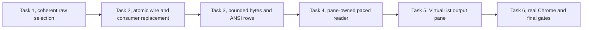

# Job Output Paging Implementation Plan

> **For agentic workers:** REQUIRED SUB-SKILL: Use superpowers:subagent-driven-development (recommended) or superpowers:executing-plans to implement this plan task-by-task. Steps use checkbox (`- [ ]`) syntax for tracking.

**Goal:** Make browser job output follow new output, preserve an older reading position and load retained history on scroll, with bounded storage and automatic recovery.

**Architecture:** Replace the payload at `evener/jobs/output` atomically with a lossless latest/backward byte page. The browser keeps two contiguous raw windows and one paced reader under its existing pane lifetime, derives source-addressed ANSI rows and uses the existing `VirtualList`. Shared, Go and phone consumers migrate together; phone presentation stays unchanged.

**Tech Stack:** Go, AppWire JSON-RPC, generated TypeScript, React, React Native, Vitest, the existing ANSI scanner and TanStack-backed `VirtualList`, real hub/daemon Chrome guards.

**Spec:** [Approved revised job-output specification](../specs/2026-10-05-job-output-paging-design.md), committed as `e12fef84fd9fe2594896384510c5f96d2647117a`. Read it with this plan. Examples below specify implementation insertions and test cases, not code already installed or executed.

## Global Constraints

These requirements are copied verbatim from the approved specification. All tasks inherit them.

- “Preserve the owning-session `ref`, `jobId` and existing `JobsOutputResponse.data` envelope.”
- “Existing 4 KiB default and 64 KiB cap, applied to source bytes. Omitted or nonpositive values use the default. Positive values are capped.”
- “The browser uses a 64 KiB page limit; a forward-demand request may use a smaller positive size.”
- “Small existing previews, including the 256-byte activity-row preview, retain their selected size.”
- “An explicit zero is a real position, never an omitted selector or a latest-page sentinel.”
- “There is no request `offsetBytes` selector.”
- “There is no response `continuation`.”
- “Never trim a page to rune boundaries or repair its bytes before transport.”
- “The shared decoder must work in browser and native JavaScript without requiring browser-only globals.”
- “Retain at most 1 MiB of source bytes per open output pane: 512 KiB for the older reading window and 512 KiB for the current live window.”
- “Count bytes once where windows overlap.”
- “Each window keeps its own 512 KiB limit.”
- “This is a source-byte budget, not a browser-heap claim.”
- “Do not retain response-page objects, a sparse page cache or bidirectional streaming-decoder machinery.”
- “Do not add a height cache, parallel scroll coordinator or sticky-bottom loop.”
- “Never carry a terminal state across an unread gap.”
- “Allow one output request in flight per pane.”
- “While a running job's pane is visible and readable, poll at the existing one-second browser cadence.”
- “Add no separate live, history or final-drain retry owners.”
- “A read started before terminal metadata cannot settle that obligation.”
- “Add no compatibility bridge, dual parser or silent tail fallback.”
- “Never restart or kill a daemon automatically to complete this migration.”
- “Do not introduce separate paging-feature negotiation.”
- “The phone migration preserves its current view, read cadence and failure recovery.”
- “Do not add sleeps, widen timeouts or weaken assertions to hide races.”
- “Real browser end-to-end tests use actual producers, hub routing and APIs.”
- “Previously accepted Jobs, Overview, startup, dependency and Activity Sheet work stays closed.”

## Review Focus

Each risk has an owning test below. These extend, rather than replace, P01–P15.

1. **R01: Explicit zero after pruning or remote forwarding.** Zero must stay present; `[F,F)` succeeds, a supplied end below `F` is typed pruning, and an unavailable owner must not substitute saved output. Owned by Tasks 1–2.
2. **R02: Repair changes the first visible fragment.** Prepending a split character, repairing a partial line or trimming a long line must preserve the visible byte and pixel anchor, including malformed bytes whose display width differs from their raw length. Owned by Tasks 3 and 5.
3. **R03: History contains only controls while live output grows.** Demand must progress by bytes, retries must be paced, and sustained history paging must neither starve live output nor cross an unloaded gap. Owned by Tasks 3–5.
4. **R04: A readiness wait outlives its pane or connection.** Closing, replacing the job or disconnecting during that wait must fence dispatch as well as publication. Hidden-tab unmount must preserve windows and demand. Owned by Task 4.
5. **R05: Terminal metadata races an old empty output read.** An earlier EOF must not discharge the final drain; a failed, hidden or disconnected fresh drain must resume automatically, with finished history still readable. Owned by Tasks 4 and 6.

---

## Execution boundary and evidence

This document is the planning deliverable. Jesse must approve this written plan and choose Native or Subagent-driven execution before any product edits, tests, builds, installations or probes. The earlier Jobs execution choice does not select execution for this plan.

Use the existing isolated `wip/web-activity-followups` worktree. Do not create another lane for inline work. Before implementation, inspect `git status --short`, read `AGENTS.md`, `docs/product/README.md`, the relevant S02/S03/S05/S12 rows in `docs/product/subsystems.md`, and `docs/developing-evener/testing.md`.

There is one preserved, unqualified draft: `cmd/evener-hub/frontend/src/panes/transcript/JobLog.test.tsx`, SHA-256 `a0327532ea9fc38f44012bfb9d888fe6248a3e2676884ad6d3ad6f3d951bde62`. Keep it unchanged and unstaged through plan approval. At Task 2, copy the draft and the committed original into `$EVENER_SCRATCH_DIR` before comparing their assertions. Its previous failures are investigation evidence, not an accepted test oracle.

For each test cycle, retain the command, complete output, exit status, source revision, literal oracle and ruling in `$EVENER_SCRATCH_DIR/job-output-paging/`. Preserve failed attempts. Review the complete staged diff and run `git diff --cached --check` before every commit. Stage only the paths named for that slice. Keep hooks enabled. Tests that intentionally trigger errors must capture and assert them.

Some existing output tests mock the internal source/store. Those cannot prove the new forwarding or recovery contract. Replace only affected output cases with real product code below a scripted external transport. Keep their visible assertions. Browser end-to-end coverage uses no mocked product layer or API response.

## File and ownership map

| Unit | Files and responsibility |
| --- | --- |
| Snapshot selection | `agent/internal/jobstore/output.go`, `output_snapshot.go`, `output_snapshot_fd.go`: latest/backward selection inside the existing lock or guarded snapshot attempt. |
| Page production | `agent/jobs.go`, `jobs_panel.go`, `job_transcript_read.go`, `retained_output_read.go`: real live/secure saved reads, exact bytes, error conversion, shared byte encoding only. |
| Atomic wire migration | `appwire/types.go`, `errors.go`, `client.go`; `server/server.go`, `appwire_runtime.go`; `cmd/evener/serve.go`; `cmd/evener-hub/app_jobs.go`; affected routing tests and generated references. |
| Shared decoding | `appwire-client/typescript/jobOutput.ts`, `jobOutput.test.ts`, `index.ts`: portable raw-byte validation, scalar decoding and typed pruning classification. |
| Mechanical consumers | `cmd/evener-hub/frontend/src/stores/threads.ts`, `panes/transcript/JobLog.tsx`, `panes/session/chrome/ActivityRowDetail.tsx`; native output hook, screen and demos. Task 2 keeps the existing latest view useful before adding browser paging. |
| Bounded browser model | Create `cmd/evener-hub/frontend/src/panes/transcript/jobLogWindow.ts` and `.test.ts`; extend `src/widgets/codeblock/ansi.ts` and `.test.ts`: two contiguous byte windows and source-addressed rows, no read scheduling or DOM ownership. |
| Pane reader | Create `cmd/evener-hub/frontend/src/panes/transcript/jobLogReader.ts` and `.test.ts`; modify `src/shell/paneLifetime.ts` and the two job request methods in `src/stores/threads.ts`: one reader, existing read view and connection fences. |
| Real-wire client fixtures | Create `cmd/evener-hub/frontend/src/panes/transcript/jobLogTestUtils.ts` in Task 2: real `AppwireClient` and an awaitable external `FakeSocket`, shared by current latest-view, reader and UI tests. |
| Thin rendered adapter | `src/panes/transcript/JobLog.tsx`, `JobLog.test.tsx`, `transcript.module.css`: mount/visibility binding, chrome, `VirtualList` and byte/pixel capture. |
| Browser producer and journey | `cmd/evener-hub/background_jobs_browser_test.go`, new `job_output_paging_browser_test.go`, `cmd/evener-hub/frontend/scripts/backgroundjobsguard/run.mjs`: additional real producer session and trusted browser scrolling, preserving the original journey. |
| Evergreen contracts | `docs/product/session-activity.md`, `docs/product/subsystems.md`, `docs/product/friction.md`, `appwire-client/typescript/README.md`, `mobile-native/README.md`, generated `docs/appwire-protocol.md`. |

New browser source files stay beside `JobLog`. Do not move unrelated code or change `VirtualList`'s production contract. The shared codec belongs in its existing package. Both snapshot access paths keep their security and generation checks; sharing the range calculation is enough.



Task 1 adds a tested internal capability without changing the public method. Task 2 changes the wire and every current consumer in one commit. Tasks 3 and 4 add independently tested browser units. Task 5 binds them to the existing output pane. Task 6 qualifies the complete user journey and closes the product documentation.

## Task 1: Select exact pages within one output snapshot

**Files**

- Modify: `agent/internal/jobstore/output.go`, `agent/internal/jobstore/output_snapshot.go`, `agent/internal/jobstore/output_snapshot_fd.go`.
- Test: `agent/internal/jobstore/output_test.go`, `agent/internal/jobstore/output_snapshot_test.go`, `agent/internal/jobstore/output_snapshot_fd_test.go`.
- Create test: `agent/internal/jobstore/output_page_test.go`.

**Interfaces**

- Existing consumed result: `OutputWindowSnapshot`, with `Content []byte`, `Start`, `End`, `TotalBytes`, `RetainedStart int64`, and existing truncation/partial-boundary facts. Existing forward `ReadWindow` contracts stay unchanged.
- Add `func (o *Output) ReadPage(beforeBytes *int64, maxBytes int) (OutputWindowSnapshot, error)`.
- Add `func ReadOutputPageSnapshot(path string, beforeBytes *int64, maxBytes int) (OutputWindowSnapshot, error)`.
- Add `func ReadOutputPageSnapshotFromFile(path string, f *os.File, beforeBytes *int64, maxBytes int) (OutputWindowSnapshot, error)`.
- Internal shared selector: `func outputPageBounds(beforeBytes *int64, maxBytes int, totalBytes, retainedStart int64) (start, end int64, err error)`.
- `maxBytes` here is already positive and bounded by the caller; reject nonpositive values in this internal API. Return the coherent total/floor in the snapshot even on a selector error. Consistency/generation errors take precedence over publishing those error bounds.

- [ ] **Step 1: Add raw-byte and normative selection tests.**

Use the real output store, not a stubbed manager. This test belongs in the existing `jobstore` package and uses its existing `appendOutput` helper.

```go
func TestOutputReadPageRawBoundaries(t *testing.T) {
    path := filepath.Join(t.TempDir(), "output.log")
    out, err := CreateOutputNoSync(path, 100)
    if err != nil { t.Fatal(err) }
    appendOutput(t, out, strings.Repeat("p", 100)+strings.Repeat("s", 100))
    zero, floor, near, forward, eof, pruned, beyond, negative :=
        int64(0), int64(100), int64(120), int64(184), int64(200),
        int64(99), int64(201), int64(-1)
    cases := []struct {
        name string
        before *int64
        start, end int64
        wantErr error
    }{
        {"latest", nil, 136, 200, nil},
        {"forward demand", &forward, 120, 184, nil},
        {"clipped start", &near, 100, 120, nil},
        {"floor empty", &floor, 100, 100, nil},
        {"eof", &eof, 136, 200, nil},
        {"pruned", &pruned, 0, 0, ErrOutputPruned},
        {"zero pruned", &zero, 0, 0, ErrOutputPruned},
        {"beyond", &beyond, 0, 0, ErrInvalidOffset},
        {"negative", &negative, 0, 0, ErrInvalidOffset},
    }
    for _, tc := range cases {
        t.Run(tc.name, func(t *testing.T) {
            got, err := out.ReadPage(tc.before, 64)
            if !errors.Is(err, tc.wantErr) { t.Fatalf("error=%v, want %v", err, tc.wantErr) }
            if got.TotalBytes != 200 || got.RetainedStart != 100 {
                t.Fatalf("incoherent bounds: %+v", got)
            }
            if tc.wantErr != nil { return }
            want := bytes.Repeat([]byte{'s'}, int(tc.end-tc.start))
            if got.Start != tc.start || got.End != tc.end || !bytes.Equal(got.Content, want) {
                t.Fatalf("page=%+v bytes=%x, want [%d,%d) %x", got, got.Content, tc.start, tc.end, want)
            }
        })
    }
}

func TestOutputReadPagePreservesSplitRuneAndZero(t *testing.T) {
    path := filepath.Join(t.TempDir(), "output.log")
    out, err := CreateOutputNoSync(path, 100)
    if err != nil { t.Fatal(err) }
    appendOutput(t, out, "abécd")
    got, err := out.ReadPage(nil, 3)
    if err != nil { t.Fatal(err) }
    if got.Start != 3 || got.End != 6 || !bytes.Equal(got.Content, []byte{0xa9, 'c', 'd'}) {
        t.Fatalf("rune-trimmed page: %+v %x", got, got.Content)
    }
    zero := int64(0)
    got, err = out.ReadPage(&zero, 3)
    if err != nil || got.Start != 0 || got.End != 0 || len(got.Content) != 0 || got.TotalBytes != 6 {
        t.Fatalf("zero became latest: %+v %v", got, err)
    }
}
```

Add real empty-store and `F=T` snapshot fixtures. Use literal bytes `61 62 c3 a9 63 64`, `61 62 63 f0 9f 98 80 78 79 7a` and malformed `ff c3 28`. Verify each successful page's raw count and end independently. Run the same selection cases through the path and opened-FD APIs using the existing `mustWriteSnapshotFixture` helper. R01 is pinned by explicit zero, floor-empty, below-floor and negative cases.

- [ ] **Step 2: Observe the new tests fail before implementation.**

Run from the repository root:

```bash
go test ./agent/internal/jobstore -run '^TestOutputReadPage' -count=1
```

Expected first RED: the new `ReadPage` API is absent. After adding its declaration, retain a behavioral RED for the split-rune and normative cases before implementing selection. A compilation failure alone does not prove the old selection defect.

- [ ] **Step 3: Share the bound calculation and guarded raw read.**

Insert this selector in `output.go`. Calculate subtraction only after validating the end, so `int64` overflow cannot arise.

```go
func outputPageBounds(beforeBytes *int64, maxBytes int, totalBytes, retainedStart int64) (int64, int64, error) {
    if maxBytes <= 0 || retainedStart < 0 || totalBytes < retainedStart {
        return 0, 0, ErrInvalidOffset
    }
    end := totalBytes
    if beforeBytes != nil {
        end = *beforeBytes
        if end < 0 || end > totalBytes { return 0, 0, ErrInvalidOffset }
        if end < retainedStart { return 0, 0, ErrOutputPruned }
    }
    start := retainedStart
    if end-retainedStart > int64(maxBytes) { start = end-int64(maxBytes) }
    return start, end, nil
}
```

Extract the raw body of the existing locked `Output.ReadWindow` into a private locked-range reader. `ReadWindow` retains its existing validation; `ReadPage` acquires the same mutex, snapshots `o`'s current bounds, selects and reads before unlocking. Never call the locking public `ReadWindow` while holding that mutex. On selector errors, populate the snapshot's total/floor without returning bytes.

For both file APIs, add a page-selection entry point to their current snapshot attempt. Select after reading that attempt's metadata and before reading its bytes. Keep before/after observations, retry count, file generation validation, FD pinning, size checks and error precedence. A selector rejection also passes through the after-observation check before its bounds are returned. Keep the path and secure-FD access implementations distinct; do not replace secure reads with path reopening.

The implementation insertion inside each existing attempt is:

```go
start, end, selectionErr := outputPageBounds(beforeBytes, maxBytes, totalBytes, retainedStart)
snapshot := OutputWindowSnapshot{
    Start: start, End: end, TotalBytes: totalBytes, RetainedStart: retainedStart,
}
if selectionErr != nil { return snapshot, selectionErr }
```

Use the selected `start` and `end-start` in that attempt's existing raw read operation. Preserve the result's existing partial-boundary facts. The outer snapshot loop must still replace a provisional selector error with `ErrOutputChangedDuringRead` when the observations disagree.

- [ ] **Step 4: Add synchronized append, rollover and replacement tests, then run the suite.**

In the existing snapshot filesystem seam, block the read after metadata observation with channels, append or replace the file, then release it. Assert either one coherent snapshot or the existing consistency error, never bounds from one generation with another generation's bytes. Extend `TestReadOutputSnapshotFromFilePinsOpenedOutput` with a page arm for its regular-file, symlink and FIFO replacement cases. It must never read replacement bytes. Use its existing observation hooks and synchronization; do not add sleeps or widen its deadlines.

Record a before/after literal byte oracle for every transition. Assert that a generation failure is not `ErrOutputPruned`, and that rejected selectors publish bounds only from a stable attempt.

```bash
go test ./agent/internal/jobstore -count=1
go test -race ./agent/internal/jobstore -run 'Output.*(Page|Snapshot|Window)' -count=1
```

Expected GREEN: raw, existing forward-window and snapshot/security assertions all pass. Owns P01–P04's store boundaries and R01. Public behavior has not changed yet.

- [ ] **Step 5: Commit the tested internal capability.**

Stage only the three implementation paths and actual touched/new test paths listed above. Read the staged diff; commit with `feat(jobstore): select raw pages within output snapshots`. Do not stage the preserved `JobLog.test.tsx` draft.

## Task 2: Replace the wire contract and migrate every current consumer atomically

**Files**

- Modify: `appwire/types.go`, `appwire/errors.go`, `appwire/client.go`, their affected tests; `internal/appwiredoc/main.go`, `internal/appwiredoc/main_test.go`.
- Modify: `agent/jobs.go`, `agent/jobs_panel.go`, `agent/job_transcript_read.go`, `agent/retained_output_read.go`, affected jobs-panel/raw-read tests.
- Modify: `server/server.go`, `server/appwire_runtime.go`, affected server tests; `cmd/evener/serve.go`, `cmd/evener/serve_residual_fuzz_test.go`.
- Modify: `cmd/evener-hub/app_jobs.go` and affected `app_jobs_test.go`, `app_rpc_test.go`, `app_session_activity_test.go`, `web_test.go`, `background_jobs_browser_test.go`.
- Test real sources: `cmd/evener-hub/internal/appsource/local_daemon_test.go`, `remote_hub_mutations_test.go`, `registry_test.go`, `coverage_completion_test.go`. Existing production `Source.JobOutput`, `LocalDaemonSource.JobOutput` and `RemoteHubSource.JobOutput` retain their method names and routing ownership.
- Modify: `appwire-client/typescript/jobOutput.ts`, `jobOutput.test.ts`, `index.ts`, `client.ts`, `client.test.ts`, `scripts/qualify-package.mjs` and active protocol fixtures.
- Generate: `appwire-client/typescript/types.gen.ts`, `docs/appwire-protocol.md`.
- Modify: `cmd/evener-hub/frontend/src/stores/threads.ts`, `threads.test.ts`, `panes/transcript/JobLog.tsx`, `JobLog.test.tsx`, `panes/session/chrome/ActivityRowDetail.tsx`, `ActivityRowDetail.test.tsx`.
- Create: `cmd/evener-hub/frontend/src/panes/transcript/jobLogTestUtils.ts`, the real-client external wire fixture consumed again by Tasks 4–5.
- Modify: `mobile-native/src/subagents/useShellJobOutput.ts`, `ShellJobScreen.tsx`, `ShellJobScreen.test.tsx`, `src/dev/demoSubagents.ts`, `demoSessions.ts`, `scripts/demo-hub.mts`, affected demo/connection tests.
- Update current contract references in `docs/product/session-activity.md`, `docs/product/subsystems.md`, `appwire-client/typescript/README.md`, `mobile-native/README.md`. Do not close friction C09 yet.

**Interfaces**

- Consumes all three `ReadPage` snapshot APIs from Task 1.
- Wire `JobsOutputParams.BeforeBytes` becomes `*int64`; `JobsOutputResponse.Data` becomes `JobOutputPage`. The method remains `evener/jobs/output`.
- Add `Session.JobOutputPage(jobID string, beforeBytes *int64, maxBytes int64) (appwire.JobOutputPage, bool, error)` and `LoadSessionJobOutputPage(stateDir, sessionID, jobID string, beforeBytes *int64, maxBytes int64) (appwire.JobOutputPage, bool, error)`.
- Add private manager `readOutputPage(jobID string, beforeBytes *int64, maxBytes int) (jobstore.OutputWindowSnapshot, bool, error)` and secure loader `readLocalJobOutputPageSnapshot(path string, beforeBytes *int64, maxBytes int) (jobstore.OutputWindowSnapshot, error)`.
- `Server.SetJobOutputFunc` callback becomes `func(jobID string, beforeBytes *int64, maxBytes int64) (appwire.JobOutputPage, bool, error)`.
- Add `appwire.JobOutputPruned(retainedStartBytes, totalBytes int64) WireError` and `JobOutputPrunedErrorData` below.
- Shared exports: `DecodedJobOutputPage = JobOutputPage & { bytes: Uint8Array }`; `parseJobOutputPage(value: unknown): DecodedJobOutputPage | null`; `decodeJobOutputText(bytes: Uint8Array): string`; `forEachJobOutputScalar(bytes: Uint8Array, emit: (value: string, start: number, end: number) => void): void`; `jobOutputPrunedBounds(error: unknown): { retainedStartBytes: number; totalBytes: number } | null`.
- Frontend `jobOutput(ref: string, jobId: string, beforeBytes?: number, maxBytes?: number): Promise<JobOutputPage>` retains its arguments until Task 4 adds the optional freshness guard. Current `JobLog` stays a latest-only view in this slice.

- [ ] **Step 1: Add wire, producer, routing and portable decoder RED cases.**

The Go JSON test proves presence independently of any client builder:

```go
func TestJobsOutputExplicitZero(t *testing.T) {
    var params JobsOutputParams
    if err := json.Unmarshal([]byte(`{"ref":"owner","jobId":"job","beforeBytes":0}`), &params); err != nil {
        t.Fatal(err)
    }
    if params.BeforeBytes == nil || *params.BeforeBytes != 0 { t.Fatal("explicit zero lost") }
    data, err := json.Marshal(params)
    if err != nil { t.Fatal(err) }
    var fields map[string]json.RawMessage
    if err := json.Unmarshal(data, &fields); err != nil { t.Fatal(err) }
    if string(fields["beforeBytes"]) != "0" { t.Fatalf("zero omitted: %s", data) }
}
```

The only scripted boundary is the socket. The actual `AppwireClient`, connection store, readiness wait and threads request builder stay real; later tasks also exercise their real reader and byte model. The new `jobLogTestUtils.ts` imports testing fixtures by the package name `@evener/appwire-client/testing/fakeSocket` using the existing package's actual module specifier.

The fixture records outbound JSON-RPC ids and params, lets the test await arrival and holds each reply explicitly. Its core is:

```ts
export class JobOutputPeer extends FakeSocket {
  readonly requests: Array<{ id: number | string; method: string; params: Record<string, unknown> }> = [];
  private listeners = new Set<() => void>();

  override send(frame: string): void {
    super.send(frame);
    const request = JSON.parse(frame) as { id?: number | string; method?: string; params?: Record<string, unknown> };
    if (request.id === undefined || (request.method !== "evener/jobs/output" && request.method !== "evener/jobs/get")) return;
    this.requests.push({ id: request.id, method: request.method, params: request.params ?? {} });
    for (const listener of this.listeners) listener();
  }

  waitRequest(method: string, occurrence: number): Promise<(typeof this.requests)[number]> {
    const present = () => this.requests.filter((request) => request.method === method)[occurrence];
    const ready = present();
    if (ready !== undefined) return Promise.resolve(ready);
    return new Promise((resolve) => {
      const listener = () => {
        const request = present();
        if (request === undefined) return;
        this.listeners.delete(listener);
        resolve(request);
      };
      this.listeners.add(listener);
    });
  }

  respond(request: (typeof this.requests)[number], result: unknown): void {
    this.receive({ jsonrpc: "2.0", id: request.id, result });
  }

  fail(request: (typeof this.requests)[number], code: number, message: string, data?: unknown): void {
    this.receive({ jsonrpc: "2.0", id: request.id, error: { code, message, data } });
  }
}
```

Shared tests use literal payloads, including a page beginning in the middle of `é`:

```ts
it("accepts exact split bytes and explicit empty bounds", () => {
  const page = parseJobOutputPage({
    offsetBytes: 3, bytesReturned: 3, totalBytes: 6,
    retainedStartBytes: 0, encoding: "base64", data: "qWNk",
  });
  expect(page?.bytes).toEqual(new Uint8Array([0xa9, 0x63, 0x64]));
  expect(parseJobOutputPage({
    offsetBytes: 0, bytesReturned: 0, totalBytes: 6,
    retainedStartBytes: 0, encoding: "utf8", data: "",
  })?.bytes).toEqual(new Uint8Array());
});

it("rejects fabricated counts, old tails and invalid bounds", () => {
  const valid = {
    offsetBytes: 0, bytesReturned: 2, totalBytes: 2,
    retainedStartBytes: 0, encoding: "utf8", data: "é",
  };
  expect(parseJobOutputPage(valid)?.bytes).toEqual(new Uint8Array([0xc3, 0xa9]));
  for (const invalid of [
    { ...valid, bytesReturned: 1 },
    { ...valid, offsetBytes: 1 },
    { ...valid, totalBytes: -1 },
    { ...valid, retainedStartBytes: 1 },
    { ...valid, encoding: "gzip" },
    { ...valid, data: "\ud800" },
    { ...valid, bytesReturned: Number.MAX_SAFE_INTEGER + 1 },
    { tail: "é", totalBytes: 2, retainedStart: 0 },
  ]) expect(parseJobOutputPage(invalid)).toBeNull();
});

it("decodes without browser-only byte globals", () => {
  vi.stubGlobal("atob", undefined);
  vi.stubGlobal("Buffer", undefined);
  vi.stubGlobal("TextDecoder", undefined);
  vi.stubGlobal("TextEncoder", undefined);
  try {
    const page = parseJobOutputPage({
      offsetBytes: 0, bytesReturned: 4, totalBytes: 4,
      retainedStartBytes: 0, encoding: "base64", data: "8J+YgA==",
    });
    expect(page?.bytes).toEqual(new Uint8Array([0xf0, 0x9f, 0x98, 0x80]));
    expect(decodeJobOutputText(page?.bytes ?? new Uint8Array())).toBe("😀");
  } finally { vi.unstubAllGlobals(); }
});
```

Extend the actual daemon and actual local/remote source tests with raw request capture at their external transport. Test omitted end versus zero, negative/beyond-total, 4 KiB default, positive 64 KiB cap, `before==F`, and nonzero-floor pruning. Assert real wire error data and raw bytes, not callback invocation alone. Saved local fixtures use the real journal/output/PastIndex already seeded by `seedPastSessionWithJobs`. A live error with different stale saved bytes must return the live error; only the existing dead-local condition can admit saved output. A missing output file must fail transiently; an existing empty file succeeds.

Use the existing real-client transport fixture `newPushableScriptedRemoteHub` and `scriptedRemoteHubParams` in hub tests rather than `jobsListSource.outResp`. Preserve the existing owner/reference transformation assertions. Server tests also exercise the real dispatcher before the Go client receives the result. Capture `WireError` as its actual value type with `errors.As`, not an assumed pointer.

P07 RED cases: a v6 peer is rejected before output dispatch, its running daemon is not killed, and an independent compatible v7 owner remains readable. Keep existing restart-required and generation assertions. Do not treat successful initialization against a fake constant as sufficient ownership evidence.

- [ ] **Step 2: Run the focused RED tests on the old contract.**

```bash
go test ./appwire ./agent ./server ./cmd/evener-hub/internal/appsource ./cmd/evener-hub \
  -run '(JobOutput|JobsOutput|OutputPage|UpgradeRequired|ProtocolVersion)' -count=1
cd cmd/evener-hub/frontend && npm test -- ../../../appwire-client/typescript/jobOutput.test.ts src/panes/session/chrome/ActivityRowDetail.test.tsx
```

Run each command separately while RED; do not let the expected Go failure suppress the TypeScript run. Use the existing canonical preflight once execution is approved if dependencies are absent or stale. Never `npm ci` through a symlink. The shared package has no standalone `npm test`; its tests run through this frontend harness or the native shared lane.

- [ ] **Step 3: Implement the atomic Go contract, secure producer and routing replacement.**

Use these exact new wire fields; none of the response fields has `omitempty`:

```go
const ProtocolVersion = "evener-appwire-v7"

type JobOutputPage struct {
    OffsetBytes int64 `json:"offsetBytes"`
    BytesReturned int64 `json:"bytesReturned"`
    TotalBytes int64 `json:"totalBytes"`
    RetainedStartBytes int64 `json:"retainedStartBytes"`
    Encoding string `json:"encoding"`
    Data string `json:"data"`
}

type JobOutputPrunedErrorData struct {
    EvenerErrorInfo ErrorInfo `json:"evenerErrorInfo"`
    RetainedStartBytes int64 `json:"retainedStartBytes"`
    TotalBytes int64 `json:"totalBytes"`
}

const ErrorJobOutputPruned ErrorInfo = "jobOutputPruned"

func JobOutputPruned(retainedStartBytes, totalBytes int64) WireError {
    return WireError{
        Code: CodeUnavailable, Message: "job output is no longer retained",
        Data: JobOutputPrunedErrorData{
            EvenerErrorInfo: ErrorJobOutputPruned,
            RetainedStartBytes: retainedStartBytes, TotalBytes: totalBytes,
        },
    }
}
```

Change only `JobsOutputParams.BeforeBytes` to `*int64` with its existing JSON name and omission tag. Replace `JobOutputTail` and its aliases, response type, daemon callback, CLI interface/binding and saved-loader calls. `appwire.Client.JobOutput`, `Source.JobOutput` and the public method name remain. The hub's existing `hubJobRead` continues to own authoritative live/remote reads and dead-local fallback; do not broaden its error classification.

Normalize the page size before calling Task 1 APIs:

```go
func jobOutputPageLimit(maxBytes int64) int {
    if maxBytes <= 0 { return 4 * 1024 }
    if maxBytes > 64 * 1024 { return 64 * 1024 }
    return int(maxBytes)
}

func encodeRawOutputBytes(content []byte) (encoding, data string) {
    if utf8.Valid(content) { return "utf8", string(content) }
    return "base64", base64.StdEncoding.EncodeToString(content)
}
```

Extract this encoding helper from the duplicated branch in `retained_output_read.go`. Leave that tool's 16 KiB paging, snake_case fields, selectors, continuation, job/artifact addressing and exact transcript expansion unchanged. Keep its existing assertions and rerun them.

The producer's success construction is:

```go
encoding, data := encodeRawOutputBytes(snapshot.Content)
page := appwire.JobOutputPage{
    OffsetBytes: snapshot.Start, BytesReturned: int64(len(snapshot.Content)),
    TotalBytes: snapshot.TotalBytes, RetainedStartBytes: snapshot.RetainedStart,
    Encoding: encoding, Data: data,
}
```

Use the real live `Output.ReadPage` when `recordForRead` has the running output. Otherwise use the new secure page loader, preserving `openJobOutputFile`, no-follow/open-beneath-root checks, opened-file identity, retries and terminal-record total validation. Do not select from `validatedOutputStatsForRecord` followed by an unrelated read. Keep that helper for its other callers. A stable `ErrOutputPruned` becomes `appwire.JobOutputPruned(snapshot.RetainedStart, snapshot.TotalBytes)`; an invalid selector becomes invalid parameters; unavailable file or changed generation becomes ordinary unavailable. Never convert generation errors into pruning or dead-session errors.

Update `internal/appwiredoc`'s explicit registered tail type to the page and register the pruning data type so its explicit zero bounds appear in the generated reference. Regenerate from the root with `go generate ./appwire/...`; do not edit generated files by hand.

- [ ] **Step 4: Implement one portable shared codec and migrate current web/phone reads.**

Use pure JavaScript byte operations in `jobOutput.ts`. A strict standard-base64 decoder rejects bad padding, noncanonical trailing bits and unknown characters:

```ts
const BASE64 = "ABCDEFGHIJKLMNOPQRSTUVWXYZabcdefghijklmnopqrstuvwxyz0123456789+/";
const MAX_JOB_OUTPUT_BYTES = 64 * 1024;

function base64Bytes(data: string): Uint8Array | null {
  if (data.length > 4 * Math.ceil(MAX_JOB_OUTPUT_BYTES / 3)) return null;
  if (data.length % 4 !== 0 || !/^(?:[A-Za-z0-9+/]{4})*(?:[A-Za-z0-9+/]{2}==|[A-Za-z0-9+/]{3}=)?$/.test(data)) return null;
  const padding = data.endsWith("==") ? 2 : data.endsWith("=") ? 1 : 0;
  const length = (data.length / 4) * 3 - padding;
  if (length > MAX_JOB_OUTPUT_BYTES) return null;
  const bytes = new Uint8Array(length);
  let written = 0;
  for (let index = 0; index < data.length; index += 4) {
    const a = BASE64.indexOf(data.charAt(index));
    const b = BASE64.indexOf(data.charAt(index + 1));
    const c = data.charAt(index + 2) === "=" ? 0 : BASE64.indexOf(data.charAt(index + 2));
    const d = data.charAt(index + 3) === "=" ? 0 : BASE64.indexOf(data.charAt(index + 3));
    if (index + 4 === data.length && ((padding === 2 && (b & 15) !== 0) || (padding === 1 && (c & 3) !== 0))) return null;
    const value = (a << 18) | (b << 12) | (c << 6) | d;
    if (written < bytes.length) bytes[written++] = value >>> 16;
    if (written < bytes.length) bytes[written++] = value >>> 8;
    if (written < bytes.length) bytes[written++] = value;
  }
  return bytes;
}

function utf8Bytes(data: string): Uint8Array | null {
  if (data.length > MAX_JOB_OUTPUT_BYTES) return null;
  const bytes: number[] = [];
  for (const character of data) {
    const point = character.codePointAt(0);
    if (point === undefined || (point >= 0xd800 && point <= 0xdfff)) return null;
    if (point < 0x80) bytes.push(point);
    else if (point < 0x800) bytes.push(0xc0 | (point >>> 6), 0x80 | (point & 63));
    else if (point < 0x10000) bytes.push(0xe0 | (point >>> 12), 0x80 | ((point >>> 6) & 63), 0x80 | (point & 63));
    else bytes.push(0xf0 | (point >>> 18), 0x80 | ((point >>> 12) & 63), 0x80 | ((point >>> 6) & 63), 0x80 | (point & 63));
    if (bytes.length > MAX_JOB_OUTPUT_BYTES) return null;
  }
  return new Uint8Array(bytes);
}

export type DecodedJobOutputPage = JobOutputPage & { bytes: Uint8Array };

export function parseJobOutputPage(value: unknown): DecodedJobOutputPage | null {
  if (typeof value !== "object" || value === null) return null;
  const page = value as Record<string, unknown>;
  const { offsetBytes, bytesReturned, totalBytes, retainedStartBytes, encoding, data } = page;
  if (typeof offsetBytes !== "number" || typeof bytesReturned !== "number" || typeof totalBytes !== "number" || typeof retainedStartBytes !== "number") return null;
  if (![offsetBytes, bytesReturned, totalBytes, retainedStartBytes].every((n) => Number.isSafeInteger(n) && n >= 0)) return null;
  if (bytesReturned > MAX_JOB_OUTPUT_BYTES || retainedStartBytes > offsetBytes || offsetBytes > totalBytes || bytesReturned > totalBytes - offsetBytes) return null;
  if (typeof data !== "string" || (encoding !== "utf8" && encoding !== "base64")) return null;
  const bytes = encoding === "utf8" ? utf8Bytes(data) : base64Bytes(data);
  if (bytes === null || bytes.length !== bytesReturned) return null;
  return { offsetBytes, bytesReturned, totalBytes, retainedStartBytes, encoding, data, bytes };
}
```

Bound allocations during validation: calculate decoded byte length before allocating and reject responses above the public 64 KiB cap. `utf8Bytes` must enforce that cap while collecting bytes. A payload claiming a short count must not cause allocation of an arbitrarily large string-derived array.

Implement the source-addressed decoder with this scalar loop. It emits original byte coordinates, including malformed subsequences; Task 3 consumes those coordinates instead of re-encoding displayed replacement characters.

```ts
export function forEachJobOutputScalar(bytes: Uint8Array, emit: (value: string, start: number, end: number) => void): void {
  let index = 0;
  while (index < bytes.length) {
    const start = index;
    const first = bytes[index] ?? 0;
    if (first < 0x80) { emit(String.fromCharCode(first), index, index + 1); index++; continue; }
    const width = first >= 0xc2 && first <= 0xdf ? 2 : first >= 0xe0 && first <= 0xef ? 3 : first >= 0xf0 && first <= 0xf4 ? 4 : 0;
    if (width === 0) { emit("\ufffd", index, index + 1); index++; continue; }
    let point = first & (width === 2 ? 31 : width === 3 ? 15 : 7);
    let taken = 1;
    while (taken < width && index + taken < bytes.length) {
      const next = bytes[index + taken] ?? 0;
      if (next < 0x80 || next > 0xbf) break;
      if (taken === 1 && ((first === 0xe0 && next < 0xa0) || (first === 0xed && next > 0x9f) || (first === 0xf0 && next < 0x90) || (first === 0xf4 && next > 0x8f))) break;
      point = (point << 6) | (next & 63);
      taken++;
    }
    index += taken;
    emit(taken === width ? String.fromCodePoint(point) : "\ufffd", start, index);
  }
}

export function decodeJobOutputText(bytes: Uint8Array): string {
  const text: string[] = [];
  forEachJobOutputScalar(bytes, (value) => text.push(value));
  return text.join("");
}
```

Implement `jobOutputPrunedBounds` in `jobOutput.ts` using the existing `WireError` from `./errors`:

```ts
export function jobOutputPrunedBounds(error: unknown): { retainedStartBytes: number; totalBytes: number } | null {
  if (!(error instanceof WireError) || error.code !== -32014 || error.evenerErrorInfo !== "jobOutputPruned") return null;
  if (typeof error.data !== "object" || error.data === null) return null;
  const { retainedStartBytes, totalBytes } = error.data as Record<string, unknown>;
  if (typeof retainedStartBytes !== "number" || typeof totalBytes !== "number") return null;
  if (!Number.isSafeInteger(retainedStartBytes) || !Number.isSafeInteger(totalBytes) || retainedStartBytes < 0 || retainedStartBytes > totalBytes) return null;
  return { retainedStartBytes, totalBytes };
}
```

`-32014` is Go's existing `CodeUnavailable`; pin that correspondence in the shared binding test. Test ordinary unavailable, malformed data, wrong code and message-only lookalikes. Export the new functions by package name and remove `parseJobLogTail` and `JobLogTail`; no dual parser.

Set shared `APPWIRE_PROTOCOL_VERSION` to `evener-appwire-v7`. Use the exported version constant for active current-peer fixtures. Keep explicit v6 mismatch fixtures and historical descriptions of earlier v6 features. Inspect each literal before changing it. The active fixture inventory includes Go handshake/daemon/appserver/rendezvous/rvreg/launchcheck/hub/sshconn tests, shared navigation/client/package qualification, web demo/App/AppShell/DockRegion/notifications fixtures, and native demo/connection/sessionResume fixtures. This is a mechanical current-version migration, not a review of those accepted features.

Frontend request construction must use `beforeBytes !== undefined`, preserving zero. Preview reads remain `jobOutput(row.ownerRef, row.jobId, undefined, 256)` and decode the page bytes. For Task 2's current `JobLog`, replace `.tail` access with `parseJobOutputPage` plus `decodeJobOutputText`; preserve its present chrome and latest-read behavior until Task 5.

Phone hook result becomes `{ status: "read"; page: DecodedJobOutputPage; text: string }`. Keep `JOB_OUTPUT_REREAD_MS = 2000`, focus gating, current identity fence and prior-success recovery on transport failure. Render `output.text`; base empty and “Showing the end” facts on the raw page count/start. `retainedStartBytes` is the server floor, not the displayed page start. Demo fixtures emit all six fields with actual source-byte counts; do not carry the old artificial `totalBytes: 42`. Add real `AppwireClient`/external `FakeSocket` renderer cases in the existing `ShellJobScreen.test.tsx`; there is no existing separate hook test file.

- [ ] **Step 5: Run affected suites, regenerate twice, then commit the coordinated replacement.**

```bash
go test ./agent/internal/jobstore ./appwire ./agent ./server ./cmd/evener ./cmd/evener-hub/internal/appsource ./cmd/evener-hub ./internal/appwiredoc ./internal/appwirets -count=1
go test -race ./appwire ./server ./cmd/evener-hub/internal/appsource -run '(JobOutput|JobsOutput|UpgradeRequired)' -count=1
go generate ./appwire/...
make test-web
make test-native
make test-api-package
```

Before committing, copy the two generated outputs to the evidence directory, generate again and compare exact bytes. After committing, run `make lint-generated`, which compares generated outputs with HEAD. Running that HEAD-diff gate before committing the intentionally changed generated files would falsely classify the intended change as stale generation.

Run the real existing Jobs browser test after building the web bundle, preserving its original settled-output text assertion while changing only wire frame decoding:

```bash
make build-web
go test -tags browserguard ./cmd/evener-hub -run '^TestBackgroundJobsBrowser$' -count=1
```

Before changing `JobLog.test.tsx`, make exact scratch copies of the preserved draft and committed original, verify the recorded draft hash, and compare every meaningful assertion. Migrate the original latest-view cases to the real `JobOutputPeer` boundary in this slice, preserving full command, empty output, metadata unavailable/malformed, old-job command fencing, fallback heading and pane-title assertions. Keep the unqualified draft as evidence; do not submit its store-call assertions or restore over unrelated edits. Task 5 extends these accepted boundary tests with paging/geometry cases. This reconciliation is allowed only after plan/execution approval.

Stage the explicit changed files from this task's inventory after reading `git status` and each diff. Commit all Go/shared/web/phone contract changes together as `feat(appwire): replace job output tails with raw byte pages`. Owns P01–P07 and R01. The intermediate commit must compile across every consumer and provide a working latest view; no broken wire-only commit.

## Task 3: Derive source-addressed ANSI rows from two bounded windows

**Files**

- Create: `cmd/evener-hub/frontend/src/panes/transcript/jobLogWindow.ts`, `jobLogWindow.test.ts`.
- Modify and test: `cmd/evener-hub/frontend/src/widgets/codeblock/ansi.ts`, `ansi.test.ts`.

**Interfaces**

Consume `DecodedJobOutputPage` and `forEachJobOutputScalar` from `@evener/appwire-client`. Reuse the current ANSI scanner, SGR state and `AnsiLine` presentation.

```ts
export const JOB_LOG_PAGE_BYTES = 64 * 1024;
export const JOB_LOG_WINDOW_BYTES = 512 * 1024;
export const JOB_LOG_FRAGMENT_BYTES = ANSI_BYTE_FRAGMENT_BYTES;

export type JobLogRow = {
  offsetBytes: number;
  endBytes: number;
  line: AnsiLine;
};

export type AnsiByteState = TerminalState;
export type AnsiByteRows = {
  rows: JobLogRow[];
  endState: AnsiByteState;
  boundaries: Array<{ offsetBytes: number; state: AnsiByteState }>;
};

export function parseAnsiByteRows(bytes: Uint8Array, offsetBytes: number, initialState?: AnsiByteState): AnsiByteRows;

export type JobLogByteWindow = {
  offsetBytes: number;
  bytes: Uint8Array;
  initialState?: AnsiByteState;
  rows: JobLogRow[];
  boundaries: AnsiByteRows["boundaries"];
};
export type JobLogWindows = {
  older: JobLogByteWindow | null;
  live: JobLogByteWindow | null;
  retainedStartBytes: number;
  totalBytes: number;
};
export type JobLogDemand = { direction: "backward" | "forward"; boundaryBytes: number; limitBytes: number };
export type JobLogPageSelection = { beforeBytes: number; maxBytes: number };

export function emptyJobLogWindows(): JobLogWindows;
export function applyJobLogPage(windows: JobLogWindows, page: DecodedJobOutputPage, target: "older" | "live", keep: "start" | "end"): JobLogWindows;
export function reconcileJobLogBounds(windows: JobLogWindows, retainedStartBytes: number, totalBytes: number): JobLogWindows;
export function retainJobLogReadingWindow(windows: JobLogWindows, byteOffset: number): JobLogWindows;
export function selectJobLogDemand(windows: JobLogWindows, demand: JobLogDemand): JobLogPageSelection | null;
export function jobLogSourceBytes(windows: JobLogWindows): number;
```

`TerminalState` is the scanner's existing bounded state, exposed as a frontend-only type, not a new wire type. Put `JobLogRow` in `ansi.ts` or export a source-row type there and alias it in `jobLogWindow.ts` to avoid a widget importing a pane. A window retains one raw interval, derived rows and bounded parser checkpoints, not response objects. `keep` identifies the viewport side that survives a trim. Unknown state is `undefined`; never borrow another disconnected window's state.

- [ ] **Step 1: Add literal-byte join, gap, malformed-source and budget RED cases.**

Test fixtures construct pages from literal bytes, using standard base64 in the test environment only. The fixture's fields are independent of the production selector:

```ts
function rawPage(offsetBytes: number, bytes: number[], totalBytes: number, retainedStartBytes = 0): DecodedJobOutputPage {
  return {
    offsetBytes, bytesReturned: bytes.length, totalBytes, retainedStartBytes,
    encoding: "base64", data: Buffer.from(bytes).toString("base64"),
    bytes: new Uint8Array(bytes),
  };
}

it("repairs a split scalar by prepend without changing source positions", () => {
  let windows = emptyJobLogWindows();
  windows = applyJobLogPage(windows, rawPage(2, [0xa9, 0x0a], 4), "older", "start");
  windows = applyJobLogPage(windows, rawPage(0, [0x61, 0xc3], 4), "older", "end");
  expect(windows.older?.bytes).toEqual(new Uint8Array([0x61, 0xc3, 0xa9, 0x0a]));
  expect(windows.older?.rows.flatMap((row) => row.line.map((run) => run.text)).join("")).toBe("aé");
  expect(windows.older?.rows[0]?.offsetBytes).toBe(0);
  expect(windows.older?.rows[0]?.endBytes).toBe(4);
});

it("uses byte frontiers even when a page contains no visible rows", () => {
  let windows = emptyJobLogWindows();
  windows = applyJobLogPage(windows, rawPage(0, [27, 91, 51, 49, 109], 10), "older", "end");
  expect(windows.older?.rows).toEqual([]);
  expect(selectJobLogDemand(windows, { direction: "forward", boundaryBytes: 5, limitBytes: 10 })).toEqual({ beforeBytes: 10, maxBytes: 5 });
});

it("keeps independent ANSI state across an unread gap", () => {
  let windows = emptyJobLogWindows();
  windows = applyJobLogPage(windows, rawPage(0, [27, 91, 51, 49, 109, 65, 10], 101), "older", "end");
  windows = applyJobLogPage(windows, rawPage(100, [66], 101), "live", "end");
  expect(windows.older?.rows[0]?.line[0]?.foreground).toEqual({ kind: "named", name: "red" });
  expect(windows.live?.rows[0]?.line[0]?.foreground).toBeUndefined();
});
```

Add append and overlap repair, malformed `ff c3 28` byte-coordinate cases, a split CSI/OSC sequence, a styled long line exceeding a window, two-way trims and refetch. Assert rendered characters and actual color/decoration values, not parser invocation. Controls-only source intervals advance without manufacturing empty visible rows.

Generate more than 512 KiB in each window from literal repeated bytes. Assert each raw length is at most `JOB_LOG_WINDOW_BYTES`, the union is at most 1 MiB, overlapping rows render once, and evicting a locally retained interval leaves it demand-readable. Add useful cached bytes below a newly reported floor; reconciliation preserves them and does not label them refetchable. Owns R02/R03's model cases.

- [ ] **Step 2: Observe RED using the real shared codec and scanner.**

```bash
cd cmd/evener-hub/frontend && npm test -- src/panes/transcript/jobLogWindow.test.ts src/widgets/codeblock/ansi.test.ts
```

The absent window unit is the initial RED. Then isolate behavioral failures for split scalars, gap-state isolation and raw-budget trim before completing those operations.

- [ ] **Step 3: Implement contiguous merge, bounded trim and demand selection.**

The core merge accepts only overlapping or adjacent ranges. Verify overlapping bytes agree; an impossible conflict is a read failure, not a silent replacement. A disconnected latest page may replace the live window without deleting older bytes. A disconnected history page starts the newly demanded older range. Do not make a union containing fabricated bytes across a gap.

```ts
function mergeRawWindow(window: JobLogByteWindow | null, page: DecodedJobOutputPage): { offsetBytes: number; bytes: Uint8Array; initialState?: AnsiByteState } {
  if (window === null) return { offsetBytes: page.offsetBytes, bytes: page.bytes.slice() };
  const oldEnd = window.offsetBytes + window.bytes.length;
  const pageEnd = page.offsetBytes + page.bytes.length;
  if (page.offsetBytes > oldEnd || pageEnd < window.offsetBytes) {
    return { offsetBytes: page.offsetBytes, bytes: page.bytes.slice() };
  }
  const start = Math.min(window.offsetBytes, page.offsetBytes);
  const end = Math.max(oldEnd, pageEnd);
  const bytes = new Uint8Array(end - start);
  bytes.set(window.bytes, window.offsetBytes - start);
  const overlapStart = Math.max(window.offsetBytes, page.offsetBytes);
  const overlapEnd = Math.min(oldEnd, pageEnd);
  for (let offset = overlapStart; offset < overlapEnd; offset++) {
    if (window.bytes[offset - window.offsetBytes] !== page.bytes[offset - page.offsetBytes]) throw new Error("job output bytes changed at an existing position");
  }
  bytes.set(page.bytes, page.offsetBytes - start);
  return { offsetBytes: start, bytes, initialState: start === window.offsetBytes ? window.initialState : undefined };
}

export function selectJobLogDemand(windows: JobLogWindows, demand: JobLogDemand): JobLogPageSelection | null {
  const floor = windows.retainedStartBytes;
  if (demand.direction === "backward") {
    const beforeBytes = Math.min(demand.boundaryBytes, windows.totalBytes);
    if (beforeBytes <= floor) return null;
    return { beforeBytes, maxBytes: Math.min(JOB_LOG_PAGE_BYTES, beforeBytes - floor) };
  }
  const start = Math.max(demand.boundaryBytes, floor);
  const limit = Math.min(demand.limitBytes, windows.totalBytes);
  if (start >= limit) return null;
  const count = Math.min(JOB_LOG_PAGE_BYTES, limit - start);
  return { beforeBytes: start + count, maxBytes: count };
}

export function retainJobLogReadingWindow(windows: JobLogWindows, byteOffset: number): JobLogWindows {
  const contains = (window: JobLogByteWindow | null) => window !== null && byteOffset >= window.offsetBytes && byteOffset < window.offsetBytes + window.bytes.length;
  if (contains(windows.older) || !contains(windows.live)) return windows;
  return { ...windows, older: windows.live };
}
```

Window contents and scanner checkpoints are immutable after publication. The reading-window transition may share the current live object; later page applications construct new objects, so live trimming cannot mutate the preserved reading copy. Add a test that captures a live marker, exceeds the live cap and still finds that exact marker in the older window.

`applyJobLogPage` merges only its target, then trims the raw window to at most 512 KiB from the side opposite `keep`. Its implementation is:

```ts
export function emptyJobLogWindows(): JobLogWindows {
  return { older: null, live: null, retainedStartBytes: 0, totalBytes: 0 };
}

export function reconcileJobLogBounds(windows: JobLogWindows, retainedStartBytes: number, totalBytes: number): JobLogWindows {
  if (!Number.isSafeInteger(retainedStartBytes) || !Number.isSafeInteger(totalBytes) || retainedStartBytes < windows.retainedStartBytes || totalBytes < windows.totalBytes || retainedStartBytes > totalBytes) throw new Error("job output bounds are inconsistent");
  return { ...windows, retainedStartBytes, totalBytes };
}

export function applyJobLogPage(windows: JobLogWindows, page: DecodedJobOutputPage, target: "older" | "live", keep: "start" | "end"): JobLogWindows {
  const next = reconcileJobLogBounds(windows, page.retainedStartBytes, page.totalBytes);
  if (page.bytes.length === 0 && next[target] !== null) return next;
  const merged = mergeRawWindow(next[target], page);
  let parsed = parseAnsiByteRows(merged.bytes, merged.offsetBytes, merged.initialState);
  if (merged.bytes.length > JOB_LOG_WINDOW_BYTES) {
    if (keep === "end") {
      const minimumCut = merged.offsetBytes + merged.bytes.length - JOB_LOG_WINDOW_BYTES;
      const boundary = parsed.boundaries.find((entry) => entry.offsetBytes >= minimumCut);
      if (boundary === undefined) throw new Error("job output trim has no parsed boundary");
      const cut = boundary.offsetBytes - merged.offsetBytes;
      merged.bytes = merged.bytes.slice(cut);
      merged.offsetBytes = boundary.offsetBytes;
      merged.initialState = boundary.state;
    } else {
      const maximumEnd = merged.offsetBytes + JOB_LOG_WINDOW_BYTES;
      let boundary = parsed.boundaries[0];
      for (const entry of parsed.boundaries) {
        if (entry.offsetBytes > maximumEnd) break;
        boundary = entry;
      }
      if (boundary === undefined) throw new Error("job output trim has no parsed boundary");
      merged.bytes = merged.bytes.slice(0, boundary.offsetBytes - merged.offsetBytes);
    }
    parsed = parseAnsiByteRows(merged.bytes, merged.offsetBytes, merged.initialState);
  }
  const window: JobLogByteWindow = { ...merged, rows: parsed.rows, boundaries: parsed.boundaries };
  return { ...next, [target]: window };
}

export function jobLogSourceBytes(windows: JobLogWindows): number {
  const { older, live } = windows;
  if (older === null) return live?.bytes.length ?? 0;
  if (live === null) return older.bytes.length;
  const overlap = Math.max(0, Math.min(older.offsetBytes + older.bytes.length, live.offsetBytes + live.bytes.length) - Math.max(older.offsetBytes, live.offsetBytes));
  return older.bytes.length + live.bytes.length - overlap;
}
```

For a known front eviction, preserve the scanner checkpoint at the selected scalar-safe cut. A temporarily incomplete scalar at the end remains raw data until the next contiguous page arrives. Its discarded display parse is replaced on reparse. If a backward trim removes that incomplete suffix, refetch it on demand rather than keeping hidden raw carry outside the cap.

For overlap between older and live windows, keep window lengths bounded. Derive the connected display interval from their source union and reparse it with the earliest window's known state; use a temporary concatenation only for that derivation and discard it afterward. This prevents duplicate or truncated overlapping line fragments. Do not retain a third raw window. Separate display intervals parse independently across gaps. A server floor may advance past cached bytes without erasing them.

The scalar-aware entry in `ansi.ts` feeds the existing `scanTerminalText` with the scalar decoder's original byte span. Keep existing scanner callers and `AnsiTailBuffer` behavior intact. Reuse current SGR normalization, CSI cap and OSC/string suppression. The concrete entry is:

```ts
export const ANSI_BYTE_FRAGMENT_BYTES = 4096;

export function parseAnsiByteRows(bytes: Uint8Array, offsetBytes: number, initialState?: AnsiByteState): AnsiByteRows {
  const state = initialState === undefined ? defaultTerminalState() : cloneTerminalState(initialState);
  const rows: JobLogRow[] = [];
  const boundaries: AnsiByteRows["boundaries"] = [{ offsetBytes, state: cloneTerminalState(state) }];
  let fragmentStart = offsetBytes;
  let prefix = sgrSequence(state.sgr);
  let presentation = "";
  const flush = (endBytes: number, newline: boolean) => {
    const text = newline ? presentation.slice(0, -1) : presentation;
    const line = parseAnsiLines(prefix + text)[0] ?? [];
    if (newline || line.some((run) => run.text.length !== 0)) rows.push({ offsetBytes: fragmentStart, endBytes, line });
    fragmentStart = endBytes;
    prefix = sgrSequence(state.sgr);
    presentation = "";
    boundaries.push({ offsetBytes: endBytes, state: cloneTerminalState(state) });
  };
  forEachJobOutputScalar(bytes, (value, start, end) => {
    const absoluteStart = offsetBytes + start;
    const absoluteEnd = offsetBytes + end;
    if (absoluteEnd - fragmentStart > ANSI_BYTE_FRAGMENT_BYTES && absoluteStart > fragmentStart) flush(absoluteStart, false);
    let newline = false;
    scanTerminalText(value, state, (part) => {
      presentation += part;
      if (part.endsWith("\n")) newline = true;
    });
    if (newline) flush(absoluteEnd, true);
  });
  if (fragmentStart < offsetBytes + bytes.length) flush(offsetBytes + bytes.length, false);
  return { rows, endState: cloneTerminalState(state), boundaries };
}
```

Import `ANSI_BYTE_FRAGMENT_BYTES` into `jobLogWindow.ts` and export `JOB_LOG_FRAGMENT_BYTES` as its alias. Define the source-row/result types in `ansi.ts`; the window module imports them. This keeps the widget independent of panes. Checkpoints are scalar-safe and occur at newlines or bounded fragments, including controls-only fragments. Prefix each fragment's presentation parse with the known SGR sequence. Store source starts/ends even when display has replacement characters; never derive them by encoding displayed strings. Do not add a second ANSI parser.

- [ ] **Step 4: Run affected tests and the frontend gate.**

```bash
cd cmd/evener-hub/frontend && npx biome check --write src/panes/transcript/jobLogWindow.ts src/panes/transcript/jobLogWindow.test.ts src/widgets/codeblock/ansi.ts src/widgets/codeblock/ansi.test.ts
cd ../../.. && make test-web
```

Run the root command from the repository root if starting a new shell; `cd ../../..` above applies only after entering the frontend in that same shell. Expected GREEN: literal bytes/styles, all existing ANSI cases and the canonical unit/typecheck/Biome lanes. Owns P04/P09/P10's model proof and R02/R03.

- [ ] **Step 5: Commit the bounded model and scanner entry.**

```bash
git add cmd/evener-hub/frontend/src/panes/transcript/jobLogWindow.ts cmd/evener-hub/frontend/src/panes/transcript/jobLogWindow.test.ts cmd/evener-hub/frontend/src/widgets/codeblock/ansi.ts cmd/evener-hub/frontend/src/widgets/codeblock/ansi.test.ts
git diff --cached --check
git diff --cached
git commit -m "feat(web): derive bounded job output rows from source bytes"
```

## Task 4: Retain one paced reader under the existing pane lifetime

**Files**

- Create: `cmd/evener-hub/frontend/src/panes/transcript/jobLogReader.ts`, `jobLogReader.test.ts`.
- Consume: `cmd/evener-hub/frontend/src/panes/transcript/jobLogTestUtils.ts` from Task 2.
- Modify and test: `cmd/evener-hub/frontend/src/shell/paneLifetime.ts`, `paneLifetime.test.ts`; `cmd/evener-hub/frontend/src/stores/threads.ts`, `threads.test.ts`.
- Consume without a new lifecycle: `src/panes/session/transcript/transcriptReadView.ts`, `src/stores/connection.ts`.

**Interfaces**

Consume Task 3's window operations and `JobLogDemand`. Add optional last guard arguments only to the two job reads:

```ts
jobOutput(ref: string, jobId: string, beforeBytes?: number, maxBytes?: number, isCurrent?: () => boolean): Promise<JobOutputPage>;
jobGet(ref: string, jobId: string, isCurrent?: () => boolean): Promise<JobActivityJob>;
```

`JobActivityJob` is the existing activity metadata type returned by `threads.ts`; reuse it rather than introduce another metadata model.

```ts
export type JobLogScrollCapture = { byteOffset: number; pixelOffset: number; following: boolean };
export type JobLogReaderSnapshot = {
  windows: JobLogWindows;
  job: JobActivityJob | null;
  outputError: string | null;
  metadataError: string | null;
  pendingDemand: JobLogDemand | null;
  drainPending: boolean;
  scrollCapture: JobLogScrollCapture | null;
};

export class JobLogReader {
  constructor(lifetime: PaneLifetime, ownerRef: string, jobId: string, view: TranscriptReadView);
  subscribe(listener: () => void): () => void;
  getSnapshot(): JobLogReaderSnapshot;
  setMounted(mounted: boolean): void;
  demand(demand: JobLogDemand, keep: "start" | "end"): void;
  refresh(): void;
  capture(value: JobLogScrollCapture): void;
  dispose(): void;
}
export function retainedJobLogReader(lifetime: PaneLifetime, ownerRef: string, jobId: string): JobLogReader;
```

Add `jobOutputReads: Map<string, JobLogReader>` to the existing `PaneLifetime`, following its `readViews` disposal pattern. Use a type-only import. One pane holds one current job reader; an owner/job replacement disposes the old reader and its job-specific read view. `retainedJobLogReader` obtains `retainedTranscriptReadView(lifetime, "job:" + jobId, "transcript")`. Store byte/pixel capture in the reader, not the ordinary transcript's turn-based capture type. No activity subscription or transcript hydration is introduced.

- [ ] **Step 1: Add the real-wire awaitable fixture and fake-clock RED matrix.**

Reuse Task 2's `JobOutputPeer` and the real-client setup in `jobLogTestUtils.ts`. Its interfaces are `waitRequest(method: string, occurrence: number)`, `respond(request, result)` and `fail(request, code, message, data?)`; the request includes the captured id, method and params. The actual client, connection/readiness path, threads builder, reader and byte model remain real.

Construct the peer with `{ autoInitialize: true }`, use `new AppwireClient({ url: "ws://127.0.0.1:1/rpc", socketFactory: () => peer })`, call `client.connect()`, `peer.open()`, and await connection. Connect it to the real frontend connection store using its existing `connect` action. Use actual workspace open-pane records and `paneLifetime`, not a mocked lifetime. Assert no activity subscription or ordinary transcript read occurs for the output pane.

New tests await request arrivals or reader subscription state transitions. Advance Vitest's fake clock to the one-second boundary; do not use arbitrary repeated microtask flushing as a readiness oracle. This exact scenario pins R05:

```ts
const terminalJob: JobActivityJob = {
  jobId: "job_output", ownerSessionId: "session_output", ownerRef: "local:session_output",
  type: "shell", status: "completed", outcome: "succeeded", terminal: true,
  background: true, hasOutput: true, description: "Paging producer", command: "paging-producer",
  startedAt: "2026-10-05T00:00:00Z", endedAt: "2026-10-05T00:00:01Z", outputBytes: 13,
};
const emptyPage = {
  offsetBytes: 0, bytesReturned: 0, totalBytes: 0,
  retainedStartBytes: 0, encoding: "utf8", data: "",
};
const finalPage = {
  offsetBytes: 0, bytesReturned: 13, totalBytes: 13,
  retainedStartBytes: 0, encoding: "utf8", data: "FINAL_MARKER\n",
};
const firstOutput = await peer.waitRequest("evener/jobs/output", 0);
const firstMetadata = await peer.waitRequest("evener/jobs/get", 0);
peer.respond(firstMetadata, { data: terminalJob });
peer.respond(firstOutput, { data: emptyPage });
const drain = await peer.waitRequest("evener/jobs/output", 1);
expect(reader.getSnapshot().drainPending).toBe(true);
peer.fail(drain, -32014, "temporarily unavailable");
await vi.advanceTimersByTimeAsync(999);
expect(peer.requests.filter((request) => request.method === "evener/jobs/output")).toHaveLength(2);
await vi.advanceTimersByTimeAsync(1);
const retry = await peer.waitRequest("evener/jobs/output", 2);
peer.respond(retry, { data: finalPage });
```

Create the real pane/reader for the literal `local:session_output`/`job_output` identity above. Assert final bytes equal `FINAL_MARKER\n` and a subscription-observed `drainPending:false`; do not call a private scheduler to force success.

Add these ordered cases, all with explicit holds and literal output:

| Case | Required visible/state assertion |
| --- | --- |
| Held output plus repeated demand/live ticks | One output request remains in flight; demand is retained. |
| Sustained history demand | History gets priority, with a due live read served after at most one completed history read. |
| Output failure, metadata success | Cache stays; same unresolved demand retries no sooner than one second. |
| Metadata failure, output success | Output still arrives; terminal polling decisions remain pending. |
| Empty EOF while running, then append | A later paced read publishes the new bytes. |
| Hide, disconnect, inactive-tab unmount | No new dispatch; windows, later-page demand and capture remain. |
| Resume/remount/reconnect | Same reader resumes pending work and rejects the old connection's held reply. |
| Close/owner/job replacement during readiness wait, R04 | No obsolete request is dispatched after readiness returns. |
| Terminal drain hidden or disconnected, R05 | Fresh drain remains pending and resumes automatically. |
| Repeated identical terminal metadata | A settled drain remains settled until explicit Refresh; no endless fresh-drain loop. |
| Terminal history demand | History pages still load after routine live reads stop. |
| Multi-page Refresh/reconnect | A visible later-page row and older window survive; new floor is reconciled. |

- [ ] **Step 2: Run RED before adding the reader.**

```bash
cd cmd/evener-hub/frontend && npm test -- src/panes/transcript/jobLogReader.test.ts src/shell/paneLifetime.test.ts src/stores/threads.test.ts
```

Retain separate behavioral REDs for lost zero, obsolete dispatch after readiness, terminal-drain loss and inactive-tab state loss. An absent class alone is insufficient evidence for these lifecycle defects.

- [ ] **Step 3: Implement the reader, dispatch fence and one output scheduler.**

In both job request methods, perform this check after the existing `requireReadyClient()` wait and before `client.request`:

```ts
const client = await requireReadyClient();
if (isCurrent !== undefined && !isCurrent()) throw new Error("job read is no longer current");
```

No `AbortSignal` is added: the actual client request options expose timeouts, not transport cancellation. The reader checks its captured pane/read-view/job/connection epoch again before publication. Connection epoch changes on client identity or ready/unready transitions, not on every unrelated store publication. Hiding/unmounting fences an in-flight result without clearing bytes, demand or drain. While an obsolete request is unresolved, retain its in-flight slot; resuming must not send a second output request in parallel.

Reader fields include one output promise slot, one scheduled timeout, `nextReadAt`, a pending demand/keep pair, `liveDueAt`, a metadata promise slot, terminal-observation counter, drain obligation counter, connection epoch and disposed/mounted state. Metadata is best-effort and independent of the output slot. It must not gate initial output or retries. Validate owner/job identity before accepting metadata and clear old chrome on reader replacement.

Use this selection priority in the single scheduler:

```ts
const now = Date.now();
const liveDue = now >= liveDueAt || drainPending;
if (pendingDemand === null && !liveDue) return;
const readHistory = pendingDemand !== null && !(liveDue && historyServedSinceLive);
const selection = readHistory && pendingDemand !== null
  ? selectJobLogDemand(snapshot.windows, pendingDemand)
  : null;
if (readHistory && selection === null) {
  pendingDemand = null;
  if (!liveDue) return;
}
const kind: "older" | "live" = selection !== null ? "older" : "live";
```

History gets the first turn. Once one history request has completed while live service is due, the next eligible output request is live, then history resumes. That is the bounded-service policy for this plan; it requires no additional queue or timer. Do not issue an automatic retry before `nextReadAt`. An immediately available initial read, an explicit Refresh and a new terminal observation can schedule work at the next legal dispatch point; failures set `nextReadAt = Date.now() + 1000`.

Before dispatch, capture the current generation and terminal-observation counter. Increment that counter when terminal metadata is first observed for the current job, or when an explicit same-job Refresh requests a new settlement read. Repeated identical terminal metadata does not create another drain. Pass a closure that checks mounted/readable/alive/current connection and that generation to `jobOutput`. After success, validate/decode the page, apply it to the selected window, publish and re-evaluate byte demand even when there are no visible rows. Typed prune errors reconcile the floor/total and retain demand at the earliest readable boundary; transient failures retain the original demand and cached bytes. A valid floor-empty history page clears only the impossible backward demand, never live polling.

The terminal-drain decision is:

```ts
const reachedEof = page.offsetBytes + page.bytesReturned === page.totalBytes;
if (kind === "live" && drainPending && startedAfterTerminalObservation && reachedEof) {
  drainPending = false;
}
```

`startedAfterTerminalObservation` compares the captured counter with the pending drain's observation counter and is false for every read begun earlier. If terminal metadata arrives during a live read, a fresh live request follows that result. Failed/malformed/obsolete replies cannot discharge it. Same-job Refresh preserves older bytes/capture, requests fresh metadata/output and requires a new drain when the current metadata is terminal. Completed history demand runs without routine live polling. Set `liveDueAt` to infinity after a terminal drain settles; a same-job Refresh makes live service due again. Add a terminal backward-demand-at-floor case that clears only that demand and sends no new live request.

Reader `capture(value)` stores the byte/pixel/following value. When `following` becomes false, it applies `retainJobLogReadingWindow` to preserve the currently visible live bytes before future live trimming. It publishes only when the window/capture changes, avoiding an onChange publication loop. `setMounted(false)` sets the existing read view unreadable, captures/preserves current state and stops the timeout. `dispose()` unsubscribes view/connection listeners, stops its timeout and fences publication. Pane disposal also disposes and clears `jobOutputReads`. Use current `readViews` ownership rather than a global store. Job pane routing in `Transcript.tsx` must stay before ordinary transcript hydration.

- [ ] **Step 4: Run recovery suites.**

```bash
cd cmd/evener-hub/frontend && npx biome check --write src/panes/transcript/jobLogReader.ts src/panes/transcript/jobLogReader.test.ts src/panes/transcript/jobLogTestUtils.ts src/shell/paneLifetime.ts src/shell/paneLifetime.test.ts src/stores/threads.ts src/stores/threads.test.ts
```

Then run `make test-web` from the root. Require no leaked timers/listeners and captured expected failure messages. Owns P11–P13 and R03–R05.

- [ ] **Step 5: Commit the pane reader and dispatch fences.**

```bash
git add cmd/evener-hub/frontend/src/panes/transcript/jobLogReader.ts cmd/evener-hub/frontend/src/panes/transcript/jobLogReader.test.ts cmd/evener-hub/frontend/src/panes/transcript/jobLogTestUtils.ts cmd/evener-hub/frontend/src/shell/paneLifetime.ts cmd/evener-hub/frontend/src/shell/paneLifetime.test.ts cmd/evener-hub/frontend/src/stores/threads.ts cmd/evener-hub/frontend/src/stores/threads.test.ts
git diff --cached --check
git diff --cached
git commit -m "feat(web): retain paced job output reads with pane lifetime"
```

## Task 5: Bind JobLog to VirtualList with byte-based reading anchors

**Files**

- Modify: `cmd/evener-hub/frontend/src/panes/transcript/JobLog.tsx`, `JobLog.test.tsx`, `transcript.module.css`.
- Consume unchanged production widgets: `src/widgets/virtuallist/index.tsx`, `src/widgets/codeblock/ansi.ts`.
- Reuse tests/fixture: `src/panes/transcript/jobLogTestUtils.ts`.

**Interfaces**

Consume `retainedJobLogReader`, its snapshots and `JobLogScrollCapture`. Resolve the actual workspace pane record from `paneId` and use `paneLifetime(record)`. Reuse `VirtualList`'s `count`, `estimateSize`, `renderRow`, `dynamic`, `getItemKey`, `onChange`, `anchorToEnd` and `refHandle`. Its handle provides `scrollToIndex`, `getScrollElement` and overscanned `getVisibleRange`.

Local display rows have these variants:

```ts
type JobLogDisplayRow =
  | { kind: "output"; key: string; row: JobLogRow }
  | { kind: "unloaded" | "pruned"; key: string; startBytes: number; endBytes: number };
```

Define `jobLogDisplayRows(windows: JobLogWindows, jobId: string): JobLogDisplayRow[]` locally in `JobLog.tsx` unless the tests show it belongs with the byte model. It derives the loaded union and explicit missing intervals without keeping another raw cache. Output keys use immutable source coordinates, not array indices. Keep cached bytes below the floor visibly loaded; mark only missing bytes unavailable.

- [ ] **Step 1: Audit the original/draft assertions and add real-boundary RED UI tests.**

Use Task 2's retained exact copies and accepted real-boundary tests. Preserve the original full command, empty output, metadata unavailable/malformed, old-job command fencing, fallback heading and pane-title assertions. Extend the real AppWire fixture with output/heading/command/title, owner and paging checks. Do not reintroduce internal `threadsStore` spies or assertions that merely count a mocked store method.

Mount an actual pane through the workspace, then `JobLog` through its normal `Transcript` job branch. Feed literal wire pages and use the existing DOM geometry fixture plus real `VirtualList`. The geometry case captures the first row that intersects the scroll viewport, not the overscan range's first item:

```ts
const anchor = scroller.querySelector<HTMLElement>('[data-joblog-kind="output"][data-source-start="65536"]');
expect(anchor).not.toBeNull();
const before = anchor?.getBoundingClientRect().top ?? Number.NaN;
peer.respond(growthRequest, { data: growthPage });
await waitFor(() => expect(screen.getByText("LIVE_GROWTH_MARKER")).toBeInTheDocument());
const after = scroller.querySelector<HTMLElement>('[data-source-start="65536"]')?.getBoundingClientRect().top ?? Number.NaN;
expect(Math.abs(after - before)).toBeLessThanOrEqual(2);
```

Define `scroller`, `growthRequest` and `growthPage` from the real mounted fixture and held transport request. The literal later-page marker must sit on a loaded page after at least three pages, not on the initial latest page. Assert source-row identity, visible text and pixel delta together.

Add bottom-follow, away-from-bottom growth, return-to-bottom, Refresh preservation, actual inactive tab switch/unmount/remount, later-page reconnect, structural trim and partial-line repair. R02 requires a malformed byte before the anchor so a mistaken decoded-string offset cannot pass. R03 requires automatic scroll paging in both directions through a gap containing controls-only pages. Assert the gap remains a boundary until adjacent output arrives, rather than allowing scroll to reveal the live side early. Keep true owner, status, command and failure chrome.

- [ ] **Step 2: Observe RED on the current latest-only view.**

```bash
cd cmd/evener-hub/frontend && npm test -- src/panes/transcript/JobLog.test.tsx src/panes/transcript/jobLogReader.test.ts src/panes/transcript/jobLogWindow.test.ts
```

The decisive REDs are lost older anchor, missing automatic gap paging and lost inactive-tab state. Retain the original meaningful tests in this same run.

- [ ] **Step 3: Make JobLog a thin reader and virtual-list adapter.**

Subscribe with `useSyncExternalStore` to the retained reader. Mount/unmount updates its mount state; document visibility and the existing read view determine readability. Render existing `PaneScaffold`, title, metadata/status/command and Refresh action. Refresh calls the same reader's `refresh()`. Missing metadata never suppresses output. Do not add activity subscriptions or ordinary transcript reads.

The virtual list binding is:

```tsx
<VirtualList
  count={rows.length}
  dynamic
  estimateSize={() => 20}
  getItemKey={(index) => {
    const item = rows[index];
    if (item === undefined) throw new RangeError("job output row is outside the rendered range");
    return item.key;
  }}
  renderRow={(index) => {
    const item = rows[index];
    if (item === undefined) return null;
    if (item.kind !== "output") {
      return <div data-joblog-kind={item.kind} data-source-start={item.startBytes} data-source-end={item.endBytes}>{item.kind === "unloaded" ? "Output not loaded" : "Output no longer retained"}</div>;
    }
    return <div data-joblog-kind="output" data-source-start={item.row.offsetBytes} data-source-end={item.row.endBytes}><AnsiLineContent line={item.row.line} /></div>;
  }}
  anchorToEnd
  refHandle={listHandle}
  onChange={onListChange}
/>
```

Import `AnsiLineContent` from the existing `src/widgets/codeblock/ansiLine.tsx`; it already renders colors, decorations and their diagnostic attributes. Keep virtual rows keyed by source bytes. Reuse the existing renderer unchanged rather than adding parallel style conversion or new index-keyed run markup. Ordinary output rows preserve their existing monospace/line-height treatment in `transcript.module.css`.

`anchorToEnd` supplies ordinary end-follow behavior; `VirtualList` already tests whether the reader is near the bottom. Let keyed prepend anchoring handle ordinary history insertion. In `onListChange`, determine actually visible rows using item geometry and the scroll element, update byte/pixel capture and issue a boundary demand when an unloaded row enters the viewport. A forward boundary requests adjacent bytes starting at the older end and limited by the gap end; a backward boundary requests before the adjacent loaded start. Keep the scroll position on the loaded side while the gap is pending, then release it after source progress. Use the existing handle and onChange callbacks, not another scrolling coordinator.

For trim, partial-line structural replacement or remount only, locate the row containing the captured byte, call `scrollToIndex`, then correct the pixel delta after measurement. Preserve capture while hidden. Do not keep a per-row height map, use a recurring scroll correction, or restore to an array index. If the captured byte was actually pruned and has no local copy, restore to the nearest readable boundary and show the explicit loss.

Expose bounded-storage diagnostics on the pane root for the browser guard: `data-joblog-older-bytes`, `data-joblog-live-bytes`, `data-joblog-source-bytes`, each derived from the current model. They measure retained source bytes, not heap use or transport allocation. The unloaded marker has one ordinary row height; it does not pretend to allocate scroll height proportional to missing output.

- [ ] **Step 4: Run tests, format only touched source, then commit.**

```bash
cd cmd/evener-hub/frontend && npx biome check --write src/panes/transcript/JobLog.tsx src/panes/transcript/JobLog.test.tsx src/panes/transcript/transcript.module.css
```

Run the focused command from Step 2, then root `make test-web`. Require preserved original visible assertions plus real lifecycle/rows. Owns P08–P13 and R02/R03.

- [ ] **Step 5: Commit the thin rendered adapter.**

```bash
git add cmd/evener-hub/frontend/src/panes/transcript/JobLog.tsx cmd/evener-hub/frontend/src/panes/transcript/JobLog.test.tsx cmd/evener-hub/frontend/src/panes/transcript/transcript.module.css
git diff --cached --check
git diff --cached
git commit -m "feat(web): page job output with stable reading anchors"
```

## Task 6: Prove the complete journey with real producers and close the guides

**Files**

- Modify: `cmd/evener-hub/background_jobs_browser_test.go`, `cmd/evener-hub/frontend/scripts/backgroundjobsguard/run.mjs`.
- Create: `cmd/evener-hub/job_output_paging_browser_test.go` with the same `browserguard` build tag. It provides a helper journey/producer called by the existing `TestBackgroundJobsBrowser`, so the canonical launcher actually runs it.
- Modify: `docs/product/session-activity.md`, `docs/product/subsystems.md`, `docs/product/friction.md`, `appwire-client/typescript/README.md`, `mobile-native/README.md`.
- Generated references remain owned by Task 2; recheck freshness here.

**Interfaces**

The new Go helper is `runJobOutputPagingJourney(t *testing.T, ctx context.Context, stack *hubStack)`; call it with `&stack` after the original driver has completed, before the overall test returns. Reuse its existing hub launcher. The helper creates a separate output-owner session through the existing real provider/session path and invokes the current driver a second time with the new test-only fixture field `journey: "output-paging"`, plus `outputOwnerRef`, `outputJobId`, `outputOraclePath` and producer control paths. Add an `async runOutputPagingJourney(fixture)` branch in `run.mjs` for that mode; the original fixture continues through its existing path unchanged. Each invocation collects and asserts its own final page/console errors. The helper never replaces the original 151-background/4-foreground session.

The new subprocess entry is `TestJobOutputPagingProducerProcess(t *testing.T)` in the new tagged Go file. Its explicit opt-in environment is test-only `EVENER_JOB_OUTPUT_PAGING_PRODUCER=1`, supplied only to that process. Launch the current test executable via an actual Evener shell job; the normal invocation skips the entry. Controls are FIFO lines `grow`, `middle`, `rollover`, `finish`; acknowledgements are file/channel events awaited with the fixture's existing filesystem notification machinery. The driver sends these through the actual Go fixture control handler, not fabricated output responses.

- [ ] **Step 1: Add the independent producer, byte oracle and trusted Chrome RED journey.**

The producer writes literal phases to stdout and a separate oracle file, with flush/close acknowledgements before the browser consumes each phase. Use a fixed readable row width and byte marker. This phase generator is deterministic:

```go
func pagingProducerRows(first, count int) []byte {
    var output bytes.Buffer
    for row := first; row < first+count; row++ {
        fmt.Fprintf(&output, "ROW_%08d ", row)
        output.Write(bytes.Repeat([]byte{'x'}, 112))
        output.WriteByte('\n')
    }
    return output.Bytes()
}
```

Each row is 126 bytes. Calculate phase sizes with code, not a guessed count. Write at least 2 MiB before the long-history journey, then grow beyond the actual 8 MiB store retention limit (`agent/session_tools_jobs.go:maxJobOutputRetentionBytes`) during the rollover phase. Include literal `é`, a split four-byte scalar written in two acknowledged phases, SGR/OSC boundaries, a controls-only interval, a malformed byte sequence and a line longer than 512 KiB. Keep the exact written oracle, raw page captures and milestones.

The subprocess control loop performs real writes; its essential operation is:

```go
func writePagingPhase(stdout, oracle io.Writer, content []byte) error {
    written, err := oracle.Write(content)
    if err != nil { return err }
    if written != len(content) { return io.ErrShortWrite }
    written, err = stdout.Write(content)
    if err != nil { return err }
    if written != len(content) { return io.ErrShortWrite }
    return nil
}
```

Require complete writes, sync the oracle and acknowledge only after stdout write completion. Use a named pipe or explicit channel for command/read acknowledgements. The parent launches this binary as the command of a real background shell job through the existing scripted provider at the LLM boundary. No sleeps, internal store replacements, injected page payloads or extra eligibility records in the original session.

Preserve these original driver milestones and assertions: `closed-history-late-live`, `quiet-later-history`, `refresh-extent`, `reconnect-extent`, `reload-extent`, `settled-output`, `post-journey-errors`. Keep the original command/status/output checks, 2-pixel anchor tolerance and timeout tripwires. Add paging milestones before the final error resnapshot, so errors from the added journey are also checked.

The browser driver captures real WebSocket requests/responses for `evener/jobs/output` and `evener/jobs/get`. Decode response bytes with Node's independent standard decoder in the driver, not the production shared parser. Compare their interval with the separately written oracle:

```js
const raw = page.encoding === "base64" ? Buffer.from(page.data, "base64") : Buffer.from(page.data, "utf8");
assert.equal(raw.length, page.bytesReturned);
assert.deepEqual(raw, oracle.subarray(page.offsetBytes, page.offsetBytes + page.bytesReturned));
assert.ok(page.retainedStartBytes <= page.offsetBytes);
assert.ok(page.offsetBytes + page.bytesReturned <= page.totalBytes);
```

Use trusted CDP mouse-wheel input over the actual output scroller. Assert these journeys with DOM text, source offsets, real row styles and pixel geometry:

1. Open latest; grow while at bottom; newest marker stays visible.
2. Scroll to a later loaded history page; capture a byte/pixel anchor; grow; anchor remains within 2 pixels.
3. Scroll forward and backward through the retained gap; requests advance adjacent raw boundaries, including controls-only pages; no live-side leap over unread bytes.
4. Exceed both 512 KiB window limits; each diagnostic count stays bounded and union count stays at most 1 MiB; reverse scroll refetches an evicted retained marker.
5. Repair the split scalar and long-line fragment; assert actual text/style and anchor.
6. Refresh and reconnect with that later-page row visible; preserve history/capture and resume pending demand.
7. Rollover while a read is held; distinguish typed pruning, unloaded bytes and useful cached bytes below the floor; resume from readable output.
8. Observe terminal metadata while an earlier output read remains pending; force a transient connection loss before fresh drain; recover the final literal marker and continue paging finished history.
9. Capture console/page errors after all journeys and assert none. Treat warnings separately and retain them.

R05 requires that the final marker is written after the preterminal output request starts; otherwise an old EOF could accidentally pass. The real producer's phase acknowledgement and captured RPC order supply that proof.

- [ ] **Step 2: Run the new Chrome journey and observe its behavioral RED.**

Build the existing frontend and run the canonical test entry; do not invent an environment enablement flag:

```bash
make build-web
go test -tags browserguard ./cmd/evener-hub -run '^TestBackgroundJobsBrowser$' -count=1
```

Before treating the new assertions as proof, run them against the pre-Task-5 latest-only source in an isolated evidence lane, or temporarily reverse only Task 5's owned production changes with exact copies and restore them immediately. Do not disturb accepted branch work. Require the new anchor/gap/refetch assertions to fail while the original milestones remain strict. Record both source hashes and logs. Do not reduce expected job counts or remove the original output equality assertion to make the additional fixture fit.

- [ ] **Step 3: Complete the real fixture controls and any confirmed cause fixes.**

Extend the existing Go control handler's exact allowed command set with `output-grow`, `output-middle`, `output-rollover`, `output-finish`. Add this private helper to the new tagged fixture file:

```go
func pagingControlCommand(command string) (string, bool) {
    switch command {
    case "output-grow": return "grow", true
    case "output-middle": return "middle", true
    case "output-rollover": return "rollover", true
    case "output-finish": return "finish", true
    default: return "", false
    }
}
```

Route its successful result to the producer's existing FIFO command writer, and await the matching phase acknowledgement through the fixture's filesystem notification path. Validate phase acknowledgements before progressing. Keep the original Jobs wakeup helper's scoped/coalesced notification semantics and all original failure handling. The extra session uses the same real hub, daemon, provider boundary and owner routes; the original Jobs session keeps its counts and settled-output oracle.

Fix any confirmed failures at their owning Task 1–5 source, with the scenario RED before and GREEN after. No timeout widening or browser-only workaround. Retain transient-error captures and assertions. Run the full driver again on the final source, not only a direct function test.

- [ ] **Step 4: Update current contracts only after the behavior passes.**

Update the owning guides with exact behavior and responsibility:

- `session-activity.md`: raw page fields and selection, explicit zero, typed floor/EOF, live owner/dead-local fallback, current v7 handshake, pane-owned two-window reading/recovery and final drain, mechanical phone cadence.
- `subsystems.md`: S02 domain byte authority/routing, S03 shared portable decoding, S05 client output surfaces, S12 pane lifetime/rendering ownership and recovery. Keep current source-of-truth responsibilities consistent with the guide.
- Shared/native READMEs: replacement exports and six-field fixtures, native latest-only view and 2-second cadence, no new phone scrolling feature.
- Remove only resolved friction C09 after P08–P14 are recorded GREEN. Keep every other case and its number.
- Confirm `docs/tools/transcripts.md` and `docs/job-control.md` still describe unchanged tool selectors, continuation and retention behavior. Change those guides only if the shared encoding extraction revealed an actual contract discrepancy.

Use current-behavior prose, not rollout logs or review narratives. Example guide text to insert after qualification:

> Job output is read as a lossless byte page. The owning daemon or remote hub supplies one coherent interval and retention floor; saved output is used only for a dead local owner. Browser output panes retain two bounded source-byte windows under the pane lifetime. Hidden panes pause reads and preserve their reading state. Returning to a readable pane resumes pending history reads and any final drain.

- [ ] **Step 5: Run the final affected gates, simplify and obtain the scoped final review.**

Run from the repository root. Bound worker counts to leave room for Evener; do not run native bundling and all Go race packages in parallel on this workstation.

```bash
go test ./agent/internal/jobstore ./appwire ./agent ./server ./cmd/evener ./cmd/evener-hub/internal/appsource ./cmd/evener-hub ./internal/appwiredoc ./internal/appwirets -count=1
go test -race ./agent/internal/jobstore ./appwire ./server ./cmd/evener-hub/internal/appsource -count=1
make lint-generated
make test-web
make test-native
make test-api-package
GOMAXPROCS=4 BROWSER_GUARD_CONCURRENCY=3 make test-web-browser
```

Read actual runner scripts before invoking the gates, then read all retained output. `make test-web` runs preflight, builds the dev gate runner and executes unit/typecheck/Biome lanes. `make test-native` covers native tests, shared mobile tests, type/lint/script checks and its real bundle prerequisite. `make test-api-package` qualifies the built/packed package. `make test-web-browser` builds the production web bundle/dev runner and runs real browser guards, including this expanded existing Jobs entry. None substitutes for a default full-repository CI run after an authorized push.

Before PR submission, apply the requested simplify-code process to the paging delta. Review only this new contract/model/reader/UI/journey work; closed accepted follow-ups stay closed. For Native execution, obtain one fresh whole-paging-branch correctness review after the six slices, reconcile each finding with evidence and rerun affected checks after fixes. For Subagent-driven execution, use the chosen task reviews plus the required final branch review. Do not start new reviewers during the docs-only planning gate.

- [ ] **Step 6: Commit the journey/guides and reconcile every proof.**

Stage only the actual touched/new browser fixture, driver and guide paths after reading their diffs. Commit `test(web): qualify paged job output recovery with real producers`. Record the final revision, test output paths, producer oracle, screenshots, routing/pruning captures and review rulings. Report P01–P15 individually, with the exact command/evidence and any missing case. Do not push or start a PR observation batch from this plan alone; final publication scope and monitoring cadence remain separate decisions.

## Proof-to-evidence acceptance matrix

| Proof | Owning tasks | Evidence needed before completion |
| --- | --- | --- |
| P01 | 1, 2, 6 | Literal store/subprocess interval equality for normative latest/backward and derived-forward selections. |
| P02 | 1, 2, 3 | JSON/real-route zero presence, invalid ends, default/cap raw counts and positive forward demand. |
| P03 | 1, 2, 6 | Synchronized append/rollover/FD replacement; coherent bytes/bounds or transient consistency error. |
| P04 | 1, 2, 3, 5 | Literal malformed/partial bytes, portable decode and append/prepend/overlap/eviction repair. |
| P05 | 2, 6 | Structured error equality through real daemon/local/remote/Go/shared clients; authoritative failure versus dead-local saved fallback. |
| P06 | 2 | Shared portable validation, preview request size 256, actual native renderer/cadence and all old-tail consumer replacements. |
| P07 | 2 | Before-dispatch version rejection, work-preserving restart-required behavior and a compatible owner still usable. |
| P08 | 5, 6 | Real JobLog rows and trusted Chrome bottom/away/bottom/Refresh geometry, trim and line repair. |
| P09 | 3, 4, 5, 6 | Two-way gap/control-only progress, both raw-budget limits, union limit, long-line bounds and refetch. |
| P10 | 3, 5, 6 | Visible characters and ANSI style equality through contiguous joins/known trim, independent gap state. |
| P11 | 4, 5, 6 | Held wire replies/fake clocks prove serialization, bounded live service, paced retry, pause/resume and readiness fencing. |
| P12 | 4, 6 | Metadata-independent output, append after empty EOF, post-observation fresh drain and finished-history read. |
| P13 | 3, 4, 5, 6 | Later-page visible row survives Refresh/reconnect; floor reconciliation preserves useful cached bytes. |
| P14 | 6 | Expanded actual Jobs producer/hub/daemon/Chrome journey with original milestones/error assertions preserved. |
| P15 | 2, 6 | Complete affected Go/race, generator freshness and four canonical client/browser gates on final source. |

## Self-review and handoff checklist

- [ ] Every spec section maps to the acceptance matrix and a task's concrete cases.
- [ ] Six response fields, four request fields, no forward selector or continuation, latest/backward selection and zero/floor/EOF semantics agree across all tasks.
- [ ] Types and signatures match between snapshot, producer, decoder, windows, reader and UI. Newly named interfaces are defined here; existing symbols are checked against their source before insertion.
- [ ] R01–R05 each have owning tests and an independent oracle.
- [ ] No undefined helper, missing test path, placeholder implementation, old-tail parser, imagined cancellation support or mechanical global version rewrite remains.
- [ ] The new browser helper is called by the canonical existing test and preserves its original fixture counts/milestones.
- [ ] Only the plan is staged for the planning commit; the preserved draft's hash and empty product diff outside that known draft are checked.
- [ ] Jesse has a link to the committed written plan and chooses execution before product work resumes.

## Qualification limits

Chrome and native renderer evidence does not establish Safari behavior, physical phone safe areas, software-keyboard geometry, VoiceOver or other screen-reader virtual-cursor behavior. The retained-source-byte limit is not a measured heap cap. Full-repository CI, bundle attribution and a new PR monitoring budget remain outside this plan's local proof. State those limits in the final report rather than implying they passed.
