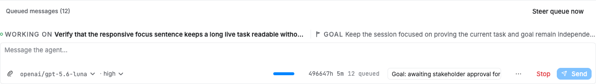
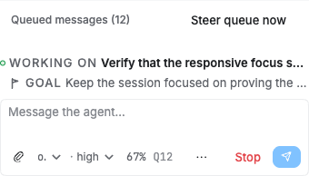

# Focus Sentence implementation screenshots

Captured from `overflowharness.html` on commit `48ed7d5e5`. The harness renders the real Session reducer, Composer component, generated wire model, and production CSS.

## Desktop container

## Narrow 390px container

