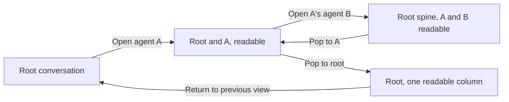

# Automatic agent cascade design

Status: proposed amendment, awaiting Jesse's written review.

## Intent and authority

Opening a subagent on desktop shows its transcript beside its parent's.
Drilling deeper keeps the two most recent scopes readable and collapses older
ancestors into live, peekable spines. The user can follow nested work without
collecting separate transcript tabs or losing the conversation they started from.

Jesse chose **Automatic cascade**: ordinary desktop agent-row clicks enter this
view. This replaces the opt-in entry in the approved
[Zoom activity surfaces design](2026-09-29-zoom-activity-surfaces-design.md), PR 2.
The recovered Zoom prototype at `activity-ux-prototypes`, commit `bea553aab0`,
supplies the column, spine, peek and pop behavior. This amendment governs conflicts
with that older design, particularly its navigation-tree data source and opt-in
entry. Other shipped activity behavior stays intact.

Production currently opens a plain transcript from `AgentsTab`; it has no
`sessionZoom` pane. The merged session-activity APIs supply the necessary delegate
ownership and ancestry. Navigation rows remain shallow and never become an
activity graph again.

## Approach

Use the already approved **dedicated `sessionZoom` pane**, with a reversible
promotion of the source pane. Keep its pane ID, Dockview position and return
context. This lets one host own the cascade geometry while the existing shared
stores own transcripts and activity.

Two alternatives explain the boundary:

- Opening another Dockview pane at every depth preserves today's implementation,
  but cannot produce the prototype's ancestor collapse.
- Building the cascade into the live session editor couples read-only inspection
  to composing and makes every session renderer responsible for column geometry.

The dedicated pane needs a small workspace transition and a lossless handoff of
source-view state. It avoids a new backend, retry owner or transcript engine.

## Entry, drill and return

1. Clicking an Agents-tab row on desktop uses that row's `ownerRef`, `childRef`
   and delegate identity. It promotes the matching focused session or non-job
   transcript pane into the cascade. The ordinary root-to-child case displays
   the root and child inside that same pane, with no extra root transcript split.
2. If the source pane is already a cascade, drilling updates that pane's selected
   leaf. A drill from an ancestor peek truncates the former branch at that owner
   and follows its chosen child. It never appends a sibling below the old leaf.
3. Clicking a breadcrumb or a spine pops to that scope. At the root, the cascade
   shows one readable column. An explicit **Return to previous view** action
   restores the source pane's type and params in place. A secondary cascade's
   normal tab close remains available; a promoted main pane keeps the existing
   main-pane rule, which has no close button.
4. Each readable column has **Open conversation**. It focuses an already open
   full session for that ref or opens one in secondary. When reopening the
   original full session, it restores that source view. Inspection itself never
   sends, resumes, steers or stops work.

If no matching conversation pane is available, such as activity reached from a
job-output pane, open a contextual cascade in secondary and leave the unrelated
source untouched. A second independent conversation pane has its own cascade
intent; drilling does not take over another pane merely because its root matches.

Automatic entry applies to the shared desktop Agents-tab row action and cascade
peek rows. Existing explicit transcript links, job-output opens and full-session
links keep their existing meanings. Mobile agent rows keep their current
transcript behavior. A restored cascade on mobile renders its selected read-only
transcript and return action without columns; returning to desktop restores its
cascade intent.

Opening an agent changes the inspected path. Popping restores the preceding
geometry. Returning restores the original conversation surface and its work.

## Geometry and interaction

- With at least two scopes, show exactly two readable columns: the immediate
  parent and selected leaf. Every earlier ancestor is a spine. Depth counts
  delegate edges: a root plus six descendants yields **five spines and two
  readable columns**.
- Match the prototype's **52px spine**, **400px parent column** and **440px minimum
  leaf column**. The leaf fills spare width. When those widths cannot fit, scroll
  the cascade horizontally and bring the selected leaf into view; keep transcript
  scrolling independent and keep navigation controls reachable.
- A spine shows its name, authoritative state and direct-scope activity counts.
  Its primary button pops; separate count controls open a peek. Keyboard focus
  can open and use the peek. A peek lists that owner's delegates, jobs or watches
  through the same row vocabulary and page boundary as Activity. Tasks peeks
  embed the existing scoped Tasks body, keeping tasks inside the inspector.
- The right sidebar supervises the selected leaf. Reading or selecting text in
  the parent column does not silently pop the path. Parent activity is available
  through its peek; explicitly popping makes that parent the selected scope.
- The cascade footer describes its selected leaf. Existing normal session panes
  keep their explicitly bound footers. Activity-opening controls publish the
  selected ref before the shared sidebar reads focus.
- User-initiated drill, pop and spine expansion use the existing motion wrapper,
  `--motion-duration-spatial` and `--motion-easing-standard`. Reduced motion makes
  the same geometry changes instant. Status updates, reconnects and late ancestry
  never animate geometry or move keyboard focus.
- Escape dismisses the topmost claimed transient surface first. Closing a peek
  does not also close the sidebar or pop the cascade. Popping is an explicit
  navigation action, not a new competing Escape listener.

## Sources of truth and saved intent

The cascade's pane params retain the **requested leaf ref**, the source pane's
return descriptor, and owner-qualified edges the user actually followed. These
edges record navigation intent, not a second activity database. Persist no
activity rows, transcript contents, continuation cursors or retry state in the
workspace layout. There is no separate root-global cascade store.

Derive the displayed path from the selected session's activity context:
`ancestors` in root-first order, followed by the selected session. Trust the full
path only when `ancestryKnown` is true. While ancestry is being reconstructed,
already accepted delegate edges can display the proven parent-child portion;
identify the preceding ancestry as incomplete. Unknown ancestry never establishes
a root, and an empty downloaded page never establishes a leaf.

Keep public routing aliases separate from resolved session identities. Saved
refs remain the requested bindings; returned identities qualify ownership and
reconciliation. An alias resolving to a new session retires the previous drill
branch before showing replacement evidence. A new cursor epoch for the same
session preserves useful rows and reading intent.

Workspace updates are targeted. Entering, drilling, popping, returning and opening
conversation controls must not call the whole-workspace-clearing
`replacePrimary` path. Unrelated documents, job outputs and other conversation
panes keep their IDs, params and positions. Layout save/restore retains the leaf,
clicked edges and return descriptor, then re-establishes authority through the
shared readers. Invalid cascade intent does not discard healthy saved panes.

## Reading and work preservation

Extract the reusable read-only thread content from `Transcript.tsx` rather than
copying or replacing the transcript implementation. Ordinary transcript panes
and cascade columns share `useTranscript`, `TranscriptBody`, projection, older
history and the scroll coordinator. The cascade owns one pane scaffold; columns
supply their own headers without registering multiple scaffolds for one pane ID.

Use distinct view identities for each pane/ref reading surface. Keep semantic
reader anchors outside column mounts, so a column can collapse to a spine and
return at its previous position. Associate history demand with the retained
cascade path: collapsing pauses that view's reads, reopening resumes its pending
intent, and popping removes only the abandoned views. Jump to live must not
cancel an independently open view of the same ref. Extend the existing transcript
consumer membership where necessary; do not create another history scheduler.

Pane promotion must preserve source drafts, selected skills, staged attachments,
pending attachment encoding, queued input and recovery identity. Text drafts
already persist by ref. The current Composer uses `useAttachments(textEditor)`
without a retained backing store, so unmounting it alone would lose staged image
bytes. Retain that source-view state for the original pane lifetime using the
existing attachment-store seam; keep asynchronous encoding and recovery bound to
the original draft. Image bytes never enter layout JSON or localStorage.

Source restoration must not resubmit accepted input, clear a newer draft or
retarget pending files to a child. The implementation plan must prove this
handoff before wiring automatic entry. Composing inside cascade columns remains
out of scope; the full-session action restores the appropriate editing surface.

## Activity demand and recovery

Reuse `useSessionActivity(ref, "session", collection)` and its shared
per-client/ref/scope owner. Collections list that session's direct logical
resources. Use neither navigation children nor subtree rows to guess each level's
children or completeness. Fork provenance does not become a delegate edge.

Readable transcripts retain their normal thread and activity bindings. Spines
observe summaries only. A committed open peek observes just its displayed
collection, and its visible page boundary supplies further demand. Closing the
peek releases that collection demand. The cascade does not prefetch every
ancestor collection or recursively load the entire subtree. Subscription leases
remain additive across transcripts, footers, sidebar and peeks. A Tasks peek
observes its scoped thread through the existing Tasks binding only while open.

Unknown counts render as unknown. Partial and empty progress pages retain their
continuation. Delegate rows remain drillable after idle runtime release, and
archived navigation placement does not exclude activity. Temporary failures keep
readable content and the selected path while the existing owners retry.
Unavailable ancestry does not block the addressed child's transcript. A proven
missing child receives a scoped explanation; other columns, Return and full
conversation controls stay usable.

## Implementation boundary

- `src/panes/zoom/`: pane registration, path presentation, columns and spines.
- `src/shell/workspace.ts` and `DockHost.tsx`: reversible promotion, selected-ref
  publication and serialization through existing pane ownership.
- `src/shell/activitybar/AgentsTab.tsx` and shared breadcrumbs: desktop cascade
  entry and in-cascade pop/drill callbacks; normal navigation remains available.
- `src/panes/transcript/` and `src/panes/session/transcript/`: shared read-only
  content and retained reader membership, with the current paging owner.
- `src/panes/session/composer/`: lossless source-view handoff using existing draft,
  attachment and recovery ownership, with no new mutation or recovery authority.
- `docs/product/session-activity.md`, the Browser workspace row in
  `docs/product/subsystems.md`, and `docs/web-ui/design-system.md`: update the
  durable behavior and geometry contract in the implementation change.

All `src/` paths above are under `cmd/evener-hub/frontend`. No new dependencies,
AppWire methods, provider behavior or navigation-tree format are required.

## Acceptance and evidence

Implementation proceeds red-first through the real production stores and
components. Scripted responses belong at the transport or provider boundary;
tests never mock the cascade, transcript, activity store or ownership logic.
At least the root → child → grandchild browser journey runs through real
daemon and hub AppWire handlers, with a scripted provider driving real delegates.
A frontend fake cannot supply that end-to-end journey's activity or transcripts.

Required journeys and failure cases:

1. Root → child → grandchild enters automatically in the same source pane, then
   collapses root to a spine. Six delegate edges render five spines and two
   columns. No extra transcript pane is created at each depth.
2. Peek an older ancestor, page its direct delegates and choose a different
   branch. Pop through every level and return to the exact source view. Counts,
   sidebar category and scope remain correct.
3. Exercise retained and archived nested delegates through the real collector
   and hub routing. Navigation payloads contain no fabricated activity children.
   An initially empty incomplete delegate page progresses to a drillable child.
4. Lose and restore the connection with columns, a peek and sidebar sharing a
   ref. Recovery resumes through the shared owners without duplicate membership,
   lost page extent, stale descendant rows or reads for closed peeks.
5. Enter and return with a text draft, selected skills, a staged image, an encoding
   image, queued input and an unresolved submission outcome. Restore each to the
   original recipient without losing files or sending input twice.
6. Collapse and reopen a scrolled transcript during older-page recovery. Its
   anchor and pending demand survive; another view of that ref remains independent.
   Save/reload the layout and prove the selected path and return descriptor survive.
7. Verify focus, keyboard peek/paging, single Escape dismissal, narrow desktop
   overflow and instant reduced motion in a real browser. Mobile keeps its
   existing agent action and can read a restored cascade's selected transcript.

The data audit already ran the real nested collector and retained public-route
checks, including `TestSessionActivityRealDelegateTree` and
`TestSessionActivityRetainedPublicHierarchyAndSourceFences`, successfully at
`6b5a2e755982c7a8c83d97a2615ab7d1c8e22bfb`. Those checks establish API support,
not cascade behavior. Live socket relay, dedicated archived-activity coverage,
frontend cascade behavior and browser geometry remain unverified.

Before delivery, run the targeted suites and the canonical `make test-web` gate.
Run `make test-web-browser` for real geometry, plus the affected Go checks when
adding producer-boundary evidence. Follow the repository's CI and review gates
for push and merge. A fixture-only screenshot or passing mock cannot establish
that the production nested journey works.
