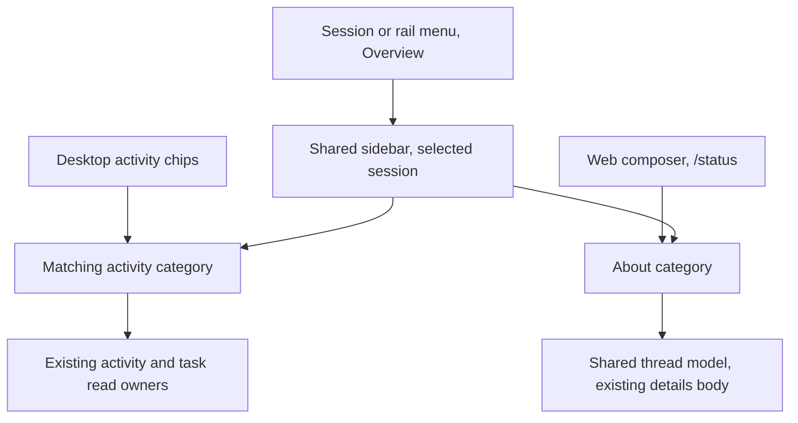

# Web session Overview

## Intent and agreed scope

Give each session one primary inspection surface for its work and its identity.
The session and rail action menus open **Overview**, with **About** as the last
category beside Agents, Jobs, Watches, and Tasks. About contains the existing
session details. Remove the separate Details menu item.

Jesse chose consolidation on desktop and mobile, with existing saved Details
workspace panes left unchanged. Details and Activity panes have no standalone
URLs. Jesse chose to retire legacy Activity workspace panes without migration:
their saved placements disappear, while underlying session and activity records
remain. The web `/status` command opens About. Jesse rejected a playful name and
asked for a clear one. Use **Overview** for the combined surface and its menu
action.

This spec describes intended behavior. The evergreen product guides continue to
describe shipped behavior until implementation and verification.

## Current implementation

- `shell/activitybar/ActivitySidebar.tsx` renders the shared four-category sidebar.
  Desktop uses a 320px shell region. Mobile presents the same sidebar full-screen.
- `shell/activitybar/activityTabs.tsx` supplies category labels, counts, bodies,
  and status-footer chips. `StatusBar.tsx` renders only chip-visible categories.
- `shell/activitybar/activitySidebarStore.ts` owns per-session open/category
  intent, bounded persistence, explicit opening, focus, and return-focus intent.
- `shell/sessionMenu/SessionMenu.tsx` supplies both rail and session action menus.
  It currently offers separate Details and Activity actions.
- `panes/session/chrome/DetailsPanel.tsx` contains the stateless
  `DetailsPanelBody` and a separate mobile Sheet wrapper.
- `panes/sessionPanels/SessionPanelPane.tsx` already reuses that details body in
  a separately hydrated workspace pane.
- `shell/palette/commands.ts` implements the web `/status` command by toggling
  the separate Details pane. Session commands execute through the composer.

Frontend paths above are relative to `cmd/evener-hub/frontend/src/`.

## Approach

Extend the existing shared sidebar and reuse `DetailsPanelBody` for About.
Keep the current activity read owners, category bodies, and view store.

A separate About sheet would preserve two inspection surfaces and miss the
requested consolidation. A new all-purpose workspace pane would replace the
existing sidebar, alter saved layouts, and add navigation work this change does
not need. Extending the sidebar achieves the requested result with the smallest
change.

Opening from a session menu preserves the current per-session category choice.
A status chip selects its existing category. `/status` explicitly selects About.
All three paths inspect the intended session, including when another pane had
focus before the action.

## User-visible behavior

### One menu entry

Both session chrome and rail menus replace Activity with Overview and remove
Details. Preserve the existing optional active-job-plus-delegate count, unknown
count handling, checked state, and opening/toggling behavior. Rename, Verbosity,
Pin, Archive, Delete, Stop, Steer, and shutdown behavior stay unchanged.

Use Overview in the combined sidebar's accessible name, category control label,
close control, status-chip descriptions, and mobile overlay description. Keep
resource-specific text such as “Loading activity…” and “No retained activity yet”
where it describes activity data. Do not rename the transcript's Activity detail
level, domain APIs, storage keys, route identifiers, or every occurrence of the
word Activity.

### Five categories

Keep the order **Agents, Jobs, Watches, Tasks, About**. The first four retain
their category counts and existing bodies. About shows only its label, with no
count and no status-footer chip. Preserve existing keyboard selection and
visible focus through the shared category-control widget.

The five categories must remain legible and reachable inside the 320px desktop
sidebar and on narrow phone screens, including the supported XL font preference
and multi-digit counts. Adapt the tab strip locally if needed; retain the
existing sidebar width, design tokens, and touch-target floors.

### About content

Use the same details body as the existing Details pane, preserving:

- Session: model, lifecycle state, and session ID.
- Usage: measured live context, work time, token accounting, and server-supplied
  cost. Work time advances during an active turn.
- Location: working directory, distinct project path, branch, start time, and
  last activity time.
- Omission of unavailable values and empty sections, partial-token labels, and
  suppression of live context for ended or closed sessions.

Full model identifiers, session IDs, branches, and paths must remain readable
and selectable at sidebar and phone widths. Use wrapping or contained scrolling
rather than silent clipping. Keep necessary presentation changes local to the
details content instead of redesigning every inspector widget.

Use the sidebar's explicit public session ref for model lookup and hydration,
not the navigation row or a previously focused session. Observe the live thread
model while About is mounted, with the existing shared hydration/subscription
owner. A missing model shows a loading state. Available model evidence remains
useful during disconnection; reconnect follows the thread store's existing
recovery behavior. About adds no lifecycle mutation, provider call, separate
metadata cache, collection demand, or retry owner.

The sidebar's existing summary observation may continue for its scope and other
category badges. Mounting About must not observe delegates, jobs, watches, or
tasks merely to render identity and accounting. Other visible consumers retain
their existing independent demand.

### Opening, selection, and retention

- Overview menus keep the existing shared-sidebar session targeting and
  desktop/mobile toggle behavior. A fresh sidebar starts on Agents.
- Category selection, including About, follows existing per-public-session
  retention across close/reopen, session switches, child/Back navigation, and
  reload. About must not overwrite another category's disclosure or scroll
  intent.
- `/status` opens Overview on About for its explicit command session. Repeating
  `/status` keeps About open. It does not toggle a standalone Details pane.
  Its completion description says “Show session details in Overview” and keeps
  useful details/info search terms.
- Footer counters continue selecting their own categories and focusing their
  owning pane. About introduces no counter.
- On phones, opening from a menu or `/status` moves focus into the named visible
  surface after the opener finishes closing. Sequential keyboard focus stays
  within the full-screen surface until dismissal. Desktop remains nonmodal.
  Reuse the existing focus primitive; a global accessibility redesign is outside
  this change.
- Closing returns focus to a visible, connected opener. If it has disappeared
  or become hidden, prefer the originating pane's visible session-actions
  control, then another visible control for the intended session. Preserve the
  existing owning-pane footer fallback for activity categories. About has no
  footer chip, so a session-qualified menu-trigger fallback is required.
- Switching sessions never shows the previous session's About values, including
  when the target model has not loaded yet. A same-ref session replacement uses
  the thread store's existing identity reconciliation.

## Retired and retained surfaces

Remove the `sessionActivity` workspace pane registration and its production
opening/rendering branches. Saved layouts omit that unregistered pane through
the existing restoration behavior. Do not migrate its position, focus, or
session intent into Overview and do not add a compatibility shim. Restore
remaining registered panes normally, including when Activity was the saved
focused pane. Independently saved Overview choices restore normally for the
surviving session. Valid routes retain their existing precedence over restored
layouts and the empty-workspace fallback. No session, delegate, job, watch,
transcript, or output data is deleted.

The retired pane displays recursive subtree activity. Overview retains its
existing session-scoped categories: inspecting a descendant requires selecting
that session. Retiring the pane deliberately removes its combined subtree view
from saved layouts. Do not silently broaden Overview's read scope to replace it.

Existing saved Details workspace panes keep their registration, title, body,
and loading behavior. Session-panel panes have no standalone URLs, so this
change needs no route migration. Remove the hidden mobile Details Sheet mount
from session chrome once its menu action is removed. Keep implementations used
by retained surfaces and preserve their tests.

The recursive Activity Sheet and hidden activity-discovery owner are distinct
from the retired workspace pane. Preserve their existing trigger/title, read
scope, and restoration contracts where still used. Overview names only the
combined shared sidebar and its entry points. Remove code only when the retired
pane was its last caller; do not replace the discovery or Sheet implementation.

## Non-goals

Native mobile and TUI behavior, backend APIs, activity ownership, counts,
transcript detail levels, session lifecycle, and generic retry behavior are out
of scope.

## Acceptance and proof obligations

1. Real session and rail menus expose Overview and no Details item on desktop
   and phone layouts. Overview still opens the correct session and carries the
   same active count and checked state.
2. The shared sidebar offers the five categories in the specified order. About
   has no count or footer chip. Existing counters still select the right tab.
3. About displays hydrated model, identity, measured usage, cost, and location.
   Exercise live, ended, sparse, and remote-session cases through the real
   renderer. Preserve the existing details accounting tests and absence rules.
4. A clock-controlled active-turn test proves work-time changes while About is
   visible. Model updates are reflected without closing the sidebar.
5. Start on session A, open About, then move to session B before its model read
   completes. A's values disappear immediately; B's accepted values appear.
   Also close or switch away before hydration completes, reopen the same public
   ref, and resolve the old response last. It cannot replace newer model values.
6. About acquires and releases the existing thread holder. An independently
   open transcript remains subscribed. Switching to About releases the previous
   category's collection demand without adding new collection demand. Recovery
   and late-result isolation remain the shared stores' responsibility. Prove
   rich model hydration and model-holder release separately from the summary's
   shared subscription. Deliver a notification after About releases its holder
   and prove an independent transcript still updates. In a sidebar-only fixture,
   invalidate activity or reconnect after switching to About and prove the
   previous category does not reacquire collection demand.
7. About selection survives close/reopen, session/child/Back navigation, and
   reload through existing view persistence. Visit an activity category after
   About and verify its prior disclosure and later-page scroll state remain.
   Rerun existing multiple-page refresh/reconnect retention tests.
8. The real web `/status` execution opens About for the command session on
   desktop and mobile, including repeated invocation and another focused pane.
   Exercise composer submission, not only the command handler. No new Details
   workspace pane or provider turn appears.
9. Existing restored Details workspace panes still render the same body. The
   removal of menu access must not remove their registration.
10. Real menu and `/status` phone flows move focus into Overview and contain
    sequential keyboard navigation. Escape and close restore a visible control
    for the intended session and originating pane. Include a closed phone drawer
    and a multi-pane desktop workspace. Switching from an activity category to
    About does not lose the opener.
11. Browser evidence at desktop sidebar width and 320px/390px phone widths proves
    all five labels and counts remain legible with XL text and multi-digit
    counts. Full long model/session identifiers, branches, and paths remain
    readable and selectable. The close control stays reachable without
    page-wide overflow. Check both themes, visible keyboard focus, and preserved
    touch-target floors. DOM-only tests do not prove geometry.
12. Restore layouts containing Activity plus retained session, Details, and
    other panes through the real workspace host. Activity is omitted without
    losing another pane or creating, transferring, or altering Overview intent.
    Independently saved Overview choices restore normally: cover both closed
    and open-on-About choices. Include Activity as the saved main and focused
    pane; surviving panes render and focus resolves to a useful survivor.
    Activity-only layouts with no valid routed primary reach the existing
    Welcome fallback. A valid session route keeps its existing precedence.
    No resource-deletion calls occur.

Use real components and stores. Script only external transport/model reads and
clocks. Assert visible behavior, store demand, and subscription effects rather
than replacing the sidebar, details body, or view store with mocks.

## Documentation and gates

Update `docs/product/subsystems.md` (Browser workspace),
`docs/product/session-activity.md`, `docs/web-ui/README.md`, and the affected
panel/menu clauses in `docs/web-ui/design-system.md` with shipped behavior in
the implementation change. Historical designs remain historical.

Run targeted frontend tests first. Before final verification, format touched
TypeScript with the frontend's pinned Biome, then run `make test-web` from the
repository root. Run `make test-web-browser` on this Chrome-capable host and add
focused real-browser coverage for the five-category About flow through an
existing gated harness. `src/dev/shellguard-entry.tsx` currently equates category
count with footer-chip count. Update that assumption: assert the four footer
identities independently of the five category identities, not by counting the
unfiltered production registry. Inspect the commands' implementations before
relying on their reported outcomes. CI owns full-repository gates; this change
does not require a long local full suite.

## Review and handoff

Before planning, run parallel read-only adversarial reviews: one for product,
interaction, accessibility, and scope; one for session binding, demand,
retention, test coverage, and implementation risk. Reconcile each actionable
finding into the spec or record a source-grounded refutation. Jesse reviews the
written spec before the implementation plan. Implementation runs inline, then
simplify-code and PR shepherding follow as requested.
