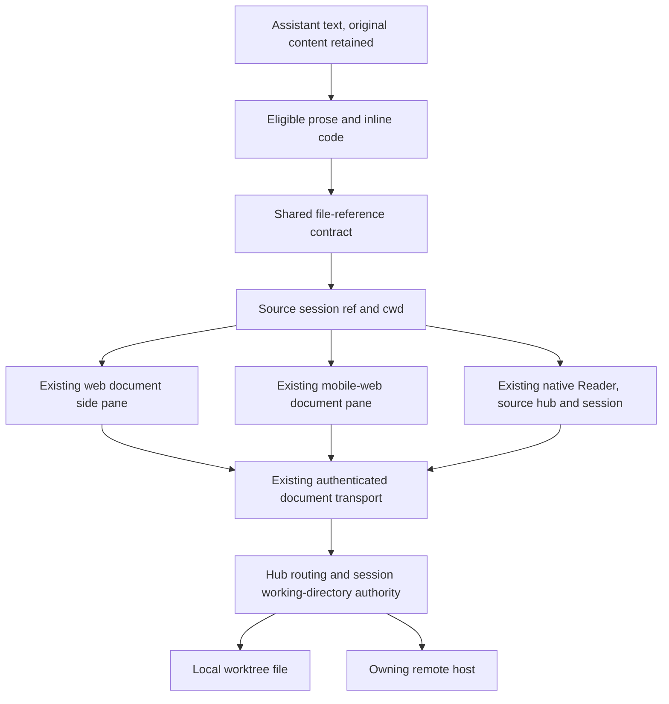

# Clickable worktree filenames

## Intent and approved scope

Jesse wants to open files named in Evener's replies without copying a path or asking the agent to display the file. These plain-text examples must work:

```text
Spec: docs/superpowers/specs/2026-10-02-web-session-overview-design.md
Review: docs/superpowers/specs/2026-10-02-web-session-overview-review.md
```

Jesse approved assistant messages first: plain paths, inline-code filenames and Markdown links, including remote sessions. Desktop opens the existing document pane beside the conversation. Mobile web opens that pane full-screen. Native opens its existing Reader, with Back returning to the originating conversation.

When opening from a secondary delegate conversation, Jesse chose to keep the clicked delegate visible: promote that exact conversation to the main column and open its document beside it. Retain the prior parent conversation so it can be selected again without losing its work. This explicit file-opening action is a narrow exception to the ordinary parent-pinned layout; opening a delegate itself keeps its existing placement behavior.

The feature reads the current file. It does not recover the version that existed when a message was written. Recognition identifies a possible file reference; it does not claim that the file exists.

### Out of scope

- Editing, downloads, a new filesystem browser or a new document viewer.
- Recognizing paths in user messages, tool-output bodies, parent-side delegate reports, diagrams or fenced/indented code blocks. Existing tool-file actions remain.
- Reading outside the source session's working directory, reading arbitrary URLs, or searching other worktrees for a missing file.
- Persisting a directory snapshot on every message, historical file contents, document deep links or line highlighting.
- Turning structured artifact handles into filesystem paths.

A delegate's own conversation is in scope when its assistant message has that conversation's explicit session binding. A child report embedded in its parent's conversation is out of scope because its file ownership cannot be inferred from the parent.

## Existing implementation

### Shared transport and filesystem authority

`appwire-client/typescript/docContent.ts` provides `cwdRelative`, file/image classification, `readDocFile`, and document URL builders. `DocPort` owns origin and credentials. Raw text is capped at 512 KiB, with binary, truncation, revision and modified-time metadata.

`cmd/evener-hub/doc_serve.go` serves `/doc/file?format=raw&session=...&path=...` and `/doc/image`. It resolves a session's working directory, validates symlink containment, and opens regular files beneath an `os.Root`. Host-qualified session refs route through `doc_proxy.go` to the owning host. The client must use this authority instead of reading a device-local path or navigating to a transcript-supplied origin.

Worktree entry updates the session environment in `agent/session_tools_worktree.go` and `agent/session_env_swap.go`. The daemon's live `Thread.CWD` still comes from launch status in `server/appwire_runtime.go`; `server/bridge.go` does not publish environment changes. Hub hydrate/list overlays replace only an empty cwd. Reconnecting therefore cannot repair a nonempty launch cwd. Document-root selection also prefers cached past metadata over the live roster. Correcting this publication and read-authority gap is required for useful worktree links, not an assumed existing behavior.

A successful environment switch must publish the installed environment's working directory into the live thread projection and invalidate its owning client's directory binding. The owning host's document routes must resolve the current live working root ahead of cached past metadata. Archived reads use current persisted session metadata without a stale cache winning over a newer value. Project grouping and restore-directory metadata remain separate. Real enter/switch/exit, hydrate and reconnect tests must prove this producer-to-client and producer-to-read path.

### Web

`AgentMarkdown.tsx` enhances sanitized Markdown anchors using `fileDocParams`, `paneActions.openBeside` and `OpenButton`. It does not recognize ordinary text or inline code. Its local-session-only guard contradicts the remote-capable document routes.

`DocPane` renders text, sanitized Markdown, images, binary and truncation notices. The desktop workspace opens it in a secondary group. Mobile `StackHost` renders the same pane full-screen. Existing document panes are identified by session, path and kind. Path aliases such as `./docs/a.md` currently produce separate identities unless normalized before opening.

### Native

`MarkdownResponse.tsx` uses `EnrichedMarkdownText` and routes links to HTTP/HTTPS opening or an unsupported-destination alert. `screens.tsx` already opens Reader from document chips using explicit `hubId`, `sessionRef` and path.

`reader/documentReferences.ts` discovers inline code and Markdown link targets for chips, but misses plain prose. Its basename discovery requires a successful write by the session. `reader/documentSource.ts` refuses remote text before calling the remote-capable shared transport.

`reader/useDocument.ts` reloads on foreground and controller readiness, and exposes a programmatic reload callback. Reader's Document actions menu has no Reload action yet. The hook retains content during a refresh and guards late publication with generations. Identity changes currently need stronger coverage to ensure old content cannot appear under a new file's title. Neither controller readiness nor foreground alone signals a remote SSH attachment's recovery.

## Chosen approach

Use one framework-free file-reference contract in the shared TypeScript client, with small web and native rendering adapters. Reuse the document transport, pane and Reader.

Recognition runs locally during rendering. It performs no existence checks and fetches no files. A click starts the existing authenticated read. This avoids a request for every path in a streaming reply and keeps recognition independent of host availability.

Alternatives considered:

1. Verify every path before showing a link. This adds background reads, stale existence caches and streaming delays without eliminating races between recognition and opening.
2. Require the agent to emit Markdown links. This leaves existing messages and Jesse's plain-text examples unchanged.
3. Add a filesystem browser or a new viewer. Existing viewers already cover this use case.



Adapters select eligible text. The shared contract validates and normalizes destinations. Navigation retains the source identity. The hub decides which filesystem may satisfy the read.

## File-reference contract

Keep the pure path parsing and text-span recognition alongside the existing shared document helpers, or in a dedicated module exported through the established package conventions. It has no React, DOM, React Native, network or Markdown-parser dependency. Both callers import it by package name.

### Recognition grammar

| Input surface | Recognize | Leave unchanged |
| --- | --- | --- |
| Ordinary prose | A slash-separated relative or contained absolute path whose final filename has an extension, such as `docs/plan.md`, `./src/main.go`, `/work/tree/docs/plan.md` | Bare dotted words, domain names, version numbers, directories, extensionless names and ambiguous partial paths |
| Inline code | The entire code span is one path. Accept a dotted basename such as `README.md`, or a slash path with a nonempty filename, including `src/Makefile` | Commands, expressions, whitespace-containing spans and directory paths |
| Markdown link destination | Explicit relative or contained absolute file targets, including extensionless names and percent-encoded spaces | HTTP/HTTPS URLs, other schemes, protocol-relative URLs, query-only/fragment-only targets and malformed percent encoding |

Do not match a path-shaped substring inside a URL, email address, scheme-prefixed token or a longer invalid path. For example, `https://example.test/docs/plan.md`, `mailto:a/docs/plan.md` and `../docs/plan.md` must not yield a shorter clickable `docs/plan.md`.

Validate candidate boundaries across adjacent inline text and formatting nodes/tokens within a block. A DOM or Markdown-token edge is not a word boundary: `../**docs/plan.md**` and `https://host/**docs/plan.md**` stay unchanged. A candidate split across formatting spans may remain text; never link a shorter suffix merely because it occupies one span. Existing anchors, code blocks and entity controls are not eligible spans.

Trailing `.`, `,`, `;`, `:`, `!`, `?` and a terminal Unicode ellipsis (`…`) are excluded from an ordinary-prose match. Then strip a numeric location suffix before path validation, so `docs/a.md:12.` opens `docs/a.md`. Whitespace, surrounding straight/curly quotes and brackets delimit candidates. Other Unicode filename characters remain data. Parentheses inside an undelimited candidate make the whole candidate ambiguous, including `docs/foo(bar)/plan.md`; an explicit Markdown link can name such a file. Use an explicit link to disambiguate filenames ending in sentence punctuation.

The recognizer handles ordinary Unicode filename characters. Reject control characters, backslashes, protocol-relative paths, empty names and `..` path segments. This client-side filtering preserves the existing worktree-only affordance; the server remains the filesystem authority.

### Path meaning and normalization

- Prose and inline-code references are literal filesystem text. Do not percent-decode them. `docs/100%25.md` names exactly that file.
- Markdown destinations are URI references. Reject schemes and protocol-relative destinations first. Remove raw query/fragment metadata and a supported raw pathname line suffix, then percent-decode the pathname once and validate it. Encoded `:`, `#` and `?` remain filename data; never strip them after decoding. Never decode twice.
- Reject `..` segments before lexical normalization. Collapse `.` segments and repeated separators within accepted paths, including leading `./`, so `docs/a.md`, `docs/./a.md` and `docs//a.md` share a normalized path. A leading `//` remains forbidden. Do not resolve symlinks during recognition. Derive a cwd-relative display/dedup path from a contained absolute target only on a separator boundary, never from a sibling prefix such as `/work/tree-other`.
- `..` is rejected rather than guessed away. A missing cwd or missing/invalid session binding leaves the text untouched. When hydration supplies the binding, recognition updates without changing the recorded message.
- Strip numeric `:line` and `:line:column` suffixes from literal references before path validation. Thus inline `README.md:12` opens `README.md`. Link `README.md:12` is scheme-shaped and stays unchanged; `./README.md:12` opens `README.md`, while `./README.md%3A12` names the literal colon filename. Raw link `#Lline` is fragment metadata; encoded `%23Lline` is filename data. Literal hashes and question marks are not URI metadata. Opening at or highlighting a line is deferred.
- Images use the existing image route and classification. SVG remains text. Unsupported binary files retain the existing notice.

Recognition rejects syntactic directory forms such as a trailing slash, `.` and `..`. It cannot tell whether `docs/archive.md` is a directory without reading the filesystem. If opening discovers a directory, use the existing non-regular-file failure state.

### Display path, cwd binding and read target

Keep three values distinct: the normalized cwd-relative display/dedup path, the source session's hydrated cwd binding, and the absolute read target. Retain whether the reference was relative or absolute. A relative reference's read target joins that render's cwd with its normalized path. A contained absolute reference retains its absolute target after lexical/location normalization. Neither an in-flight read nor Reload silently rebases a captured target onto a later cwd. The source hub/session chooses the document port; transcript text never supplies that authority.

A visible viewer subscribes to its owning session's directory publication. When that publication acknowledges A→B, invalidate A's read generation and clear A's content. A viewer opened from a relative reference explicitly replaces its cwd binding and read target with B's current-relative target as a new read identity. An absolute A reference keeps its absolute target and becomes unavailable if outside B; it never gets reinterpreted as B's same-named file. Reopening a B reference may explicitly replace either viewer's binding through normalized-path deduplication. These are viewer-state transitions, not transport rebasing or message-time snapshots.

The server accepts an absolute target only inside the source session's current root. If the trusted cwd itself is a symlink alias, normalize only that current trusted root prefix, on a separator boundary, to its resolved root before the existing target containment checks and `os.Root` open. Canonical-root absolute and relative spellings also work. Never normalize arbitrary request-provided aliases or old worktree roots. Keep the trusted cwd spelling in the render binding so paths written with that alias remain recognizable.

### Current working-directory semantics

An action is bound to the message's owning session, never the globally focused session. At each render, references use that session's current hydrated cwd to capture a read target. The server validates that target against the same session's current working directory at read time. The viewer shows current file contents, not a message-time snapshot.

An absolute reference outside the session's current working directory stays text. If the session later leaves a worktree, this feature does not broaden the file endpoint to read its old absolute paths. Historical workspace selection is a separate product decision.

Publication must repair the current stale-launch-cwd construction. A transient delay may still occur between a committed switch and client refresh. During that delay, a captured A target must fail against root B rather than open B's same-named file. After invalidation/hydration, relative references capture B and newly generated absolute B references become useful. Do not fall back to a different session, old root or checkout to hide a missing file.

## Web interaction and ownership

Extend the assistant-only `AgentMarkdown` enhancement seam. Keep the shared Markdown renderer's sanitization and URI policy unchanged. Process eligible text nodes in paragraphs, headings, lists, tables and blockquotes. Inline code is eligible only when its whole text is a recognized path. Skip existing anchors while scanning text, `pre`, Mermaid containers and mounted entity controls.

For explicit local-file anchors, use the shared destination parser and existing document action. For generated references, preserve their visible spelling and inline-code styling while making the filename itself keyboard-operable. Retain the existing explicit-link `OpenButton` behavior and disclosure isolation. Do not append a second button to every newly recognized word when the link itself supplies the opening action.

An unmodified primary click or keyboard activation opens the existing document pane beside the originating conversation. Existing modified-click behavior uses the safe hub document URL. External links retain their current behavior.

Pass an exact source-pane context into the opening action. If that pane is secondary, promote that retained conversation pane to main and retain the previous main pane in the workspace, then show the document in secondary. Preserve both conversations' drafts, scroll and retained identity across placement changes. Do not replace the parent with a newly constructed delegate pane or introduce a third column. A source already in main keeps its placement. Focus alone never selects an opening source.

Normalize the path before forming document params. Session and normalized relative path determine pane deduplication; the separate cwd/read-target binding determines which file it reads. Stripping line suffixes keeps different line references to the same file from opening duplicate panes. Reopening an existing pane with the same binding focuses it and refreshes it for current contents. Reopening after cwd A→B replaces its binding and invalidates old content/publications before focusing it. The source conversation stays visible on desktop.

Store document return ownership with retained workspace state, separately from deduplication params. Every explicit open, including reuse, records its exact source pane as the latest Back destination. Preserve that record across breakpoint and host-component changes. If the source pane has been closed, use existing navigation to open the document's bound source session; never return to an unrelated focused session. Other explicit navigation keeps its existing behavior.

DOM enhancements must be reversible and idempotent across React StrictMode, hydration, streamed updates, settled transitions and context replacement. Cleanup removes generated nodes/listeners and restores original content without replacing DOM owned by a newer render. An eligible whole-file span takes precedence over an entity ID substring, such as `reports/dlg_02wMz5TxvEMoJEDTDGOTil.md`. Coordinate both passes' restoration and invalidation when source text, session binding or cwd changes. Hydration without a text change must restore original text before recognizing files and then unrelated entities; skip neither the new filename nor a standalone entity elsewhere.

Mobile web uses the existing full-screen document pane. Retain the originating pane as its Back destination, including a desktop-to-phone breakpoint change while a file is open. Do not infer that destination from whatever session is focused later.

## Native interaction and ownership

Pass an explicit file-opening context from the owning conversation into assistant message rendering. It carries the source cwd and an opening callback already bound to `{hubId, sessionRef, sessionTitle}`. Tool-evidence and user-text callers do not receive this context.

Use the native Markdown adapter to expose recognized prose and inline-code paths through the renderer's existing link events. Keep the original message for Copy response, accessibility and message actions. Preserve existing Markdown constructs, reference definitions, escaped syntax, fenced code and Mermaid segmentation. A transform must operate on eligible Markdown tokens or source spans, not a regex over the whole Markdown string.

Generated destinations are local rendering identifiers, not external URLs. A tap validates the identifier against that render's recognized references and calls the conversation-bound Reader action. Existing relative Markdown file links use the same parser. The native adapter resolves Markdown escaping/entities exactly once before passing the resulting URI reference to the shared destination parser. The web DOM adapter already has that resolved representation and must not decode Markdown entities again. Literal prose/code paths receive neither Markdown-destination entity decoding nor percent decoding. External HTTP/HTTPS links keep their existing browser behavior. No recognized filename is passed to `Linking.openURL`, and no transcript URL selects the document port or receives a hub token.

Tap-to-open is the required new native action. Preserve ordinary response holds, Copy response, text selection and existing external-link actions. If the pinned renderer emits a recognized file-link long-press event, offer Open file and Copy path using the displayed path's meaning, never an internal rendering identifier. Guaranteed file-link holds, changing assistant `selectable={false}`, and native renderer patches are outside this first feature. A parser or invoked callback cannot establish actual UIKit gesture arbitration; report unavailable device qualification explicitly.

Reuse Reader and its navigation contract. Align document-chip discovery with the shared path parser and add plain-prose discovery so settling the message does not produce contradictory destinations. Keep the existing chip policy for bare filenames that require write evidence; that chip policy is distinct from an explicitly backticked filename's inline action. Preserve write ages and file/artifact lists.

Remove the native remote-text preflight refusal. Let the existing authenticated document read return content or its typed error. Map the transport's `host-unsupported` result from HTTP 501 to a distinct unsupported-host explanation, rather than native's generic `failed` state. HTTP 503 remains a retryable transient failure. This feature adds no version fallback or alternate protocol.

## Reads, recovery and preservation

The file-opening action retains its source hub/session, display path, cwd binding and read target until explicitly replaced. Navigating to another file, rebinding a retained pane after a cwd change, or replacing the hub origin invalidates publication by the old read. Never show file A under file B's title, or content from a previous hub as content from its replacement. Reload retries the captured target; it does not silently reinterpret an old target as a different worktree's file.

Use existing connection/foreground signals for a visible viewer's read recovery. On a transient refresh failure for the same identity, retain already displayed content and its explanation. On an identity change, clear previous content before loading the new file. A newly acknowledged cwd counts as replacement, with the relative/absolute transitions defined above. A missing/forbidden file uses its distinct error state and can be retried after the underlying file or permission changes. Add Reload to Reader's existing Document actions menu and to the web viewer's existing action surface, without a new retry toolbar. Viewer recovery must not disturb conversation drafts or scroll.

Retain recovery demand for transient failures while the viewer is visible and the app is foregrounded. A remote attachment can recover while its controller remains ready, so use scoped, capped-backoff retries rather than depending on a nonexistent attachment subscription. Retry after 1, 2, 4, 8 and then 15 seconds, capped at 15 seconds, with at most one read in flight. Stop on success, typed terminal failure, identity replacement, close, hiding or backgrounding; resume useful reads on visibility/foreground/controller recovery. Retry the viewer's captured source and target only. Unrelated host events never reload it. Image failures without typed status use the same bounded retry interval while visible; expose an honest unavailable-image state. Keep typed 403/404/501 handling for the text transport distinct from retryable failures.

Add the minimal missing web recovery ownership rather than a second document cache. Native retains foreground/reconnect behavior with connection signals scoped to the Reader's source hub. Cleanup retires listeners, retry timers and stale publication after close.

Keep the 512 KiB cap, binary notices, truncation notice, safe Markdown rendering and image behavior. A successful read is the existing endpoint's bytes, not HTML from an external site.

Viewer image reads use a fresh, viewer-owned request generation on explicit open/reopen, Reload, directory replacement and recovery refresh. Include that generation in the authenticated image request URL so the existing 60-second image cache cannot satisfy a new viewer read with old bytes. Reset failed-image and late-publication state for a replacement generation. Keep a healthy image during a same-identity refresh until its replacement loads. A retry attempt increments the request generation without resetting its backoff or retained same-identity content. Ordinary transcript-image preview caching remains unchanged. Native image load/error events belong to the same source binding and read generation; a text reload callback alone does not refresh an image.

## Verification and acceptance

Read `docs/developing-evener/testing.md` before changing tests. Each implementation unit starts with a failing behavior test, then the minimal production change. Tests must exercise the actual parser, actual navigation/state and real temporary worktree files where filesystem routing is claimed.

### Shared parsing matrix

- Jesse's two exact plain-text examples, multiple paths, surrounding punctuation, Unicode, lexical aliases and contained absolute paths with separate normalized/display and read-target values.
- Inline-code basenames and extensionless slash paths; inline commands remain code.
- Explicit links, reference links and percent-encoded spaces.
- Literal percent signs versus URI decoding, malformed escapes and encoded traversal/separators/control characters.
- Out-of-cwd paths and sibling-prefix paths, missing cwd, invalid refs, protocol-relative paths, schemes, domain names, email addresses and URLs containing filename-shaped substrings.
- Line/column and fragment suffix order, encoded colon/hash/question-mark filenames, distinct literal percent sequences, and syntactic directory rejection.
- Adjacent formatting spans in invalid traversal/scheme tokens, interior parentheses, curly quotes and terminal ellipses. Prove no shorter partial path becomes clickable.

### Web behavior

- Render both example paths, click the filenames themselves, and assert the originating session remains in the main pane while the document opens beside it.
- Exercise streaming, hydration, StrictMode and context switches. Assert one action per reference and no stale opening callback or accumulated generated links.
- Preserve external links, modified clicks, diagram links, fenced code, entity controls and sanitization.
- Hydrate cwd after rendering a whole filename containing a delegate ID beside a standalone delegate ID. Exercise the real Markdown/entity pipeline and prove filename precedence, independent entity controls and exact restoration.
- Assert no document fetch during recognition. Open a file that does not exist and prove the viewer shows the typed failure without losing the conversation.
- Open the same file through aliases and location suffixes without a duplicate pane.
- Reopen a retained session/relative-path pane across cwd A→B with conflicting files and a delayed A response. Replace its read binding and prevent stale content from publishing.
- Open from a secondary delegate conversation with the actual workspace/host components. Keep that delegate visible in main, show its document beside it and retain the parent with draft/scroll preserved. Reuse the document from another same-session pane context, change focus and cross the breakpoint. Back returns to the latest exact opener without duplicate documents; closing that source uses the bound-session fallback.
- Real browser: desktop geometry, mobile full-screen opening and Back, breakpoint crossing, wrapping, keyboard activation and focus. Existing DOM tests alone do not prove geometry.

### Native behavior

- Tap recognized prose, inline-code and explicit-link references through the Markdown event path and assert Reader navigation carries the source hub, session and normalized path.
- Verify emitted file-link long-press wiring without claiming device gesture support, external-link behavior, unchanged Copy response, streaming updates, code/diagram exclusion and reference definitions. Device qualification must check ordinary response holds and generated/file/external link taps separately.
- Prove discovery chips and inline actions agree on path identity, while preserving chip write-evidence and age rules.
- Exercise Reader switching A to B with deferred reads, hub-origin replacement, route disposal, disconnect/reconnect, foreground recovery and source-hub isolation. Assert old content never appears as the new identity.
- Verify local and remote text/Markdown/image reads and typed 403/404/501/transient failures. Retain existing binary/truncation coverage.
- Use the real native Markdown parser for destination-generation proof. A test double emitting a desired URL proves event wiring only. Simulator/device touch, accessibility and Back behavior require separate qualification; report when that environment is unavailable.
- Run production adapter output through the pinned parser for Markdown entities, nested entity-looking filename text, escaped punctuation and percent encoding. Compare resulting paths with web DOM destinations.
- Keep Reader mounted after a missing file appears, create the file, activate its actual Document actions Reload item and prove useful content returns.

### Recovery and image freshness proof

- Hold the controller connection continuously ready, fail only the owning remote attachment, and prove a visible failed read becomes useful through capped-backoff recovery after attachment restoration. Unrelated host recovery does not trigger a read. Assert foreground/visibility demand, single-flight requests and timer cleanup with a controlled clock.
- Keep one viewer mounted across a source-session cwd change. Defer the old read and fail the first replacement read before recovering. Clear old bytes at the acknowledged switch, not only after a new click succeeds. Cover relative-follow-current and absolute-outside-current transitions separately.
- Use real browser HTTP caching to open two successive versions of one image at the same session/path. Include explicit reopen, Reload, failed-image recovery and a same-path worktree switch. Qualify native Image cache and touch behavior separately; a URL-builder assertion proves construction only.

### Server and active-worktree proof

Create a real temporary Git checkout and linked worktree with a document found only in the worktree and a conflicting same-path launch-checkout file. Exercise successful enter, switch and exit through the session directory-switching path and the actual document-serving path. Verify live thread cwd, hydrated client cwd and returned bytes agree, locally and at the owning remote host. Warm cached past metadata with root A, switch to B, and prove the cache cannot keep either publication or reads on A. Reconnect/hydrate and verify absolute B paths use B.

Delay client hydration across A→B. A's captured absolute target must fail against B; it must never return B's conflicting bytes. After hydration, reopening the relative path binds to B. Test trusted cwd `alias→real`: relative, trusted-alias absolute and canonical absolute targets return the same bytes; alias sibling prefixes, old-worktree targets and escaping child symlinks remain forbidden. Replace a child symlink before open to verify final containment still holds.

Retain and run server tests for traversal, symlink escape, non-regular files, local/remote routing and read caps. Existing remote-route coverage establishes transport routing; it does not by itself prove active-worktree metadata publication.

### Gates and documentation

Fast tests cover touched web/shared/native modules and hub document routing. After formatting touched files with the correct pinned Biome, run `make test-web`, `make test-web-browser`, native targeted tests/typecheck and affected Go tests from the repository root as appropriate. Let CI own the full repository gates per `AGENTS.md`.

Update `docs/web-ui/design-system.md`, `mobile-native/README.md`, the shared client package README if its exports change, and the affected S02/S03/S05/S06/S13 rows in `docs/product/subsystems.md`. Document current-worktree semantics and recovery ownership in an evergreen guide. Keep this spec and the review artifact as design history.

After implementation, run the requested four-reviewer simplify-code workflow, behavior-preserving cleanup and verification. Create the feature PR and shepherd its CI and current-head RoboRev findings to the repository's authorized merge conditions. No deployment or running-hub restart is part of this request.
