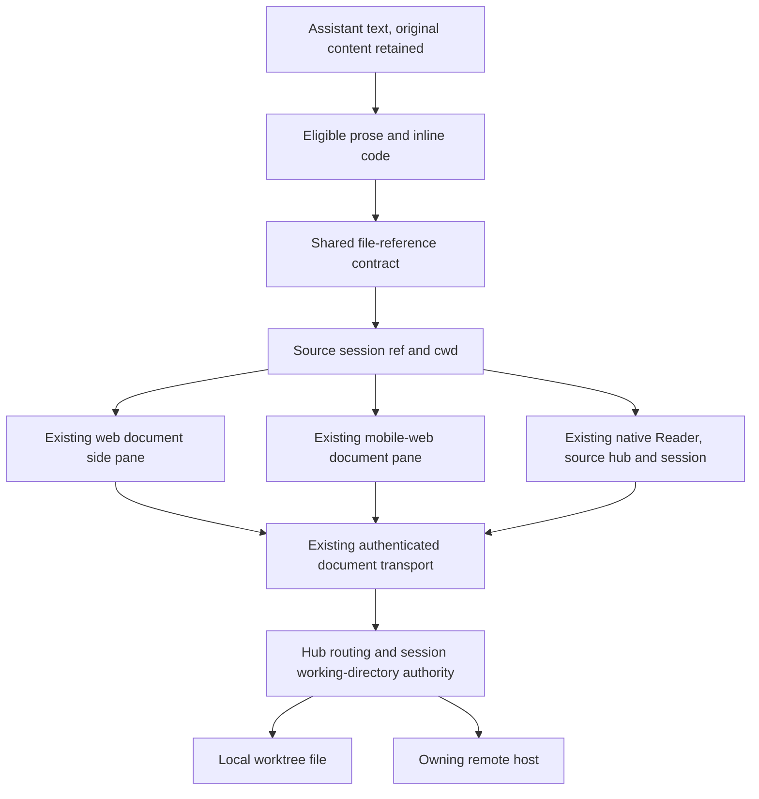

# Clickable worktree filenames

## Intent and approved scope

Jesse wants to open files named in Evener's replies without copying a path or asking the agent to display the file. These plain-text examples must work:

```text
Spec: docs/superpowers/specs/2026-10-02-web-session-overview-design.md
Review: docs/superpowers/specs/2026-10-02-web-session-overview-review.md
```

Jesse approved assistant messages first: plain paths, inline-code filenames and Markdown links, including remote sessions. Desktop opens the existing document pane beside the conversation. Mobile web opens that pane full-screen. Native opens its existing Reader, with Back returning to the originating conversation.

The feature reads the current file. It does not recover the version that existed when a message was written. Recognition identifies a possible file reference; it does not claim that the file exists.

### Out of scope

- Editing, downloads, a new filesystem browser or a new document viewer.
- Recognizing paths in user messages, tool-output bodies, parent-side delegate reports, diagrams or fenced/indented code blocks. Existing tool-file actions remain.
- Reading outside the source session's working directory, reading arbitrary URLs, or searching other worktrees for a missing file.
- Persisting a directory snapshot on every message, historical file contents, document deep links or line highlighting.
- Turning structured artifact handles into filesystem paths.

A delegate's own conversation is in scope when its assistant message has that conversation's explicit session binding. A child report embedded in its parent's conversation is out of scope because its file ownership cannot be inferred from the parent.

## Existing implementation

### Shared transport and filesystem authority

`appwire-client/typescript/docContent.ts` provides `cwdRelative`, file/image classification, `readDocFile`, and document URL builders. `DocPort` owns origin and credentials. Raw text is capped at 512 KiB, with binary, truncation, revision and modified-time metadata.

`cmd/evener-hub/doc_serve.go` serves `/doc/file?format=raw&session=...&path=...` and `/doc/image`. It resolves a session's working directory, validates symlink containment, and opens regular files beneath an `os.Root`. Host-qualified session refs route through `doc_proxy.go` to the owning host. The client must use this authority instead of reading a device-local path or navigating to a transcript-supplied origin.

Worktree entry updates the session environment in `agent/session_tools_worktree.go` and `agent/session_env_swap.go`. Implementation must prove that the document read and client cwd reflect the active worktree after switching. A file existing only in the worktree, and a same-named file with different contents in the launch checkout, are the acceptance fixtures. Source inspection alone does not establish the entire metadata-publication path.

### Web

`AgentMarkdown.tsx` enhances sanitized Markdown anchors using `fileDocParams`, `paneActions.openBeside` and `OpenButton`. It does not recognize ordinary text or inline code. Its local-session-only guard contradicts the remote-capable document routes.

`DocPane` renders text, sanitized Markdown, images, binary and truncation notices. The desktop workspace opens it in a secondary group. Mobile `StackHost` renders the same pane full-screen. Existing document panes are identified by session, path and kind. Path aliases such as `./docs/a.md` currently produce separate identities unless normalized before opening.

### Native

`MarkdownResponse.tsx` uses `EnrichedMarkdownText` and routes links to HTTP/HTTPS opening or an unsupported-destination alert. `screens.tsx` already opens Reader from document chips using explicit `hubId`, `sessionRef` and path.

`reader/documentReferences.ts` discovers inline code and Markdown link targets for chips, but misses plain prose. Its basename discovery requires a successful write by the session. `reader/documentSource.ts` refuses remote text before calling the remote-capable shared transport.

`reader/useDocument.ts` reloads on foreground, connection readiness and explicit reload. It retains content during a refresh and guards late publication with generations. Identity changes currently need stronger coverage to ensure old content cannot appear under a new file's title.

## Chosen approach

Use one framework-free file-reference contract in the shared TypeScript client, with small web and native rendering adapters. Reuse the document transport, pane and Reader.

Recognition runs locally during rendering. It performs no existence checks and fetches no files. A click starts the existing authenticated read. This avoids a request for every path in a streaming reply and keeps recognition independent of host availability.

Alternatives considered:

1. Verify every path before showing a link. This adds background reads, stale existence caches and streaming delays without eliminating races between recognition and opening.
2. Require the agent to emit Markdown links. This leaves existing messages and Jesse's plain-text examples unchanged.
3. Add a filesystem browser or a new viewer. Existing viewers already cover this use case.



Adapters select eligible text. The shared contract validates and normalizes destinations. Navigation retains the source identity. The hub decides which filesystem may satisfy the read.

## File-reference contract

Keep the pure path parsing and text-span recognition alongside the existing shared document helpers, or in a dedicated module exported through the established package conventions. It has no React, DOM, React Native, network or Markdown-parser dependency. Both callers import it by package name.

### Recognition grammar

| Input surface | Recognize | Leave unchanged |
| --- | --- | --- |
| Ordinary prose | A slash-separated relative or contained absolute path whose final filename has an extension, such as `docs/plan.md`, `./src/main.go`, `/work/tree/docs/plan.md` | Bare dotted words, domain names, version numbers, directories, extensionless names and ambiguous partial paths |
| Inline code | The entire code span is one path. Accept a dotted basename such as `README.md`, or a slash path with a nonempty filename, including `src/Makefile` | Commands, expressions, whitespace-containing spans and directory paths |
| Markdown link destination | Explicit relative or contained absolute file targets, including extensionless names and percent-encoded spaces | HTTP/HTTPS URLs, other schemes, protocol-relative URLs, query-only/fragment-only targets and malformed percent encoding |

Do not match a path-shaped substring inside a URL, email address, scheme-prefixed token or a longer invalid path. For example, `https://example.test/docs/plan.md`, `mailto:a/docs/plan.md` and `../docs/plan.md` must not yield a shorter clickable `docs/plan.md`.

Trailing sentence punctuation is excluded from an ordinary-prose match. Delimiters include whitespace and surrounding quotes/brackets. Parentheses inside an undelimited filename are ambiguous and remain ordinary text; an explicit Markdown link can name such a file.

The recognizer handles ordinary Unicode filename characters. Reject control characters, backslashes, protocol-relative paths, empty names and `..` path segments. This client-side filtering preserves the existing worktree-only affordance; the server remains the filesystem authority.

### Path meaning and normalization

- Prose and inline-code references are literal filesystem text. Do not percent-decode them. `docs/100%25.md` names exactly that file.
- Markdown destinations are URI references. Remove query/fragment location metadata, decode the pathname once, then validate containment. Never decode twice.
- Leading `./` segments are removed from accepted paths so equivalent spellings open the same document. Resolve contained absolute paths to cwd-relative paths without matching a sibling prefix such as `/work/tree-other`.
- `..` is rejected rather than guessed away. A missing cwd or missing/invalid session binding leaves the text untouched. When hydration supplies the binding, recognition updates without changing the recorded message.
- Common `:line`, `:line:column` and Markdown `#Lline` locations open the file itself. These suffixes are not sent as part of the filename. Opening at or highlighting a line is deferred. Query and fragment handling applies only to link destinations, not literal prose paths.
- Images use the existing image route and classification. SVG remains text. Unsupported binary files retain the existing notice.

### Current working-directory semantics

An action is bound to the message's owning session, never the globally focused session. At each render, references use that session's current hydrated cwd. A relative reference opens against the server-authoritative current working directory of that same session. The viewer shows current file contents, not a message-time snapshot.

An absolute reference outside the session's current working directory stays text. If the session later leaves a worktree, this feature does not broaden the file endpoint to read its old absolute paths. Historical workspace selection is a separate product decision.

Client cwd can briefly lag the server after a worktree switch. Tests must establish how metadata invalidation reaches the client and ensure a newly generated worktree reference becomes useful after that update. Do not fall back to a different session or checkout to hide a missing file.

## Web interaction and ownership

Extend the assistant-only `AgentMarkdown` enhancement seam. Keep the shared Markdown renderer's sanitization and URI policy unchanged. Process eligible text nodes in paragraphs, headings, lists, tables and blockquotes. Inline code is eligible only when its whole text is a recognized path. Skip existing anchors while scanning text, `pre`, Mermaid containers and mounted entity controls.

For explicit local-file anchors, use the shared destination parser and existing document action. For generated references, preserve their visible spelling and inline-code styling while making the filename itself keyboard-operable. Retain the existing explicit-link `OpenButton` behavior and disclosure isolation. Do not append a second button to every newly recognized word when the link itself supplies the opening action.

An unmodified primary click or keyboard activation opens the existing document pane beside the originating conversation. Existing modified-click behavior uses the safe hub document URL. External links retain their current behavior.

Normalize the path before forming document params. Session and normalized path determine document identity; stripping line suffixes keeps different line references to the same file from opening duplicate panes. Opening an already retained file focuses its pane. The source conversation stays mounted on desktop.

DOM enhancements must be reversible and idempotent across React StrictMode, hydration, streamed updates, settled transitions and context replacement. Cleanup removes generated nodes/listeners and restores original content without replacing DOM owned by a newer render. Coordinate file and entity enhancement order so neither processes the other's controls.

Mobile web uses the existing full-screen document pane. Retain the originating pane as its Back destination, including a desktop-to-phone breakpoint change while a file is open. Do not infer that destination from whatever session is focused later.

## Native interaction and ownership

Pass an explicit file-opening context from the owning conversation into assistant message rendering. It carries the source cwd and an opening callback already bound to `{hubId, sessionRef, sessionTitle}`. Tool-evidence and user-text callers do not receive this context.

Use the native Markdown adapter to expose recognized prose and inline-code paths through the renderer's existing link events. Keep the original message for Copy response, accessibility and message actions. Preserve existing Markdown constructs, reference definitions, escaped syntax, fenced code and Mermaid segmentation. A transform must operate on eligible Markdown tokens or source spans, not a regex over the whole Markdown string.

Generated destinations are local rendering identifiers, not external URLs. A tap validates the identifier against that render's recognized references and calls the conversation-bound Reader action. Existing relative Markdown file links use the same parser. External HTTP/HTTPS links keep their existing browser behavior. No recognized filename is passed to `Linking.openURL`, and no transcript URL selects the document port or receives a hub token.

Long press exposes Open file and Copy path for recognized file references. Copy retains the displayed path's meaning rather than an internal rendering identifier. Existing external-link actions remain.

Reuse Reader and its navigation contract. Align document-chip discovery with the shared path parser and add plain-prose discovery so settling the message does not produce contradictory destinations. Keep the existing chip policy for bare filenames that require write evidence; that chip policy is distinct from an explicitly backticked filename's inline action. Preserve write ages and file/artifact lists.

Remove the native remote-text preflight refusal. Let the existing authenticated document read return content or its typed error. A remote host that lacks document-read support still gets the existing unsupported-host explanation; this feature adds no version fallback or alternate protocol.

## Reads, recovery and preservation

The file-opening action retains its source hub/session/path for the viewer lifetime. Navigating to another file or replacing the hub origin invalidates publication by the old read. Never show file A under file B's title, or content from a previous hub as content from its replacement.

Use existing connection/foreground signals for a visible viewer's read recovery. On a transient refresh failure for the same identity, retain already displayed content and its explanation. On an identity change, clear previous content before loading the new file. An initial failed read remains readable as an error state and retries when the owning connection becomes ready; explicit Reload remains available. A missing/forbidden file uses its distinct error state and can be retried after the underlying file or permission changes. Viewer recovery must not disturb conversation drafts or scroll.

Add the minimal missing web recovery ownership rather than a second document cache. Native retains its current foreground/reconnect/reload behavior, with connection signals scoped to the Reader's source hub. Cleanup retires listeners and stale publication after close.

Keep the 512 KiB cap, binary notices, truncation notice, safe Markdown rendering and image behavior. A successful read is the existing endpoint's bytes, not HTML from an external site.

## Verification and acceptance

Read `docs/developing-evener/testing.md` before changing tests. Each implementation unit starts with a failing behavior test, then the minimal production change. Tests must exercise the actual parser, actual navigation/state and real temporary worktree files where filesystem routing is claimed.

### Shared parsing matrix

- Jesse's two exact plain-text examples, multiple paths, surrounding punctuation, Unicode, leading `./` aliases and contained absolute paths.
- Inline-code basenames and extensionless slash paths; inline commands remain code.
- Explicit links, reference links and percent-encoded spaces.
- Literal percent signs versus URI decoding, malformed escapes and encoded traversal/separators/control characters.
- Out-of-cwd paths and sibling-prefix paths, missing cwd, invalid refs, protocol-relative paths, schemes, domain names, email addresses and URLs containing filename-shaped substrings.
- Line/column and fragment suffixes, distinct filenames whose literal percent sequences differ, and no accidental directory links.

### Web behavior

- Render both example paths, click the filenames themselves, and assert the originating session remains in the main pane while the document opens beside it.
- Exercise streaming, hydration, StrictMode and context switches. Assert one action per reference and no stale opening callback or accumulated generated links.
- Preserve external links, modified clicks, diagram links, fenced code, entity controls and sanitization.
- Assert no document fetch during recognition. Open a file that does not exist and prove the viewer shows the typed failure without losing the conversation.
- Open the same file through aliases and location suffixes without a duplicate pane.
- Real browser: desktop geometry, mobile full-screen opening and Back, breakpoint crossing, wrapping, keyboard activation and focus. Existing DOM tests alone do not prove geometry.

### Native behavior

- Tap recognized prose, inline-code and explicit-link references through the Markdown event path and assert Reader navigation carries the source hub, session and normalized path.
- Verify long-press file actions, external-link behavior, unchanged Copy response, streaming updates, code/diagram exclusion and reference definitions.
- Prove discovery chips and inline actions agree on path identity, while preserving chip write-evidence and age rules.
- Exercise Reader switching A to B with deferred reads, hub-origin replacement, route disposal, disconnect/reconnect, foreground recovery and source-hub isolation. Assert old content never appears as the new identity.
- Verify local and remote text/Markdown/image reads and typed 403/404/501/transient failures. Retain existing binary/truncation coverage.
- Use the real native Markdown parser for destination-generation proof. A test double emitting a desired URL proves event wiring only. Simulator/device touch, accessibility and Back behavior require separate qualification; report when that environment is unavailable.

### Server and active-worktree proof

Create a real temporary Git checkout and linked worktree with a document found only in the worktree and a conflicting same-path launch-checkout file. Exercise session directory switching and the actual document-serving path. Verify the bytes and metadata correspond to the active worktree. Reconnect/hydrate the client and verify its recognized absolute worktree paths use that same directory.

Retain and run server tests for traversal, symlink escape, non-regular files, local/remote routing and read caps. Existing remote-route coverage establishes transport routing; it does not by itself prove active-worktree metadata publication.

### Gates and documentation

Fast tests cover touched web/shared/native modules and hub document routing. After formatting touched files with the correct pinned Biome, run `make test-web`, `make test-web-browser`, native targeted tests/typecheck and affected Go tests from the repository root as appropriate. Let CI own the full repository gates per `AGENTS.md`.

Update `docs/web-ui/design-system.md`, `mobile-native/README.md`, the shared client package README if its exports change, and the affected S02/S03/S05/S06/S13 rows in `docs/product/subsystems.md`. Document current-worktree semantics and recovery ownership in an evergreen guide. Keep this spec and the review artifact as design history.

After implementation, run the requested four-reviewer simplify-code workflow, behavior-preserving cleanup and verification. Create the feature PR and shepherd its CI and current-head RoboRev findings to the repository's authorized merge conditions. No deployment or running-hub restart is part of this request.
