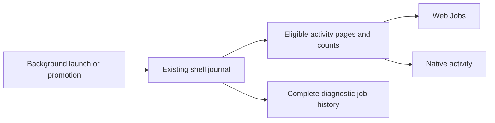

# Background Jobs and quiet activity

## Purpose and approval boundary

Jobs lists show commands launched in the background or promoted from a foreground
wait into background execution. Finished jobs and delegates belong to history.
An unsuccessful outcome alone does not deserve prominent placement or warning
color. Actual requests for input, approvals and errors blocking a session keep
their attention treatment.

Jesse approved this design in conversation. This written spec needs his review
before an implementation plan is written. Product implementation requires approval
of that plan and its execution method. This document describes required behavior,
not behavior already implemented or verified.

## Agreed scope

- Apply background-only Jobs eligibility to web and native phone activity lists
  and their authoritative counts.
- Put every terminal background job under Completed, including failed, stopped,
  cancelled and runtime-limited jobs. Preserve each actual outcome.
- Give native jobs a separate history fold from delegates.
- Treat failed delegates as ordinary terminal history. Remove job/delegate
  failure-first sections, red failure emphasis and failure-only chips.
- Remove failed-delegate emphasis from native Board, project and pinned session
  rows and the matching session-header chip.
- Keep attention and ordering for a session's own provider, sign-in and runtime
  errors. Keep genuine questions, approvals and active work accessible.
- Exclude historical jobs without durable background proof from activity lists.
  Preserve their records, output and transcripts. Do not backfill classifications.

## Existing boundary and confirmed gaps

The [job record](../../../agent/internal/jobstore/record.go) currently keeps
`Background` only in memory. A record folded from the journal loses that flag.
The [shell producer](../../../agent/job_shell.go) commits both explicit background
launches and foreground promotions through `commitDelayedShell`; promotion sets
the live flag after committing the start event. A completed foreground command
can also retain a job record to expose large output. Record existence and terminal
notifications therefore cannot prove background execution.

The [web Jobs tab](../../../cmd/evener-hub/frontend/src/shell/activitybar/JobsTab.tsx)
currently folds successful jobs only. The web Agents tab already places terminal
delegates in history, but its shared rows give failed outcomes danger-colored
glyphs. The [native activity list](../../../mobile-native/src/subagents/activityList.ts)
mixes delegates and jobs, puts failed rows first, and folds only Done rows.

Native session-row failed-delegate chips and own-session attention have separate
owners. [BoardRow](../../../mobile-native/src/board/BoardRow.tsx) colors failed
delegate counts. [Native attention classification](../../../mobile-native/src/board/attention.ts)
puts errored sessions in Needs you. This change removes the former emphasis and
preserves the latter classification and priority.

## Durable eligibility and domain reads

The shell journal owns background eligibility. Record it in the existing durable
start registration before publishing a successful background handoff. Explicit
background launch and foreground promotion both establish the marker. It remains
true after completion, retained-history reads and restart.

Use the existing wire `JobActivityJob.background` boolean for durable background
eligibility, including retained terminal jobs. Keep the wire shape unchanged.
The journal is the authority, with no client-inferred classification, separate
journal or transcript migration.

| Producer case | Jobs eligibility |
| --- | --- |
| Explicit background launch with durable registration | Eligible, including immediate completion |
| Foreground wait expires and hands the command to background supervision | Eligible |
| Inline foreground completion with retained output | Ineligible |
| Foreground runtime limit ends the command before promotion | Ineligible |
| Runtime limit ends an already backgrounded command | Eligible, terminal history |
| Foreground cancellation before promotion | Ineligible |
| Detached command | No managed job record, excluded |
| Older journal record without durable background proof | Excluded, data retained |

Use one server-owned eligibility rule for `evener/thread/jobs/list` and the jobs
counts in `evener/thread/activity/read`. Apply it before pagination so excluded
records cannot consume visible page capacity or cause a false end-of-history.
Keep the existing session/subtree scope, owner identity, ordering and cursor
contracts. Forwarded owner journals must retain the same eligibility evidence.

The shared TypeScript activity store remains the read, subscription and recovery
owner. Web and native render its filtered results. Neither client acquires a new
reader, subscription, timer or retry loop to reconstruct background status.

The producer records eligibility once. Activity reads use it for both rows and
counts, while diagnostic reads retain the full managed-job history.

## Counts, outcomes and access

Activity job totals count only eligible jobs. Active counts cover nonterminal
eligible jobs. Failed and completed outcome buckets retain their current domain
meaning; a Completed history group includes **all** terminal outcomes and must
not present a failed job as successful.

Use authoritative summary counts for overall labels and filters. Preserve
unknown, incomplete, unavailable and recovering states rather than replacing them
with zero. Loaded-page history labels must remain honest about their loaded
boundary. Do not infer activity ownership or background eligibility from
navigation rows.

Diagnostic `job_list`, `job_status`, `evener/jobs/list`, `evener/jobs/get`,
`evener/jobs/output` and job-transcript reads retain their existing scope and
access. A retained foreground-output handle remains usable even though that job
does not appear in activity Jobs. Stopping, terminal notifications, watches and
delegate generation ownership keep their existing semantics.

## Web presentation

Running background jobs remain above a collapsed Completed fold. Every terminal
background job belongs inside that fold, independently of its outcome. Existing
output actions, semantic anchors, disclosure state and scroll restoration remain
usable across state transitions and refreshed pages.

Agents retain the existing Inactive subagents history. Terminal job/delegate
glyphs use ordinary quiet styling, including failed outcomes. Status text, reason,
exit code, command and detail access remain truthful. Live input and approval
attention retains its current styling.

This does not redesign web session-list error indicators, watches, transcripts or
the standalone Details and Tasks panels.

## Native activity presentation

The default Activity list has live rows followed by two independent, collapsed
history folds:

1. **Done:** terminal delegates, including unsuccessful outcomes.
2. **Completed:** terminal background jobs, including unsuccessful outcomes.

Delegate and job history keep separate open state. Live delegates and background
jobs remain available without opening either history. Keep the existing stable
row keys and ordering within each lifecycle group.

Keep All, Running and Done filters. Done selects terminal rows, including failed
ones; its count includes terminal delegates and eligible terminal jobs. Remove
the dedicated Failed chip and failed-first section. Explicit Done selection shows
matching histories without requiring another disclosure tap. Search retains its
existing scope and history access.

Remove red failure strips and failure-specific row emphasis. Retain actual status
and explanatory text in ordinary styling. A terminal parent must not hide running
descendants or make their existing navigation and stop controls unreachable.
Counts and controls for active work remain independent of the parent's outcome.

## Native session-list presentation

Board, project and pinned session rows no longer show a highlighted failed-
delegate count or a failure-only delegate chip. Retain existing active-delegate
indicators and navigation into activity. The session header retains neutral
Subagents access and its authoritative total, without a red failed-count suffix.

This is a presentation change to existing navigation summaries and activity
counts, not a new navigation-derived activity model. It does not change the
session's own error mark, Needs you membership, error priority, recovery actions,
questions, approvals, offline state or stale-input handling.

## Failure, recovery and preservation

Carry the eligibility marker through the existing journal append and forwarding
path. Preserve current start/forwarding failure handling and terminal-write retry
semantics. Do not report a background handoff as durable before its registration
succeeds, add an independent recovery loop, or change command execution policy.

Reconnect and refresh recover through the existing shared activity owner. Retain
healthy loaded evidence while it recovers and preserve later-page demand, selected
scope and semantic scroll/disclosure intent. Closed history must not prevent
discovery of active rows on later pages.

No historical job record, output, transcript, draft, pending input, attachment or
workspace placement is deleted by this change. Quiet outcomes change presentation,
not the evidence or the user's ability to inspect and control work. Existing
retention policies are unchanged.

## Proof obligations

New behavior follows red-green tests against actual Evener code. Scripted provider
and transport boundaries are allowed; tests must not replace the workspace action,
journal fold, lifecycle decision or renderer whose behavior they claim to prove.

| ID | Required independent evidence |
| --- | --- |
| J01 | Real shell producer explicitly backgrounds a command, and a fresh journal read retains eligibility after it ends. |
| J02 | Real foreground wait promotes a command; durable registration and published activity already agree at handoff and after termination. |
| J03 | Retained inline foreground output and pre-promotion runtime timeout remain excluded while their existing output/diagnostic access works. |
| J04 | Success, nonzero exit, runtime limit, cancellation and stop of background jobs retain eligibility and actual terminal outcomes. |
| J05 | Reopened store/fresh manager and forwarded child-owner journal reads produce the same eligible rows and counts without live-memory overlays. |
| J06 | Historical events without the marker remain absent from activity, with their exact retained record/output/transcript data preserved. Detached behavior remains unchanged. |
| J07 | Actual producer, session/subtree routing and shared adapter agree on eligibility and counts across multiple owners, including unknown or temporarily unavailable sources. |
| J08 | Web terminal jobs move under Completed for every outcome; terminal delegate/job glyphs are neutral and outcomes remain truthful. The real output action opens the intended workspace pane. |
| J09 | Native mixed Activity keeps separate histories, folds failed delegates/jobs, removes failure-priority affordances, and preserves All/Running/Done filtering, search and accurate counts. |
| J10 | Recorded delegate producers pass through the shared adapter and native renderer with their settled generation and reported/failed/stopped evidence intact. Active descendants and controls remain reachable. |
| J11 | Native Board/project/pinned rows and session-header chips remove failed-delegate emphasis; actual session errors, questions, approvals and offline behavior retain their existing priority and actions. |
| J12 | After loading several pages, a visible later-page row survives refresh and reconnect with current content, stable identity, disclosure and scroll intent in both clients. |
| J13 | Collapsed histories do not trap later-page active work; a running job becoming terminal changes groups without duplicating or losing its row or output access. |
| J14 | Journal start/forwarding failure and terminal-write recovery preserve existing lifecycle results and do not publish false background success. |

Use the real recorded producers under
[`agent/testdata/subagentwire`](../../../agent/testdata/subagentwire) for delegate
outcomes. Do not combine report evidence from independently refreshed, mismatched
delegate run generations. New default tests require no provider credentials,
network service, live model behavior or ambient machine state.

### Paging and recovery matrix

Run the impacted web and native bindings through these cases, including an actual
row loaded on a later page:

| Loaded evidence | Transition | Required result |
| --- | --- | --- |
| Multiple pages, history open | Refresh and changed terminal description | Later row updates without duplicate/loss or disclosure reset |
| Multiple pages, history open | Disconnect then reconnect | Later boundary and semantic position recover through the same owner |
| Terminal first page, active work later | Both history folds closed | Live work is discoverable without manually opening history |
| Running row visible | Terminal event, then refresh/reconnect | Exactly one row in the correct history with its actual outcome |
| Eligible and excluded records interleaved | Continue paging, refresh/reconnect | Correct eligible capacity, counts and end-of-history |
| Subtree with temporarily unavailable owner | Owner recovers | Partial/unknown evidence becomes useful without losing healthy branches |

These are required checks for implementation, not tests run for this spec. Local
targeted suites and the canonical web/native/shared-package gates will be named
in the approved implementation plan. CI remains the full-suite source of truth.
Safari, real-device safe-area/software-keyboard and screen-reader behavior need
separate platform evidence; Chrome or renderer tests do not establish those claims.

## Documentation and source ownership

Implementation updates the owning evergreen guides in the same change as code:

- [Session activity](../../product/session-activity.md): eligible Jobs semantics,
  source-owned rows/counts, separate history and existing lifetime/recovery owners.
- [Job control](../../job-control.md): durable background evidence and the
  distinction from retained foreground output and detached processes.
- [Subsystem map](../../product/subsystems.md): S02 web presentation, S03 native
  presentation, S05 shared activity contracts and S12 job-journal authority.
- [Native guide](../../../mobile-native/README.md) and affected client references:
  quiet outcomes and the preserved session-error boundary.

Follow [testing rules](../../developing-evener/testing.md), native instructions and
the package import contract. Preserve truthful outcome assertions when migrating
grouping. Update any directly conflicting evergreen promise. Remove an open
friction case only after its own agreed behavior is implemented and verified;
research or design approval does not resolve it.

## Out of scope

No transcript backfill, new legacy-history UI, new diagnostics restriction,
command lifecycle redesign, failure suppression in logs, or relabeling failures
as successes. No change to own-session error priority, global FocusScope behavior
or platform qualification promises.

The merged Overview work remains final. Dependency advisory patches, deferred
review cleanups, the cascade reload investigation, job-output auto-follow and
bundle-size architecture remain separate work.
