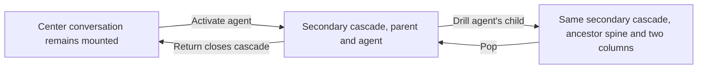

# Agent cascade in the secondary pane group

Status: desktop destination and Return approved in chat. The written amendment
and the previous-layout policy below await Jesse's approval. No implementation
is approved by this document alone.

## Authority and scope

Jesse chose **Keep the nested columns**, **Secondary pane group**, and
**Yes, close that view** for the button labeled **Return to previous view**.
The original center conversation stays mounted. One separate read-only agent
cascade opens beside it. Return closes that agent view and focuses its surviving
original conversation.

This amends the placement, source ownership, saved return context, and Return
clauses of [Automatic agent cascade](2026-10-01-automatic-agent-cascade-design.md).
Its ancestry, geometry, pop, peek, history, activity, input-delivery, and mobile
contracts otherwise remain in force. The evergreen authority after implementation
is [Session activity](../../product/session-activity.md#automatic-agent-cascade).

The change belongs in the browser workspace. It adds no backend method, provider
behavior, shared-client subscription owner, native-app feature, or new retry loop.
Explicit transcript links and Open conversation retain their existing meanings.
The separate spine-status PR is held. This work authorizes no merge, deployment,
or live-hub restart.

The mounted guarantee applies to the center conversation in the main group.
An origin already in secondary follows the existing inactive-tab retention rules:
its record and source work survive, but opening another secondary tab may unmount
its content. Do not add a third group or move that origin to keep it mounted.

## Current implementation and consequence

At base `f3663d00ee9935d6af3e92f783d17decc594284c`,
`cmd/evener-hub/frontend/src/panes/zoom/actions.ts` promotes a matching focused
session or non-job transcript in place. Its fallback already creates a secondary
cascade. Return retypes either cascade into its source descriptor. Merely changing
entry would therefore leave a duplicate parent transcript after Return.

`parseZoomParams` retains only the selected ref, source descriptor, and ordered
edges. A Return association must pass that validator and the actual saved-layout
round trip. `AppShell` and `sessionPlacement` currently recognize a cascade's
original route role; restore must also recognize a real center session plus a
separate read-only cascade without redirecting their saved focus.

## Entry and navigation

1. Desktop Agents activation uses the row's actual owner ref, child ref, and
   delegate ID. It creates a `sessionZoom` pane with `slot: "secondary"`, leaving
   the originating conversation's committed record and lifetime unchanged.
2. The cascade owns read-only readers. It must not acquire the original pane's
   composer or transfer, pause, or cancel that pane's transcript/history demand.
3. Later drills update the same cascade pane and secondary group. Reopening Agents
   from the original conversation reuses its associated cascade even after the
   selected leaf changes. An ancestor drill replaces only the suffix after that
   owner. Independent same-ref panes retain independent inspection contexts.
4. Pop, peeks, and the selected-leaf footer/sidebar keep their existing scope rules.
   The center footer continues to describe its own conversation. Reading or
   selecting parent text inside the cascade does not change the selected leaf.
5. Return closes only the secondary cascade. It creates no replacement transcript
   or composer. When the original conversation survives, Return focuses that exact
   pane and requests keyboard focus there.
6. Open conversation focuses an existing full conversation or opens one in
   secondary. Opening the original full conversation focuses its surviving pane;
   it must not focus the removed cascade ID or manufacture another source editor.
7. Activity reached without a matching conversation still opens read-only
   inspection in secondary without changing the unrelated pane. Return closes
   this new inspector, leaving useful surviving workspace panes available.



The center conversation remains usable throughout. Drill and pop change only
what the secondary inspector reads. Return removes that inspector.

## Preservation and recovery

- Entry, drill, pop, and Return preserve the original editor, draft, skill/command
  selections, UTF-16 mention locations, attachments, pending encodes, queued input,
  and mutation identity. Inspection issues no send, steer, resume, or stop request.
- Center transcript position remains attached to its existing reader. A new split
  can reflow rows, so continuity is checked by the semantic anchor after geometry
  settles rather than by requiring an unchanged pre-split pixel offset.
- Unrelated panes retain their records, params, order, group, and work. Adding or
  removing the cascade may change the secondary group's active tab and membership.
- Runtime Return and reuse bind to the original committed pane lifetime, not just
  its ID or ref. Closing or resetting that origin retires the association. A fresh
  record with the same ID, type, and ref cannot become its replacement target.
- Saved intent distinguishes separated inspection from an older in-place cascade.
  It retains a validated Return locator and the existing selected ref/edges.
  Restore binds that locator only against the surviving restored panes. Subsequent
  removal cannot rebind it to a new pane. Retired locators must not become valid
  again through a later layout save/reload.
- A missing original pane does not get recreated by Return. Close only the
  inspector and retain the workspace's useful survivors. Malformed or unavailable
  Return metadata must not discard a readable cascade or unrelated saved panes.
- Save/reload preserves a main conversation and a distinct secondary cascade,
  selected path, unrelated tabs, and valid saved focus. Deferred route placement
  cannot count the read-only cascade as a second full conversation or seize focus
  from it after the parent route is already satisfied.
- Transient reads, reconnect, unknown ancestry, deletion, and alias replacement
  retain the existing owners and fences. Closing a peek releases only its demand;
  a still-mounted center transcript may legitimately observe the same collection.
- Image bytes and pending encodes remain lifetime-owned and stay out of layout
  JSON/localStorage. Page reload does not restore those bytes. Persisted draft
  metadata and pending delivery retain their existing storage contracts.

## Previous-layout policy, proposed for explicit approval

Keep the existing Return behavior for already-saved cascades: Return restores
their source view in that same pane. This includes in-place cascades that occupy
the center and older secondary fallback cascades. Do not discard or move those
saved views automatically. Newly opened secondary cascades use the new
close-and-focus behavior, including after reload.

This is a narrow compatibility boundary. It adds no automatic migration and no
second composer or history implementation. Jesse must explicitly approve it
before implementation. If declined, discuss the replacement policy before changing
saved layouts or removing their existing Return path.

## Geometry and clients

Keep 52px ancestor spines, a 400px immediate-parent column, and a 440px minimum
leaf. Horizontal overflow belongs to the cascade track. A narrow secondary group
at desktop viewport width still uses the desktop cascade, keeps the center visible,
and reveals the selected leaf after drill/pop. Transcript scrolling stays
independent. Keep reduced-motion geometry and native keyboard/mouse actions.

Phone Agents entry remains `openTranscript`. A restored cascade at phone width
still shows its selected read-only leaf and usable Return without desktop columns.
This change does not add native-app cascade entry or change phone navigation.

## Whole-journey proof

Use the real workspace/reader owners in mounted tests and the existing real-stack
producer in `cmd/evener-hub/cascade_browser_test.go`. Script only the external LLM
boundary. Use the production SPA and native browser input in
`cmd/evener-hub/frontend/scripts/cascadeguard/run.mjs`, not seeded frontend stores.

Required evidence:

- First entry from the center yields distinct main `session` and secondary
  `sessionZoom` workspace panels. The original source record, lifetime, composer,
  and DOM nodes survive. A secondary transcript origin retains its source work
  under normal tab activation and returns to that exact surviving transcript.
- Repeated root entry and nested/ancestor drill reuse the inspector ID/group, prune
  only abandoned inspector readers, and leave independent same-ref panes alone.
- Real draft, catalog selection, PNG bytes, pending completion, center anchor, and
  unrelated secondary-tab work survive entry and Return. Cascade-only queries prove
  read-only inspection while the center composer remains mounted.
- Native Return removes only the inspector, records its removal in the saved layout,
  focuses the exact source, and preserves its work. Missing/reused-origin tests
  cannot claim a replacement even when ID, type, and ref match.
- Native reload restores both panels, the path, unrelated tabs, and focus through
  held ancestry/deferred location recovery. Return after reload targets the surviving
  original. Unit tests cover invalid locator data and origin retirement across save.
- Keep the real six-edge chain, five spines, readable widths, independent scroll,
  text selection, Tasks peek, Escape, reduced motion, direct paging, and reconnect.
  Prove closed-peek demand release on a scope with no other collection holder rather
  than forbidding the mounted center's legitimate reads.
- Retain independent provider-delivery and mutation-ID assertions. Keep existing
  detached-continuation tests as detached tests; do not describe the newly mounted
  center journey as editor detachment.
- Keep mobile-entry and saved-phone-cascade cases. Cover the proposed old in-place
  Return policy only if Jesse approves it.

Verification commands from the repository root:

```sh
make test-web
make build-web
go test -tags browserguard ./cmd/evener-hub -run '^TestAgentCascadeBrowser$' -count=1 -v
BROWSER_GUARD_CONCURRENCY=4 make test-web-browser
```

The targeted unchanged baseline is four Vitest files: `actions.test.ts`,
`intent.test.ts`, `ActivitySidebar.test.tsx`, and `DockHost.test.tsx`. Implementation
requires regressions that fail for the stated routing defect before production
edits. Update `docs/product/session-activity.md`, the Browser workspace row in
`docs/product/subsystems.md`, and the cascade guard README with the verified behavior.
