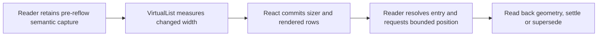

# Shared transcript reading position through pane reflow

Status: approved written amendment, implementation and native proof unfinished.
Jesse approved the written design and its revised native implementation plan.
The plan approval on 2026-10-05 permits this archive and bounded native execution.
Original external amendment bytes remain unchanged as approval evidence.

## Intent and authority

Opening or closing secondary agent inspection must keep the center conversation
usable at the entry the reader was reading. The original composer, draft,
attachments, pending work and reader lifetime survive. Return closes only the
inspector and focuses the exact surviving source.

This amendment refines **Preservation and recovery** and **Whole-journey proof** in
`docs/superpowers/specs/2026-10-04-secondary-agent-cascade-design.md`, approved blob
`b41235e09a5b9bf680cefc24e45eabcef5977eae`. Its placement, ancestry, geometry,
independent history demand, saved-layout policy and mobile navigation remain in
force. The corresponding native plan is
`docs/superpowers/plans/2026-10-04-secondary-agent-cascade.md`, blob
`63c86c800951bb223d497120860c6da94811252f`. Its Tasks 1–3 are complete; Task 4 remains
unfinished. These repository paths are relative to the existing
`agent-cascade-secondary` worktree.

The ownership change belongs to the shared **browser** transcript reader. It
covers ordinary sessions, read-only transcripts and cascade columns that use
`TranscriptBody`, including their existing phone-width browser rendering.
It adds no native-app feature, backend method, provider behavior, history or
subscription owner, dependency upgrade, storage migration or new layout group.
Fixed-height VirtualList consumers and transcript previews keep their current
behavior. The held spine-status PR and live hub remain untouched.

## Evidence and limits

The [ownership review](file:///tmp/evener-sandbox-2768502204/agent-cascade-secondary-zAZ4cYoo/task4-scroll-ownership-review.md) establishes a missing
width-reflow guarantee. The existing transcript registration restores display
transitions and retained views. A width change alone does not arm it. VirtualList
and the pinned TanStack core conditionally adjust offsets; their measurement
notification does not guarantee committed React geometry.

The pending-image Return widens the source from 152px to 352px. `turn_m31` shrinks
from 12853.140625px to 7036.171875px, but the final within-row offset is 7394px.
Its bottom is 357.828125px above the viewport, and `turn_m32` becomes first visible.
An earlier successful Return has the same row-start and height changes and a
different final within-row offset. The trace does not identify the precise native
callback sequence or prove that image release changed transcript content.

The real-core probe independently loses a cached backward partial row while DOM
and logical offsets agree. That probe uses supplied geometry, not mounted React
or Chrome. It establishes the contract gap, not the native failure's full cause.
The proposed policy below is unimplemented and has no new passing journey proof.

## One semantic owner, one geometry authority

Extend the existing `useTranscriptViewRegistration` and shared transcript scroll
policy. That owner resolves source entries, folded aliases, retained captures and
reader intent. It owns one pending semantic restoration per retained reader.
Reader identity and lifetime distinguish independent same-ref panes.

VirtualList remains responsible for measurement, rendered range, committed sizer
and row positions, ordinary prepend compensation and end following. It supplies
a commit-aware geometry handoff to the transcript owner. Upstream `onChange`
remains a measurement/range notification; the owner must not treat it as proof
that the DOM can accept the target offset. Use supported upstream APIs. The
revised plan will specify the smallest local interface needed for this handoff.



The reader supplies the meaning of the position. VirtualList supplies the geometry
that can realize it. A newer reader gesture or explicit command supersedes the
pending work at every step.

A separate VirtualList-owned semantic anchor would need arbitration with the
existing source-entry and remount owner. A Return-only replay or unconditional
partial-row height adjustment would still leave ordinary reader reflow uncovered.
Neither is the selected design.

## Reading-point policy

Capture the smallest existing semantic entry crossing the viewport top, using the
current source identity and folded-member mappings. If none crosses the top, use
the existing first-visible-entry rule. Preserve its source position, viewport
alignment, measured entry and viewport sizes, and following-bottom intent from
the **last committed geometry before reflow**. Detecting changed width and then
capturing already-reflowed boxes is too late.

For a non-bottom reader during width reflow, retain that entry and proportional
progress through its usable reading depth. Usable depth is the entry's measured
height minus viewport height, bounded at zero. Progress is the distance from the
entry's top to the viewport top divided by that depth, between zero and one; a
zero depth uses zero progress. Restore the same fraction of the new usable
depth. An entry whose top was already below the viewport top retains that
alignment where feasible. An entry whose top is above the viewport and whose
bottom was already inside it (the reader is past its usable depth, reading its
tail and what follows; this includes any entry no taller than the viewport that
crosses its top) keeps its bottom where it was: the same height of its tail
stays visible, bounded so the entry's top never moves below the viewport top.
A 1px tail stays 1px; it never grows to fill the viewport. This preserves approximate progress within the entry and keeps the
reader's current reading line in place; exact-word continuity across different
line wrapping is outside the contract.

A viewport-height-only change, such as composer-height settlement, doesn't
rewrap the entry, so the same rule reduces to keeping the entry's offset outright:
the reader's current reading line stays in place whether the reader is at the
entry's start, inside it, or reading its tail. A later width reflow measures
progress against the committed viewport height.

This policy keeps useful content from the same entry visible. It never replays an
old pixel offset beyond the entry's new readable extent. Browser scroll bounds
still apply near the beginning or end of the transcript. A geometry-only fallback
must leave a real part of the selected entry visible, rather than a blank tail or
the following entry when the selected entry remains available.

If projection or disclosure changes coincide with reflow, resolve the existing
source/folded-member alias first. A collapsed alias lands at its visible summary.
If the source entry is genuinely absent, keep the existing nearest-message rule,
including its preceding-message tie break, and use feasible alignment there.
If no semantic candidate exists, retain the existing bounded whole-transcript
normalized fallback. Do not infer disappearance merely because virtualization
has not mounted the target row.

Exact word locators, a new source-text index and changes to the persisted layout
format are outside this amendment. Ordinary display-only transitions retain their
existing policy; overlapping width reflow uses the bounded policy above.

## Capture, commit and settlement

1. Maintain the latest valid committed capture for each reader. Width reflow arms
   restoration from that capture, independently of cascade entry or Return.
   Further width changes during the same pending restoration retain its original
   semantic point and resolve it against the newest committed dimensions.
   Intermediate clamping or compensation must not replace it with a displaced
   entry. Newer reader input supersedes it rather than updating stale work.
2. Measurement marks geometry as changed. After React commits the corresponding
   sizer and rows, resolve the current semantic target. If virtualization has
   removed its DOM row, request that row through the existing list interface,
   then wait for its committed measurement before applying intra-entry alignment.
3. Keep the pending capture through estimates, temporary zero-sized geometry and
   browser-clamped writes. Resume on relevant measurement/commit events. No
   polling, arbitrary sleep or healthy-reader retry loop is added.
4. Settle only after read-back confirms the selected entry/alias or followed live
   end is visibly useful, the bounded target is achieved, and DOM and virtual
   offsets agree within the pinned core's 1.5px read-back tolerance. A write alone
   is insufficient. The widget's existing 4px bottom threshold has a separate
   meaning and stays intact.
5. A later dynamic measurement belonging to the same reflow continues from that
   semantic intent until valid geometry settles. Settlement, superseding input,
   reader replacement or retirement releases pending work and its observers.
   A retired reader cannot write to a replacement, even with the same pane ID/ref.

Reflow corrects scroll position only. It never captures focus back from the
composer, an inspector or another pane. Existing display-transition focus
restoration retains its own intent checks. Return's source-focus request and
ordinary editor selection remain separate responsibilities.

## Arbitration and preservation

| Competing event | Required result |
| --- | --- |
| Reader wheel, touch, scrollbar or scroll-navigation key targeting this viewport | Supersede the older reflow restore before it can overwrite that gesture. Any later capture reflects the reader's newer position. |
| Explicit Jump to live or jump-to-entry | Supersede older positioning, including clamped writes and remount restores. Keep the command's target and existing history-demand cancellation. |
| Following the bottom before reflow | Keep existing end-following intent. Do not replace it with a mid-entry anchor or infer bottom intent from a resize-induced clamp. |
| Append while reading earlier content | Receive content and preserve reading position. Keep existing new-content and failure affordances. |
| Older-page prepend during reflow | Let VirtualList perform ordinary keyed compensation. Resolve the original semantic capture against the committed result once, without adding the prepend delta again. |
| Display/configuration change or retained-view remount during reflow | Coalesce positioning under the same reader owner. Resolve source/folded identities in the new representation; older captures cannot overwrite newer input. |
| Focus-only Tab, modifiers, editor typing or text selection | Preserve normal focus/editing behavior. Do not reclaim focus or classify every key as scrolling. |
| Close, reset, source replacement or reader retirement | Cancel that reader's pending work and release observers. Other readers and durable input delivery remain usable. |

Layout and programmatic restoration scroll events must be distinguished from
newer reader intent. No competing per-pane semantic listener or Return-specific
scroll owner is introduced. Ordinary pure prepend, append and height settling
outside width reflow keep their existing owners.

Keep source drafts, catalog selections, UTF-16 mention locations, image bytes,
pending encodes, queued mutations and independent demand unchanged. Transient
reads retain useful content and existing automatic recovery. Pending geometry
work must not block reading, composing, Return or healthy neighboring panes.

## Required behavior evidence

The revised plan must retain the original strict native assertions and add proof
of the shared-reader boundary. Passing DOM/logical-offset equality alone does not
satisfy the reading-position requirement.

- Before production edits, compare the successful and failing Returns' row
  measurements, adjustment predicate, direction/cache/end state, commit order,
  clamping and read-back. Record what the trace proves and what it cannot decide.
- Exercise the real pinned core and mounted `TranscriptBody`/VirtualList below
  controlled external geometry seams. Cover a tall partial row that shrinks below
  its old offset, plus idle, cached backward, fully-above and prepend controls.
  Observe a correct failing reading-position assertion before the fix.
- Verify proportional continuity inside the selected semantic entry, its shorter-
  entry and folded-summary fallbacks, delayed/zero-size measurements, and a target
  initially outside the rendered range. Use literal expected fixture positions
  and independently measured DOM content, not the restoration helper as an oracle.
- Cover ordinary Session, read-only transcript and cascade-column readers, including
  independent same-ref readers. Width reflow must work without invoking Return.
- Interrupt pending work with native scrolling and explicit commands. A later
  measurement, clamped replay, display change or remount cannot undo newer intent.
  Cover lifetime retirement and same-ID replacement, with observers released.
- Preserve bottom following, away-from-bottom append, keyed prepend, focused/folded
  display transitions, retained-view restoration and older-history recovery.
- Run the real daemon/hub/production-SPA cascade journey with native Chrome input.
  Keep the 152→352px pending-image Return scene and its original strict visible-row
  assertion. Also prove that actual content inside the source entry stays useful.
  Keep source-record/DOM/composer, draft, image, pending-delivery and mutation-ID
  checks, reload/deferred-focus cases, nested geometry, peeks and reconnect.
- Keep existing browser-phone entry/restored-leaf cases and verify shared-reader
  reflow at phone width. Desktop Chrome evidence does not establish Safari, iOS or
  native-app behavior.

The existing verification commands remain required after an approved revised plan,
not as work performed while drafting:

```sh
make test-web
make build-web
go test -tags browserguard ./cmd/evener-hub -run '^TestAgentCascadeBrowser$' -count=1 -v
BROWSER_GUARD_CONCURRENCY=4 make test-web-browser
```

The revised plan must identify which frozen physical-scroll changes support the
new contract and which need replacement, with regression evidence. Drafting
permits no rollback or removal. After implementation and verification, update
`docs/web-ui/README.md` for shared reader ownership, the Browser workspace row in
`docs/product/subsystems.md`, `docs/product/session-activity.md` for cascade
preservation, and the cascade guard README for actual coverage and limits.
Evergreen docs must describe verified behavior, not this proposal as already done.

## Written gates and held state

The written amendment and two independent immutable-input spec reviews are
complete. Jesse approved the revised native plan on 2026-10-05, authorizing
bounded implementation and archival placement. The original external amendment
and eleven-path pre-execution manifest remain retained as evidence.

Tasks 1–3 of secondary routing remain complete at `0fcdd45bde`, `1125a1329e` and
`3defe45027`. Native Task 4 and the shared-reader behavior remain unfinished.
Keep held refs unchanged:

- `cascade-spine-status`: `fe0a537d80533e6505bac96a98acb32cd428c53f`.
- `automatic-agent-cascade`: `e978ed43e635783407b77430ed3be4a5e2800b76`.

No push, merge, deployment or live-hub operation belongs to this execution.

## Source and evidence pointers

Frontend source paths below are relative to `cmd/evener-hub/frontend/`:

- `src/panes/session/transcript/flow/useTranscriptScroll.ts`: semantic capture,
  `restoreTopAnchor`, `useTranscriptViewRegistration` and scroll policy.
- `src/panes/session/transcript/TranscriptBody.tsx`: shared registration and
  source-entry manifest.
- `src/panes/session/Session.tsx` and
  `src/panes/transcript/ReadOnlyThreadContent.tsx`: live and read-only hosts.
- `src/widgets/virtuallist/index.tsx`: measurement, compensation, clamped replay
  and rendered geometry.
- [Native trace](file:///tmp/evener-sandbox-2768502204/agent-cascade-secondary-zAZ4cYoo/task4-clamped-commit-native-evidence/source-scroll-trace.json):
  both Returns and the retained failure geometry.
- [Core probe output](file:///tmp/evener-sandbox-2768502204/agent-cascade-secondary-zAZ4cYoo/task4-upstream-scroll-contract-evidence/mechanism-output.txt):
  external-geometry contract evidence, not a React/native journey.
- [Ownership review](file:///tmp/evener-sandbox-2768502204/agent-cascade-secondary-zAZ4cYoo/task4-scroll-ownership-review.md): upstream versions, source
  references, exact snapshot verification and remaining causal limits.
