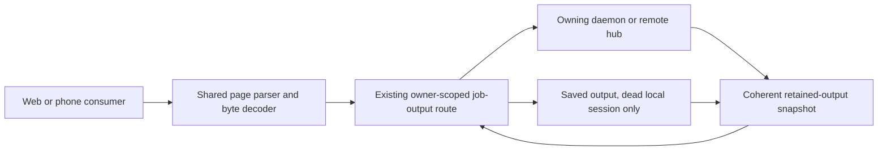
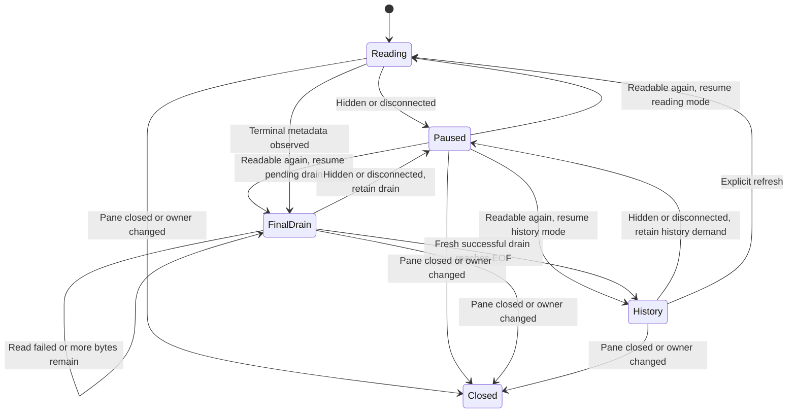

# Job output paging and live browser logs

## Intent and approval boundary

Jesse wants job output to follow new lines automatically, preserve an older
reading position, and load retained history as the user scrolls. The reader must
stay useful during output growth, retention rollover, transient failures and
reconnects. Use the existing paging routes, pane ownership and `VirtualList`.
Keep `JobLog` a thin adapter rather than build a scrolling framework.

This document specifies the approved design. It does not describe shipped or
verified paging behavior. Approval to write this document permits documentation
only. Jesse must approve the written specification before planning. The written
plan then needs approval and an execution-method choice before implementation.

The scope includes replacing the job-output wire contract and migrating its
Go, shared TypeScript, browser and phone consumers together. New phone scrolling
or paging features are outside this scope. Previously accepted Jobs, Overview,
startup, dependency and Activity Sheet work stays closed.

## Architecture and source of truth

Replace the tail-shaped payload at the existing `evener/jobs/output` method with
one byte-page contract. A latest read is a page selection, not a second public
response type. Preserve the owning-session `ref`, `jobId` and existing
`JobsOutputResponse.data` envelope.

The route resolves the job's owner, reads one coherent output snapshot and returns
its bytes and bounds. Shared client code validates and decodes the page. The
browser combines contiguous ranges and gives rows to the existing virtual list.
The phone adapts its current latest-output presentation to the replacement.

The live owner remains authoritative. A failed live or remote read must not
silently switch to stale saved output. Preserve the existing saved-output
fallback for a dead local session. Keep job lifecycle, cancellation and metadata
ownership separate from output paging.

### Consistency with other reads

Use the existing raw job, artifact and transcript-expansion pages as the common
contract: exact lifetime byte positions, raw byte counts, lossless `utf8` or
`base64` encoding, and a continuation at the returned interval's end. Expose the
actual job retention floor, independently of the returned page's start.

Consistency concerns byte semantics. Keep tool snake_case and AppWire camelCase,
their existing wrappers and page sizes, artifact addressing, and transcript
expansion's exact JSONL representation. Share encoding or validation logic where
the affected readers would otherwise duplicate it. Preserve each reader's
existing behavior assertions.

Line-numbered file reads, revision-owned document files, execution head-and-tail
digests, and opaque activity or semantic transcript cursors retain their own
contracts. This change adds no journal backfill, data migration or retention
policy.

## Byte-page contract

### Request

| Field | Meaning |
| --- | --- |
| `ref` | Existing owning-session reference and routing rules. |
| `jobId` | Existing durable shell-job identity. |
| `maxBytes` | Existing 4 KiB default and 64 KiB cap, applied to source bytes. Omitted or nonpositive values use the default. Positive values are capped. |
| `offsetBytes` | Optional inclusive lifetime start for a forward page. |
| `beforeBytes` | Optional exclusive lifetime end for a backward page. |

Omit both selectors for the latest page. Supply at most one. An explicit zero is
a real position, never an omitted selector or a latest-page sentinel. Forward
selectors must survive Go decoding, forwarding and TypeScript request creation
with their presence intact. Every supplied selector must be a nonnegative
integer. Conflicting selectors and invalid selectors are invalid-parameter
errors.

The browser requests 64 KiB pages. Small existing previews, including the
256-byte activity-row preview, retain their selected size.

### Selection and coherent bounds

Let `F` be the snapshot's retained start, `T` its lifetime total, and `M` the
effective page limit. Validate the supplied selector against that same snapshot.
Select and read bytes within one coherent snapshot; do not select from old
metadata and then perform an unrelated forward read.

| Selection | Returned half-open source-byte interval |
| --- | --- |
| Latest, selectors omitted | `[max(F, T - M), T)` |
| Forward, `offsetBytes = O` | `[O, min(T, O + M))` |
| Backward, `beforeBytes = B` | `[max(F, B - M), B)` |

A supplied selector below `F` reports pruning. A negative selector or a selector
above `T` is invalid. Check invalid negative values before classifying pruning.
Clip a calculated backward start to `F`; its unclipped value is not a supplied
selector. Avoid arithmetic overflow when calculating interval ends.

These boundary examples are normative:

| Snapshot and request | Result |
| --- | --- |
| `F=100, T=200, M=64`, latest | `[136, 200)`, 64 bytes |
| Same snapshot, `offsetBytes=120` | `[120, 184)`, 64 bytes |
| Same snapshot, `beforeBytes=120` | `[100, 120)`, 20 bytes |
| Same snapshot, `beforeBytes=100` | Empty `[100, 100)` |
| Same snapshot, `beforeBytes=99` | Pruned selector |
| `F=0`, `beforeBytes=0` | Empty `[0, 0)` |
| `F>0`, `beforeBytes=0` | Pruned selector |
| `offsetBytes=T` | Empty `[T, T)` |
| Either selector greater than `T` | Invalid parameters |

This distinction incorporates the source-verified Astra clarification: validate
the supplied backward end, then clip the calculated start. A valid page near the
floor must not fail because its requested capacity extends into pruned bytes.

### Response

The replacement payload is `JobOutputPage` inside `JobsOutputResponse.data`.
Remove the public `JobOutputTail`, `tail`, page-start `retainedStart`, `truncated`
and `hasEarlier` contract. Migrate its consumers rather than accept both shapes.

| Field | Meaning |
| --- | --- |
| `offsetBytes` | Actual lifetime start of the returned interval. |
| `bytesReturned` | Raw source-byte count, including zero. |
| `totalBytes` | Lifetime total from this snapshot, before retention clipping. |
| `retainedStartBytes` | Actual storage retention floor from this snapshot. |
| `encoding` | `utf8` or `base64`. |
| `data` | Text or standard base64 representing exactly the returned bytes. |
| `continuation` | Optional `{ offsetBytes }` for the next forward read. |

All bounds and counts are explicit, including zeros. The returned interval is
`[offsetBytes, offsetBytes + bytesReturned)`, with
`F <= offsetBytes <= offsetBytes + bytesReturned <= T`. It may be empty at a
valid boundary, including EOF. `bytesReturned` is neither a JavaScript string
length nor a base64 string length.

Include `continuation` exactly when the returned end is below the snapshot's
`totalBytes`; its `offsetBytes` equals that end. This is a forward continuation
even for a backward-selected page. Request the previous page with
`beforeBytes=offsetBytes`, only while that start exceeds the observed floor.

An empty EOF page says that this snapshot has no more bytes. It says nothing
about whether the job can append later. Job completion comes from metadata.

### Encoding and display

If the selected raw bytes are valid UTF-8, return `encoding: "utf8"` and the exact
text. Otherwise return `encoding: "base64"` and the exact bytes encoded as
standard base64. Never trim a page to rune boundaries or repair its bytes before
transport. Empty data uses `utf8`.

The shared decoder must work in browser and native JavaScript without requiring
browser-only globals. Validate encoding, decoded raw counts, bounds and
continuation consistency before accepting a page. Invalid payloads remain read
failures; they must not fabricate pruning or successful empty output.

Keep raw bytes until contiguous ranges can be decoded together. A code point
split across pages must render correctly after those pages join, whether bytes
arrive by append or prepend. Truly malformed UTF-8 may display replacement
characters without losing the underlying bytes. A temporarily incomplete
character must be repairable when its missing contiguous bytes arrive.

### Pruning and failures

Introduce a typed pruning error through the existing AppWire error envelope:
`CodeUnavailable`, `evenerErrorInfo: "jobOutputPruned"`, `retainedStartBytes` and
`totalBytes` from the rejecting snapshot. These new fields and discriminator are
part of this design, not an existing wire promise. Forward them intact through
daemon, local hub and remote hub routes. Clients classify pruning by structured
data, never by message text.

Transport errors, unavailable files, and output-file consistency or generation
failures remain transient read failures. They do not prove pruning. Retry the
still-needed read automatically when its owner is readable again. On confirmed
pruning, reconcile the demand with the reported floor and continue from the
earliest readable bytes without throwing away useful cached output.

## Browser reading and bounded storage

Retain at most 1 MiB of source bytes per open output pane: 512 KiB for the older
reading window and 512 KiB for the current live window. Count bytes once where
windows overlap. Each window keeps its own 512 KiB limit. This is a source-byte
budget, not a browser-heap claim. Decoded text, row metadata and parse state must
also remain bounded; no second unbounded history or decoded cache is allowed.

Open at the latest page and follow new output while the reader is at the bottom.
Scrolling away preserves the visible byte-based row and its pixel position
while the live window continues to update. Returning to the live bottom resumes
following. Refreshing the same job reconciles its bounds and latest output
without discarding the older reading window.

Use the existing `VirtualList` for viewport rendering, dynamic measurement,
stable item keys, end-following and prepend anchoring. Identify rows by source
byte positions, not mutable array indices. Preserve the visible anchor through
prepend, page repair, trim and live growth. Handle long lines and control
sequences within the same storage budget.

Slide the older window with the viewport. Discard offscreen raw bytes as needed
and refetch them if the user scrolls back and the server still retains them.
Automatic backward and forward paging must work through the unloaded retained
interval between older and live windows. A jump to the live end or a manual
"Load earlier" button is not a substitute for scrolling through that interval.

Represent these conditions distinctly:

| Interval condition | Reader behavior |
| --- | --- |
| Loaded contiguous bytes | Render their output. |
| Retained but unloaded bytes | Mark the interval unloaded and fetch on viewport demand. |
| Confirmed server-pruned bytes with no local copy | Mark the interval unavailable and continue with readable output. |
| Useful cached bytes now below the server floor | Preserve them within the budget, without implying they can be refetched. |

Use existing ANSI parsing and bounded control-state handling. Carry UTF-8 and
ANSI state across contiguous bytes and known local eviction boundaries. Never
carry a terminal state across an unread gap. If a range's preceding state is
unknown, parse it independently rather than invent continuity. Reuse or extract
the current parsing logic; this scope adds no terminal emulator.

## Read lifetime and recovery

`JobLog` uses existing pane and connection ownership. Do not add activity
subscriptions, hydrate unrelated transcript history, or create another
subscription-lifetime owner to read a `job:` output pane.

Allow one output request in flight per pane. While a running job's pane is
visible and readable, poll at the existing one-second browser cadence. Prioritize
viewport paging demand over routine live refreshes, while continuing live reads.
Keep unresolved demand after failures and retry at a paced cadence; an automatic
read must not be abandoned until a manual Refresh.

Best-effort `evener/jobs/get` supplies status and command metadata. A metadata
failure must not block output reads or clear output. Once terminal metadata is
observed, perform a fresh successful output drain to EOF before stopping live
polling. A failed, hidden or disconnected final drain remains pending. History
paging stays usable after the job finishes.

Pausing preserves cached bytes, scroll position, paging demand and any final
drain. Resuming restores the pending reader mode, including final drain when
required. `History` stops routine live polling, not viewport-driven paging.
These names describe reader modes, not a new shared lifecycle owner.
Closing or changing the owner disposes reads and timers. Late replies from an
old owner, job, closed pane or connection generation cannot change current data.

| Event | Required recovery |
| --- | --- |
| Output read fails while status reads succeed | Preserve output and retry the output demand. |
| Status read fails while output reads succeed | Continue output reads and defer completion decisions. |
| Empty EOF page while job is running | Keep polling for later appends. |
| Page is pruned during a pending history read | Use typed bounds, show actual loss and resume readable paging. |
| Pane becomes hidden or connection drops | Stop issuing reads, retain data and demand, resume automatically. |
| Connection returns with different retained bounds | Reconcile cached intervals and refill demanded readable ranges. |
| Terminal metadata precedes final output reply | Complete a fresh output drain before stopping live reads. |
| Job or pane owner changes during a read | Reject the obsolete reply. |

## Coordinated replacement and affected surfaces

Change the exact AppWire protocol version with this contract. Regenerate the
wire types and migrate all job-output producers, routes, parsers, fixtures and
consumers in the same implementation. Keep the `evener/jobs/output` method name.
Add no compatibility bridge, dual parser or silent tail fallback.

The existing version handshake must reject mismatched peers before they can
ignore a new selector and answer with an old tail. Older live daemons continue
running with their work intact. A newer hub reports the existing restart-required
condition and cannot read them until an explicit restart. Never restart or kill
a daemon automatically to complete this migration. Healthy compatible owners
remain usable. Do not introduce separate paging-feature negotiation.

The implementation must cover these existing boundaries:

| Boundary | Existing source anchors |
| --- | --- |
| Wire types, method, Go client and structured errors | [types.go](../../../appwire/types.go), [protocol.go](../../../appwire/protocol.go), [client.go](../../../appwire/client.go), [errors.go](../../../appwire/errors.go) |
| Live and saved job output | [jobs.go](../../../agent/jobs.go), [jobs_panel.go](../../../agent/jobs_panel.go), [output.go](../../../agent/internal/jobstore/output.go), [output_snapshot_fd.go](../../../agent/internal/jobstore/output_snapshot_fd.go) |
| Consistent raw read semantics | [retained_output_read.go](../../../agent/retained_output_read.go), [session_tools_transcript.go](../../../agent/session_tools_transcript.go) |
| Daemon and CLI binding | [appwire_runtime.go](../../../server/appwire_runtime.go), [serve.go](../../../cmd/evener/serve.go) |
| Local and remote hub routing | [app_jobs.go](../../../cmd/evener-hub/app_jobs.go), [source.go](../../../cmd/evener-hub/internal/appsource/source.go), [local_daemon.go](../../../cmd/evener-hub/internal/appsource/local_daemon.go), [remote_hub_mutations.go](../../../cmd/evener-hub/internal/appsource/remote_hub_mutations.go) |
| Shared page parser and exports | [jobOutput.ts](../../../appwire-client/typescript/jobOutput.ts), [index.ts](../../../appwire-client/typescript/index.ts) |
| Web output, preview and request adapter | [JobLog.tsx](../../../cmd/evener-hub/frontend/src/panes/transcript/JobLog.tsx), [ActivityRowDetail.tsx](../../../cmd/evener-hub/frontend/src/panes/session/chrome/ActivityRowDetail.tsx), [threads.ts](../../../cmd/evener-hub/frontend/src/stores/threads.ts) |
| Existing pane and rendering ownership | [Transcript.tsx](../../../cmd/evener-hub/frontend/src/panes/transcript/Transcript.tsx), [paneLifetime.ts](../../../cmd/evener-hub/frontend/src/shell/paneLifetime.ts), [VirtualList](../../../cmd/evener-hub/frontend/src/widgets/virtuallist/index.tsx), [ansi.ts](../../../cmd/evener-hub/frontend/src/widgets/codeblock/ansi.ts) |
| Phone's current latest-output view and fixtures | [useShellJobOutput.ts](../../../mobile-native/src/subagents/useShellJobOutput.ts), [ShellJobScreen.tsx](../../../mobile-native/src/subagents/ShellJobScreen.tsx), [demoSubagents.ts](../../../mobile-native/src/dev/demoSubagents.ts) |
| Real Jobs browser journey | [background_jobs_browser_test.go](../../../cmd/evener-hub/background_jobs_browser_test.go), [backgroundjobsguard/run.mjs](../../../cmd/evener-hub/frontend/scripts/backgroundjobsguard/run.mjs) |

The phone migration preserves its current view, read cadence and failure
recovery. It uses the shared replacement decoder and retains source-byte
bookkeeping. It does not acquire the browser's two-window interface or auto-follow
behavior. The activity-row preview likewise decodes the selected latest page
instead of accessing `data.tail`.

Update the owning evergreen guides with implementation:
[session activity](../../product/session-activity.md),
[subsystem map](../../product/subsystems.md), the AppWire contract and shared
package references, and relevant phone documentation. Keep
[friction C09](../../product/friction.md) open until its behavior is implemented
and verified. Preserve the tool contracts in
[transcript reads](../../tools/transcripts.md) and
[job control](../../job-control.md) if shared byte helpers change.

## Proof obligations

These are required implementation evidence, not tests run for this document.
Follow the [testing guide](../../developing-evener/testing.md). Use independent
literal producer bytes and real Evener code below scripted external boundaries.

| Proof | Required assertion and evidence |
| --- | --- |
| P01 | Real output-store and subprocess bytes match latest, forward and backward pages byte-for-byte, including clipping near the floor and all normative boundary examples. |
| P02 | Explicit zero survives JSON and every local/remote forwarding path; conflicts, negative selectors and selectors beyond EOF fail as specified. Defaults and the 64 KiB cap use raw counts. |
| P03 | Concurrent append, retention rollover and output-file replacement cannot mix selected bounds with another snapshot's bytes. Consistency failures are transient, not fabricated pruning. Use synchronized producer or filesystem transitions. |
| P04 | Partial and malformed UTF-8 round-trip exactly through `utf8`/`base64`. Append, prepend, overlapping pages and eviction repair split characters against literal raw-byte oracles. Empty pages and continuation counts are exact. |
| P05 | Typed pruning bounds survive real daemon, local hub, remote hub and Go/shared client routing. A live-owner failure never uses stale saved bytes; a dead local session still reads its saved output. |
| P06 | Shared parser and decoder validate payload invariants and work under web and native test environments. Every consumer and fixture migrates, including the 256-byte preview and phone renderer. No dual tail parser remains. |
| P07 | The version handshake rejects mismatches before job-output dispatch. Existing restart-required behavior preserves old daemons and work; compatible owners continue serving output. |
| P08 | Real `JobLog` binding opens latest, follows at bottom, preserves an older visible anchor during growth, resumes following at bottom and preserves history through Refresh. Assert rendered rows and geometry. |
| P09 | The viewport automatically fetches both directions through an unloaded retained gap. After more than each 512 KiB budget, source-byte storage stays bounded and evicted retained bytes can be refetched. Long lines remain bounded. |
| P10 | Contiguous UTF-8 and ANSI state survives page joins and known eviction. Independent ranges never inherit state across an unread gap. Verify rendered characters and styles, not only parser calls. |
| P11 | One output read is in flight per pane; viewport demand, live refresh and paced retry coexist. Fake-clock and awaitable-response tests prove hidden/disconnected suspension, automatic resumption and rejection of obsolete replies. |
| P12 | Metadata failure does not block output. A running job appends after an empty EOF read. Terminal metadata requires a fresh successful final drain; failure, hiding or reconnect cannot drop that drain. Finished history stays readable. |
| P13 | Multiple loaded pages survive refresh and reconnect with a visible later-page row. New retention bounds distinguish unloaded output, true pruning and useful cached bytes below the floor. |
| P14 | Extend the existing real-stack Chrome Jobs journey with literal producer bytes: live following, older anchoring, gap scrolling, eviction/refetch beyond both budgets, retention rollover, reconnect and final drain. Preserve its existing milestones and error assertions. |
| P15 | Affected Go tests and race checks, generated-output freshness, and root `make test-web`, `make test-native`, `make test-api-package` and `make test-web-browser` finish without failures. Record actual execution and remaining platform limits. |

Use deterministic fake clocks and explicit response holds for client ordering
tests. Do not add sleeps, widen timeouts or weaken assertions to hide races.
Script only the external AppWire transport; exercise the real binding, byte
window, virtual list and renderer. Internal-store spies do not prove recovery.
Real browser end-to-end tests use actual producers, hub routing and APIs.

The existing unqualified `JobLog.test.tsx` RED draft is preserved, not accepted
as proof. Before reuse, compare it with the original meaningful assertions and
review its oracle integrity. Rewrite internal-call assertions only when the
replacement proves the same visible behavior through the real boundary.

Run targeted checks for each implementation slice, then the affected canonical
gates. Let CI run the full repository suite after an authorized push. Chrome and
native test-renderer evidence does not qualify Safari, real phone geometry,
software keyboards or screen-reader behavior. The source-byte limit does not
qualify heap usage. Report those limits unless separately measured.

## Completion and non-goals

The implementation is complete when every proof obligation has recorded
evidence, all consumers use the replacement, the browser meets the reading and
recovery contract, and evergreen docs match verified behavior. Keep original
producer bytes, failure evidence and scoped review rulings for reconciliation.

This work adds no custom virtualizer, generic paging framework, terminal engine,
activity subscription owner, compatibility layer, phone UX expansion, retention
policy, historical journal rewrite or unrelated bundle cleanup. It does not
reopen accepted follow-ups. Written-spec and plan approval remain the next gates.
